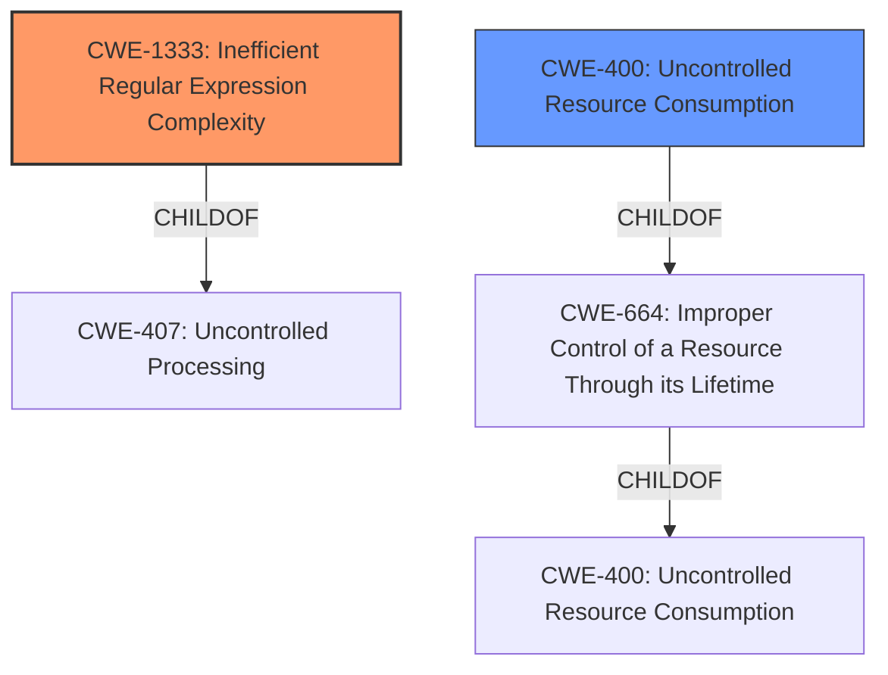

# Analysis Report for CVE-2020-1920

# Vulnerability Analysis Report: CVE-2020-1920

## Description


## Analysis (with Relationship Data)

# Summary
| CWE ID  | CWE Name                                   | Confidence | CWE Abstraction Level | CWE Vulnerability Mapping Label | CWE-Vulnerability Mapping Notes |
| :------- | :----------------------------------------- | :--------- | :---------------------- | :------------------------------ | :----------------------------- |
| CWE-1333 | Inefficient Regular Expression Complexity  | 1.0        | Base                    | Primary                         | Allowed                        |
| CWE-400  | Uncontrolled Resource Consumption          | 0.7        | Class                   | Secondary                       | Discouraged                    |

## Evidence and Confidence

*   **Confidence Score:** 0.9
*   **Evidence Strength:** HIGH

## Relationship Analysis
The primary CWE, CWE-1333, is a base-level CWE that directly addresses the root cause: the use of an inefficient regular expression. It's a child of CWE-407 (Uncontrolled Processing). CWE-400 is a class-level CWE representing the broader impact of uncontrolled resource consumption, which is a consequence of the inefficient regex. Although CWE-400 is often misused, the additional information found in the CVE Reference Links Content Summary that includes excessive CPU consumption makes it a reasonable secondary consideration.



## Vulnerability Chain
The vulnerability chain starts with the **inefficient regular expression** (CWE-1333), which leads to **excessive resource consumption** and ultimately results in a **denial of service**.

## Summary of Analysis
The initial assessment identified the **regular expression** as the **root cause** of a **denial of service** vulnerability. The retriever results strongly suggested CWE-1333 (Inefficient Regular Expression Complexity) as the primary candidate. The detailed CVE Reference Links Content Summary provided further evidence, explicitly stating that the vulnerability stemmed from a ReDoS flaw due to an inefficient regular expression and resulting in excessive CPU resource consumption. This solidifies the selection of CWE-1333.

CWE-400 (Uncontrolled Resource Consumption) was considered as a secondary CWE because the vulnerability leads to excessive resource consumption. However, CWE-400 is a high-level class, and the evidence clearly points to a more specific cause: the inefficient regular expression. While the impact is resource consumption, the root cause is the regex itself. The description states the regex can cause excessive resources, making the app unresponsive, or crash.

The final decision is to map the vulnerability primarily to CWE-1333, as it directly reflects the **root cause** of the vulnerability. CWE-400 is a secondary consideration, representing the consequence of the vulnerability. This selection provides the optimal level of specificity and aligns with the provided evidence and MITRE's mapping guidance.

Relevant CWE Information:

# Enhanced Context (25 CWEs)
The following CWEs were identified as potentially relevant to this vulnerability:

## CWE-457: Use of Uninitialized Variable
**Abstraction Level**: Variant
**Similarity Score**: 0.76
**Source**: dense

**Description**:
The code uses a variable that has not been initialized, leading to unpredictable or unintended results.

**Mapping Guidance**:
- Usage: Allowed
- Rationale: This CWE entry is at the Variant level of abstraction, which is a preferred level of abstraction for mapping to the root causes of vulnerabilities.

## CWE-789: Memory Allocation with Excessive Size Value
**Abstraction Level**: Variant
**Similarity Score**: 0.75
**Source**: dense

**Description**:
The product allocates memory based on an untrusted, large size value, but it does not ensure that the size is within expected limits, allowing arbitrary amounts of memory to be allocated.

**Mapping Guidance**:
- Usage: Allowed
- Rationale: This CWE entry is at the Variant level of abstraction, which is a preferred level of abstraction for mapping to the root causes of vulnerabilities.

## CWE-226: Sensitive Information in Resource Not Removed Before Reuse
**Abstraction Level**: Base
**Similarity Score**: 0.74
**Source**: dense

**Description**:
The product releases a resource such as memory or a file so that it can be made available for reuse, but it does not clear or "zeroize" the information contained in the resource before the product performs a critical state transition or makes the resource available for reuse by other entities.

**Mapping Guidance**:
- Usage: Allowed
- Rationale: This CWE entry is at the Base level of abstraction, which is a preferred level of abstraction for mapping to the root causes of vulnerabilities.

## CWE-404: Improper Resource Shutdown or Release
**Abstraction Level**: Class
**Similarity Score**: 0.74
**Source**: dense

**Description**:
The product does not release or incorrectly releases a resource before it is made available for re-use.

**Mapping Guidance**:
- Usage: Allowed-with-Review
- Rationale: This CWE entry is a Class and might have Base-level children that would be more appropriate

## CWE-909: Missing Initialization of Resource
**Abstraction Level**: Class
**Similarity Score**: 0.74
**Source**: dense

**Description**:
The product does not initialize a critical resource.

**Mapping Guidance**:
- Usage: Allowed-with-Review
- Rationale: This CWE entry is a Class and might have Base-level children that would be more appropriate

## CWE-667: Improper Locking
**Abstraction Level**: Class
**Similarity Score**: 0.73
**Source**: dense

**Description**:
The product does not properly acquire or release a lock on a resource, leading to unexpected resource state changes and behaviors.

**Mapping Guidance**:
- Usage: Allowed-with-Review
- Rationale: This CWE entry is a Class and might have Base-level children that would be more appropriate

## CWE-1289: Improper Validation of Unsafe Equivalence in Input
**Abstraction Level**: Base
**Similarity Score**: 0.73
**Source**: dense

**Description**:
The product receives an input value that is used as a resource identifier or other type of reference, but it does not validate or incorrectly validates that the input is equivalent to a potentially-unsafe value.

**Mapping Guidance**:
- Usage: Allowed
- Rationale: This CWE entry is at the Base level of abstraction, which is a preferred level of abstraction for mapping to the root causes of vulnerabilities.

## CWE-405: Asymmetric Resource Consumption (Amplification)
**Abstraction Level**: Class
**Similarity Score**: 0.73
**Source**: dense

**Description**:
The product does not properly control situations in which an adversary can cause the product to consume or produce excessive resources without requiring the adversary to invest equivalent work or otherwise prove authorization, i.e., the adversary's influence is "asymmetric."

**Mapping Guidance**:
- Usage: Allowed-with-Review
- Rationale: This CWE entry is a Class and might have Base-level children that would be more appropriate

## CWE-908: Use of Uninitialized Resource
**Abstraction Level**: Base
**Similarity Score**: 0.73
**Source**: dense

**Description**:
The product uses or accesses a resource that has not been initialized.

**Mapping Guidance**:
- Usage: Allowed
- Rationale: This CWE entry is at the Base level of abstraction, which is a preferred level of abstraction for mapping to the root causes of vulnerabilities.

## CWE-1325: Improperly Controlled Sequential Memory Allocation
**Abstraction Level**: Base
**Similarity Score**: 0.73
**Source**: dense

**Description**:
The product manages a group of objects or resources and performs a separate memory allocation for each object, but it does not properly limit the total amount of memory that is consumed by all of the combined objects.

**Mapping Guidance**:
- Usage: Allowed
- Rationale: This CWE entry is at the Base level of abstraction, which is a preferred level of abstraction for mapping to the root causes of vulnerabilities.

## CWE-1333: Inefficient Regular Expression Complexity
**Abstraction Level**: Base
**Similarity Score**: 6429.67
**Source**: sparse

**Description**:
The product uses a regular expression with an inefficient, possibly exponential worst-case computational complexity that consumes excessive CPU cycles.

**Mapping Guidance**:
- Usage: Allowed
- Rationale: This CWE entry is at the Base level of abstraction, which is a preferred level of abstraction for mapping to the root causes of vulnerabilities.

## CWE-789: Memory Allocation with Excessive Size Value
**Abstraction Level**: Variant


## CWE Relationship Analysis

Current CWEs represent these abstraction levels: .


### Vulnerability Chain Analysis

**Chain starting from CWE-667:**
- 667 (Improper Locking) - ROOT


**Chain starting from CWE-664:**
- 664 (Improper Control of a Resource Through its Lifetime) - ROOT


### CWE Relationship Diagram

```mermaid
graph TD
    classDef primary fill:#f96,stroke:#333,stroke-width:2px
    classDef secondary fill:#69f,stroke:#333
    classDef tertiary fill:#9e9,stroke:#333
```


*Report generated on 2025-04-02 02:50:56*
