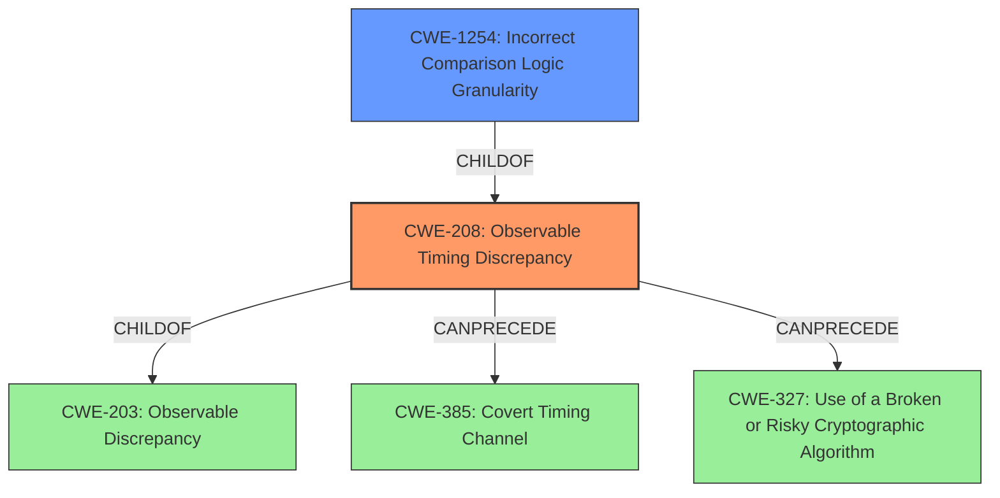

# Analysis for CVE-2020-1926

# Summary
| CWE ID  | CWE Name                                                        | Confidence | CWE Abstraction Level | CWE Vulnerability Mapping Label | CWE-Vulnerability Mapping Notes |
| :-------- | :-------------------------------------------------------------- | :--------- | :-------------------- | :------------------------------ | :------------------------------ |
| CWE-208 | Observable Timing Discrepancy                                 | 0.90       | Base                  | Primary                         | Allowed                       |
| CWE-1254 | Incorrect Comparison Logic Granularity                          | 0.70       | Base                  | Secondary                       | Allowed                       |

## Evidence and Confidence

*   **Confidence Score:** 0.8
*   **Evidence Strength:** HIGH

## Relationship Analysis
The primary CWE selected is CWE-208 (Observable Timing Discrepancy), which has a child relationship with CWE-203 (Observable Discrepancy) and can precede CWE-385 (Covert Timing Channel) and CWE-327 (Use of a Broken or Risky Cryptographic Algorithm). CWE-1254 (Incorrect Comparison Logic Granularity) is also considered due to its relationship as a child of CWE-208, and its description relating to comparison logic being performed in steps which can lead to timing attacks. The selection of CWE-208 is favored due to its direct relevance to the **non constant time comparison** weakness described.

## Vulnerability Chain
The vulnerability chain starts with the **non constant time comparison**, leading to an Observable Timing Discrepancy, which enables an attacker to recover another user's cookie signature.

## Summary of Analysis
The initial analysis focused on the **non constant time comparison** that is vulnerable to timing attacks which could lead to the recovery of another user's cookie signature.

The vulnerability description states: "Apache Hive cookie signature verification used a **non constant time comparison** which is known to be vulnerable to timing attacks. This could allow recovery of another users cookie signature."

The primary weakness is CWE-208 (Observable Timing Discrepancy) because the vulnerability involves timing variations during cookie signature verification that an attacker can observe and exploit. The "CVE Reference Links Content Summary" also supports the root cause being related to HTTP transport and potential data exposure.

CWE-1254 (Incorrect Comparison Logic Granularity) is a closely related secondary weakness. Its description states: "The product's comparison logic is performed over a series of steps rather than across the entire string in one operation. If there is a comparison logic failure on one of these steps, the operation may be vulnerable to a timing attack that can result in the interception of the process for nefarious purposes." The vulnerability description directly states that the cookie signature verification used a **non constant time comparison**, meaning that the granularity of the comparison logic is incorrect.

Other CWEs, such as CWE-347 (Improper Verification of Cryptographic Signature), CWE-203 (Observable Discrepancy), and CWE-287 (Improper Authentication), were considered but deemed less relevant as they don't specifically address the timing-related aspect of the vulnerability. CWE-784 (Reliance on Cookies without Validation and Integrity Checking in a Security Decision) could potentially apply, but the core issue is the timing discrepancy, not the lack of cookie validation.

The selected CWEs are at the optimal level of specificity, as they directly relate to the root cause (**non constant time comparison**) and the observable timing discrepancy.

Relevant CWE Information:

# Enhanced Context (25 CWEs)
The following CWEs were identified as potentially relevant to this vulnerability:

## CWE-208: Observable Timing Discrepancy
**Abstraction Level**: Base
**Similarity Score**: 0.77
**Source**: dense

**Description**:
Two separate operations in a product require different amounts of time to complete, in a way that is observable to an actor and reveals security-relevant information about the state of the product, such as whether a particular operation was successful or not.

**Mapping Guidance**:
- Usage: Allowed
- Rationale: This CWE entry is at the Base level of abstraction, which is a preferred level of abstraction for mapping to the root causes of vulnerabilities.

## CWE-1254: Incorrect Comparison Logic Granularity
**Abstraction Level**: Base
**Similarity Score**: 5850.35
**Source**: sparse

**Description**:
The product's comparison logic is performed over a series of steps rather than across the entire string in one operation. If there is a comparison logic failure on one of these steps, the operation may be vulnerable to a timing attack that can result in the interception of the process for nefarious purposes.

**Mapping Guidance**:
- Usage: Allowed
- Rationale: This CWE entry is at the Base level of abstraction, which is a preferred level of abstraction for mapping to the root causes of vulnerabilities.

## CWE-347: Improper Verification of Cryptographic Signature
**Abstraction Level**: Base
**Similarity Score**: 0.210

**Description**:
The product does not verify, or incorrectly verifies, the cryptographic signature for data.

## CWE-203: Observable Discrepancy
**Abstraction Level**: Base
**Similarity Score**: 0.207

**Description**:
The product behaves differently or sends different responses under different circumstances in a way that is observable to an unauthorized actor, which exposes security-relevant information about the state of the product, such as whether a particular operation was successful or not.

## CWE-287: Improper Authentication
**Abstraction Level**: Class
**Similarity Score**: 0.202

**Description**:
When an actor claims to have a given identity, the product does not prove or insufficiently proves that the claim is correct.

# Enhanced Query for CVE-2020-1926

## Vulnerability Description
Apache Hive cookie signature verification used a **non constant time comparison** which is known to be vulnerable to timing attacks. This could allow recovery of another users cookie signature. The issue was addressed in Apache Hive 2.3.8

### Vulnerability Description Key Phrases
- **weakness:** **non constant time comparison**
- **impact:** recover another users cookie signature
- **vector:** timing attacks
- **product:** Apache Hive
- **version:** 2.3.8

## CVE Reference Links Content Summary
Based on the provided content, here's an analysis related to CVE-2020-1926:

**1. Verification of Relevance:**
The content is related to a specific bug fix in Apache Hive, identified as HIVE-22708. While it doesn't directly state a CVE number, it's plausible this issue was assigned a CVE, especially if it had security implications, and the naming convention would suggest its likely CVE-2020-1926. The content details the fix, which gives us insights into the potential vulnerability. Therefore, it is likely related to CVE-2020-1926.

**2. Vulnerability Analysis:**

*   **Root Cause:** The issue revolves around a problem within the HTTP transport mechanism in Apache Hive.  The provided description "Test fix for http transport" indicates that the vulnerability likely lies in how Hive handles HTTP connections or requests, though the specifics are not listed. The linked pull request to the Spark project also suggests it could be related to interaction between Hive and Spark.
*   **Weaknesses/Vulnerabilities Present:**  The description and title suggest the vulnerability was a bug in handling HTTP transport which could potentially lead to data exposure, denial of service, or other issues depending on the specifics. Without the patch details, specific vulnerability such as improper input validation, missing authentication/authorization checks, or an issue with resource management, cannot be determined.
*   **Impact of Exploitation:** Without more information about the exact nature of the HTTP transport bug, the impact can only be speculated. Potential impacts could include:
    *   **Data Exposure:** If the bug involves improper handling of HTTP requests or responses, sensitive data could be leaked.
    *   **Denial of Service (DoS):**  If the bug can be triggered repeatedly with crafted requests, the service could be made unavailable.
    *  **Remote Code Execution (RCE):** Although less likely given the context, if the bug involved injecting malformed HTTP requests which caused a memory corruption it could have led to RCE.
*   **Attack Vectors:**  The attack vector is via HTTP requests to the HiveServer2 component. An attacker would need to send malicious or malformed requests to exploit the flaw in the HTTP transport.
*   **Required Attacker Capabilities/Position:**  The attacker would need network access to the HiveServer2 and the ability to send HTTP requests. No specific authentication details are mentioned in the bug report, it is likely accessible to any user who can interact with the Hiveserver2.

**3. Additional Notes:**
*   The issue was found and fixed by Naveen Gangam.
*   The issue is categorized as a "Bug" with a "Major" priority and has been resolved.
*   The fix was implemented in versions 2.3.8 and 4.0.0-alpha-1.
*   The issue also has a corresponding pull request on GitHub for the Apache Spark project.
*   The label "pull-request-available" indicates a code fix is available for this issue
*   The provided information does not contain the specific details of the vulnerability itself.

In conclusion, this content provides insight into a bug within the HTTP transport of Apache Hive that was addressed as issue HIVE-22708, which likely corresponds to CVE-2020-1926. The root cause is within HTTP handling within HiveServer2, and while the exact nature of the vulnerability cannot be defined without the patch content, the impact could potentially range from data exposure to DoS.

## Retriever Results

### Top Combined Results

| Rank | CWE ID | Name | Abstraction | Usage  | Retrievers | Individual Scores |
|------|--------|------|-------------|-------|------------|-------------------|
| 1 | 208 | Observable Timing Discrepancy | Base | Allowed | sparse | 0.382 |
| 2 | 1254 | Incorrect Comparison Logic Granularity | Base | Allowed | sparse | 0.249 |
| 3 | 347 | Improper Verification of Cryptographic Signature | Base | Allowed | sparse | 0.210 |
| 4 | 203 | Observable Discrepancy | Base | Allowed | sparse | 0.207 |
| 5 | 287 | Improper Authentication | Class | Discouraged | sparse | 0.202 |
| 6 | 784 | Reliance on Cookies without Validation and Integrity Checking in a Security Decision | Variant | Allowed | dense | 0.505 |
| 7 | 385 | Covert Timing Channel | Base | Allowed | graph | 0.002 |
| 8 | 1390 | Weak Authentication | Class | Allowed-with-Review | sparse | 0.193 |
| 9 | 327 | Use of a Broken or Risky Cryptographic Algorithm | Class | Allowed-with-Review | sparse | 0.187 |
| 10 | 201 | Insertion of Sensitive Information Into Sent Data | Base | Allowed | sparse | 0.186 |

# Complete CWE Specifications

## CWE-208: Observable Timing Discrepancy
**Abstraction:** Base
**Status:** Incomplete

### Description
Two separate operations in a product require different amounts of time to complete, in a way that is observable to an actor and reveals security-relevant information about the state of the product, such as whether a particular operation was successful or not.

### Extended Description
In security-relevant contexts, even small variations in timing can be exploited by attackers to indirectly infer certain details about the product's internal operations. For example, in some cryptographic algorithms, attackers can use timing differences to infer certain properties about a private key, making the key easier to guess. Timing discrepancies effectively form a timing side channel.

### Alternative Terms
None

### Relationships
ChildOf -> CWE-203
CanPrecede -> CWE-385
CanPrecede -> CWE-327

### Mapping Guidance
**Usage:** Allowed
**Rationale:** This CWE entry is at the Base level of abstraction, which is a preferred level of abstraction for mapping to the root causes of vulnerabilities.
**Comments:** Carefully read both the name and description to ensure that this mapping is an appropriate fit. Do not try to 'force' a mapping to a lower-level Base/Variant simply to comply with this preferred level of abstraction.
**Reasons:**
- Acceptable-Use

### Additional Notes
**[Relationship]** Often primary in cryptographic applications and algorithms.

**[Maintenance]** CWE 4.16 removed a demonstrative example for a hardware module because it was inaccurate and unable to be adapted. The CWE team is developing an alternative.

### Observed Examples
- **CVE-2019-10071:** Java-oriented framework compares HMAC signatures using String.equals() instead of a constant-time algorithm, causing timing discrepancies
- **CVE-2019-10482:** Smartphone OS uses comparison functions that are not in constant time, allowing side channels
- **CVE-2014-0984:** Password-checking function in router terminates validation of a password entry when it encounters the first incorrect character, which allows remote attackers to obtain passwords via a brute-force attack that relies on timing differences in responses to incorrect password guesses, aka a timing side-channel attack.

## CWE-1254: Incorrect Comparison Logic Granularity
**Abstraction:** Base
**Status:** Draft

### Description
The product's comparison logic is performed over a series of steps rather than across the entire string in one operation. If there is a comparison logic failure on one of these steps, the operation may be vulnerable to a timing attack that can result in the interception of the process for nefarious purposes.

### Extended Description

Comparison logic is used to compare a variety of objects including passwords, Message Authentication Codes (MACs), and responses to verification challenges. When comparison logic is implemented at a finer granularity (e.g., byte-by-byte comparison) and breaks in the case of a comparison failure, an attacker can exploit this implementation to identify when exactly the failure occurred. With multiple attempts, the attacker may be able to guesses the correct password/response to challenge and elevate their privileges.

### Alternative Terms
None

### Relationships
ChildOf -> CWE-208
ChildOf -> CWE-697

### Mapping Guidance
**Usage:** Allowed
**Rationale:** This CWE entry is at the Base level of abstraction, which is a preferred level of abstraction for mapping to the root causes of vulnerabilities.
**Comments:** Carefully read both the name and description to ensure that this mapping is an appropriate fit. Do not try to 'force' a mapping to a lower-level Base/Variant simply to comply with this preferred level of abstraction.
**Reasons:**
- Acceptable-Use

### Additional Notes
**[Maintenance]** CWE 4.16 removed a demonstrative example for a hardware module because it was inaccurate and unable to be adapted. The CWE team is developing an alternative.

### Observed Examples
- **CVE-2019-10482:** Smartphone OS uses comparison functions that are not in constant time, allowing side channels
- **CVE-2019-10071:** Java-oriented framework compares HMAC signatures using String.equals() instead of a constant-time algorithm, causing timing discrepancies
- **CVE-2014-0984:** Password-checking function in router terminates validation of a password entry when it encounters the first incorrect character, which allows remote attackers to obtain passwords via a brute-force attack that relies on timing differences in responses to incorrect password guesses, aka a timing side-channel attack.

## CWE-347: Improper Verification of Cryptographic Signature
**Abstraction:** Base
**Status:** Draft

### Description
The product does not verify, or incorrectly verifies, the cryptographic signature for data.

### Extended Description
Not provided

### Alternative Terms
None

### Relationships
ChildOf -> CWE-345
ChildOf -> CWE-345

### Mapping Guidance
**Usage:** Allowed
**Rationale:** This CWE entry is at the Base level of abstraction, which is a preferred level of abstraction for mapping to the root causes of vulnerabilities.
**Comments:** Carefully read both the name and description to ensure that this mapping is an appropriate fit. Do not try to 'force' a mapping to a lower-level Base/Variant simply to comply with this preferred level of abstraction.
**Reasons:**
- Acceptable-Use

### Observed Examples
- **CVE-2002-1796:** Does not properly verify signatures for "trusted" entities.
- **CVE-2005-2181:** Insufficient verification allows spoofing.
- **CVE-2005-2182:** Insufficient verification allows spoofing.

## CWE-203: Observable Discrepancy
**Abstraction:** Base
**Status:** Incomplete

### Description
The product behaves differently or sends different responses under different circumstances in a way that is observable to an unauthorized actor, which exposes security-relevant information about the state of the product, such as whether a particular operation was successful or not.

### Extended Description
Discrepancies can take many forms, and variations may be detectable in timing, control flow, communications such as replies or requests, or general behavior. These discrepancies can reveal information about the product's operation or internal state to an unauthorized actor. In some cases, discrepancies can be used by attackers to form a side channel.

### Alternative Terms
Side Channel Attack: Observable Discrepancies are at the root of side channel attacks.

### Relationships
ChildOf -> CWE-200
ChildOf -> CWE-200

### Mapping Guidance
**Usage:** Allowed
**Rationale:** This CWE entry is at the Base level of abstraction, which is a preferred level of abstraction for mapping to the root causes of vulnerabilities.
**Comments:** Carefully read both the name and description to ensure that this mapping is an appropriate fit. Do not try to 'force' a mapping to a lower-level Base/Variant simply to comply with this preferred level of abstraction.
**Reasons:**
- Acceptable-Use

### Observed Examples
- **CVE-2020-8695:** Observable discrepancy in the RAPL interface for some Intel processors allows information disclosure.
- **CVE-2019-14353:** Crypto hardware wallet's power consumption relates to total number of pixels illuminated, creating a side channel in the USB connection that allows attackers to determine secrets displayed such as PIN numbers and passwords
- **CVE-2019-10071:** Java-oriented framework compares HMAC signatures using String.equals() instead of a constant-time algorithm, causing timing discrepancies

## CWE-287: Improper Authentication
**Abstraction:** Class
**Status:** Draft

### Description
When an actor claims to have a given identity, the product does not prove or insufficiently proves that the claim is correct.

### Extended Description
Not provided

### Alternative Terms
authentification: An alternate term is "authentification", which appears to be most commonly used by people from non-English-speaking countries.
AuthN: "AuthN" is typically used as an abbreviation of "authentication" within the web application security community. It is also distinct from "AuthZ," which is an abbreviation of "authorization." The use of "Auth" as an abbreviation is discouraged, since it could be used for either authentication or authorization.
AuthC: "AuthC" is used as an abbreviation of "authentication," but it appears to used less frequently than "AuthN."

### Relationships
ChildOf -> CWE-284
ChildOf -> CWE-284

### Mapping Guidance
**Usage:** Discouraged
**Rationale:** This CWE entry might be misused when lower-level CWE entries are likely to be applicable. It is a level-1 Class (i.e., a child of a Pillar).
**Comments:** Consider children or descendants, beginning with CWE-1390: Weak Authentication or CWE-306: Missing Authentication for Critical Function.
**Reasons:**
- Frequent Misuse
**Suggested Alternatives:**
- CWE-1390: Weak Authentication
- CWE-306: Missing Authentication for Critical Function

### Additional Notes
**[Relationship]** This can be resultant from SQL injection vulnerabilities and other issues.

**[Maintenance]** The Taxonomy_Mappings to ISA/IEC 62443 were added in CWE 4.10, but they are still under review and might change in future CWE versions. These draft mappings were performed by members of the "Mapping CWE to 62443" subgroup of the CWE-CAPEC ICS/OT Special Interest Group (SIG), and their work is incomplete as of CWE 4.10. The mappings are included to facilitate discussion and review by the broader ICS/OT community, and they are likely to change in future CWE versions.

### Observed Examples
- **CVE-2022-35248:** Chat application skips validation when Central Authentication Service (CAS) is enabled, effectively removing the second factor from two-factor authentication
- **CVE-2022-36436:** Python-based authentication proxy does not enforce password authentication during the initial handshake, allowing the client to bypass authentication by specifying a 'None' authentication type.
- **CVE-2022-30034:** Chain: Web UI for a Python RPC framework does not use regex anchors to validate user login emails (CWE-777), potentially allowing bypass of OAuth (CWE-1390).

## CWE-784: Reliance on Cookies without Validation and Integrity Checking in a Security Decision
**Abstraction:** Variant
**Status:** Draft

### Description
The product uses a protection mechanism that relies on the existence or values of a cookie, but it does not properly ensure that the cookie is valid for the associated user.

### Extended Description
Attackers can easily modify cookies, within the browser or by implementing the client-side code outside of the browser. Attackers can bypass protection mechanisms such as authorization and authentication by modifying the cookie to contain an expected value.

### Alternative Terms
None

### Relationships
ChildOf -> CWE-807
ChildOf -> CWE-565

### Mapping Guidance
**Usage:** Allowed
**Rationale:** This CWE entry is at the Variant level of abstraction, which is a preferred level of abstraction for mapping to the root causes of vulnerabilities.
**Comments:** Carefully read both the name and description to ensure that this mapping is an appropriate fit. Do not try to 'force' a mapping to a lower-level Base/Variant simply to comply with this preferred level of abstraction.
**Reasons:**
- Acceptable-Use

### Additional Notes
**[Maintenance]** A new parent might need to be defined for this entry. This entry is specific to cookies, which reflects the significant number of vulnerabilities being reported for cookie-based authentication in CVE during 2008 and 2009. However, other types of inputs - such as parameters or headers - could also be used for similar authentication or authorization. Similar issues (under the Research view) include CWE-247 and CWE-472.

### Observed Examples
- **CVE-2009-1549:** Attacker can bypass authentication by setting a cookie to a specific value.
- **CVE-2009-1619:** Attacker can bypass authentication and gain admin privileges by setting an "admin" cookie to 1.
- **CVE-2009-0864:** Content management system allows admin privileges by setting a "login" cookie to "OK."

## CWE-385: Covert Timing Channel
**Abstraction:** Base
**Status:** Incomplete

### Description
Covert timing channels convey information by modulating some aspect of system behavior over time, so that the program receiving the information can observe system behavior and infer protected information.

### Extended Description

In some instances, knowing when data is transmitted between parties can provide a malicious user with privileged information. Also, externally monitoring the timing of operations can potentially reveal sensitive data. For example, a cryptographic operation can expose its internal state if the time it takes to perform the operation varies, based on the state.

Covert channels are frequently classified as either storage or timing channels. Some examples of covert timing channels are the system's paging rate, the time a certain transaction requires to execute, and the time it takes to gain access to a shared bus.

### Alternative Terms
None

### Relationships
ChildOf -> CWE-514

### Mapping Guidance
**Usage:** Allowed
**Rationale:** This CWE entry is at the Base level of abstraction, which is a preferred level of abstraction for mapping to the root causes of vulnerabilities.
**Comments:** Carefully read both the name and description to ensure that this mapping is an appropriate fit. Do not try to 'force' a mapping to a lower-level Base/Variant simply to comply with this preferred level of abstraction.
**Reasons:**
- Acceptable-Use

### Additional Notes
**[Maintenance]** As of CWE 4.9, members of the CWE Hardware SIG are working to improve CWE's coverage of transient execution weaknesses, which include issues related to Spectre, Meltdown, and other attacks that create or exploit covert channels. As a result of that work, this entry might change in CWE 4.10.

## CWE-1390: Weak Authentication
**Abstraction:** Class
**Status:** Incomplete

### Description
The product uses an authentication mechanism to restrict access to specific users or identities, but the mechanism does not sufficiently prove that the claimed identity is correct.

### Extended Description

Attackers may be able to bypass weak authentication faster and/or with less effort than expected.

### Alternative Terms
None

### Relationships
ChildOf -> CWE-287

### Mapping Guidance
**Usage:** Allowed-with-Review
**Rationale:** This CWE entry is a Class and might have Base-level children that would be more appropriate
**Comments:** Examine children of this entry to see if there is a better fit
**Reasons:**
- Abstraction

### Observed Examples
- **CVE-2022-30034:** Chain: Web UI for a Python RPC framework does not use regex anchors to validate user login emails (CWE-777), potentially allowing bypass of OAuth (CWE-1390).
- **CVE-2022-35248:** Chat application skips validation when Central Authentication Service (CAS) is enabled, effectively removing the second factor from two-factor authentication
- **CVE-2021-3116:** Chain: Python-based HTTP Proxy server uses the wrong boolean operators (CWE-480) causing an incorrect comparison (CWE-697) that identifies an authN failure if all three conditions are met instead of only one, allowing bypass of the proxy authentication (CWE-1390)

## CWE-327: Use of a Broken or Risky Cryptographic Algorithm
**Abstraction:** Class
**Status:** Draft

### Description
The product uses a broken or risky cryptographic algorithm or protocol.

### Extended Description

Cryptographic algorithms are the methods by which data is scrambled to prevent observation or influence by unauthorized actors. Insecure cryptography can be exploited to expose sensitive information, modify data in unexpected ways, spoof identities of other users or devices, or other impacts.

It is very difficult to produce a secure algorithm, and even high-profile algorithms by accomplished cryptographic experts have been broken. Well-known techniques exist to break or weaken various kinds of cryptography. Accordingly, there are a small number of well-understood and heavily studied algorithms that should be used by most products. Using a non-standard or known-insecure algorithm is dangerous because a determined adversary may be able to break the algorithm and compromise whatever data has been protected.

Since the state of cryptography advances so rapidly, it is common for an algorithm to be considered "unsafe" even if it was once thought to be strong. This can happen when new attacks are discovered, or if computing power increases so much that the cryptographic algorithm no longer provides the amount of protection that was originally thought.

For a number of reasons, this weakness is even more challenging to manage with hardware deployment of cryptographic algorithms as opposed to software implementation. First, if a flaw is discovered with hardware-implemented cryptography, the flaw cannot be fixed in most cases without a recall of the product, because hardware is not easily replaceable like software. Second, because the hardware product is expected to work for years, the adversary's computing power will only increase over time.

### Alternative Terms
None

### Relationships
ChildOf -> CWE-693
PeerOf -> CWE-311

### Mapping Guidance
**Usage:** Allowed-with-Review
**Rationale:** This CWE entry is a Class and might have Base-level children that would be more appropriate
**Comments:** Examine children of this entry to see if there is a better fit
**Reasons:**
- Abstraction

### Additional Notes
**[Maintenance]** Since CWE 4.4, various cryptography-related entries, including CWE-327 and CWE-1240, have been slated for extensive research, analysis, and community consultation to define consistent terminology, improve relationships, and reduce overlap or duplication. As of CWE 4.6, this work is still ongoing.

**[Maintenance]** The Taxonomy_Mappings to ISA/IEC 62443 were added in CWE 4.10, but they are still under review and might change in future CWE versions. These draft mappings were performed by members of the "Mapping CWE to 62443" subgroup of the CWE-CAPEC ICS/OT Special Interest Group (SIG), and their work is incomplete as of CWE 4.10. The mappings are included to facilitate discussion and review by the broader ICS/OT community, and they are likely to change in future CWE versions.

### Observed Examples
- **CVE-2022-30273:** SCADA-based protocol supports a legacy encryption mode that uses Tiny Encryption Algorithm (TEA) in ECB mode, which leaks patterns in messages and cannot protect integrity
- **CVE-2022-30320:** Programmable Logic Controller (PLC) uses a protocol with a cryptographically insecure hashing algorithm for passwords.
- **CVE-2008-3775:** Product uses "ROT-25" to obfuscate the password in the registry.

## CWE-201: Insertion of Sensitive Information Into Sent Data
**Abstraction:** Base
**Status:** Draft

### Description
The code transmits data to another actor, but a portion of the data includes sensitive information that should not be accessible to that actor.

### Extended Description
Not provided

### Alternative Terms
None

### Relationships
ChildOf -> CWE-200
CanAlsoBe -> CWE-209
CanAlsoBe -> CWE-202

### Mapping Guidance
**Usage:** Allowed
**Rationale:** This CWE entry is at the Base level of abstraction, which is a preferred level of abstraction for mapping to the root causes of vulnerabilities.
**Comments:** Carefully read both the name and description to ensure that this mapping is an appropriate fit. Do not try to 'force' a mapping to a lower-level Base/Variant simply to comply with this preferred level of abstraction.
**Reasons:**
- Acceptable-Use

### Additional Notes
**[Other]** Sensitive information could include data that is sensitive in and of itself (such as credentials or private messages), or otherwise useful in the further exploitation of the system (such as internal file system structure).

### Observed Examples
- **CVE-2022-0708:** Collaboration platform does not clear team emails in a response, allowing leak of email addresses

