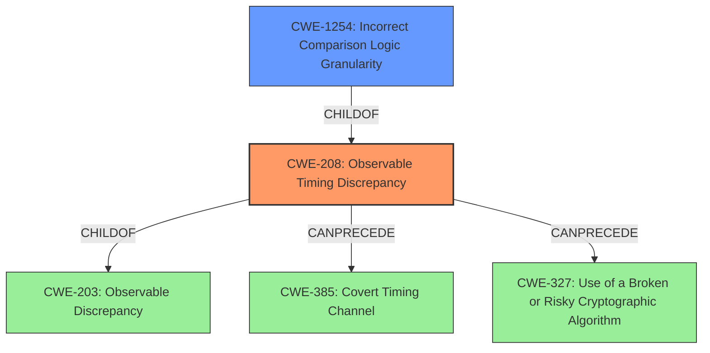

# Analysis Report for CVE-2020-1926

# Vulnerability Analysis Report: CVE-2020-1926

## Description


## Analysis (with Relationship Data)

# Summary
| CWE ID  | CWE Name                                                        | Confidence | CWE Abstraction Level | CWE Vulnerability Mapping Label | CWE-Vulnerability Mapping Notes |
| :-------- | :-------------------------------------------------------------- | :--------- | :-------------------- | :------------------------------ | :------------------------------ |
| CWE-208 | Observable Timing Discrepancy                                 | 0.90       | Base                  | Primary                         | Allowed                       |
| CWE-1254 | Incorrect Comparison Logic Granularity                          | 0.70       | Base                  | Secondary                       | Allowed                       |

## Evidence and Confidence

*   **Confidence Score:** 0.8
*   **Evidence Strength:** HIGH

## Relationship Analysis
The primary CWE selected is CWE-208 (Observable Timing Discrepancy), which has a child relationship with CWE-203 (Observable Discrepancy) and can precede CWE-385 (Covert Timing Channel) and CWE-327 (Use of a Broken or Risky Cryptographic Algorithm). CWE-1254 (Incorrect Comparison Logic Granularity) is also considered due to its relationship as a child of CWE-208, and its description relating to comparison logic being performed in steps which can lead to timing attacks. The selection of CWE-208 is favored due to its direct relevance to the **non constant time comparison** weakness described.



## Vulnerability Chain
The vulnerability chain starts with the **non constant time comparison**, leading to an Observable Timing Discrepancy, which enables an attacker to recover another user's cookie signature.

## Summary of Analysis
The initial analysis focused on the **non constant time comparison** that is vulnerable to timing attacks which could lead to the recovery of another user's cookie signature.

The vulnerability description states: "Apache Hive cookie signature verification used a **non constant time comparison** which is known to be vulnerable to timing attacks. This could allow recovery of another users cookie signature."

The primary weakness is CWE-208 (Observable Timing Discrepancy) because the vulnerability involves timing variations during cookie signature verification that an attacker can observe and exploit. The "CVE Reference Links Content Summary" also supports the root cause being related to HTTP transport and potential data exposure.

CWE-1254 (Incorrect Comparison Logic Granularity) is a closely related secondary weakness. Its description states: "The product's comparison logic is performed over a series of steps rather than across the entire string in one operation. If there is a comparison logic failure on one of these steps, the operation may be vulnerable to a timing attack that can result in the interception of the process for nefarious purposes." The vulnerability description directly states that the cookie signature verification used a **non constant time comparison**, meaning that the granularity of the comparison logic is incorrect.

Other CWEs, such as CWE-347 (Improper Verification of Cryptographic Signature), CWE-203 (Observable Discrepancy), and CWE-287 (Improper Authentication), were considered but deemed less relevant as they don't specifically address the timing-related aspect of the vulnerability. CWE-784 (Reliance on Cookies without Validation and Integrity Checking in a Security Decision) could potentially apply, but the core issue is the timing discrepancy, not the lack of cookie validation.

The selected CWEs are at the optimal level of specificity, as they directly relate to the root cause (**non constant time comparison**) and the observable timing discrepancy.

Relevant CWE Information:

# Enhanced Context (25 CWEs)
The following CWEs were identified as potentially relevant to this vulnerability:

## CWE-208: Observable Timing Discrepancy
**Abstraction Level**: Base
**Similarity Score**: 0.77
**Source**: dense

**Description**:
Two separate operations in a product require different amounts of time to complete, in a way that is observable to an actor and reveals security-relevant information about the state of the product, such as whether a particular operation was successful or not.

**Mapping Guidance**:
- Usage: Allowed
- Rationale: This CWE entry is at the Base level of abstraction, which is a preferred level of abstraction for mapping to the root causes of vulnerabilities.

## CWE-1254: Incorrect Comparison Logic Granularity
**Abstraction Level**: Base
**Similarity Score**: 5850.35
**Source**: sparse

**Description**:
The product's comparison logic is performed over a series of steps rather than across the entire string in one operation. If there is a comparison logic failure on one of these steps, the operation may be vulnerable to a timing attack that can result in the interception of the process for nefarious purposes.

**Mapping Guidance**:
- Usage: Allowed
- Rationale: This CWE entry is at the Base level of abstraction, which is a preferred level of abstraction for mapping to the root causes of vulnerabilities.

## CWE-347: Improper Verification of Cryptographic Signature
**Abstraction Level**: Base
**Similarity Score**: 0.210

**Description**:
The product does not verify, or incorrectly verifies, the cryptographic signature for data.

## CWE-203: Observable Discrepancy
**Abstraction Level**: Base
**Similarity Score**: 0.207

**Description**:
The product behaves differently or sends different responses under different circumstances in a way that is observable to an unauthorized actor, which exposes security-relevant information about the state of the product, such as whether a particular operation was successful or not.

## CWE-287: Improper Authentication
**Abstraction Level**: Class
**Similarity Score**: 0.202

**Description**:
When an actor claims to have a given identity, the product does not prove or insufficiently proves that the claim is correct.


## CWE Relationship Analysis

Current CWEs represent these abstraction levels: .


### Vulnerability Chain Analysis

**Chain starting from CWE-1254:**
- 1254 (Incorrect Comparison Logic Granularity) - ROOT


**Chain starting from CWE-784:**
- 784 (Reliance on Cookies without Validation and Integrity Checking in a Security Decision) - ROOT


### CWE Relationship Diagram

```mermaid
graph TD
    classDef primary fill:#f96,stroke:#333,stroke-width:2px
    classDef secondary fill:#69f,stroke:#333
    classDef tertiary fill:#9e9,stroke:#333
```


*Report generated on 2025-04-01 22:49:24*
