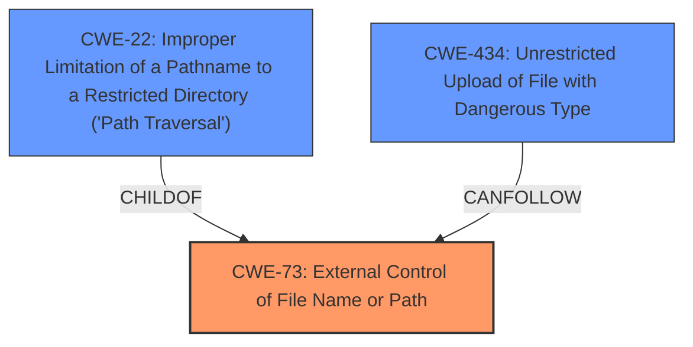

# Analysis for CVE-2020-19305

# Summary
| CWE ID | CWE Name | Confidence | CWE Abstraction Level | CWE Vulnerability Mapping Label | CWE-Vulnerability Mapping Notes |
|---|---|---|---|---|---|
| CWE-73 | External Control of File Name or Path | Base | 1 | Primary | Allowed |
| CWE-434 | Unrestricted Upload of File with Dangerous Type | Base | 0.7 | Secondary | Allowed |
| CWE-22 | Improper Limitation of a Pathname to a Restricted Directory ('Path Traversal') | Base | 0.6 | Secondary | Allowed |

## Evidence and Confidence

*   **Confidence Score:** 0.8
*   **Evidence Strength:** HIGH

## Relationship Analysis
The primary CWE is CWE-73, representing the **external control of a file name or path**. This is a base-level CWE, providing a good balance of specificity and generality. CWE-73 is related to CWE-22 (Improper Limitation of a Pathname to a Restricted Directory), with CWE-22 being a more specific type of path traversal. CWE-434 (Unrestricted Upload of File with Dangerous Type) is also relevant, as the vulnerability involves file operations.

## Vulnerability Chain
The vulnerability chain starts with the **lack of proper input validation** on the `indeximg` parameter, leading to **external control of a file path** (CWE-73). This allows an attacker to specify an arbitrary file for deletion, resulting in arbitrary file deletion.

## Summary of Analysis
The initial analysis focused on the arbitrary file deletion aspect. However, the root cause lies in the **improper handling of the file path**, which is externally controlled via the `indeximg` parameter. The analysis is heavily based on the provided "CVE Reference Links Content Summary," specifically the sections on "Root Cause" and "Weaknesses/Vulnerabilities". The evidence clearly indicates that the `indeximg` field can be arbitrarily specified by a background user, leading to the deletion of any file accessible to the webserver process.

The graph relationships influenced the final selection by highlighting the connection between CWE-73 and other related weaknesses like CWE-22 and CWE-434. While CWE-22 and CWE-434 could be present, the more general CWE-73 is the better fit for the Root Cause.

The selected CWEs are at the optimal level of specificity because they accurately represent the underlying coding error (CWE-73) and any important chain of weaknesses (CWE-434, CWE-22).

Relevant CWE Information:

# Enhanced Context (25 CWEs)
The following CWEs were identified as potentially relevant to this vulnerability:

## CWE-1176: Inefficient CPU Computation
**Abstraction Level**: Class
**Similarity Score**: 0.74
**Source**: dense

**Description**:
The product performs CPU computations using
         algorithms that are not as efficient as they could be for the
         needs of the developer, i.e., the computations can be
         optimized further.

**Mapping Guidance**:
- Usage: Allowed-with-Review
- Rationale: This CWE entry is a Class and might have Base-level children that would be more appropriate

## CWE-74: Improper Neutralization of Special Elements in Output Used by a Downstream Component ('Injection')
**Abstraction Level**: Class
**Similarity Score**: 0.74
**Source**: dense

**Description**:
The product constructs all or part of a command, data structure, or record using externally-influenced input from an upstream component, but it does not neutralize or incorrectly neutralizes special elements that could modify how it is parsed or interpreted when it is sent to a downstream component.

**Mapping Guidance**:
- Usage: Discouraged
- Rationale: CWE-74 is high-level and often misused when lower-level weaknesses are more appropriate.

## CWE-472: External Control of Assumed-Immutable Web Parameter
**Abstraction Level**: Base
**Similarity Score**: 0.74
**Source**: dense

**Description**:
The web application does not sufficiently verify inputs that are assumed to be immutable but are actually externally controllable, such as hidden form fields.

**Mapping Guidance**:
- Usage: Allowed
- Rationale: This CWE entry is at the Base level of abstraction, which is a preferred level of abstraction for mapping to the root causes of vulnerabilities.

## CWE-407: Inefficient Algorithmic Complexity
**Abstraction Level**: Class
**Similarity Score**: 0.74
**Source**: dense

**Description**:
An algorithm in a product has an inefficient worst-case computational complexity that may be detrimental to system performance and can be triggered by an attacker, typically using crafted manipulations that ensure that the worst case is being reached.

**Mapping Guidance**:
- Usage: Allowed-with-Review
- Rationale: This CWE entry is a Class and might have Base-level children that would be more appropriate

## CWE-41: Improper Resolution of Path Equivalence
**Abstraction Level**: Base
**Similarity Score**: 0.73
**Source**: dense

**Description**:
The product is vulnerable to file system contents disclosure through path equivalence. Path equivalence involves the use of special characters in file and directory names. The associated manipulations are intended to generate multiple names for the same object.

**Mapping Guidance**:
- Usage: Allowed
- Rationale: This CWE entry is at the Base level of abstraction, which is a preferred level of abstraction for mapping to the root causes of vulnerabilities.

## CWE-405: Asymmetric Resource Consumption (Amplification)
**Abstraction Level**: Class
**Similarity Score**: 0.73
**Source**: dense

**Description**:
The product does not properly control situations in which an adversary can cause the product to consume or produce excessive resources without requiring the adversary to invest equivalent work or otherwise prove authorization, i.e., the adversary's influence is "asymmetric."

**Mapping Guidance**:
- Usage: Allowed-with-Review
- Rationale: This CWE entry is a Class and might have Base-level children that would be more appropriate

## CWE-1289: Improper Validation of Unsafe Equivalence in Input
**Abstraction Level**: Base
**Similarity Score**: 0.72
**Source**: dense

**Description**:
The product receives an input value that is used as a resource identifier or other type of reference, but it does not validate or incorrectly validates that the input is equivalent to a potentially-unsafe value.

**Mapping Guidance**:
- Usage: Allowed
- Rationale: This CWE entry is at the Base level of abstraction, which is a preferred level of abstraction for mapping to the root causes of vulnerabilities.

## CWE-653: Improper Isolation or Compartmentalization
**Abstraction Level**: Class
**Similarity Score**: 0.72
**Source**: dense

**Description**:
The product does not properly compartmentalize or isolate functionality, processes, or resources that require different privilege levels, rights, or permissions.

**Mapping Guidance**:
- Usage: Allowed
- Rationale: This CWE entry is at the Base level of abstraction, which is a preferred level of abstraction for mapping to the root causes of vulnerabilities.

## CWE-915: Improperly Controlled Modification of Dynamically-Determined Object Attributes
**Abstraction Level**: Base
**Similarity Score**: 0.72
**Source**: dense

**Description**:
The product receives input from an upstream component that specifies multiple attributes, properties, or fields that are to be initialized or updated in an object, but it does not properly control which attributes can be modified.

**Mapping Guidance**:
- Usage: Allowed
- Rationale: This CWE entry is at the Base level of abstraction, which is a preferred level of abstraction for mapping to the root causes of vulnerabilities.

## CWE-184: Incomplete List of Disallowed Inputs
**Abstraction Level**: Base
**Similarity Score**: 0.72
**Source**: dense

**Description**:
The product implements a protection mechanism that relies on a list of inputs (or properties of inputs) that are not allowed by policy or otherwise require other action to neutralize before additional processing takes place, but the list is incomplete.

**Mapping Guidance**:
- Usage: Allowed
- Rationale: This CWE entry is at the Base level of abstraction, which is a preferred level of abstraction for mapping to the root causes of vulnerabilities.

## CWE-79: Improper Neutralization of Input During Web Page Generation ('Cross-site Scripting')
**Abstraction Level**: Base
**Similarity Score**: 7372.82
**Source**: sparse

**Description**:
The product does not neutralize or incorrectly neutralizes user-controllable input before it is placed in output that is used as

# Enhanced Query for CVE-2020-19305

## Vulnerability Description
An issue in /app/system/column/admin/index.class.php of Metinfo v7.0.0 causes the indeximg parameter to be deleted when the column is deleted, allowing attackers to escalate privileges.

### Vulnerability Description Key Phrases
- **attacker:** attackers
- **product:** Metinfo
- **version:** v7.0.0
- **component:** /app/system/column/admin/index.class.php

## CVE Reference Links Content Summary
Based on the provided content, here's an analysis of the vulnerability:

**Vulnerability:** Arbitrary File Deletion in MetInfo CMS v7.0.0

**Root Cause:**
The vulnerability stems from improper handling of the `indeximg` field when deleting a column within the MetInfo CMS. The `_delolumn` function in `/app/system/column/admin/index.class.php` uses the `fileUnlink` function which deletes the file specified in the `indeximg` field. Critically, this `indeximg` field can be arbitrarily specified by a background user (via the column picture upload functionality). This allows a malicious user to specify a system file path in `indeximg`, and upon column deletion, trigger the deletion of that arbitrary file.

**Weaknesses/Vulnerabilities:**
*   **Arbitrary File Deletion:** The primary vulnerability is the ability to delete any file accessible to the webserver process by specifying its path in the `indeximg` field.
*   **Insufficient Input Validation:** The CMS lacks proper input validation and sanitization of the `indeximg` field. It doesn't check whether the specified file path belongs to a user uploaded image or any other restriction.
*   **Unsafe File Operations:** The `fileUnlink` function is used directly on user-supplied input without proper verification, enabling the deletion of arbitrary files.

**Impact of Exploitation:**
*   **Data Loss:** An attacker can delete critical files on the server, potentially causing data loss and disruption of services.
*   **System Instability:** Deletion of key system files can lead to system instability, crashes, or rendering the application unusable.
*   **Potential for Further Attacks:** Arbitrary file deletion can be a stepping stone for more severe attacks. For instance, an attacker could delete application files and then upload a modified version to gain further access or control.

**Attack Vectors:**
*   **HTTP POST Request:** The attack is performed by sending a specifically crafted POST request to `/admin/?n=column&c=index&a=doEditorsave`.
*   **Multipart Form Data:** The request uses `multipart/form-data` to send the necessary parameters.
*   **`indeximg` Parameter:** The `indeximg` parameter within the POST request is used to specify the path of the file to be deleted.

**Required Attacker Capabilities/Position:**
*   **Authenticated User:** An attacker needs to be an authenticated user with access to the column management section in the MetInfo CMS backend. This means a user that has the ability to create/edit column content and upload images for columns.
*   **Knowledge of Target Path:** The attacker needs to know the full path to the file they want to delete on the server.

**Technical Details:**
The provided POC demonstrates the exploitation process:
1.  A POST request is sent to `admin/?n=column&c=index&a=doEditorsave` with the `indeximg` field set to the target file path.
2.  The column associated with the POST request is deleted, triggering the arbitrary file deletion via the `fileUnlink` function.

In summary, this is a serious vulnerability as it allows an authenticated user to arbitrarily delete files on the server through a misconfiguration of the column deletion functionality.

This analysis provides more detail than a basic CVE description, detailing the specific parameters and code flow involved in the vulnerability.

## Retriever Results

### Top Combined Results

| Rank | CWE ID | Name | Abstraction | Usage  | Retrievers | Individual Scores |
|------|--------|------|-------------|-------|------------|-------------------|
| 1 | 36 | Absolute Path Traversal | Base | Allowed | sparse | 0.065 |
| 2 | 352 | Cross-Site Request Forgery (CSRF) | Compound | Allowed | sparse | 0.057 |
| 3 | 23 | Relative Path Traversal | Base | Allowed | sparse | 0.057 |
| 4 | 94 | Improper Control of Generation of Code ('Code Injection') | Base | Allowed-with-Review | sparse | 0.056 |
| 5 | 79 | Improper Neutralization of Input During Web Page Generation ('Cross-site Scripting') | Base | Allowed | sparse | 0.055 |
| 6 | 89 | Improper Neutralization of Special Elements used in an SQL Command ('SQL Injection') | Base | Allowed | dense | 0.478 |
| 7 | 434 | Unrestricted Upload of File with Dangerous Type | Base | Allowed | graph | 0.002 |
| 8 | 286 | Incorrect User Management | Class | Allowed-with-Review | sparse | 0.055 |
| 9 | 472 | External Control of Assumed-Immutable Web Parameter | Base | Allowed | sparse | 0.054 |
| 10 | 1176 | Inefficient CPU Computation | Class | Allowed-with-Review | sparse | 0.053 |

# Complete CWE Specifications

## CWE-36: Absolute Path Traversal
**Abstraction:** Base
**Status:** Draft

### Description
The product uses external input to construct a pathname that should be within a restricted directory, but it does not properly neutralize absolute path sequences such as "/abs/path" that can resolve to a location that is outside of that directory.

### Extended Description
This allows attackers to traverse the file system to access files or directories that are outside of the restricted directory.

### Alternative Terms
None

### Relationships
ChildOf -> CWE-22
ChildOf -> CWE-22
ChildOf -> CWE-22

### Mapping Guidance
**Usage:** Allowed
**Rationale:** This CWE entry is at the Base level of abstraction, which is a preferred level of abstraction for mapping to the root causes of vulnerabilities.
**Comments:** Carefully read both the name and description to ensure that this mapping is an appropriate fit. Do not try to 'force' a mapping to a lower-level Base/Variant simply to comply with this preferred level of abstraction.
**Reasons:**
- Acceptable-Use

### Observed Examples
- **CVE-2022-31503:** Python package constructs filenames using an unsafe os.path.join call on untrusted input, allowing absolute path traversal because os.path.join resets the pathname to an absolute path that is specified as part of the input.
- **CVE-2002-1345:** Multiple FTP clients write arbitrary files via absolute paths in server responses
- **CVE-2001-1269:** ZIP file extractor allows full path

## CWE-352: Cross-Site Request Forgery (CSRF)
**Abstraction:** Compound
**Status:** Stable

### Description
The web application does not, or can not, sufficiently verify whether a well-formed, valid, consistent request was intentionally provided by the user who submitted the request.

### Extended Description
When a web server is designed to receive a request from a client without any mechanism for verifying that it was intentionally sent, then it might be possible for an attacker to trick a client into making an unintentional request to the web server which will be treated as an authentic request. This can be done via a URL, image load, XMLHttpRequest, etc. and can result in exposure of data or unintended code execution.

### Alternative Terms
Session Riding
Cross Site Reference Forgery
XSRF

### Relationships
ChildOf -> CWE-345
ChildOf -> CWE-345
Requires -> CWE-346
Requires -> CWE-441
Requires -> CWE-642
Requires -> CWE-613

### Mapping Guidance
**Usage:** Allowed
**Rationale:** This is a well-known Composite of multiple weaknesses that must all occur simultaneously, although it is attack-oriented in nature.
**Comments:** While attack-oriented composites are supported in CWE, they have not been a focus of research. There is a chance that future research or CWE scope clarifications will change or deprecate them. Perform root-cause analysis to determine if other weaknesses allow CSRF attacks to occur, and map to those weaknesses. For example, predictable CSRF tokens might allow bypass of CSRF protection mechanisms; if this occurs, they might be better characterized as randomness/predictability weaknesses.
**Reasons:**
- Other

### Additional Notes
**[Relationship]** 

There can be a close relationship between XSS and CSRF (CWE-352). An attacker might use CSRF in order to trick the victim into submitting requests to the server in which the requests contain an XSS payload. A well-known example of this was the Samy worm on MySpace [REF-956]. The worm used XSS to insert malicious HTML sequences into a user's profile and add the attacker as a MySpace friend. MySpace friends of that victim would then execute the payload to modify their own profiles, causing the worm to propagate exponentially. Since the victims did not intentionally insert the malicious script themselves, CSRF was a root cause.

**[Theoretical]** 

The CSRF topology is multi-channel:

  - Attacker (as outsider) to intermediary (as user). The interaction point is either an external or internal channel.

  - Intermediary (as user) to server (as victim). The activation point is an internal channel.

### Observed Examples
- **CVE-2004-1703:** Add user accounts via a URL in an img tag
- **CVE-2004-1995:** Add user accounts via a URL in an img tag
- **CVE-2004-1967:** Arbitrary code execution by specifying the code in a crafted img tag or URL

## CWE-23: Relative Path Traversal
**Abstraction:** Base
**Status:** Draft

### Description
The product uses external input to construct a pathname that should be within a restricted directory, but it does not properly neutralize sequences such as ".." that can resolve to a location that is outside of that directory.

### Extended Description
This allows attackers to traverse the file system to access files or directories that are outside of the restricted directory.

### Alternative Terms
Zip Slip: "Zip slip" is an attack that uses file archives (e.g., ZIP, tar, rar, etc.) that contain filenames with path traversal sequences that cause the files to be written outside of the directory under which the archive is expected to be extracted [REF-1282]. It is most commonly used for relative path traversal (CWE-23) and link following (CWE-59).

### Relationships
ChildOf -> CWE-22
ChildOf -> CWE-22
ChildOf -> CWE-22

### Mapping Guidance
**Usage:** Allowed
**Rationale:** This CWE entry is at the Base level of abstraction, which is a preferred level of abstraction for mapping to the root causes of vulnerabilities.
**Comments:** Carefully read both the name and description to ensure that this mapping is an appropriate fit. Do not try to 'force' a mapping to a lower-level Base/Variant simply to comply with this preferred level of abstraction.
**Reasons:**
- Acceptable-Use

### Observed Examples
- **CVE-2024-37032:** Large language model (LLM) management tool does not validate the format of a digest value (CWE-1287) from a private, untrusted model registry, enabling relative path traversal (CWE-23), a.k.a. Probllama
- **CVE-2022-45918:** Chain: a learning management tool debugger uses external input to locate previous session logs (CWE-73) and does not properly validate the given path (CWE-20), allowing for filesystem path traversal using "../" sequences (CWE-24)
- **CVE-2019-20916:** Python package manager does not correctly restrict the filename specified in a Content-Disposition header, allowing arbitrary file read using path traversal sequences such as "../"

## CWE-94: Improper Control of Generation of Code ('Code Injection')
**Abstraction:** Base
**Status:** Draft

### Description
The product constructs all or part of a code segment using externally-influenced input from an upstream component, but it does not neutralize or incorrectly neutralizes special elements that could modify the syntax or behavior of the intended code segment.

### Extended Description

When a product allows a user's input to contain code syntax, it might be possible for an attacker to craft the code in such a way that it will alter the intended control flow of the product. Such an alteration could lead to arbitrary code execution.

Injection problems encompass a wide variety of issues -- all mitigated in very different ways. For this reason, the most effective way to discuss these weaknesses is to note the distinct features which classify them as injection weaknesses. The most important issue to note is that all injection problems share one thing in common -- i.e., they allow for the injection of control plane data into the user-controlled data plane. This means that the execution of the process may be altered by sending code in through legitimate data channels, using no other mechanism. While buffer overflows, and many other flaws, involve the use of some further issue to gain execution, injection problems need only for the data to be parsed. The most classic instantiations of this category of weakness are SQL injection and format string vulnerabilities.

### Alternative Terms
None

### Relationships
ChildOf -> CWE-74
ChildOf -> CWE-74
ChildOf -> CWE-913

### Mapping Guidance
**Usage:** Allowed-with-Review
**Rationale:** This entry is frequently misused for vulnerabilities with a technical impact of "code execution," which does not by itself indicate a root cause weakness, since dozens of weaknesses can enable code execution.
**Comments:** This weakness only applies when the product's functionality intentionally constructs all or part of a code segment. It could be that executing code could be the result of other weaknesses that do not involve the construction of code segments.
**Reasons:**
- Frequent Misuse
- Frequent Misinterpretation

### Observed Examples
- **CVE-2023-29374:** Math component in an LLM framework translates user input into a Python expression that is input into the Python exec() method, allowing code execution - one variant of a "prompt injection" attack.
- **CVE-2024-5565:** Python-based library uses an LLM prompt containing user input to dynamically generate code that is then fed as input into the Python exec() method, allowing code execution - one variant of a "prompt injection" attack.
- **CVE-2024-4181:** Framework for LLM applications allows eval injection via a crafted response from a hosting provider.

## CWE-79: Improper Neutralization of Input During Web Page Generation ('Cross-site Scripting')
**Abstraction:** Base
**Status:** Stable

### Description
The product does not neutralize or incorrectly neutralizes user-controllable input before it is placed in output that is used as a web page that is served to other users.

### Extended Description

Cross-site scripting (XSS) vulnerabilities occur when:

  1. Untrusted data enters a web application, typically from a web request.

  1. The web application dynamically generates a web page that contains this untrusted data.

  1. During page generation, the application does not prevent the data from containing content that is executable by a web browser, such as JavaScript, HTML tags, HTML attributes, mouse events, Flash, ActiveX, etc.

  1. A victim visits the generated web page through a web browser, which contains malicious script that was injected using the untrusted data.

  1. Since the script comes from a web page that was sent by the web server, the victim's web browser executes the malicious script in the context of the web server's domain.

  1. This effectively violates the intention of the web browser's same-origin policy, which states that scripts in one domain should not be able to access resources or run code in a different domain.

There are three main kinds of XSS:

  -  **Type 1: Reflected XSS (or Non-Persistent)**  - The server reads data directly from the HTTP request and reflects it back in the HTTP response. Reflected XSS exploits occur when an attacker causes a victim to supply dangerous content to a vulnerable web application, which is then reflected back to the victim and executed by the web browser. The most common mechanism for delivering malicious content is to include it as a parameter in a URL that is posted publicly or e-mailed directly to the victim. URLs constructed in this manner constitute the core of many phishing schemes, whereby an attacker convinces a victim to visit a URL that refers to a vulnerable site. After the site reflects the attacker's content back to the victim, the content is executed by the victim's browser.

  -  **Type 2: Stored XSS (or Persistent)**  - The application stores dangerous data in a database, message forum, visitor log, or other trusted data store. At a later time, the dangerous data is subsequently read back into the application and included in dynamic content. From an attacker's perspective, the optimal place to inject malicious content is in an area that is displayed to either many users or particularly interesting users. Interesting users typically have elevated privileges in the application or interact with sensitive data that is valuable to the attacker. If one of these users executes malicious content, the attacker may be able to perform privileged operations on behalf of the user or gain access to sensitive data belonging to the user. For example, the attacker might inject XSS into a log message, which might not be handled properly when an administrator views the logs. 

  -  **Type 0: DOM-Based XSS**  - In DOM-based XSS, the client performs the injection of XSS into the page; in the other types, the server performs the injection. DOM-based XSS generally involves server-controlled, trusted script that is sent to the client, such as Javascript that performs sanity checks on a form before the user submits it. If the server-supplied script processes user-supplied data and then injects it back into the web page (such as with dynamic HTML), then DOM-based XSS is possible. 

Once the malicious script is injected, the attacker can perform a variety of malicious activities. The attacker could transfer private information, such as cookies that may include session information, from the victim's machine to the attacker. The attacker could send malicious requests to a web site on behalf of the victim, which could be especially dangerous to the site if the victim has administrator privileges to manage that site. Phishing attacks could be used to emulate trusted web sites and trick the victim into entering a password, allowing the attacker to compromise the victim's account on that web site. Finally, the script could exploit a vulnerability in the web browser itself possibly taking over the victim's machine, sometimes referred to as "drive-by hacking."

In many cases, the attack can be launched without the victim even being aware of it. Even with careful users, attackers frequently use a variety of methods to encode the malicious portion of the attack, such as URL encoding or Unicode, so the request looks less suspicious.

### Alternative Terms
XSS: A common abbreviation for Cross-Site Scripting.
HTML Injection: Used as a synonym of stored (Type 2) XSS.
CSS: In the early years after initial discovery of XSS, "CSS" was a commonly-used acronym. However, this would cause confusion with "Cascading Style Sheets," so usage of this acronym has declined significantly.

### Relationships
ChildOf -> CWE-74
ChildOf -> CWE-74
CanPrecede -> CWE-494
PeerOf -> CWE-352

### Mapping Guidance
**Usage:** Allowed
**Rationale:** This CWE entry is at the Base level of abstraction, which is a preferred level of abstraction for mapping to the root causes of vulnerabilities.
**Comments:** Carefully read both the name and description to ensure that this mapping is an appropriate fit. Do not try to 'force' a mapping to a lower-level Base/Variant simply to comply with this preferred level of abstraction.
**Reasons:**
- Acceptable-Use

### Additional Notes
**[Relationship]** 

There can be a close relationship between XSS and CSRF (CWE-352). An attacker might use CSRF in order to trick the victim into submitting requests to the server in which the requests contain an XSS payload. A well-known example of this was the Samy worm on MySpace [REF-956]. The worm used XSS to insert malicious HTML sequences into a user's profile and add the attacker as a MySpace friend. MySpace friends of that victim would then execute the payload to modify their own profiles, causing the worm to propagate exponentially. Since the victims did not intentionally insert the malicious script themselves, CSRF was a root cause.

**[Applicable Platform]** 

XSS flaws are very common in web applications, since they require a great deal of developer discipline to avoid them.

### Observed Examples
- **CVE-2021-25926:** Python Library Manager did not sufficiently neutralize a user-supplied search term, allowing reflected XSS.
- **CVE-2021-25963:** Python-based e-commerce platform did not escape returned content on error pages, allowing for reflected Cross-Site Scripting attacks.
- **CVE-2021-1879:** Universal XSS in mobile operating system, as exploited in the wild per CISA KEV.

## CWE-89: Improper Neutralization of Special Elements used in an SQL Command ('SQL Injection')
**Abstraction:** Base
**Status:** Stable

### Description
The product constructs all or part of an SQL command using externally-influenced input from an upstream component, but it does not neutralize or incorrectly neutralizes special elements that could modify the intended SQL command when it is sent to a downstream component. Without sufficient removal or quoting of SQL syntax in user-controllable inputs, the generated SQL query can cause those inputs to be interpreted as SQL instead of ordinary user data.

### Extended Description
Not provided

### Alternative Terms
SQL injection: a common attack-oriented phrase
SQLi: a common abbreviation for "SQL injection"

### Relationships
ChildOf -> CWE-943
ChildOf -> CWE-74

### Mapping Guidance
**Usage:** Allowed
**Rationale:** This CWE entry is at the Base level of abstraction, which is a preferred level of abstraction for mapping to the root causes of vulnerabilities.
**Comments:** Carefully read both the name and description to ensure that this mapping is an appropriate fit. Do not try to 'force' a mapping to a lower-level Base/Variant simply to comply with this preferred level of abstraction.
**Reasons:**
- Acceptable-Use

### Additional Notes
**[Relationship]** SQL injection can be resultant from special character mismanagement, MAID, or denylist/allowlist problems. It can be primary to authentication errors.

### Observed Examples
- **CVE-2023-32530:** SQL injection in security product dashboard using crafted certificate fields
- **CVE-2021-42258:** SQL injection in time and billing software, as exploited in the wild per CISA KEV.
- **CVE-2021-27101:** SQL injection in file-transfer system via a crafted Host header, as exploited in the wild per CISA KEV.

## CWE-434: Unrestricted Upload of File with Dangerous Type
**Abstraction:** Base
**Status:** Draft

### Description
The product allows the upload or transfer of dangerous file types that are automatically processed within its environment.

### Extended Description
Not provided

### Alternative Terms
Unrestricted File Upload: Used in vulnerability databases and elsewhere, but it is insufficiently precise. The phrase could be interpreted as the lack of restrictions on the size or number of uploaded files, which is a resource consumption issue.

### Relationships
ChildOf -> CWE-669
ChildOf -> CWE-669
PeerOf -> CWE-351
PeerOf -> CWE-436
PeerOf -> CWE-430

### Mapping Guidance
**Usage:** Allowed
**Rationale:** This CWE entry is at the Base level of abstraction, which is a preferred level of abstraction for mapping to the root causes of vulnerabilities.
**Comments:** Carefully read both the name and description to ensure that this mapping is an appropriate fit. Do not try to 'force' a mapping to a lower-level Base/Variant simply to comply with this preferred level of abstraction.
**Reasons:**
- Acceptable-Use

### Additional Notes
**[Relationship]** 

This can have a chaining relationship with incomplete denylist / permissive allowlist errors when the product tries, but fails, to properly limit which types of files are allowed (CWE-183, CWE-184).

This can also overlap multiple interpretation errors for intermediaries, e.g. anti-virus products that do not remove or quarantine attachments with certain file extensions that can be processed by client systems.

### Observed Examples
- **CVE-2023-5227:** PHP-based FAQ management app does not check the MIME type for uploaded images
- **CVE-2001-0901:** Web-based mail product stores ".shtml" attachments that could contain SSI
- **CVE-2002-1841:** PHP upload does not restrict file types

## CWE-286: Incorrect User Management
**Abstraction:** Class
**Status:** Incomplete

### Description
The product does not properly manage a user within its environment.

### Extended Description
Users can be assigned to the wrong group (class) of permissions resulting in unintended access rights to sensitive objects.

### Alternative Terms
None

### Relationships
ChildOf -> CWE-284

### Mapping Guidance
**Usage:** Allowed-with-Review
**Rationale:** This CWE entry is a Class and might have Base-level children that would be more appropriate
**Comments:** Examine children of this entry to see if there is a better fit
**Reasons:**
- Abstraction

### Additional Notes
**[Maintenance]** The relationships between privileges, permissions, and actors (e.g. users and groups) need further refinement within the Research view. One complication is that these concepts apply to two different pillars, related to control of resources (CWE-664) and protection mechanism failures (CWE-693).

**[Maintenance]** This item needs more work. Possible sub-categories include: user in wrong group, and user with insecure profile or "configuration". It also might be better expressed as a category than a weakness.

### Observed Examples
- **CVE-2022-36109:** Containerization product does not record a user's supplementary group ID, allowing bypass of group restrictions.
- **CVE-1999-1193:** Operating system assigns user to privileged wheel group, allowing the user to gain root privileges.

## CWE-472: External Control of Assumed-Immutable Web Parameter
**Abstraction:** Base
**Status:** Draft

### Description
The web application does not sufficiently verify inputs that are assumed to be immutable but are actually externally controllable, such as hidden form fields.

### Extended Description

If a web product does not properly protect assumed-immutable values from modification in hidden form fields, parameters, cookies, or URLs, this can lead to modification of critical data. Web applications often mistakenly make the assumption that data passed to the client in hidden fields or cookies is not susceptible to tampering. Improper validation of data that are user-controllable can lead to the application processing incorrect, and often malicious, input.

For example, custom cookies commonly store session data or persistent data across sessions. This kind of session data is normally involved in security related decisions on the server side, such as user authentication and access control. Thus, the cookies might contain sensitive data such as user credentials and privileges. This is a dangerous practice, as it can often lead to improper reliance on the value of the client-provided cookie by the server side application.

### Alternative Terms
Assumed-Immutable Parameter Tampering

### Relationships
ChildOf -> CWE-642
ChildOf -> CWE-471

### Mapping Guidance
**Usage:** Allowed
**Rationale:** This CWE entry is at the Base level of abstraction, which is a preferred level of abstraction for mapping to the root causes of vulnerabilities.
**Comments:** Carefully read both the name and description to ensure that this mapping is an appropriate fit. Do not try to 'force' a mapping to a lower-level Base/Variant simply to comply with this preferred level of abstraction.
**Reasons:**
- Acceptable-Use

### Additional Notes
**[Relationship]** This is a primary weakness for many other weaknesses and functional consequences, including XSS, SQL injection, path disclosure, and file inclusion.

**[Theoretical]** This is a technology-specific MAID problem.

### Observed Examples
- **CVE-2002-0108:** Forum product allows spoofed messages of other users via hidden form fields for name and e-mail address.
- **CVE-2000-0253:** Shopping cart allows price modification via hidden form field.
- **CVE-2000-0254:** Shopping cart allows price modification via hidden form field.

## CWE-1176: Inefficient CPU Computation
**Abstraction:** Class
**Status:** Incomplete

### Description
The product performs CPU computations using
         algorithms that are not as efficient as they could be for the
         needs of the developer, i.e., the computations can be
         optimized further.

### Extended Description

This issue can make the product perform more slowly, possibly in ways that are noticeable to the users. If an attacker can influence the amount of computation that must be performed, e.g. by triggering worst-case complexity, then this performance problem might introduce a vulnerability.

### Alternative Terms
None

### Relationships
ChildOf -> CWE-405

### Mapping Guidance
**Usage:** Allowed-with-Review
**Rationale:** This CWE entry is a Class and might have Base-level children that would be more appropriate
**Comments:** Examine children of this entry to see if there is a better fit
**Reasons:**
- Abstraction

### Observed Examples
- **CVE-2022-37734:** Chain: lexer in Java-based GraphQL server does not enforce maximum of tokens early enough (CWE-696), allowing excessive CPU consumption (CWE-1176)

