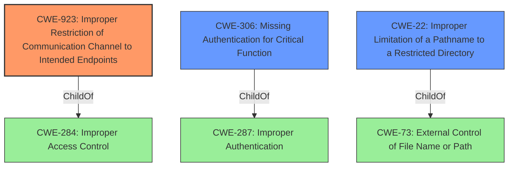

# Raw Analyzer Response for CVE-2020-1938

# Summary
| CWE ID | CWE Name | Confidence | CWE Abstraction Level | CWE Vulnerability Mapping Label | CWE-Vulnerability Mapping Notes |
|---|---|---|---|---|---|
| CWE-923 | Improper Restriction of Communication Channel to Intended Endpoints | 0.9 | Class | Primary | Allowed-with-Review |
| CWE-306 | Missing Authentication for Critical Function | 0.7 | Base | Secondary | Allowed |
| CWE-22 | Improper Limitation of a Pathname to a Restricted Directory ('Path Traversal') | 0.6 | Base | Secondary | Allowed |

## Evidence and Confidence

*   **Confidence Score:** 0.8
*   **Evidence Strength:** HIGH

## Relationship Analysis
The primary relationship that influenced my decision was the parent-child relationship between CWE-284 (Improper Access Control) and CWE-923, and between CWE-287 (Improper Authentication) and CWE-306. CWE-923 and CWE-306 are more specific than their parents and better capture the nuanced **root cause** of the vulnerability, which involves **improper** restrictions on the communication channel and **missing authentication** for a critical function.
CWE-22 and CWE-73 have a close relationship but this is not a path traversal issue, but rather an access control issue that permits returning arbitrary files.
The abstraction levels guided the selection of CWE-923 (Class), CWE-306 and CWE-22 (Base).

## Vulnerability Chain
The vulnerability chain starts with the **Tomcat treating AJP connections as having higher trust than other connections**, leading to **missing authentication** and **improper** access control on the AJP connector. This allows attackers to access arbitrary files and process them as JSPs, ultimately enabling remote code execution if file upload is possible.

## Summary of Analysis
Initially, the vulnerability description and the Retriever Results suggested several potential CWEs, including CWE-923, CWE-22, CWE-863, and CWE-306.
The primary **rootcause** is that "**Tomcat treats AJP connections as having higher trust than other connections**".
This statement, along with the fact that the AJP Connector was enabled by default without proper authentication, strongly points to **CWE-923 (Improper Restriction of Communication Channel to Intended Endpoints)**. This is because Tomcat **does not properly ensure that it is communicating with the correct endpoint**, as it trusts AJP connections without sufficient validation.
The lack of authentication on the AJP connector also makes **CWE-306 (Missing Authentication for Critical Function)** a relevant consideration, since the AJP connector handles critical functions without requiring a provable user identity.
The ability to return arbitrary files from anywhere in the web application could be related to **CWE-22 (Improper Limitation of a Pathname to a Restricted Directory)**.
I have focused on the **root cause** rather than the impact.
The final selection of CWEs is based on a thorough analysis of the vulnerability description, the CVE Reference Links Content Summary, and the Retriever Results, with a focus on identifying the **root cause** of the vulnerability and selecting the most specific and relevant CWEs. The graph relationships further support this selection by highlighting the connections between access control, authentication, and the specific weaknesses present in the AJP connector.

Relevant CWE Information:

# Enhanced Context (25 CWEs)
The following CWEs were identified as potentially relevant to this vulnerability:

## CWE-319: Cleartext Transmission of Sensitive Information
**Abstraction Level**: Base
**Similarity Score**: 0.79
**Source**: dense

**Description**:
The product transmits sensitive or security-critical data in cleartext in a communication channel that can be sniffed by unauthorized actors.

**Mapping Guidance**:
- Usage: Allowed
- Rationale: This CWE entry is at the Base level of abstraction, which is a preferred level of abstraction for mapping to the root causes of vulnerabilities.

**Why Not Selected**: Sensitive information is not transmitted in cleartext.

## CWE-345: Insufficient Verification of Data Authenticity
**Abstraction Level**: Class
**Similarity Score**: 0.79
**Source**: dense

**Description**:
The product does not sufficiently verify the origin or authenticity of data, in a way that causes it to accept invalid data.

**Mapping Guidance**:
- Usage: Discouraged
- Rationale: This CWE entry is a level-1 Class (i.e., a child of a Pillar). It might have lower-level children that would be more appropriate

**Why Not Selected**: While there is insufficient verification, the primary issue is the lack of restriction on the communication channel and missing authentication.

## CWE-203: Observable Discrepancy
**Abstraction Level**: Base
**Similarity Score**: 0.79
**Source**: dense

**Description**:
The product behaves differently or sends different responses under different circumstances in a way that is observable to an unauthorized actor, which exposes security-relevant information about the state of the product, such as whether a particular operation was successful or not.

**Mapping Guidance**:
- Usage: Allowed
- Rationale: This CWE entry is at the Base level of abstraction, which is a preferred level of abstraction for mapping to the root causes of vulnerabilities.

**Why Not Selected**: This is not the primary issue. The vulnerability is due to the improper restriction of the communication channel.

## CWE-1240: Use of a Cryptographic Primitive with a Risky Implementation
**Abstraction Level**: Base
**Similarity Score**: 0.79
**Source**: dense

**Description**:
To fulfill the need for a cryptographic primitive, the product implements a cryptographic algorithm using a non-standard, unproven, or disallowed/non-compliant cryptographic implementation.

**Mapping Guidance**:
- Usage: Allowed
- Rationale: This CWE entry is at the Base level of abstraction, which is a preferred level of abstraction for mapping to the root causes of vulnerabilities.

**Why Not Selected**: Cryptography is not the primary issue.

## CWE-1391: Use of Weak Credentials
**Abstraction Level**: Class
**Similarity Score**: 0.78
**Source**: dense

**Description**:
The product uses weak credentials (such as a default key or hard-coded password) that can be calculated, derived, reused, or guessed by an attacker.

**Mapping Guidance**:
- Usage: Allowed-with-Review
- Rationale: This CWE entry is a Class and might have Base-level children that would be more appropriate

**Why Not Selected**: The issue is not the use of weak credentials, but the **missing authentication**.

## CWE-330: Use of Insufficiently Random Values
**Abstraction Level**: Class
**Similarity Score**: 0.78
**Source**: dense

**Description**:
The product uses insufficiently random numbers or values in a security context that depends on unpredictable numbers.

**Mapping Guidance**:
- Usage: Discouraged
- Rationale: This CWE entry is a level-1 Class (i.e., a child of a Pillar). It might have lower-level children that would be more appropriate

**Why Not Selected**: Randomness is not relevant to this vulnerability.

## CWE-303: Incorrect Implementation of Authentication Algorithm
**Abstraction Level**: Base
**Similarity Score**: 0.78
**Source**: dense

**Description**:
The requirements for the product dictate the use of an established authentication algorithm, but the implementation of the algorithm is incorrect.

**Mapping Guidance**:
- Usage: Allowed
- Rationale: This CWE entry is at the Base level of abstraction, which is a preferred level of abstraction for mapping to the root causes of vulnerabilities.

**Why Not Selected**: The issue is not an incorrect implementation of an authentication algorithm, but the **missing authentication**.

## CWE-755: Improper Handling of Exceptional Conditions
**Abstraction Level**: Class
**Similarity Score**: 0.78
**Source**: dense

**Description**:
The product does not handle or incorrectly handles an exceptional condition.

**Mapping Guidance**:
- Usage: Discouraged
- Rationale: This CWE entry is a level-1 Class (i