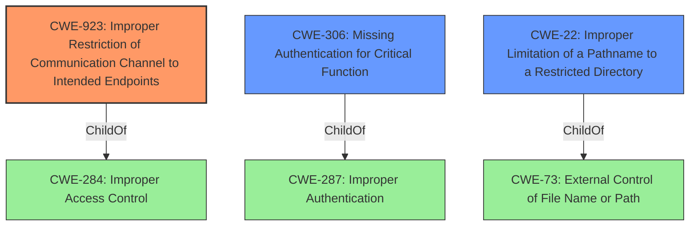

# Analysis for CVE-2020-1938

# Summary
| CWE ID | CWE Name | Confidence | CWE Abstraction Level | CWE Vulnerability Mapping Label | CWE-Vulnerability Mapping Notes |
|---|---|---|---|---|---|
| CWE-923 | Improper Restriction of Communication Channel to Intended Endpoints | 0.9 | Class | Primary | Allowed-with-Review |
| CWE-306 | Missing Authentication for Critical Function | 0.7 | Base | Secondary | Allowed |
| CWE-22 | Improper Limitation of a Pathname to a Restricted Directory ('Path Traversal') | 0.6 | Base | Secondary | Allowed |

## Evidence and Confidence

*   **Confidence Score:** 0.8
*   **Evidence Strength:** HIGH

## Relationship Analysis
The primary relationship that influenced my decision was the parent-child relationship between CWE-284 (Improper Access Control) and CWE-923, and between CWE-287 (Improper Authentication) and CWE-306. CWE-923 and CWE-306 are more specific than their parents and better capture the nuanced **root cause** of the vulnerability, which involves **improper** restrictions on the communication channel and **missing authentication** for a critical function.
CWE-22 and CWE-73 have a close relationship but this is not a path traversal issue, but rather an access control issue that permits returning arbitrary files.
The abstraction levels guided the selection of CWE-923 (Class), CWE-306 and CWE-22 (Base).

## Vulnerability Chain
The vulnerability chain starts with the **Tomcat treating AJP connections as having higher trust than other connections**, leading to **missing authentication** and **improper** access control on the AJP connector. This allows attackers to access arbitrary files and process them as JSPs, ultimately enabling remote code execution if file upload is possible.

## Summary of Analysis
Initially, the vulnerability description and the Retriever Results suggested several potential CWEs, including CWE-923, CWE-22, CWE-863, and CWE-306.
The primary **rootcause** is that "**Tomcat treats AJP connections as having higher trust than other connections**".
This statement, along with the fact that the AJP Connector was enabled by default without proper authentication, strongly points to **CWE-923 (Improper Restriction of Communication Channel to Intended Endpoints)**. This is because Tomcat **does not properly ensure that it is communicating with the correct endpoint**, as it trusts AJP connections without sufficient validation.
The lack of authentication on the AJP connector also makes **CWE-306 (Missing Authentication for Critical Function)** a relevant consideration, since the AJP connector handles critical functions without requiring a provable user identity.
The ability to return arbitrary files from anywhere in the web application could be related to **CWE-22 (Improper Limitation of a Pathname to a Restricted Directory)**.
I have focused on the **root cause** rather than the impact.
The final selection of CWEs is based on a thorough analysis of the vulnerability description, the CVE Reference Links Content Summary, and the Retriever Results, with a focus on identifying the **root cause** of the vulnerability and selecting the most specific and relevant CWEs. The graph relationships further support this selection by highlighting the connections between access control, authentication, and the specific weaknesses present in the AJP connector.

Relevant CWE Information:

# Enhanced Context (25 CWEs)
The following CWEs were identified as potentially relevant to this vulnerability:

## CWE-319: Cleartext Transmission of Sensitive Information
**Abstraction Level**: Base
**Similarity Score**: 0.79
**Source**: dense

**Description**:
The product transmits sensitive or security-critical data in cleartext in a communication channel that can be sniffed by unauthorized actors.

**Mapping Guidance**:
- Usage: Allowed
- Rationale: This CWE entry is at the Base level of abstraction, which is a preferred level of abstraction for mapping to the root causes of vulnerabilities.

**Why Not Selected**: Sensitive information is not transmitted in cleartext.

## CWE-345: Insufficient Verification of Data Authenticity
**Abstraction Level**: Class
**Similarity Score**: 0.79
**Source**: dense

**Description**:
The product does not sufficiently verify the origin or authenticity of data, in a way that causes it to accept invalid data.

**Mapping Guidance**:
- Usage: Discouraged
- Rationale: This CWE entry is a level-1 Class (i.e., a child of a Pillar). It might have lower-level children that would be more appropriate

**Why Not Selected**: While there is insufficient verification, the primary issue is the lack of restriction on the communication channel and missing authentication.

## CWE-203: Observable Discrepancy
**Abstraction Level**: Base
**Similarity Score**: 0.79
**Source**: dense

**Description**:
The product behaves differently or sends different responses under different circumstances in a way that is observable to an unauthorized actor, which exposes security-relevant information about the state of the product, such as whether a particular operation was successful or not.

**Mapping Guidance**:
- Usage: Allowed
- Rationale: This CWE entry is at the Base level of abstraction, which is a preferred level of abstraction for mapping to the root causes of vulnerabilities.

**Why Not Selected**: This is not the primary issue. The vulnerability is due to the improper restriction of the communication channel.

## CWE-1240: Use of a Cryptographic Primitive with a Risky Implementation
**Abstraction Level**: Base
**Similarity Score**: 0.79
**Source**: dense

**Description**:
To fulfill the need for a cryptographic primitive, the product implements a cryptographic algorithm using a non-standard, unproven, or disallowed/non-compliant cryptographic implementation.

**Mapping Guidance**:
- Usage: Allowed
- Rationale: This CWE entry is at the Base level of abstraction, which is a preferred level of abstraction for mapping to the root causes of vulnerabilities.

**Why Not Selected**: Cryptography is not the primary issue.

## CWE-1391: Use of Weak Credentials
**Abstraction Level**: Class
**Similarity Score**: 0.78
**Source**: dense

**Description**:
The product uses weak credentials (such as a default key or hard-coded password) that can be calculated, derived, reused, or guessed by an attacker.

**Mapping Guidance**:
- Usage: Allowed-with-Review
- Rationale: This CWE entry is a Class and might have Base-level children that would be more appropriate

**Why Not Selected**: The issue is not the use of weak credentials, but the **missing authentication**.

## CWE-330: Use of Insufficiently Random Values
**Abstraction Level**: Class
**Similarity Score**: 0.78
**Source**: dense

**Description**:
The product uses insufficiently random numbers or values in a security context that depends on unpredictable numbers.

**Mapping Guidance**:
- Usage: Discouraged
- Rationale: This CWE entry is a level-1 Class (i.e., a child of a Pillar). It might have lower-level children that would be more appropriate

**Why Not Selected**: Randomness is not relevant to this vulnerability.

## CWE-303: Incorrect Implementation of Authentication Algorithm
**Abstraction Level**: Base
**Similarity Score**: 0.78
**Source**: dense

**Description**:
The requirements for the product dictate the use of an established authentication algorithm, but the implementation of the algorithm is incorrect.

**Mapping Guidance**:
- Usage: Allowed
- Rationale: This CWE entry is at the Base level of abstraction, which is a preferred level of abstraction for mapping to the root causes of vulnerabilities.

**Why Not Selected**: The issue is not an incorrect implementation of an authentication algorithm, but the **missing authentication**.

## CWE-755: Improper Handling of Exceptional Conditions
**Abstraction Level**: Class
**Similarity Score**: 0.78
**Source**: dense

**Description**:
The product does not handle or incorrectly handles an exceptional condition.

**Mapping Guidance**:
- Usage: Discouraged
- Rationale: This CWE entry is a level-1 Class (i

# Enhanced Query for CVE-2020-1938

## Vulnerability Description
When using the Apache JServ Protocol (AJP), care must be taken when trusting incoming connections to Apache Tomcat. Tomcat treats AJP connections as having higher trust than, for example, a similar HTTP connection. If such connections are available to an attacker, they can be exploited in ways that may be surprising. In Apache Tomcat 9.0.0.M1 to 9.0.0.30, 8.5.0 to 8.5.50 and 7.0.0 to 7.0.99, Tomcat shipped with an AJP Connector enabled by default that listened on all configured IP addresses. It was expected (and recommended in the security guide) that this Connector would be disabled if not required. This vulnerability report identified a mechanism that allowed: - returning arbitrary files from anywhere in the web application - processing any file in the web application as a JSP Further, if the web application allowed file upload and stored those files within the web application (or the attacker was able to control the content of the web application by some other means) then this, along with the ability to process a file as a JSP, made remote code execution possible. It is important to note that mitigation is only required if an AJP port is accessible to untrusted users. Users wishing to take a defence-in-depth approach and block the vector that permits returning arbitrary files and execution as JSP may upgrade to Apache Tomcat 9.0.31, 8.5.51 or 7.0.100 or later. A number of changes were made to the default AJP Connector configuration in 9.0.31 to harden the default configuration. It is likely that users upgrading to 9.0.31, 8.5.51 or 7.0.100 or later will need to make small changes to their configurations.

### Vulnerability Description Key Phrases
- **rootcause:** **Tomcat treats AJP connections as having higher trust than other connections**
- **impact:** remote code execution
- **attacker:** attacker
- **product:** Apache Tomcat
- **version:** 9.0.0.M1 to 9.0.0.30, 8.5.0 to 8.5.50 and 7.0.0 to 7.0.99
- **component:** AJP Connector

## CVE Reference Links Content Summary
Based on the provided content, here's a breakdown of the vulnerability information for CVE-2020-1938:

**Root cause of vulnerability:**

The root cause of CVE-2020-1938 lies in the way Apache Tomcat handles incoming connections via the Apache JServ Protocol (AJP). Tomcat treats AJP connections with a higher level of trust than other connections, such as HTTP. This trust, combined with the AJP Connector being enabled by default and listening on all configured IP addresses, creates an opportunity for attackers if they can access this AJP port.

**Weaknesses/vulnerabilities present:**

1.  **File Read/Inclusion:** A remote, unauthenticated attacker can exploit the AJP vulnerability to read arbitrary files from anywhere within the web application.
2.  **JSP Processing:** Attackers can also use the vulnerability to process any file within the web application as a JavaServer Pages (JSP) file.
3. **Unsafe defaults:** The AJP connector was enabled by default with no authentication, allowing access to untrusted users.

**Impact of exploitation:**

*   **Sensitive Information Disclosure:** Attackers can read configuration files and source code files of web applications deployed on the server.
*   **Remote Code Execution (RCE):** By combining the file read/inclusion vulnerability with the ability to process files as JSP, attackers can upload malicious code (e.g., within a file), include it with the AJP vulnerability, and gain remote code execution.
*   **Denial of Service (DoS):** As noted in the SUSE information, exploitation can result in a DoS.

**Attack vectors:**

*   **Network Access:** The primary attack vector is through network access to the AJP Connector port. The content also mentions that this port listens on all configured IP addresses by default which opens up a larger attack surface.

**Required attacker capabilities/position:**

*   **Network access** : The attacker needs to have network access to the AJP port of the vulnerable Tomcat server.
*   **Unauthenticated:** Exploitation can be done by remote, unauthenticated attackers.
*   **File Upload (For RCE):** If the attacker intends to achieve remote code execution they will require the ability to upload files to the vulnerable server. This can occur through a file upload feature in the application, or if they can somehow control the content of the web application.

**Additional Technical Details and Context:**

*   **AJP Connector:** The AJP Connector uses the AJP protocol, which is a performance-optimized binary version of the HTTP protocol.
*   **"Ghostcat" Nickname**: The vulnerability is referred to as "Ghostcat" due to it affecting all Tomcat versions with the AJP connector enabled, with the issue having been present for more than a decade.
*  **Configuration changes:** The update does not enforce the recommended upstream configuration changes (such as setting 'secretRequired' to true), and this is intentionally done to avoid breaking existing installations, making it essential that administrators review their AJP Connector configurations manually.

The information found in the content provides more detail on the exploitation and mitigation than what is present in the official CVE description. Specifically, it elaborates on the AJP connector's role, the specific nature of the vulnerability (file read/inclusion + JSP processing), the requirement of file uploads for RCE, and the configuration changes required to fully mitigate the issue. It also specifies the versions affected.

## Retriever Results

### Top Combined Results

| Rank | CWE ID | Name | Abstraction | Usage  | Retrievers | Individual Scores |
|------|--------|------|-------------|-------|------------|-------------------|
| 1 | 923 | Improper Restriction of Communication Channel to Intended Endpoints | Class | Allowed-with-Review | sparse | 2.562 |
| 2 | 22 | Improper Limitation of a Pathname to a Restricted Directory ('Path Traversal') | Base | Allowed | sparse | 1.599 |
| 3 | 863 | Incorrect Authorization | Class | Allowed-with-Review | sparse | 1.566 |
| 4 | 201 | Insertion of Sensitive Information Into Sent Data | Base | Allowed | sparse | 1.557 |
| 5 | 116 | Improper Encoding or Escaping of Output | Class | Allowed-with-Review | sparse | 1.540 |
| 6 | 917 | Improper Neutralization of Special Elements used in an Expression Language Statement ('Expression Language Injection') | Base | Allowed | dense | 0.505 |
| 7 | 226 | Sensitive Information in Resource Not Removed Before Reuse | Base | Allowed | graph | 0.002 |
| 8 | 306 | Missing Authentication for Critical Function | Base | Allowed | sparse | 1.524 |
| 9 | 94 | Improper Control of Generation of Code ('Code Injection') | Base | Allowed-with-Review | sparse | 1.521 |
| 10 | 327 | Use of a Broken or Risky Cryptographic Algorithm | Class | Allowed-with-Review | sparse | 1.512 |

# Complete CWE Specifications

## CWE-923: Improper Restriction of Communication Channel to Intended Endpoints
**Abstraction:** Class
**Status:** Incomplete

### Description
The product establishes a communication channel to (or from) an endpoint for privileged or protected operations, but it does not properly ensure that it is communicating with the correct endpoint.

### Extended Description

Attackers might be able to spoof the intended endpoint from a different system or process, thus gaining the same level of access as the intended endpoint.

While this issue frequently involves authentication between network-based clients and servers, other types of communication channels and endpoints can have this weakness.

### Alternative Terms
None

### Relationships
ChildOf -> CWE-284

### Mapping Guidance
**Usage:** Allowed-with-Review
**Rationale:** This CWE entry is a Class and might have Base-level children that would be more appropriate
**Comments:** Examine children of this entry to see if there is a better fit
**Reasons:**
- Abstraction

### Observed Examples
- **CVE-2022-30319:** S-bus functionality in a home automation product performs access control using an IP allowlist, which can be bypassed by a forged IP address.
- **CVE-2022-22547:** A troubleshooting tool exposes a web server on a random port between 9000-65535 that could be used for information gathering
- **CVE-2022-4390:** A WAN interface on a router has firewall restrictions enabled for IPv4, but it does not for IPv6, which is enabled by default

## CWE-22: Improper Limitation of a Pathname to a Restricted Directory ('Path Traversal')
**Abstraction:** Base
**Status:** Stable

### Description
The product uses external input to construct a pathname that is intended to identify a file or directory that is located underneath a restricted parent directory, but the product does not properly neutralize special elements within the pathname that can cause the pathname to resolve to a location that is outside of the restricted directory.

### Extended Description

Many file operations are intended to take place within a restricted directory. By using special elements such as ".." and "/" separators, attackers can escape outside of the restricted location to access files or directories that are elsewhere on the system. One of the most common special elements is the "../" sequence, which in most modern operating systems is interpreted as the parent directory of the current location. This is referred to as relative path traversal. Path traversal also covers the use of absolute pathnames such as "/usr/local/bin" to access unexpected files. This is referred to as absolute path traversal.

### Alternative Terms
Directory traversal
Path traversal: "Path traversal" is preferred over "directory traversal," but both terms are attack-focused.

### Relationships
ChildOf -> CWE-706
ChildOf -> CWE-706
ChildOf -> CWE-668

### Mapping Guidance
**Usage:** Allowed
**Rationale:** This CWE entry is at the Base level of abstraction, which is a preferred level of abstraction for mapping to the root causes of vulnerabilities.
**Comments:** Carefully read both the name and description to ensure that this mapping is an appropriate fit. Do not try to 'force' a mapping to a lower-level Base/Variant simply to comply with this preferred level of abstraction.
**Reasons:**
- Acceptable-Use

### Additional Notes
**[Other]** In many programming languages, the injection of a null byte (the 0 or NUL) may allow an attacker to truncate a generated filename to apply to a wider range of files. For example, the product may add ".txt" to any pathname, thus limiting the attacker to text files, but a null injection may effectively remove this restriction.

**[Relationship]** Pathname equivalence can be regarded as a type of canonicalization error.

**[Relationship]** Some pathname equivalence issues are not directly related to directory traversal, rather are used to bypass security-relevant checks for whether a file/directory can be accessed by the attacker (e.g. a trailing "/" on a filename could bypass access rules that don't expect a trailing /, causing a server to provide the file when it normally would not).

**[Terminology]** 

Like other weaknesses, terminology is often based on the types of manipulations used, instead of the underlying weaknesses. Some people use "directory traversal" only to refer to the injection of ".." and equivalent sequences whose specific meaning is to traverse directories.

Other variants like "absolute pathname" and "drive letter" have the *effect* of directory traversal, but some people may not call it such, since it doesn't involve ".." or equivalent.

**[Research Gap]** Many variants of path traversal attacks are probably under-studied with respect to root cause. CWE-790 and CWE-182 begin to cover part of this gap.

**[Research Gap]** 

Incomplete diagnosis or reporting of vulnerabilities can make it difficult to know which variant is affected. For example, a researcher might say that "..\" is vulnerable, but not test "../" which may also be vulnerable.

Any combination of directory separators ("/", "\", etc.) and numbers of "." (e.g. "....") can produce unique variants; for example, the "//../" variant is not listed (CVE-2004-0325). See this entry's children and lower-level descendants.

### Observed Examples
- **CVE-2024-37032:** Large language model (LLM) management tool does not validate the format of a digest value (CWE-1287) from a private, untrusted model registry, enabling relative path traversal (CWE-23), a.k.a. Probllama
- **CVE-2024-4315:** Chain: API for text generation using Large Language Models (LLMs) does not include the "\" Windows folder separator in its denylist (CWE-184) when attempting to prevent Local File Inclusion via path traversal (CWE-22), allowing deletion of arbitrary files on Windows systems.
- **CVE-2022-45918:** Chain: a learning management tool debugger uses external input to locate previous session logs (CWE-73) and does not properly validate the given path (CWE-20), allowing for filesystem path traversal using "../" sequences (CWE-24)

## CWE-863: Incorrect Authorization
**Abstraction:** Class
**Status:** Incomplete

### Description
The product performs an authorization check when an actor attempts to access a resource or perform an action, but it does not correctly perform the check.

### Extended Description
Not provided

### Alternative Terms
AuthZ: "AuthZ" is typically used as an abbreviation of "authorization" within the web application security community. It is distinct from "AuthN" (or, sometimes, "AuthC") which is an abbreviation of "authentication." The use of "Auth" as an abbreviation is discouraged, since it could be used for either authentication or authorization.

### Relationships
ChildOf -> CWE-285
ChildOf -> CWE-284

### Mapping Guidance
**Usage:** Allowed-with-Review
**Rationale:** This CWE entry is a Class and might have Base-level children that would be more appropriate
**Comments:** Examine children of this entry to see if there is a better fit
**Reasons:**
- Abstraction

### Additional Notes
**[Terminology]** 

Assuming a user with a given identity, authorization is the process of determining whether that user can access a given resource, based on the user's privileges and any permissions or other access-control specifications that apply to the resource.

### Observed Examples
- **CVE-2021-39155:** Chain: A microservice integration and management platform compares the hostname in the HTTP Host header in a case-sensitive way (CWE-178, CWE-1289), allowing bypass of the authorization policy (CWE-863) using a hostname with mixed case or other variations.
- **CVE-2019-15900:** Chain: sscanf() call is used to check if a username and group exists, but the return value of sscanf() call is not checked (CWE-252), causing an uninitialized variable to be checked (CWE-457), returning success to allow authorization bypass for executing a privileged (CWE-863).
- **CVE-2009-2213:** Gateway uses default "Allow" configuration for its authorization settings.

## CWE-201: Insertion of Sensitive Information Into Sent Data
**Abstraction:** Base
**Status:** Draft

### Description
The code transmits data to another actor, but a portion of the data includes sensitive information that should not be accessible to that actor.

### Extended Description
Not provided

### Alternative Terms
None

### Relationships
ChildOf -> CWE-200
CanAlsoBe -> CWE-209
CanAlsoBe -> CWE-202

### Mapping Guidance
**Usage:** Allowed
**Rationale:** This CWE entry is at the Base level of abstraction, which is a preferred level of abstraction for mapping to the root causes of vulnerabilities.
**Comments:** Carefully read both the name and description to ensure that this mapping is an appropriate fit. Do not try to 'force' a mapping to a lower-level Base/Variant simply to comply with this preferred level of abstraction.
**Reasons:**
- Acceptable-Use

### Additional Notes
**[Other]** Sensitive information could include data that is sensitive in and of itself (such as credentials or private messages), or otherwise useful in the further exploitation of the system (such as internal file system structure).

### Observed Examples
- **CVE-2022-0708:** Collaboration platform does not clear team emails in a response, allowing leak of email addresses

## CWE-116: Improper Encoding or Escaping of Output
**Abstraction:** Class
**Status:** Draft

### Description
The product prepares a structured message for communication with another component, but encoding or escaping of the data is either missing or done incorrectly. As a result, the intended structure of the message is not preserved.

### Extended Description

Improper encoding or escaping can allow attackers to change the commands that are sent to another component, inserting malicious commands instead.

Most products follow a certain protocol that uses structured messages for communication between components, such as queries or commands. These structured messages can contain raw data interspersed with metadata or control information. For example, "GET /index.html HTTP/1.1" is a structured message containing a command ("GET") with a single argument ("/index.html") and metadata about which protocol version is being used ("HTTP/1.1").

If an application uses attacker-supplied inputs to construct a structured message without properly encoding or escaping, then the attacker could insert special characters that will cause the data to be interpreted as control information or metadata. Consequently, the component that receives the output will perform the wrong operations, or otherwise interpret the data incorrectly.

### Alternative Terms
Output Sanitization
Output Validation
Output Encoding

### Relationships
ChildOf -> CWE-707
CanPrecede -> CWE-74

### Mapping Guidance
**Usage:** Allowed-with-Review
**Rationale:** This CWE entry is a Class and might have Base-level children that would be more appropriate
**Comments:** Examine children of this entry to see if there is a better fit
**Reasons:**
- Abstraction

### Additional Notes
**[Relationship]** This weakness is primary to all weaknesses related to injection (CWE-74) since the inherent nature of injection involves the violation of structured messages.

**[Relationship]** 

CWE-116 and CWE-20 have a close association because, depending on the nature of the structured message, proper input validation can indirectly prevent special characters from changing the meaning of a structured message. For example, by validating that a numeric ID field should only contain the 0-9 characters, the programmer effectively prevents injection attacks.

However, input validation is not always sufficient, especially when less stringent data types must be supported, such as free-form text. Consider a SQL injection scenario in which a last name is inserted into a query. The name "O'Reilly" would likely pass the validation step since it is a common last name in the English language. However, it cannot be directly inserted into the database because it contains the "'" apostrophe character, which would need to be escaped or otherwise neutralized. In this case, stripping the apostrophe might reduce the risk of SQL injection, but it would produce incorrect behavior because the wrong name would be recorded.

**[Terminology]** The usage of the "encoding" and "escaping" terms varies widely. For example, in some programming languages, the terms are used interchangeably, while other languages provide APIs that use both terms for different tasks. This overlapping usage extends to the Web, such as the "escape" JavaScript function whose purpose is stated to be encoding. The concepts of encoding and escaping predate the Web by decades. Given such a context, it is difficult for CWE to adopt a consistent vocabulary that will not be misinterpreted by some constituency.

**[Theoretical]** This is a data/directive boundary error in which data boundaries are not sufficiently enforced before it is sent to a different control sphere.

**[Research Gap]** While many published vulnerabilities are related to insufficient output encoding, there is such an emphasis on input validation as a protection mechanism that the underlying causes are rarely described. Within CVE, the focus is primarily on well-understood issues like cross-site scripting and SQL injection. It is likely that this weakness frequently occurs in custom protocols that support multiple encodings, which are not necessarily detectable with automated techniques.

### Observed Examples
- **CVE-2021-41232:** Chain: authentication routine in Go-based agile development product does not escape user name (CWE-116), allowing LDAP injection (CWE-90)
- **CVE-2008-4636:** OS command injection in backup software using shell metacharacters in a filename; correct behavior would require that this filename could not be changed.
- **CVE-2008-0769:** Web application does not set the charset when sending a page to a browser, allowing for XSS exploitation when a browser chooses an unexpected encoding.

## CWE-917: Improper Neutralization of Special Elements used in an Expression Language Statement ('Expression Language Injection')
**Abstraction:** Base
**Status:** Incomplete

### Description
The product constructs all or part of an expression language (EL) statement in a framework such as a Java Server Page (JSP) using externally-influenced input from an upstream component, but it does not neutralize or incorrectly neutralizes special elements that could modify the intended EL statement before it is executed.

### Extended Description
Frameworks such as Java Server Page (JSP) allow a developer to insert executable expressions within otherwise-static content. When the developer is not aware of the executable nature of these expressions and/or does not disable them, then if an attacker can inject expressions, this could lead to code execution or other unexpected behaviors.

### Alternative Terms
EL Injection

### Relationships
ChildOf -> CWE-77
PeerOf -> CWE-1336
ChildOf -> CWE-74
ChildOf -> CWE-77
ChildOf -> CWE-77

### Mapping Guidance
**Usage:** Allowed
**Rationale:** This CWE entry is at the Base level of abstraction, which is a preferred level of abstraction for mapping to the root causes of vulnerabilities.
**Comments:** Carefully read both the name and description to ensure that this mapping is an appropriate fit. Do not try to 'force' a mapping to a lower-level Base/Variant simply to comply with this preferred level of abstraction.
**Reasons:**
- Acceptable-Use

### Additional Notes
**[Maintenance]** The interrelationships and differences between CWE-917 and CWE-1336 need to be further clarified.

**[Relationship]** In certain versions of Spring 3.0.5 and earlier, there was a vulnerability (CVE-2011-2730) in which Expression Language tags would be evaluated twice, which effectively exposed any application to EL injection. However, even for later versions, this weakness is still possible depending on configuration.

### Observed Examples
- **CVE-2021-44228:** Product does not neutralize ${xyz} style expressions, allowing remote code execution. (log4shell vulnerability in log4j)

## CWE-226: Sensitive Information in Resource Not Removed Before Reuse
**Abstraction:** Base
**Status:** Draft

### Description
The product releases a resource such as memory or a file so that it can be made available for reuse, but it does not clear or "zeroize" the information contained in the resource before the product performs a critical state transition or makes the resource available for reuse by other entities.

### Extended Description

When resources are released, they can be made available for reuse. For example, after memory is de-allocated, an operating system may make the memory available to another process, or disk space may be reallocated when a file is deleted. As removing information requires time and additional resources, operating systems do not usually clear the previously written information.

Even when the resource is reused by the same process, this weakness can arise when new data is not as large as the old data, which leaves portions of the old data still available. Equivalent errors can occur in other situations where the length of data is variable but the associated data structure is not. If memory is not cleared after use, the information may be read by less trustworthy parties when the memory is reallocated.

This weakness can apply in hardware, such as when a device or system switches between power, sleep, or debug states during normal operation, or when execution changes to different users or privilege levels.

### Alternative Terms
None

### Relationships
ChildOf -> CWE-459
ChildOf -> CWE-212
CanPrecede -> CWE-201

### Mapping Guidance
**Usage:** Allowed
**Rationale:** This CWE entry is at the Base level of abstraction, which is a preferred level of abstraction for mapping to the root causes of vulnerabilities.
**Comments:** Carefully read both the name and description to ensure that this mapping is an appropriate fit. Do not try to 'force' a mapping to a lower-level Base/Variant simply to comply with this preferred level of abstraction.
**Reasons:**
- Acceptable-Use

### Additional Notes
**[Relationship]** There is a close association between CWE-226 and CWE-212. The difference is partially that of perspective. CWE-226 is geared towards the final stage of the resource lifecycle, in which the resource is deleted, eliminated, expired, or otherwise released for reuse. Technically, this involves a transfer to a different control sphere, in which the original contents of the resource are no longer relevant. CWE-212, however, is intended for sensitive data in resources that are intentionally shared with others, so they are still active. This distinction is useful from the perspective of the CWE research view (CWE-1000).

**[Maintenance]** This entry needs modification to clarify the differences with CWE-212. The description also combines two problems that are distinct from the CWE research perspective: the inadvertent transfer of information to another sphere, and improper initialization/shutdown. Some of the associated taxonomy mappings reflect these different uses.

**[Research Gap]** This is frequently found for network packets, but it can also exist in local memory allocation, files, etc.

### Observed Examples
- **CVE-2019-3733:** Cryptography library does not clear heap memory before release
- **CVE-2003-0001:** Ethernet NIC drivers do not pad frames with null bytes, leading to infoleak from malformed packets.
- **CVE-2003-0291:** router does not clear information from DHCP packets that have been previously used

## CWE-306: Missing Authentication for Critical Function
**Abstraction:** Base
**Status:** Draft

### Description
The product does not perform any authentication for functionality that requires a provable user identity or consumes a significant amount of resources.

### Extended Description
Not provided

### Alternative Terms
None

### Relationships
ChildOf -> CWE-287
ChildOf -> CWE-287

### Mapping Guidance
**Usage:** Allowed
**Rationale:** This CWE entry is at the Base level of abstraction, which is a preferred level of abstraction for mapping to the root causes of vulnerabilities.
**Comments:** Carefully read both the name and description to ensure that this mapping is an appropriate fit. Do not try to 'force' a mapping to a lower-level Base/Variant simply to comply with this preferred level of abstraction.
**Reasons:**
- Acceptable-Use

### Observed Examples
- **CVE-2022-31260:** Chain: a digital asset management program has an undisclosed backdoor in the legacy version of a PHP script (CWE-912) that could allow an unauthenticated user to export metadata (CWE-306)
- **CVE-2022-29951:** TCP-based protocol in Programmable Logic Controller (PLC) has no authentication.
- **CVE-2022-29952:** Condition Monitor firmware uses a protocol that does not require authentication.

## CWE-94: Improper Control of Generation of Code ('Code Injection')
**Abstraction:** Base
**Status:** Draft

### Description
The product constructs all or part of a code segment using externally-influenced input from an upstream component, but it does not neutralize or incorrectly neutralizes special elements that could modify the syntax or behavior of the intended code segment.

### Extended Description

When a product allows a user's input to contain code syntax, it might be possible for an attacker to craft the code in such a way that it will alter the intended control flow of the product. Such an alteration could lead to arbitrary code execution.

Injection problems encompass a wide variety of issues -- all mitigated in very different ways. For this reason, the most effective way to discuss these weaknesses is to note the distinct features which classify them as injection weaknesses. The most important issue to note is that all injection problems share one thing in common -- i.e., they allow for the injection of control plane data into the user-controlled data plane. This means that the execution of the process may be altered by sending code in through legitimate data channels, using no other mechanism. While buffer overflows, and many other flaws, involve the use of some further issue to gain execution, injection problems need only for the data to be parsed. The most classic instantiations of this category of weakness are SQL injection and format string vulnerabilities.

### Alternative Terms
None

### Relationships
ChildOf -> CWE-74
ChildOf -> CWE-74
ChildOf -> CWE-913

### Mapping Guidance
**Usage:** Allowed-with-Review
**Rationale:** This entry is frequently misused for vulnerabilities with a technical impact of "code execution," which does not by itself indicate a root cause weakness, since dozens of weaknesses can enable code execution.
**Comments:** This weakness only applies when the product's functionality intentionally constructs all or part of a code segment. It could be that executing code could be the result of other weaknesses that do not involve the construction of code segments.
**Reasons:**
- Frequent Misuse
- Frequent Misinterpretation

### Observed Examples
- **CVE-2023-29374:** Math component in an LLM framework translates user input into a Python expression that is input into the Python exec() method, allowing code execution - one variant of a "prompt injection" attack.
- **CVE-2024-5565:** Python-based library uses an LLM prompt containing user input to dynamically generate code that is then fed as input into the Python exec() method, allowing code execution - one variant of a "prompt injection" attack.
- **CVE-2024-4181:** Framework for LLM applications allows eval injection via a crafted response from a hosting provider.

## CWE-327: Use of a Broken or Risky Cryptographic Algorithm
**Abstraction:** Class
**Status:** Draft

### Description
The product uses a broken or risky cryptographic algorithm or protocol.

### Extended Description

Cryptographic algorithms are the methods by which data is scrambled to prevent observation or influence by unauthorized actors. Insecure cryptography can be exploited to expose sensitive information, modify data in unexpected ways, spoof identities of other users or devices, or other impacts.

It is very difficult to produce a secure algorithm, and even high-profile algorithms by accomplished cryptographic experts have been broken. Well-known techniques exist to break or weaken various kinds of cryptography. Accordingly, there are a small number of well-understood and heavily studied algorithms that should be used by most products. Using a non-standard or known-insecure algorithm is dangerous because a determined adversary may be able to break the algorithm and compromise whatever data has been protected.

Since the state of cryptography advances so rapidly, it is common for an algorithm to be considered "unsafe" even if it was once thought to be strong. This can happen when new attacks are discovered, or if computing power increases so much that the cryptographic algorithm no longer provides the amount of protection that was originally thought.

For a number of reasons, this weakness is even more challenging to manage with hardware deployment of cryptographic algorithms as opposed to software implementation. First, if a flaw is discovered with hardware-implemented cryptography, the flaw cannot be fixed in most cases without a recall of the product, because hardware is not easily replaceable like software. Second, because the hardware product is expected to work for years, the adversary's computing power will only increase over time.

### Alternative Terms
None

### Relationships
ChildOf -> CWE-693
PeerOf -> CWE-311

### Mapping Guidance
**Usage:** Allowed-with-Review
**Rationale:** This CWE entry is a Class and might have Base-level children that would be more appropriate
**Comments:** Examine children of this entry to see if there is a better fit
**Reasons:**
- Abstraction

### Additional Notes
**[Maintenance]** Since CWE 4.4, various cryptography-related entries, including CWE-327 and CWE-1240, have been slated for extensive research, analysis, and community consultation to define consistent terminology, improve relationships, and reduce overlap or duplication. As of CWE 4.6, this work is still ongoing.

**[Maintenance]** The Taxonomy_Mappings to ISA/IEC 62443 were added in CWE 4.10, but they are still under review and might change in future CWE versions. These draft mappings were performed by members of the "Mapping CWE to 62443" subgroup of the CWE-CAPEC ICS/OT Special Interest Group (SIG), and their work is incomplete as of CWE 4.10. The mappings are included to facilitate discussion and review by the broader ICS/OT community, and they are likely to change in future CWE versions.

### Observed Examples
- **CVE-2022-30273:** SCADA-based protocol supports a legacy encryption mode that uses Tiny Encryption Algorithm (TEA) in ECB mode, which leaks patterns in messages and cannot protect integrity
- **CVE-2022-30320:** Programmable Logic Controller (PLC) uses a protocol with a cryptographically insecure hashing algorithm for passwords.
- **CVE-2008-3775:** Product uses "ROT-25" to obfuscate the password in the registry.

