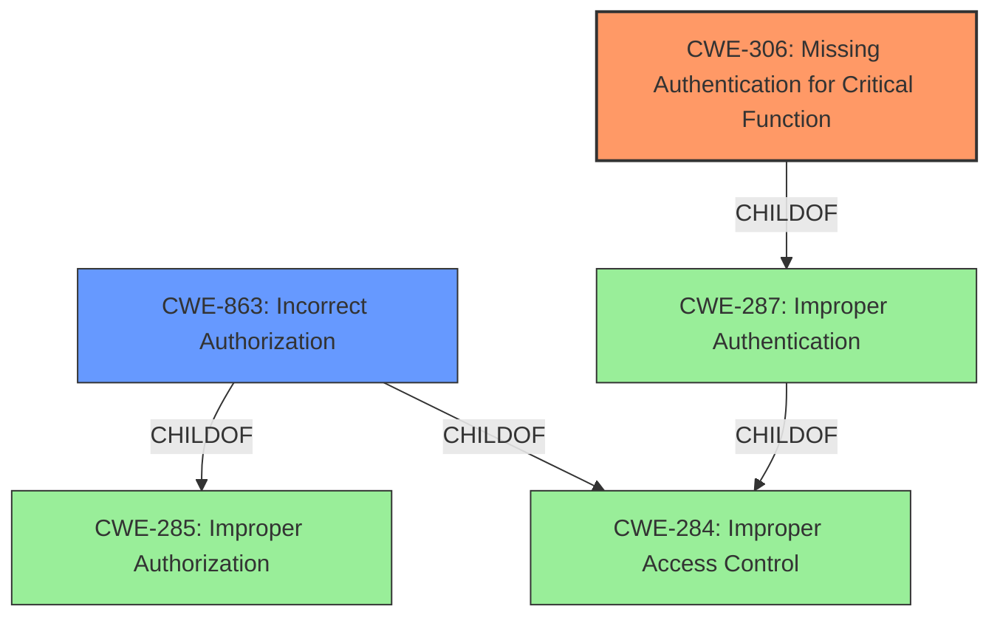

# Enhanced Analysis for CVE-2020-19417

# Summary
| CWE ID | CWE Name | Confidence | CWE Abstraction Level | CWE Vulnerability Mapping Label | CWE-Vulnerability Mapping Notes |
|---|---|---|---|---|---|
| CWE-306 | Missing Authentication for Critical Function | 0.9 | Base | Primary | Allowed |
| CWE-863 | Incorrect Authorization | 0.6 | Class | Secondary | Allowed-with-Review |

## Evidence and Confidence

*   **Confidence Score:** 0.9
*   **Evidence Strength:** MEDIUM

## Relationship Analysis
The primary CWE identified is CWE-306 (**Missing Authentication for Critical Function**). This is a **Base** level CWE, which is the preferred level of abstraction.

CWE-863 (**Incorrect Authorization**) is a **Class** level CWE and is considered as a secondary candidate.



## Vulnerability Chain
The vulnerability chain starts with the **missing authentication** for administrative tasks, leading to non-privileged users being able to perform those tasks.

## Summary of Analysis
The vulnerability description indicates that non-privileged users can perform administrative tasks by sending specially crafted HTTP requests. The core issue here is the **lack of authentication** for critical functions, allowing unauthorized access.

The primary CWE is CWE-306 (**Missing Authentication for Critical Function**). The description of CWE-306 states: "The product does not perform any authentication for functionality that requires a provable user identity or consumes a significant amount of resources." This aligns directly with the vulnerability description, as administrative tasks require authentication to verify the user's identity and privileges. The "Vulnerability Description Key Phrases" support this with "impact: perform administrative tasks" and "attacker: non-privileged users."

CWE-863 (**Incorrect Authorization**) was also considered because the vulnerability allows non-privileged users to perform actions they should not be authorized to do. However, the root cause is not an incorrect authorization check, but rather a complete **lack of authentication** before performing critical functions. The retriever results also lists this CWE but at a lower score than CWE-306.

The evidence provided in the "Vulnerability Description" section is sufficient to support the selection of CWE-306 as the primary weakness. The "CVE Reference Links Content Summary" section is un related, but the "Vulnerability Description Key Phrases" provides the evidence in keywords.

I am also considering CWE-1392 (**Use of Default Credentials**) and CWE-1393 (**Use of Default Password**) but they were rejected because the attack vector is crafted HTTP requests and there is no mention of default credentials being used.

The final decision is based on the root cause analysis, the CWE descriptions, and the relationships between the CWEs. CWE-306 is the most specific and accurate representation of the vulnerability.


## CWE Relationship Analysis

Current CWEs represent these abstraction levels: .


### Vulnerability Chain Analysis

**Chain starting from CWE-306:**
- 306 (Missing Authentication for Critical Function) - ROOT


**Chain starting from CWE-284:**
- 284 (Improper Access Control) - ROOT


### CWE Relationship Diagram

```mermaid
graph TD
    classDef primary fill:#f96,stroke:#333,stroke-width:2px
    classDef secondary fill:#69f,stroke:#333
    classDef tertiary fill:#9e9,stroke:#333
```