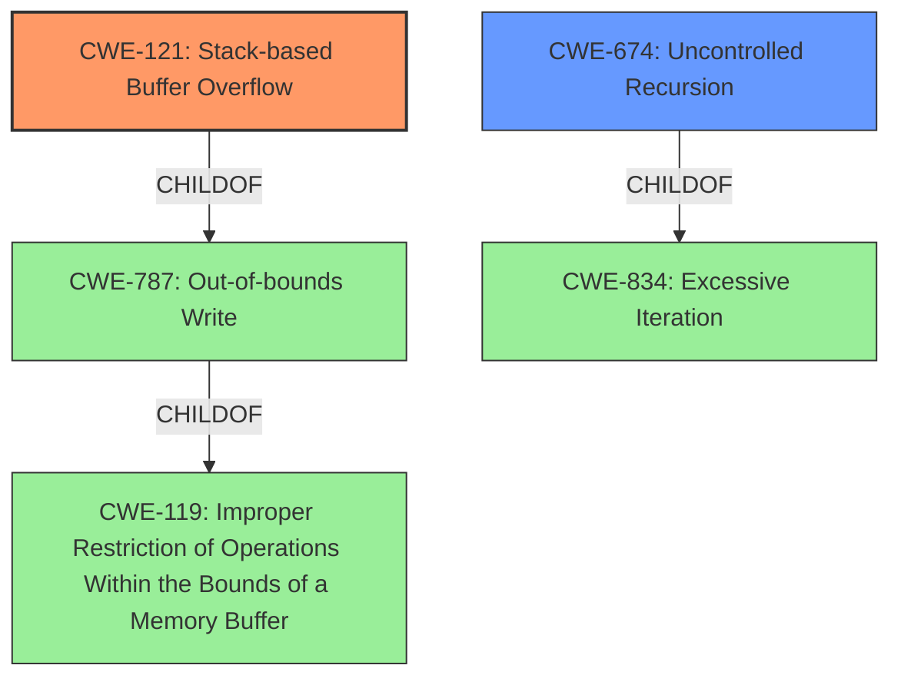

# Analysis Report for CVE-2020-19464

# Vulnerability Analysis Report: CVE-2020-19464

## Description


## Analysis (with Relationship Data)

# Summary
| CWE ID    | CWE Name                                                            | Confidence | CWE Abstraction Level | CWE Vulnerability Mapping Label | CWE-Vulnerability Mapping Notes |
| :-------- | :------------------------------------------------------------------ | :--------- | :-------------------- | :------------------------------ | :------------------------------ |
| CWE-121   | Stack-based Buffer Overflow                                         | 1          | Variant               | Primary                         | Allowed                         |
| CWE-674   | Uncontrolled Recursion                                              | 0.7        | Class                 | Secondary                       | Allowed-with-Review             |

## Evidence and Confidence

*   **Confidence Score:** 0.9
*   **Evidence Strength:** HIGH

## Relationship Analysis
The primary CWE is CWE-121 Stack-based Buffer Overflow, which is a variant of the more general CWE-787 (Out-of-bounds Write) and CWE-119 (Improper Restriction of Operations Within the Bounds of a Memory Buffer). CWE-674 Uncontrolled Recursion is a Class level CWE and a child of CWE-834 (Excessive Iteration). The description mentions a "stack overflow", and the provided summary indicates uncontrolled recursion as a potential cause.



## Vulnerability Chain
The vulnerability chain starts with either a stack-based buffer overflow, or uncontrolled recursion which can lead to stack exhaustion and denial of service.

## Summary of Analysis
The initial analysis focused on the **stack overflow** mentioned in the vulnerability description and the **stack overflow** and uncontrolled recursion mentioned in the reference summary. The retriever results also pointed to CWE-121 Stack-based Buffer Overflow as the best candidate. Given that the **weakness** is a **stack overflow** , and the function `XRef::fetch` is vulnerable to uncontrolled recursion leading to a **stack overflow** , CWE-121 and CWE-674 are appropriate. CWE-121 is the primary cause as it directly reflects the buffer overflow on the stack, while CWE-674 is secondary because it can lead to the overflow.

*   "An issue has been found in function XReffetch in PDF2JSON 0.70 that allows attackers to cause a Denial of Service due to a **stack overflow**."
*   "The vulnerability is caused by a **stack overflow** in the `XRef::fetch` function."
*   "A **stack overflow** vulnerability exists due to uncontrolled recursion or a very large stack allocation within the `XRef::fetch` function, potentially when processing a crafted PDF file."

CWE-121 is at the Variant level of abstraction, which is preferred. CWE-674 is at the Class level, but it accurately describes the uncontrolled recursion aspect.

**CWE Considerations:**

*   **CWE-190 Integer Overflow or Wraparound:** While this CWE was suggested by the retriever, there is no mention of integer overflows in the description or summary.
*   **CWE-770 Allocation of Resources Without Limits or Throttling:** This CWE is too broad. While uncontrolled recursion could be considered a resource allocation issue, CWE-674 is more specific.
*   **CWE-120 Buffer Copy without Checking Size of Input ('Classic Buffer Overflow'):** This is less specific than CWE-121 since the location of the buffer on the stack is explicitly mentioned.
*   **CWE-122 Heap-based Buffer Overflow:** This is incorrect since the vulnerability is explicitly a stack overflow.

# Relevant CWE Information:

## CWE-121: Stack-based Buffer Overflow
**Abstraction:** Variant

### Description
A stack-based buffer overflow condition is a condition where the buffer being overwritten is allocated on the stack (i.e., is a local variable or, rarely, a parameter to a function).

### Relationships
ChildOf -> CWE-788
ChildOf -> CWE-787

### Mapping Guidance
**Usage:** Allowed
**Rationale:** This CWE entry is at the Variant level of abstraction, which is a preferred level of abstraction for mapping to the root causes of vulnerabilities.

## CWE-674: Uncontrolled Recursion
**Abstraction:** Class

### Description
The product does not properly control the amount of recursion that takes place, consuming excessive resources, such as allocated memory or the program stack.

### Relationships
ChildOf -> CWE-834

### Mapping Guidance
**Usage:** Allowed-with-Review
**Rationale:** This CWE entry is a Class and might have Base-level children that would be more appropriate


## CWE Relationship Analysis

Current CWEs represent these abstraction levels: .


### Vulnerability Chain Analysis

**Chain starting from CWE-121:**
- 121 (Stack-based Buffer Overflow) - ROOT


**Chain starting from CWE-787:**
- 787 (Out-of-bounds Write) - ROOT


### CWE Relationship Diagram

```mermaid
graph TD
    classDef primary fill:#f96,stroke:#333,stroke-width:2px
    classDef secondary fill:#69f,stroke:#333
    classDef tertiary fill:#9e9,stroke:#333
```


*Report generated on 2025-04-02 02:04:59*
