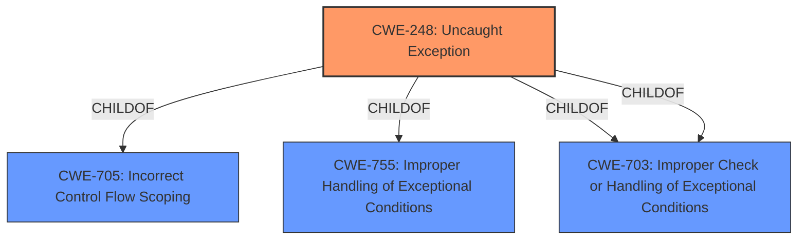

# Enhanced Analysis for CVE-2020-19473

# Summary
| CWE ID | CWE Name | Confidence | CWE Abstraction Level | CWE Vulnerability Mapping Label | CWE-Vulnerability Mapping Notes |
|---|---|---|---|---|---|
| CWE-248 | Uncaught Exception | 0.9 | Base | Primary | Allowed |

## Evidence and Confidence

*   **Confidence Score:** 0.9
*   **Evidence Strength:** HIGH

## Relationship Analysis
The primary relationship that influenced the decision was the ChildOf relationship between CWE-248 and higher-level classes like CWE-705 (Incorrect Control Flow Scoping) and CWE-755 (Improper Handling of Exceptional Conditions). While these parent classes are relevant, CWE-248 provides a more specific description of the vulnerability, aligning with the goal of selecting the most granular CWE.



## Vulnerability Chain
The chain is relatively simple:
1.  Integer Divide-by-Zero Error leads to a Floating-Point Exception
2.  **Uncaught Exception** (CWE-248)
3.  Denial of Service

## Summary of Analysis
The initial analysis focused on the **uncaught floating point exception** as the root cause. The retriever results highlighted CWE-248 (Uncaught Exception) as the top candidate.

The selection of CWE-248 is strongly supported by the vulnerability description and CVE reference summary. The vulnerability is explicitly described as an **"uncaught floating point exception"** in the `DCTStreamdecodeImage` function, leading to a program crash and denial of service. The CVE Reference Links Content Summary explicitly states: "**Root Cause:** The vulnerability is an integer divide-by-zero error within the `DCTStream::decodeImage` function...**Impact of Exploitation:** - The program crashes due to the unhandled floating-point exception (SIGFPE). This can lead to a denial-of-service (DoS) condition."

The relationship graph confirms that CWE-248 is a specific type of improper handling of exceptional conditions, which aligns with the nature of the vulnerability. The description of CWE-248, "An exception is thrown from a function, but it is not caught," directly matches the vulnerability.

CWE-248 is at the Base level of abstraction, which is the preferred level for mapping root causes.

Other CWEs considered but not used:
*   CWE-705, CWE-755, and CWE-703: These are parent classes of CWE-248. While relevant, they are less specific and do not fully capture the nature of the vulnerability.
*   CWE-835 (Loop with Unreachable Exit Condition): This was considered due to the potential for DoS, but the root cause is not related to a loop.
*   CWE-1339 (Insufficient Precision or Accuracy of a Real Number): This was considered, but the root cause is not related to floating-point precision.
*   CWE-122 (Heap-based Buffer Overflow): This was considered, but there is no evidence of a buffer overflow in the description.

Relevant CWE Information:

# Enhanced Context (25 CWEs)

## CWE-191: Integer Underflow (Wrap or Wraparound)
**Abstraction Level**: Base
**Similarity Score**: 0.78
**Source**: dense

**Description**:
The product subtracts one value from another, such that the result is less than the minimum allowable integer value, which produces a value that is not equal to the correct result.

**Mapping Guidance**:
- Usage: Allowed
- Rationale: This CWE entry is at the Base level of abstraction, which is a preferred level of abstraction for mapping to the root causes of vulnerabilities.

## CWE-131: Incorrect Calculation of Buffer Size
**Abstraction Level**: Base
**Similarity Score**: 0.77
**Source**: dense

**Description**:
The product does not correctly calculate the size to be used when allocating a buffer, which could lead to a buffer overflow.

**Mapping Guidance**:
- Usage: Allowed
- Rationale: This CWE entry is at the Base level of abstraction, which is a preferred level of abstraction for mapping to the root causes of vulnerabilities.

## CWE-193: Off-by-one Error
**Abstraction Level**: Base
**Similarity Score**: 0.77
**Source**: dense

**Description**:
A product calculates or uses an incorrect maximum or minimum value that is 1 more, or 1 less, than the correct value.

**Mapping Guidance**:
- Usage: Allowed
- Rationale: This CWE entry is at the Base level of abstraction, which is a preferred level of abstraction for mapping to the root causes of vulnerabilities.

## CWE-754: Improper Check for Unusual or Exceptional Conditions
**Abstraction Level**: Class
**Similarity Score**: 0.76
**Source**: dense

**Description**:
The product does not check or incorrectly checks for unusual or exceptional conditions that are not expected to occur frequently during day to day operation of the product.

**Mapping Guidance**:
- Usage: Allowed-with-Review
- Rationale: This CWE entry is a Class and might have Base-level children that would be more appropriate

## CWE-197: Numeric Truncation Error
**Abstraction Level**: Base
**Similarity Score**: 0.76
**Source**: dense

**Description**:
Truncation errors occur when a primitive is cast to a primitive of a smaller size and data is lost in the conversion.

**Mapping Guidance**:
- Usage: Allowed
- Rationale: This CWE entry is at the Base level of abstraction, which is a preferred level of abstraction for mapping to the root causes of vulnerabilities.

## CWE-703: Improper Check or Handling of Exceptional Conditions
**Abstraction Level**: Pillar
**Similarity Score**: 0.75
**Source**: dense

**Description**:
The product does not properly anticipate or handle exceptional conditions that rarely occur during normal operation of the product.

**Mapping Guidance**:
- Usage: Discouraged
- Rationale: This CWE entry is extremely high-level, a Pillar.

## CWE-681: Incorrect Conversion between Numeric Types
**Abstraction Level**: Base
**Similarity Score**: 0.75
**Source**: dense

**Description**:
When converting from one data type to another, such as long to integer, data can be omitted or translated in a way that produces unexpected values. If the resulting values are used in a sensitive context, then dangerous behaviors may occur.

**Mapping Guidance**:
- Usage: Allowed
- Rationale: This CWE entry is at the Base level of abstraction, which is a preferred level of abstraction for mapping to the root causes of vulnerabilities.

## CWE-125: Out-of-bounds Read
**Abstraction Level**: Base
**Similarity Score**: 0.75
**Source**: dense

**Description**:
The product reads data past the end, or before the beginning, of the intended buffer.

**Mapping Guidance**:
- Usage: Allowed
- Rationale: This CWE entry is at the Base level of abstraction, which is a preferred level of abstraction for mapping to the root causes of vulnerabilities.

## CWE-667: Improper Locking
**Abstraction Level**: Class
**Similarity Score**: 0.75
**Source**: dense

**Description**:
The product does not properly acquire or release a lock on a resource, leading to unexpected resource state changes and behaviors.

**Mapping Guidance**:
- Usage: Allowed-with-Review
- Rationale: This CWE entry is a Class and might have Base-level children that would be more appropriate

## CWE-190: Integer Overflow or Wraparound
**Abstraction Level**: Base
**Similarity Score**: 0.74
**Source**: dense

**Description**:
The product performs a calculation that can
         produce an integer overflow or wraparound when the logic
         assumes that the resulting value will always be larger than
         the original value. This occurs when an integer value is
         incremented to a value that is too large to store in the
         associated representation. When this occurs, the value may
         become a very small or negative number.

**Mapping Guidance**:
- Usage: Allowed
- Rationale: This CWE entry is at the Base level of abstraction, which is a preferred level of abstraction for mapping to the root causes of vulnerabilities.

## CWE-1339: Insufficient Precision or Accuracy of a Real Number


## CWE Relationship Analysis

Current CWEs represent these abstraction levels: .


### Vulnerability Chain Analysis

**Chain starting from CWE-248:**
- 248 (Uncaught Exception) - ROOT


**Chain starting from CWE-754:**
- 754 (Improper Check for Unusual or Exceptional Conditions) - ROOT


### CWE Relationship Diagram

```mermaid
graph TD
    classDef primary fill:#f96,stroke:#333,stroke-width:2px
    classDef secondary fill:#69f,stroke:#333
    classDef tertiary fill:#9e9,stroke:#333
```