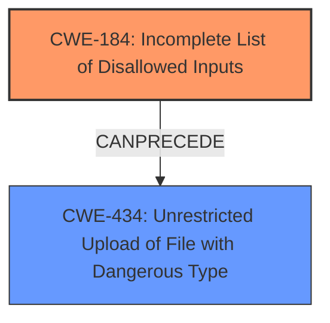

# Raw Analyzer Response for CVE-2020-19551

# Summary
| CWE ID  | CWE Name                                                                        | Confidence | CWE Abstraction Level | CWE Vulnerability Mapping Label | CWE-Vulnerability Mapping Notes |
| :-------- | :------------------------------------------------------------------------------ | :---------- | :----------------------- | :------------------------------ | :------------------------------ |
| CWE-184 | Incomplete List of Disallowed Inputs                                              | 0.95       | Base                     | Primary                         | Allowed                         |
| CWE-434 | Unrestricted Upload of File with Dangerous Type                                 | 0.8        | Base                     | Secondary                        | Allowed                         |

## Evidence and Confidence

*   **Confidence Score:** 0.9
*   **Evidence Strength:** HIGH

## Relationship Analysis
The primary CWE is CWE-184 (**CWE-184: Incomplete List of Disallowed Inputs**), which represents the root cause of the vulnerability. It is a Base level CWE, which is preferred. CWE-434 (**CWE-434: Unrestricted Upload of File with Dangerous Type**) is a related weakness that can result from an incomplete list of disallowed inputs. CWE-184 can precede CWE-434 in a vulnerability chain.

## Vulnerability Chain
The vulnerability chain starts with an **incomplete list of disallowed inputs** (CWE-184), which leads to the **unrestricted upload of a file with a dangerous type** (CWE-434). This then results in remote code execution.

## Summary of Analysis
The initial analysis of the vulnerability description points to a **blacklist bypass** issue, leading to remote code execution. The **CVE Reference Links Content Summary** confirms that the vulnerability is due to a file extension blacklist bypass during file uploads, which allows attackers to upload and execute malicious files.

The Retriever Results suggest CWE-184 (**CWE-184: Incomplete List of Disallowed Inputs**) and CWE-434 (**CWE-434: Unrestricted Upload of File with Dangerous Type**) as potential candidates. CWE-184 is a Base level CWE and represents the root cause where the application uses an incomplete list of disallowed file extensions, leading to the ability to upload dangerous file types. CWE-434 is also a Base level CWE and describes the scenario where the product allows the upload of dangerous file types.

Based on the evidence and the relationship analysis, the primary CWE is CWE-184, as it represents the root cause of the vulnerability. CWE-434 is a secondary CWE that describes the consequence of the incomplete blacklist.

The selected CWEs are at the optimal level of specificity as they are Base level CWEs and accurately represent the weakness described in the vulnerability description.

Relevant CWE Information:

# Enhanced Context (25 CWEs)

## CWE-80: Improper Neutralization of Script-Related HTML Tags in a Web Page (Basic XSS)
**Abstraction Level**: Variant
**Similarity Score**: 0.82
**Source**: dense

**Description**:
The product receives input from an upstream component, but it does not neutralize or incorrectly neutralizes special characters such as "<", ">", and "&" that could be interpreted as web-scripting elements when they are sent to a downstream component that processes web pages.

**Mapping Guidance**:
- Usage: Allowed
- Rationale: This CWE entry is at the Variant level of abstraction, which is a preferred level of abstraction for mapping to the root causes of vulnerabilities.

*This CWE was not selected because the vulnerability is primarily related to file upload restrictions rather than improper neutralization of HTML tags.*

## CWE-184: Incomplete List of Disallowed Inputs
**Abstraction Level**: Base
**Similarity Score**: 0.80
**Source**: dense

**Description**:
The product implements a protection mechanism that relies on a list of inputs (or properties of inputs) that are not allowed by policy or otherwise require other action to neutralize before additional processing takes place, but the list is incomplete.

**Mapping Guidance**:
- Usage: Allowed
- Rationale: This CWE entry is at the Base level of abstraction, which is a preferred level of abstraction for mapping to the root causes of vulnerabilities.

*This CWE was selected because the vulnerability involves a **blacklist bypass**, indicating that the list of disallowed inputs (file extensions) is incomplete.*

## CWE-74: Improper Neutralization of Special Elements in Output Used by a Downstream Component ('Injection')
**Abstraction Level**: Class
**Similarity Score**: 0.79
**Source**: dense

**Description**:
The product constructs all or part of a command, data structure, or record using externally-influenced input from an upstream component, but it does not neutralize or incorrectly neutralizes special elements that could modify how it is parsed or interpreted when it is sent to a downstream component.

**Mapping Guidance**:
- Usage: Discouraged
- Rationale: CWE-74 is high-level and often misused when lower-level weaknesses are more appropriate.

*This CWE was not selected because it is a high-level class and the vulnerability is more specifically related to file upload restrictions.*

## CWE-116: Improper Encoding or Escaping of Output
**Abstraction Level**: Class
**Similarity Score**: 0.78
**Source**: dense

**Description**:
The product prepares a structured message for communication with another component, but encoding or escaping of the data is either missing or done incorrectly. As a result, the intended structure of the message is not preserved.

**Mapping Guidance**:
- Usage: Allowed-with-Review
- Rationale: This CWE entry is a Class and might have Base-level children that would be more appropriate

*This CWE was not selected because the vulnerability is not related to improper encoding or escaping of output.*

## CWE-425: Direct Request ('Forced Browsing')
**Abstraction Level**: Base
**Similarity Score**: 0.77
**Source**: dense

**Description**:
The web application does not adequately enforce appropriate authorization on all restricted URLs, scripts, or files.

**Mapping Guidance**:
- Usage: Allowed
- Rationale: This CWE entry is at the Base level of abstraction, which is a preferred level of abstraction for mapping to the root causes of vulnerabilities.

*This CWE was not selected because the vulnerability is not related to direct request or forced browsing.*

## CWE-1289: Improper Validation of Unsafe Equivalence in Input
**Abstraction Level**: Base
**Similarity Score**: 0.77
**Source**: dense

**Description**:
The product receives an input value that is used as a resource identifier or other type of reference, but it does not validate or incorrectly validates that the input is equivalent to a potentially-unsafe value.

**Mapping Guidance**:
- Usage: Allowed
- Rationale: This CWE entry is at the Base level of abstraction, which is a preferred level of abstraction for mapping to the root causes of vulnerabilities.

*This CWE was not selected because the vulnerability doesn't involve validating equivalence of input to unsafe values.*

## CWE-138: Improper Neutralization of Special Elements
**Abstraction Level**: Class
**Similarity Score**: 0.77
**Source**: dense

**Description**:
The product receives input from an upstream component, but it does not neutralize or incorrectly neutralizes special elements that could be interpreted as control elements or syntactic markers when they are sent to a downstream component.

**Mapping Guidance**:
- Usage: Discouraged
- Rationale: This CWE entry is a level-1 Class (i.e., a child of a Pillar). It might have lower-level children that would be more appropriate

*This CWE was not selected because it is a high-level class and the vulnerability is more specifically related to file upload restrictions.*

## CWE-472: External Control of Assumed-Immutable Web Parameter
**Abstraction Level**: Base
**Similarity Score**: 0.77
**Source**: dense

**Description**:
The web application does not sufficiently verify inputs that are assumed to be immutable but are actually externally controllable, such as hidden form fields.

**Mapping Guidance**:
- Usage: Allowed
- Rationale: This CWE entry is at the Base level of abstraction, which is a preferred level of abstraction for mapping to the root causes of vulnerabilities.

*This CWE was not selected because the vulnerability doesn't involve external control of assumed immutable web parameters.*

## CWE-639: Authorization Bypass Through User-Controlled Key
**Abstraction Level**: Base
**Similarity Score**: 0.77
**Source**: dense

**Description**:
The system's authorization functionality does not prevent one user from gaining access to another user's data or record by modifying the key value identifying the data.

**Mapping Guidance**:
- Usage: Allowed
- Rationale: This CWE entry is at the Base level of abstraction, which is a preferred level of abstraction for mapping to the root causes of vulnerabilities.

*This CWE was not selected because the vulnerability is not related to authorization bypass through user-