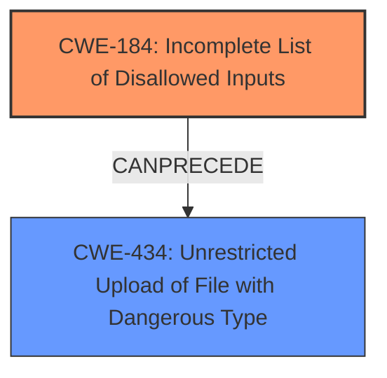

# Analysis for CVE-2020-19551

# Summary
| CWE ID  | CWE Name                                                                        | Confidence | CWE Abstraction Level | CWE Vulnerability Mapping Label | CWE-Vulnerability Mapping Notes |
| :-------- | :------------------------------------------------------------------------------ | :---------- | :----------------------- | :------------------------------ | :------------------------------ |
| CWE-184 | Incomplete List of Disallowed Inputs                                              | 0.95       | Base                     | Primary                         | Allowed                         |
| CWE-434 | Unrestricted Upload of File with Dangerous Type                                 | 0.8        | Base                     | Secondary                        | Allowed                         |

## Evidence and Confidence

*   **Confidence Score:** 0.9
*   **Evidence Strength:** HIGH

## Relationship Analysis
The primary CWE is CWE-184 (**CWE-184: Incomplete List of Disallowed Inputs**), which represents the root cause of the vulnerability. It is a Base level CWE, which is preferred. CWE-434 (**CWE-434: Unrestricted Upload of File with Dangerous Type**) is a related weakness that can result from an incomplete list of disallowed inputs. CWE-184 can precede CWE-434 in a vulnerability chain.

## Vulnerability Chain
The vulnerability chain starts with an **incomplete list of disallowed inputs** (CWE-184), which leads to the **unrestricted upload of a file with a dangerous type** (CWE-434). This then results in remote code execution.

## Summary of Analysis
The initial analysis of the vulnerability description points to a **blacklist bypass** issue, leading to remote code execution. The **CVE Reference Links Content Summary** confirms that the vulnerability is due to a file extension blacklist bypass during file uploads, which allows attackers to upload and execute malicious files.

The Retriever Results suggest CWE-184 (**CWE-184: Incomplete List of Disallowed Inputs**) and CWE-434 (**CWE-434: Unrestricted Upload of File with Dangerous Type**) as potential candidates. CWE-184 is a Base level CWE and represents the root cause where the application uses an incomplete list of disallowed file extensions, leading to the ability to upload dangerous file types. CWE-434 is also a Base level CWE and describes the scenario where the product allows the upload of dangerous file types.

Based on the evidence and the relationship analysis, the primary CWE is CWE-184, as it represents the root cause of the vulnerability. CWE-434 is a secondary CWE that describes the consequence of the incomplete blacklist.

The selected CWEs are at the optimal level of specificity as they are Base level CWEs and accurately represent the weakness described in the vulnerability description.

Relevant CWE Information:

# Enhanced Context (25 CWEs)

## CWE-80: Improper Neutralization of Script-Related HTML Tags in a Web Page (Basic XSS)
**Abstraction Level**: Variant
**Similarity Score**: 0.82
**Source**: dense

**Description**:
The product receives input from an upstream component, but it does not neutralize or incorrectly neutralizes special characters such as "<", ">", and "&" that could be interpreted as web-scripting elements when they are sent to a downstream component that processes web pages.

**Mapping Guidance**:
- Usage: Allowed
- Rationale: This CWE entry is at the Variant level of abstraction, which is a preferred level of abstraction for mapping to the root causes of vulnerabilities.

*This CWE was not selected because the vulnerability is primarily related to file upload restrictions rather than improper neutralization of HTML tags.*

## CWE-184: Incomplete List of Disallowed Inputs
**Abstraction Level**: Base
**Similarity Score**: 0.80
**Source**: dense

**Description**:
The product implements a protection mechanism that relies on a list of inputs (or properties of inputs) that are not allowed by policy or otherwise require other action to neutralize before additional processing takes place, but the list is incomplete.

**Mapping Guidance**:
- Usage: Allowed
- Rationale: This CWE entry is at the Base level of abstraction, which is a preferred level of abstraction for mapping to the root causes of vulnerabilities.

*This CWE was selected because the vulnerability involves a **blacklist bypass**, indicating that the list of disallowed inputs (file extensions) is incomplete.*

## CWE-74: Improper Neutralization of Special Elements in Output Used by a Downstream Component ('Injection')
**Abstraction Level**: Class
**Similarity Score**: 0.79
**Source**: dense

**Description**:
The product constructs all or part of a command, data structure, or record using externally-influenced input from an upstream component, but it does not neutralize or incorrectly neutralizes special elements that could modify how it is parsed or interpreted when it is sent to a downstream component.

**Mapping Guidance**:
- Usage: Discouraged
- Rationale: CWE-74 is high-level and often misused when lower-level weaknesses are more appropriate.

*This CWE was not selected because it is a high-level class and the vulnerability is more specifically related to file upload restrictions.*

## CWE-116: Improper Encoding or Escaping of Output
**Abstraction Level**: Class
**Similarity Score**: 0.78
**Source**: dense

**Description**:
The product prepares a structured message for communication with another component, but encoding or escaping of the data is either missing or done incorrectly. As a result, the intended structure of the message is not preserved.

**Mapping Guidance**:
- Usage: Allowed-with-Review
- Rationale: This CWE entry is a Class and might have Base-level children that would be more appropriate

*This CWE was not selected because the vulnerability is not related to improper encoding or escaping of output.*

## CWE-425: Direct Request ('Forced Browsing')
**Abstraction Level**: Base
**Similarity Score**: 0.77
**Source**: dense

**Description**:
The web application does not adequately enforce appropriate authorization on all restricted URLs, scripts, or files.

**Mapping Guidance**:
- Usage: Allowed
- Rationale: This CWE entry is at the Base level of abstraction, which is a preferred level of abstraction for mapping to the root causes of vulnerabilities.

*This CWE was not selected because the vulnerability is not related to direct request or forced browsing.*

## CWE-1289: Improper Validation of Unsafe Equivalence in Input
**Abstraction Level**: Base
**Similarity Score**: 0.77
**Source**: dense

**Description**:
The product receives an input value that is used as a resource identifier or other type of reference, but it does not validate or incorrectly validates that the input is equivalent to a potentially-unsafe value.

**Mapping Guidance**:
- Usage: Allowed
- Rationale: This CWE entry is at the Base level of abstraction, which is a preferred level of abstraction for mapping to the root causes of vulnerabilities.

*This CWE was not selected because the vulnerability doesn't involve validating equivalence of input to unsafe values.*

## CWE-138: Improper Neutralization of Special Elements
**Abstraction Level**: Class
**Similarity Score**: 0.77
**Source**: dense

**Description**:
The product receives input from an upstream component, but it does not neutralize or incorrectly neutralizes special elements that could be interpreted as control elements or syntactic markers when they are sent to a downstream component.

**Mapping Guidance**:
- Usage: Discouraged
- Rationale: This CWE entry is a level-1 Class (i.e., a child of a Pillar). It might have lower-level children that would be more appropriate

*This CWE was not selected because it is a high-level class and the vulnerability is more specifically related to file upload restrictions.*

## CWE-472: External Control of Assumed-Immutable Web Parameter
**Abstraction Level**: Base
**Similarity Score**: 0.77
**Source**: dense

**Description**:
The web application does not sufficiently verify inputs that are assumed to be immutable but are actually externally controllable, such as hidden form fields.

**Mapping Guidance**:
- Usage: Allowed
- Rationale: This CWE entry is at the Base level of abstraction, which is a preferred level of abstraction for mapping to the root causes of vulnerabilities.

*This CWE was not selected because the vulnerability doesn't involve external control of assumed immutable web parameters.*

## CWE-639: Authorization Bypass Through User-Controlled Key
**Abstraction Level**: Base
**Similarity Score**: 0.77
**Source**: dense

**Description**:
The system's authorization functionality does not prevent one user from gaining access to another user's data or record by modifying the key value identifying the data.

**Mapping Guidance**:
- Usage: Allowed
- Rationale: This CWE entry is at the Base level of abstraction, which is a preferred level of abstraction for mapping to the root causes of vulnerabilities.

*This CWE was not selected because the vulnerability is not related to authorization bypass through user-

# Enhanced Query for CVE-2020-19551

## Vulnerability Description
**Blacklist bypass** issue exists in WUZHI CMS up to and including 4.1.0 in common.func.php, which when uploaded can cause remote code executiong.

### Vulnerability Description Key Phrases
- **weakness:** **Blacklist bypass**
- **impact:** remote code execution
- **product:** WUZHI CMS
- **version:** up to and including 4.1.0
- **component:** common.func.php

## CVE Reference Links Content Summary
Based on the provided content, here's an analysis of the vulnerability:

**Root Cause of Vulnerability:**
* The vulnerability is caused by a file extension blacklist bypass during file uploads. This allows attackers to upload files with extensions that are not blocked by the blacklist, which can then be executed by the server.

**Weaknesses/Vulnerabilities Present:**
* **Insecure File Upload:** The primary vulnerability lies in the flawed implementation of file upload functionality. The application uses a blacklist approach for file extension filtering, which is inherently weak and susceptible to bypass techniques.

**Impact of Exploitation:**
* **Remote Code Execution (RCE):**  The most severe impact is the ability for an attacker to execute arbitrary code on the server. By uploading malicious files with a bypassable extension, they can gain control over the server and potentially compromise the entire system.

**Attack Vectors:**
* **File Upload:** The attack vector is through the file upload functionality of the WUZHI CMS.

**Required Attacker Capabilities/Position:**
* **Access to File Upload Feature:** The attacker needs access to a file upload form within the WUZHI CMS. This could be a public facing form, or one accessible through user authentication.
* **Understanding of Blacklist Bypass:** The attacker requires knowledge on how to bypass the file extension blacklist used by the CMS.

**Additional Information:**
* The provided document [Wuzhicms.RCE.docx](https://github.com/wuzhicms/wuzhicms/files/3255211/Wuzhicms.RCE.docx) is stated to contain the details of the exploit.
* The vulnerability affects WUZHI CMS versions 4.1.0 and below.
* The vulnerability is reported by user Ppsoft1990.

## Retriever Results

### Top Combined Results

| Rank | CWE ID | Name | Abstraction | Usage  | Retrievers | Individual Scores |
|------|--------|------|-------------|-------|------------|-------------------|
| 1 | 184 | Incomplete List of Disallowed Inputs | Base | Allowed | alternate_terms | 0.800 |
| 2 | 502 | Deserialization of Untrusted Data | Base | Allowed | sparse | 0.139 |
| 3 | 434 | Unrestricted Upload of File with Dangerous Type | Base | Allowed | sparse | 0.133 |
| 4 | 1336 | Improper Neutralization of Special Elements Used in a Template Engine | Base | Allowed | sparse | 0.119 |
| 5 | 96 | Improper Neutralization of Directives in Statically Saved Code ('Static Code Injection') | Base | Allowed | sparse | 0.118 |
| 6 | 790 | Improper Filtering of Special Elements | Class | Allowed-with-Review | dense | 0.598 |
| 7 | 425 | Direct Request ('Forced Browsing') | Base | Allowed | graph | 0.003 |
| 8 | 639 | Authorization Bypass Through User-Controlled Key | Base | Allowed | sparse | 0.118 |
| 9 | 138 | Improper Neutralization of Special Elements | Class | Discouraged | sparse | 0.117 |
| 10 | 79 | Improper Neutralization of Input During Web Page Generation ('Cross-site Scripting') | Base | Allowed | sparse | 0.117 |

# Complete CWE Specifications

## CWE-184: Incomplete List of Disallowed Inputs
**Abstraction:** Base
**Status:** Draft

### Description
The product implements a protection mechanism that relies on a list of inputs (or properties of inputs) that are not allowed by policy or otherwise require other action to neutralize before additional processing takes place, but the list is incomplete.

### Extended Description
Not provided

### Alternative Terms
Denylist / Deny List: This is used by CWE and CAPEC instead of other commonly-used terms. Its counterpart is allowlist.
Blocklist / Block List: This is often used by security tools such as firewalls, email or web gateways, proxies, etc.
Blacklist / Black List: This term is frequently used, but usage has been declining as organizations have started to adopt other terms.

### Relationships
ChildOf -> CWE-693
ChildOf -> CWE-1023
CanPrecede -> CWE-79
CanPrecede -> CWE-78
CanPrecede -> CWE-434
CanPrecede -> CWE-98

### Mapping Guidance
**Usage:** Allowed
**Rationale:** This CWE entry is at the Base level of abstraction, which is a preferred level of abstraction for mapping to the root causes of vulnerabilities.
**Comments:** Carefully read both the name and description to ensure that this mapping is an appropriate fit. Do not try to 'force' a mapping to a lower-level Base/Variant simply to comply with this preferred level of abstraction.
**Reasons:**
- Acceptable-Use

### Additional Notes
**[Relationship]** 

Multiple interpretation errors can indirectly introduce inputs that should be disallowed. For example, a list of dangerous shell metacharacters might not include a metacharacter that only has meaning in one particular shell, not all of them; or a check for XSS manipulations might ignore an unusual construct that is supported by one web browser, but not others.

### Observed Examples
- **CVE-2024-4315:** Chain: API for text generation using Large Language Models (LLMs) does not include the "\" Windows folder separator in its denylist (CWE-184) when attempting to prevent Local File Inclusion via path traversal (CWE-22), allowing deletion of arbitrary files on Windows systems.
- **CVE-2008-2309:** product uses a denylist to identify potentially dangerous content, allowing attacker to bypass a warning
- **CVE-2005-2782:** PHP remote file inclusion in web application that filters "http" and "https" URLs, but not "ftp".

## CWE-502: Deserialization of Untrusted Data
**Abstraction:** Base
**Status:** Draft

### Description
The product deserializes untrusted data without sufficiently ensuring that the resulting data will be valid.

### Extended Description
Not provided

### Alternative Terms
Marshaling, Unmarshaling: Marshaling and unmarshaling are effectively synonyms for serialization and deserialization, respectively.
Pickling, Unpickling: In Python, the "pickle" functionality is used to perform serialization and deserialization.
PHP Object Injection: Some PHP application researchers use this term when attacking unsafe use of the unserialize() function; but it is also used for CWE-915.

### Relationships
ChildOf -> CWE-913
ChildOf -> CWE-913
PeerOf -> CWE-915

### Mapping Guidance
**Usage:** Allowed
**Rationale:** This CWE entry is at the Base level of abstraction, which is a preferred level of abstraction for mapping to the root causes of vulnerabilities.
**Comments:** Carefully read both the name and description to ensure that this mapping is an appropriate fit. Do not try to 'force' a mapping to a lower-level Base/Variant simply to comply with this preferred level of abstraction.
**Reasons:**
- Acceptable-Use

### Additional Notes
**[Maintenance]** The relationships between CWE-502 and CWE-915 need further exploration. CWE-915 is more narrowly scoped to object modification, and is not necessarily used for deserialization.

### Observed Examples
- **CVE-2019-12799:** chain: bypass of untrusted deserialization issue (CWE-502) by using an assumed-trusted class (CWE-183)
- **CVE-2015-8103:** Deserialization issue in commonly-used Java library allows remote execution.
- **CVE-2015-4852:** Deserialization issue in commonly-used Java library allows remote execution.

## CWE-434: Unrestricted Upload of File with Dangerous Type
**Abstraction:** Base
**Status:** Draft

### Description
The product allows the upload or transfer of dangerous file types that are automatically processed within its environment.

### Extended Description
Not provided

### Alternative Terms
Unrestricted File Upload: Used in vulnerability databases and elsewhere, but it is insufficiently precise. The phrase could be interpreted as the lack of restrictions on the size or number of uploaded files, which is a resource consumption issue.

### Relationships
ChildOf -> CWE-669
ChildOf -> CWE-669
PeerOf -> CWE-351
PeerOf -> CWE-436
PeerOf -> CWE-430

### Mapping Guidance
**Usage:** Allowed
**Rationale:** This CWE entry is at the Base level of abstraction, which is a preferred level of abstraction for mapping to the root causes of vulnerabilities.
**Comments:** Carefully read both the name and description to ensure that this mapping is an appropriate fit. Do not try to 'force' a mapping to a lower-level Base/Variant simply to comply with this preferred level of abstraction.
**Reasons:**
- Acceptable-Use

### Additional Notes
**[Relationship]** 

This can have a chaining relationship with incomplete denylist / permissive allowlist errors when the product tries, but fails, to properly limit which types of files are allowed (CWE-183, CWE-184).

This can also overlap multiple interpretation errors for intermediaries, e.g. anti-virus products that do not remove or quarantine attachments with certain file extensions that can be processed by client systems.

### Observed Examples
- **CVE-2023-5227:** PHP-based FAQ management app does not check the MIME type for uploaded images
- **CVE-2001-0901:** Web-based mail product stores ".shtml" attachments that could contain SSI
- **CVE-2002-1841:** PHP upload does not restrict file types

## CWE-1336: Improper Neutralization of Special Elements Used in a Template Engine
**Abstraction:** Base
**Status:** Incomplete

### Description
The product uses a template engine to insert or process externally-influenced input, but it does not neutralize or incorrectly neutralizes special elements or syntax that can be interpreted as template expressions or other code directives when processed by the engine.

### Extended Description

Many web applications use template engines that allow developers to insert externally-influenced values into free text or messages in order to generate a full web page, document, message, etc. Such engines include Twig, Jinja2, Pug, Java Server Pages, FreeMarker, Velocity, ColdFusion, Smarty, and many others - including PHP itself. Some CMS (Content Management Systems) also use templates.

Template engines often have their own custom command or expression language. If an attacker can influence input into a template before it is processed, then the attacker can invoke arbitrary expressions, i.e. perform injection attacks. For example, in some template languages, an attacker could inject the expression "{{7*7}}" and determine if the output returns "49" instead. The syntax varies depending on the language.

In some cases, XSS-style attacks can work, which can obscure the root cause if the developer does not closely investigate the root cause of the error.

Template engines can be used on the server or client, so both "sides" could be affected by injection. The mechanisms of attack or the affected technologies might be different, but the mistake is fundamentally the same.

### Alternative Terms
Server-Side Template Injection / SSTI: This term is used for injection into template engines being used by a server.
Client-Side Template Injection / CSTI: This term is used for injection into template engines being used by a client.

### Relationships
ChildOf -> CWE-94

### Mapping Guidance
**Usage:** Allowed
**Rationale:** This CWE entry is at the Base level of abstraction, which is a preferred level of abstraction for mapping to the root causes of vulnerabilities.
**Comments:** Carefully read both the name and description to ensure that this mapping is an appropriate fit. Do not try to 'force' a mapping to a lower-level Base/Variant simply to comply with this preferred level of abstraction.
**Reasons:**
- Acceptable-Use

### Additional Notes
**[Relationship]** Since expression languages are often used in templating languages, there may be some overlap with CWE-917 (Expression Language Injection). XSS (CWE-79) is also co-located with template injection.

**[Maintenance]** The interrelationships and differences between CWE-917 and CWE-1336 need to be further clarified.

### Observed Examples
- **CVE-2024-34359:** Chain: Python bindings for LLM library do not use a sandboxed environment when parsing a template and constructing a prompt, allowing jinja2 Server Side Template Injection and code execution - one variant of a "prompt injection" attack.
- **CVE-2017-16783:** server-side template injection in content management server
- **CVE-2020-9437:** authentication / identity management product has client-side template injection

## CWE-96: Improper Neutralization of Directives in Statically Saved Code ('Static Code Injection')
**Abstraction:** Base
**Status:** Draft

### Description
The product receives input from an upstream component, but it does not neutralize or incorrectly neutralizes code syntax before inserting the input into an executable resource, such as a library, configuration file, or template.

### Extended Description
Not provided

### Alternative Terms
None

### Relationships
ChildOf -> CWE-94

### Mapping Guidance
**Usage:** Allowed
**Rationale:** This CWE entry is at the Base level of abstraction, which is a preferred level of abstraction for mapping to the root causes of vulnerabilities.
**Comments:** Carefully read both the name and description to ensure that this mapping is an appropriate fit. Do not try to 'force' a mapping to a lower-level Base/Variant simply to comply with this preferred level of abstraction.
**Reasons:**
- Acceptable-Use

### Additional Notes
**[Relationship]** "HTML injection" (see CWE-79: XSS) could be thought of as an example of this, but the code is injected and executed on the client side, not the server side. Server-Side Includes (SSI) are an example of direct static code injection.

### Observed Examples
- **CVE-2002-0495:** Perl code directly injected into CGI library file from parameters to another CGI program.
- **CVE-2005-1876:** Direct PHP code injection into supporting template file.
- **CVE-2005-1894:** Direct code injection into PHP script that can be accessed by attacker.

## CWE-790: Improper Filtering of Special Elements
**Abstraction:** Class
**Status:** Incomplete

### Description
The product receives data from an upstream component, but does not filter or incorrectly filters special elements before sending it to a downstream component.

### Extended Description
Not provided

### Alternative Terms
None

### Relationships
ChildOf -> CWE-138

### Mapping Guidance
**Usage:** Allowed-with-Review
**Rationale:** This CWE entry is a Class and might have Base-level children that would be more appropriate
**Comments:** Examine children of this entry to see if there is a better fit
**Reasons:**
- Abstraction

## CWE-425: Direct Request ('Forced Browsing')
**Abstraction:** Base
**Status:** Incomplete

### Description
The web application does not adequately enforce appropriate authorization on all restricted URLs, scripts, or files.

### Extended Description
Web applications susceptible to direct request attacks often make the false assumption that such resources can only be reached through a given navigation path and so only apply authorization at certain points in the path.

### Alternative Terms
forced browsing: The "forced browsing" term could be misinterpreted to include weaknesses such as CSRF or XSS, so its use is discouraged.

### Relationships
ChildOf -> CWE-862
ChildOf -> CWE-862
ChildOf -> CWE-288
ChildOf -> CWE-424
CanPrecede -> CWE-471
CanPrecede -> CWE-98

### Mapping Guidance
**Usage:** Allowed
**Rationale:** This CWE entry is at the Base level of abstraction, which is a preferred level of abstraction for mapping to the root causes of vulnerabilities.
**Comments:** Carefully read both the name and description to ensure that this mapping is an appropriate fit. Do not try to 'force' a mapping to a lower-level Base/Variant simply to comply with this preferred level of abstraction.
**Reasons:**
- Acceptable-Use

### Additional Notes
**[Relationship]** Overlaps Modification of Assumed-Immutable Data (MAID), authorization errors, container errors; often primary to other weaknesses such as XSS and SQL injection.

**[Theoretical]** "Forced browsing" is a step-based manipulation involving the omission of one or more steps, whose order is assumed to be immutable. The application does not verify that the first step was performed successfully before the second step. The consequence is typically "authentication bypass" or "path disclosure," although it can be primary to all kinds of weaknesses, especially in languages such as PHP, which allow external modification of assumed-immutable variables.

### Observed Examples
- **CVE-2022-29238:** Access-control setting in web-based document collaboration tool is not properly implemented by the code, which prevents listing hidden directories but does not prevent direct requests to files in those directories.
- **CVE-2022-23607:** Python-based HTTP library did not scope cookies to a particular domain such that "supercookies" could be sent to any domain on redirect.
- **CVE-2004-2144:** Bypass authentication via direct request.

## CWE-639: Authorization Bypass Through User-Controlled Key
**Abstraction:** Base
**Status:** Incomplete

### Description
The system's authorization functionality does not prevent one user from gaining access to another user's data or record by modifying the key value identifying the data.

### Extended Description

Retrieval of a user record occurs in the system based on some key value that is under user control. The key would typically identify a user-related record stored in the system and would be used to lookup that record for presentation to the user. It is likely that an attacker would have to be an authenticated user in the system. However, the authorization process would not properly check the data access operation to ensure that the authenticated user performing the operation has sufficient entitlements to perform the requested data access, hence bypassing any other authorization checks present in the system.

For example, attackers can look at places where user specific data is retrieved (e.g. search screens) and determine whether the key for the item being looked up is controllable externally. The key may be a hidden field in the HTML form field, might be passed as a URL parameter or as an unencrypted cookie variable, then in each of these cases it will be possible to tamper with the key value.

One manifestation of this weakness is when a system uses sequential or otherwise easily-guessable session IDs that would allow one user to easily switch to another user's session and read/modify their data.

### Alternative Terms
Insecure Direct Object Reference / IDOR: The "Insecure Direct Object Reference" term, as described in the OWASP Top Ten, is broader than this CWE because it also covers path traversal (CWE-22). Within the context of vulnerability theory, there is a similarity between the OWASP concept and CWE-706: Use of Incorrectly-Resolved Name or Reference.
Broken Object Level Authorization / BOLA: BOLA is used in the 2019 OWASP API Security Top 10 and is said to be the same as IDOR.
Horizontal Authorization: "Horizontal Authorization" is used to describe situations in which two users have the same privilege level, but must be prevented from accessing each other's resources. This is fairly common when using key-based access to resources in a multi-user context.

### Relationships
ChildOf -> CWE-863
ChildOf -> CWE-863
ChildOf -> CWE-284

### Mapping Guidance
**Usage:** Allowed
**Rationale:** This CWE entry is at the Base level of abstraction, which is a preferred level of abstraction for mapping to the root causes of vulnerabilities.
**Comments:** Carefully read both the name and description to ensure that this mapping is an appropriate fit. Do not try to 'force' a mapping to a lower-level Base/Variant simply to comply with this preferred level of abstraction.
**Reasons:**
- Acceptable-Use

### Observed Examples
- **CVE-2021-36539:** An educational application does not appropriately restrict file IDs to a particular user. The attacker can brute-force guess IDs, indicating IDOR.

## CWE-138: Improper Neutralization of Special Elements
**Abstraction:** Class
**Status:** Draft

### Description
The product receives input from an upstream component, but it does not neutralize or incorrectly neutralizes special elements that could be interpreted as control elements or syntactic markers when they are sent to a downstream component.

### Extended Description
Most languages and protocols have their own special elements such as characters and reserved words. These special elements can carry control implications. If product does not prevent external control or influence over the inclusion of such special elements, the control flow of the program may be altered from what was intended. For example, both Unix and Windows interpret the symbol < ("less than") as meaning "read input from a file".

### Alternative Terms
None

### Relationships
ChildOf -> CWE-707

### Mapping Guidance
**Usage:** Discouraged
**Rationale:** This CWE entry is a level-1 Class (i.e., a child of a Pillar). It might have lower-level children that would be more appropriate
**Comments:** Examine children of this entry to see if there is a better fit
**Reasons:**
- Abstraction

### Additional Notes
**[Relationship]** This weakness can be related to interpretation conflicts or interaction errors in intermediaries (such as proxies or application firewalls) when the intermediary's model of an endpoint does not account for protocol-specific special elements.

**[Relationship]** See this entry's children for different types of special elements that have been observed at one point or another. However, it can be difficult to find suitable CVE examples. In an attempt to be complete, CWE includes some types that do not have any associated observed example.

**[Research Gap]** This weakness is probably under-studied for proprietary or custom formats. It is likely that these issues are fairly common in applications that use their own custom format for configuration files, logs, meta-data, messaging, etc. They would only be found by accident or with a focused effort based on an understanding of the format.

### Observed Examples
- **CVE-2001-0677:** Read arbitrary files from mail client by providing a special MIME header that is internally used to store pathnames for attachments.
- **CVE-2000-0703:** Setuid program does not cleanse special escape sequence before sending data to a mail program, causing the mail program to process those sequences.
- **CVE-2003-0020:** Multi-channel issue. Terminal escape sequences not filtered from log files.

## CWE-79: Improper Neutralization of Input During Web Page Generation ('Cross-site Scripting')
**Abstraction:** Base
**Status:** Stable

### Description
The product does not neutralize or incorrectly neutralizes user-controllable input before it is placed in output that is used as a web page that is served to other users.

### Extended Description

Cross-site scripting (XSS) vulnerabilities occur when:

  1. Untrusted data enters a web application, typically from a web request.

  1. The web application dynamically generates a web page that contains this untrusted data.

  1. During page generation, the application does not prevent the data from containing content that is executable by a web browser, such as JavaScript, HTML tags, HTML attributes, mouse events, Flash, ActiveX, etc.

  1. A victim visits the generated web page through a web browser, which contains malicious script that was injected using the untrusted data.

  1. Since the script comes from a web page that was sent by the web server, the victim's web browser executes the malicious script in the context of the web server's domain.

  1. This effectively violates the intention of the web browser's same-origin policy, which states that scripts in one domain should not be able to access resources or run code in a different domain.

There are three main kinds of XSS:

  -  **Type 1: Reflected XSS (or Non-Persistent)**  - The server reads data directly from the HTTP request and reflects it back in the HTTP response. Reflected XSS exploits occur when an attacker causes a victim to supply dangerous content to a vulnerable web application, which is then reflected back to the victim and executed by the web browser. The most common mechanism for delivering malicious content is to include it as a parameter in a URL that is posted publicly or e-mailed directly to the victim. URLs constructed in this manner constitute the core of many phishing schemes, whereby an attacker convinces a victim to visit a URL that refers to a vulnerable site. After the site reflects the attacker's content back to the victim, the content is executed by the victim's browser.

  -  **Type 2: Stored XSS (or Persistent)**  - The application stores dangerous data in a database, message forum, visitor log, or other trusted data store. At a later time, the dangerous data is subsequently read back into the application and included in dynamic content. From an attacker's perspective, the optimal place to inject malicious content is in an area that is displayed to either many users or particularly interesting users. Interesting users typically have elevated privileges in the application or interact with sensitive data that is valuable to the attacker. If one of these users executes malicious content, the attacker may be able to perform privileged operations on behalf of the user or gain access to sensitive data belonging to the user. For example, the attacker might inject XSS into a log message, which might not be handled properly when an administrator views the logs. 

  -  **Type 0: DOM-Based XSS**  - In DOM-based XSS, the client performs the injection of XSS into the page; in the other types, the server performs the injection. DOM-based XSS generally involves server-controlled, trusted script that is sent to the client, such as Javascript that performs sanity checks on a form before the user submits it. If the server-supplied script processes user-supplied data and then injects it back into the web page (such as with dynamic HTML), then DOM-based XSS is possible. 

Once the malicious script is injected, the attacker can perform a variety of malicious activities. The attacker could transfer private information, such as cookies that may include session information, from the victim's machine to the attacker. The attacker could send malicious requests to a web site on behalf of the victim, which could be especially dangerous to the site if the victim has administrator privileges to manage that site. Phishing attacks could be used to emulate trusted web sites and trick the victim into entering a password, allowing the attacker to compromise the victim's account on that web site. Finally, the script could exploit a vulnerability in the web browser itself possibly taking over the victim's machine, sometimes referred to as "drive-by hacking."

In many cases, the attack can be launched without the victim even being aware of it. Even with careful users, attackers frequently use a variety of methods to encode the malicious portion of the attack, such as URL encoding or Unicode, so the request looks less suspicious.

### Alternative Terms
XSS: A common abbreviation for Cross-Site Scripting.
HTML Injection: Used as a synonym of stored (Type 2) XSS.
CSS: In the early years after initial discovery of XSS, "CSS" was a commonly-used acronym. However, this would cause confusion with "Cascading Style Sheets," so usage of this acronym has declined significantly.

### Relationships
ChildOf -> CWE-74
ChildOf -> CWE-74
CanPrecede -> CWE-494
PeerOf -> CWE-352

### Mapping Guidance
**Usage:** Allowed
**Rationale:** This CWE entry is at the Base level of abstraction, which is a preferred level of abstraction for mapping to the root causes of vulnerabilities.
**Comments:** Carefully read both the name and description to ensure that this mapping is an appropriate fit. Do not try to 'force' a mapping to a lower-level Base/Variant simply to comply with this preferred level of abstraction.
**Reasons:**
- Acceptable-Use

### Additional Notes
**[Relationship]** 

There can be a close relationship between XSS and CSRF (CWE-352). An attacker might use CSRF in order to trick the victim into submitting requests to the server in which the requests contain an XSS payload. A well-known example of this was the Samy worm on MySpace [REF-956]. The worm used XSS to insert malicious HTML sequences into a user's profile and add the attacker as a MySpace friend. MySpace friends of that victim would then execute the payload to modify their own profiles, causing the worm to propagate exponentially. Since the victims did not intentionally insert the malicious script themselves, CSRF was a root cause.

**[Applicable Platform]** 

XSS flaws are very common in web applications, since they require a great deal of developer discipline to avoid them.

### Observed Examples
- **CVE-2021-25926:** Python Library Manager did not sufficiently neutralize a user-supplied search term, allowing reflected XSS.
- **CVE-2021-25963:** Python-based e-commerce platform did not escape returned content on error pages, allowing for reflected Cross-Site Scripting attacks.
- **CVE-2021-1879:** Universal XSS in mobile operating system, as exploited in the wild per CISA KEV.

