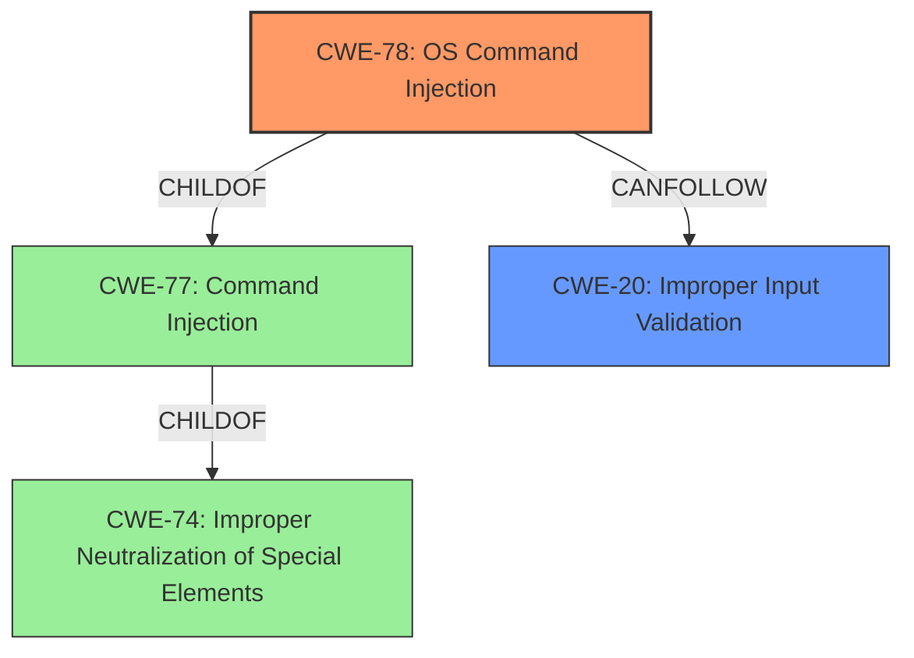

# Analysis Report for CVE-2020-1956

# Vulnerability Analysis Report: CVE-2020-1956

## Description


## Analysis (with Relationship Data)

# Summary
| CWE ID | CWE Name | Confidence | CWE Abstraction Level | CWE Vulnerability Mapping Label | CWE-Vulnerability Mapping Notes |
|---|---|---|---|---|---|
| CWE-78 | Improper Neutralization of Special Elements used in an OS Command ('OS Command Injection') | 1.0 | Base | Allowed | Primary CWE |
| CWE-20 | Improper Input Validation | 0.7 | Class | Discouraged | Secondary Candidate |

## Evidence and Confidence

*   **Confidence Score:** 0.9
*   **Evidence Strength:** HIGH

## Relationship Analysis
The primary relationship impacting the decision is that CWE-78 is a child of CWE-77, and both relate to command injection. CWE-78 is more specific as it focuses on OS commands, which aligns with the vulnerability description. CWE-20 is a more general class related to input validation, and while the vulnerability involves improper input validation, the more specific CWE-78 is a better fit.



## Vulnerability Chain
The vulnerability chain starts with **improper input validation**, leading to **command injection**, and ultimately resulting in arbitrary OS command execution.

## Summary of Analysis
The initial assessment identified CWE-78 as the primary weakness due to the **command injection** vulnerability described in the report. The report summary specifically mentions that the root cause stems from unsanitized user-controlled input being concatenated into a system command string, allowing an attacker to inject arbitrary OS commands.

The decision is primarily based on the evidence provided in the "CVE Reference Links Content Summary" section, which explicitly states:

*   "The vulnerability stems from unsanitized user-controlled input being concatenated into a system command string..."
*   "**Command Injection**: The primary vulnerability is command injection due to the lack of sanitization of the `projectName` parameter. This allows an attacker to inject arbitrary OS commands."

The relationship graph influenced the selection by highlighting the hierarchical connection between CWE-78 and its parent CWE-77. However, given the specific context of OS commands, CWE-78 was chosen for its greater specificity.

CWE-78 is the optimal level of specificity because it directly addresses the root cause of the vulnerability: the ability to inject and execute arbitrary OS commands due to **improper neutralization** of special elements in user-supplied input.

Relevant CWE Information:

# Enhanced Context (25 CWEs)
The following CWEs were identified as potentially relevant to this vulnerability:

## CWE-1240: Use of a Cryptographic Primitive with a Risky Implementation
**Abstraction Level**: Base
**Similarity Score**: 0.72

## CWE-807: Reliance on Untrusted Inputs in a Security Decision
**Abstraction Level**: Base
**Similarity Score**: 0.71

## CWE-1289: Improper Validation of Unsafe Equivalence in Input
**Abstraction Level**: Base
**Similarity Score**: 0.70

## CWE-653: Improper Isolation or Compartmentalization
**Abstraction Level**: Class
**Similarity Score**: 0.70

## CWE-1391: Use of Weak Credentials
**Abstraction Level**: Class
**Similarity Score**: 0.70

## CWE-649: Reliance on Obfuscation or Encryption of Security-Relevant Inputs without Integrity Checking
**Abstraction Level**: Base
**Similarity Score**: 0.69

## CWE-657: Violation of Secure Design Principles
**Abstraction Level**: Class
**Similarity Score**: 0.69

## CWE-74: Improper Neutralization of Special Elements in Output Used by a Downstream Component ('Injection')
**Abstraction Level**: Class
**Similarity Score**: 0.69

## CWE-303: Incorrect Implementation of Authentication Algorithm
**Abstraction Level**: Base
**Similarity Score**: 0.69

## CWE-656: Reliance on Security Through Obscurity
**Abstraction Level**: Class
**Similarity Score**: 0.69

## CWE-88: Improper Neutralization of Argument Delimiters in a Command ('Argument Injection')
**Abstraction Level**: Base
**Similarity Score**: 9787.53

## CWE-116: Improper Encoding or Escaping of Output
**Abstraction Level**: Class
**Similarity Score**: 9744.71

## CWE-22: Improper Limitation of a Pathname to a Restricted Directory ('Path Traversal')
**Abstraction Level**: Base
**Similarity Score**: 9615.53

## CWE-138: Improper Neutralization of Special Elements
**Abstraction Level**: Class
**Similarity Score**: 9234.28

## CWE-184: Incomplete List of Disallowed Inputs
**Abstraction Level**: Base
**Similarity Score**: 9168.04

## CWE-78: Improper Neutralization of Special Elements used in an OS Command ('OS Command Injection')
**Abstraction Level**: base
**Similarity Score**: 5.03

## CWE-41: Improper Resolution of Path Equivalence
**Abstraction Level**: base
**Similarity Score**: 5.03

## CWE-22: Improper Limitation of a Pathname to a Restricted Directory ('Path Traversal')
**Abstraction Level**: base
**Similarity Score**: 4.33

## CWE-770: Allocation of Resources Without Limits or Throttling
**Abstraction Level**: base
**Similarity Score**: 4.33

## CWE-190: Integer Overflow or Wraparound
**Abstraction Level**: base
**Similarity Score**: 4.33

## CWE-88: Improper Neutralization of Argument Delimiters in a Command ('Argument Injection')
**Abstraction Level**: base
**Similarity Score**: 3.64

## CWE-843: Access of Resource Using Incompatible Type ('Type Confusion')
**Abstraction Level**: base
**Similarity Score**: 3.44

## CWE-1284: Improper Validation of Specified Quantity in Input
**Abstraction Level**: base
**Similarity Score**: 3.42

## CWE-98: Improper Control of Filename for Include/Require Statement in PHP Program ('PHP Remote File Inclusion')
**Abstraction Level**: variant
**Similarity Score**: 3.33

## CWE-73: External Control of File Name or Path
**Abstraction Level**: Base
**Similarity Score**: 3.16

### CWE Selection Discussion:

*   **CWE-78 (Improper Neutralization of Special Elements used in an OS Command ('OS Command Injection'))**: This is the primary CWE. The vulnerability description clearly states that the application concatenates user-supplied input with OS commands without proper sanitization, leading to arbitrary command execution.
*   **CWE-20 (Improper Input Validation)**: This is a secondary candidate. The vulnerability stems from a lack of input validation. However, CWE-78 is more specific and accurately describes the resulting vulnerability. CWE-20 is a class-level CWE and its usage is discouraged when more specific CWEs are available.
*   **CWE-77 (Improper Neutralization of Special Elements used in a Command ('Command Injection'))**: Considered but not selected as the primary CWE because CWE-78 is a child of CWE-77 and is more specific to OS commands.
*   **CWE-88 (Improper Neutralization of Argument Delimiters in a Command ('Argument Injection'))**: Considered but not selected. While argument injection could potentially be a contributing factor, the primary issue is the ability to inject entire commands, not just arguments.
*   **CWE-22 (Improper Limitation of a Pathname to a Restricted Directory ('Path Traversal'))**: Considered but not selected as the vulnerability does not involve path traversal.
*   **CWE-116 (Improper Encoding or Escaping of Output)**: Considered but not selected as the vulnerability is caused by missing input validation, not output encoding.

CWE-78 and CWE-20 are related because the improper input validation leads to the OS command injection.


## CWE Relationship Analysis

Current CWEs represent these abstraction levels: .


### Vulnerability Chain Analysis

**Chain starting from CWE-116:**
- 116 (Improper Encoding or Escaping of Output) - ROOT


**Chain starting from CWE-656:**
- 656 (Reliance on Security Through Obscurity) - ROOT


### CWE Relationship Diagram

```mermaid
graph TD
    classDef primary fill:#f96,stroke:#333,stroke-width:2px
    classDef secondary fill:#69f,stroke:#333
    classDef tertiary fill:#9e9,stroke:#333
```


*Report generated on 2025-04-02 08:01:07*
