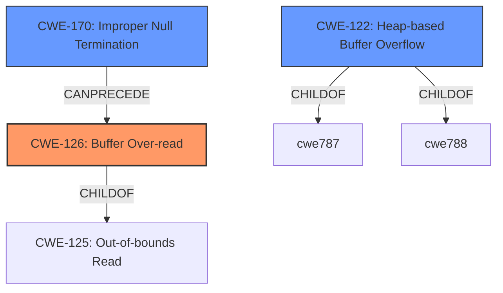

# Raw Analyzer Response for CVE-2020-19750

# Summary
| CWE ID | CWE Name | Confidence | CWE Abstraction Level | CWE Vulnerability Mapping Label | CWE-Vulnerability Mapping Notes |
|---|---|---|---|---|---|
| CWE-126 | Buffer Over-read | 0.9 | Variant | Allowed | Primary CWE |
| CWE-122 | Heap-based Buffer Overflow | 0.8 | Variant | Allowed | Secondary Candidate |
| CWE-170 | Improper Null Termination | 0.6 | Base | Allowed | Secondary Candidate |

## Evidence and Confidence

*   **Confidence Score:** 0.9
*   **Evidence Strength:** HIGH

## Relationship Analysis
The primary CWE selected is CWE-126 (Buffer Over-read), a variant of CWE-125 (Out-of-bounds Read). The vulnerability description explicitly mentions a "heap-based buffer over-read," making CWE-126 a strong candidate. CWE-122 (Heap-based Buffer Overflow) is also a relevant variant because the over-read occurs in the heap. CWE-170 (Improper Null Termination) is considered because the `gf_strdup` function is called without ensuring null termination, which can lead to an over-read. The relationship between CWE-125 and its variants (CWE-126, CWE-122) helped refine the selection to the most specific applicable CWE.

## Vulnerability Chain
The chain starts with a **heap allocation** based on size. Then, data is read from a bitstream into the allocated buffer. If the buffer is filled without a null byte, `gf_strdup` is called, leading to:
1.  **CWE-170:** **Improper Null Termination**
2.  **CWE-126:** **Buffer Over-read** (as a direct consequence of the missing null terminator, `gf_strdup` reads beyond the intended buffer).

## Summary of Analysis
The initial analysis focused on the explicit mention of "heap-based buffer over-read" in the vulnerability description. The "CVE Reference Links Content Summary" section provided additional details about the root cause, specifically the **lack of null termination** before calling `gf_strdup`.

The selection of CWE-126 is primarily based on the vulnerability description key phrases: "**heap-based buffer over-read**". The CVE Reference Links Content Summary provides further support: "If the input data fills the allocated buffer without including a null byte, then the subsequent `gf_strdup` will lead to a heap buffer overflow." This indicates that the over-read occurs because `gf_strdup` reads past the allocated buffer.

The graph relationships helped clarify the connection between a general out-of-bounds read (CWE-125) and the more specific variant (CWE-126). CWE-126 is at the optimal level of specificity because it accurately describes the vulnerability as an over-read.

The retriever results showed that CWE-126, CWE-122, and CWE-170 were good candidates.

Relevant CWE Information:

*   **CWE-126: Buffer Over-read**: Matches the vulnerability description which mentions "heap-based buffer over-read."
*   **CWE-122: Heap-based Buffer Overflow**: Considered due to the heap allocation but less precise than CWE-126 because the primary issue is reading past the buffer, not necessarily overflowing it during a write operation.
*   **CWE-170: Improper Null Termination**: Considered as a potential contributing factor, since the `gf_strdup` function copies until a null terminator is found, and the absence of a null terminator can lead to reading beyond the intended buffer.

CWE-787 was not chosen because the description specifies a read and not a write.
CWE-190, CWE-193, CWE-197, CWE-805, CWE-1260, CWE-125, CWE-1284 were not chosen because they were not specific to the "heap-based buffer over-read" or missing null termination issue.