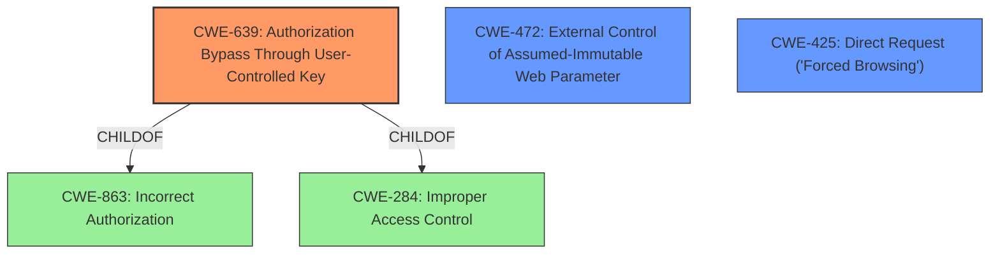

# Enhanced Analysis for CVE-2020-19778

# Summary
| CWE ID | CWE Name | Confidence | CWE Abstraction Level | CWE Vulnerability Mapping Label | CWE-Vulnerability Mapping Notes |
|---|---|---|---|---|---|
| **CWE-639** | **Authorization Bypass Through User-Controlled Key** | 1.0 | Base | Primary | Allowed |
| CWE-472 | External Control of Assumed-Immutable Web Parameter | 0.7 | Base | Secondary | Allowed |
| CWE-425 | Direct Request ('Forced Browsing') | 0.6 | Base | Secondary | Allowed |

## Evidence and Confidence

*   **Confidence Score:** 0.9
*   **Evidence Strength:** HIGH

## Relationship Analysis
The primary CWE, CWE-639, is a child of CWE-863 (Incorrect Authorization) and CWE-284 (Improper Access Control). This indicates that the vulnerability is a specific type of authorization failure where a user-controlled key is used to bypass access controls. CWE-472 (External Control of Assumed-Immutable Web Parameter) and CWE-425 (Direct Request) are related because they involve external control over parameters and direct access to resources, respectively, which can lead to authorization bypass. The abstraction levels are all Base, which is the preferred level for root cause analysis.



## Vulnerability Chain
The chain of events starts with the **incorrect access control**, allowing manipulation of the `user_id` parameter. This leads to **variable overwriting** and **insecure session management**, ultimately resulting in **unauthorized access** and potential **account takeover**.

## Summary of Analysis
The primary CWE is CWE-639, as the vulnerability stems from the ability to manipulate the `user_id` parameter and gain unauthorized access to other user accounts. This is supported by the **Vulnerability Description Key Phrases**, specifically "**Incorrect Access Control**" and "**gain privileges by manipulating the parameter user_id**". The **CVE Reference Links Content Summary** confirms this, highlighting the **root cause** as a "variable overwrite issue within the application, specifically related to the `$params['user_id']` variable". The application **fails to properly sanitize or validate user-supplied input**, allowing attackers to control the `$params['user_id']` variable through the `application=app` parameter. This directly aligns with the description of CWE-639, which states that the system's authorization functionality does not prevent one user from gaining access to another user's data by modifying the key value identifying the data.

CWE-472 is considered a secondary CWE because the application does not sufficiently verify inputs that are assumed to be immutable but are actually externally controllable. The `$params['user_id']` variable is assumed to be controlled by the system, but it's actually externally controllable. The evidence is the **root cause** as a "variable overwrite issue within the application, specifically related to the `$params['user_id']` variable".

CWE-425 is also considered a secondary CWE because the web application does not adequately enforce appropriate authorization on restricted resources. Specifically, it is possible to directly request a user profile by manipulating the `user_id` parameter without proper authorization checks. The application fails to apply authorization at certain points in the path.

The abstraction levels of the selected CWEs are all Base, which is the preferred level for root cause analysis. The selection is based on the evidence provided and the descriptions of the CWEs. The mapping guidance also supports these selections, as the CWEs are at the Base level of abstraction and the usage is allowed.

Relevant CWE Information:

# Enhanced Context (25 CWEs)
The following CWEs were identified as potentially relevant to this vulnerability:

## CWE-472: External Control of Assumed-Immutable Web Parameter
**Abstraction Level**: Base
**Similarity Score**: 0.76
**Source**: dense

**Description**:
The web application does not sufficiently verify inputs that are assumed to be immutable but are actually externally controllable, such as hidden form fields.

**Mapping Guidance**:
- Usage: Allowed
- Rationale: This CWE entry is at the Base level of abstraction, which is a preferred level of abstraction for mapping to the root causes of vulnerabilities.

## CWE-639: Authorization Bypass Through User-Controlled Key
**Abstraction Level**: Base
**Similarity Score**: 0.75
**Source**: dense

**Description**:
The system's authorization functionality does not prevent one user from gaining access to another user's data or record by modifying the key value identifying the data.

**Mapping Guidance**:
- Usage: Allowed
- Rationale: This CWE entry is at the Base level of abstraction, which is a preferred level of abstraction for mapping to the root causes of vulnerabilities.

## CWE-425: Direct Request ('Forced Browsing')
**Abstraction Level**: Base
**Similarity Score**: 6522.71
**Source**: sparse

**Description**:
The web application does not adequately enforce appropriate authorization on all restricted URLs, scripts, or files.

**Mapping Guidance**:
- Usage: Allowed
- Rationale: This CWE entry is at the Base level of abstraction, which is a preferred level of abstraction for mapping to the root causes of vulnerabilities.


## CWE Relationship Analysis

Current CWEs represent these abstraction levels: .


### Vulnerability Chain Analysis

**Chain starting from CWE-284:**
- 284 (Improper Access Control) - ROOT


**Chain starting from CWE-425:**
- 425 (Direct Request ('Forced Browsing')) - ROOT


### CWE Relationship Diagram

```mermaid
graph TD
    classDef primary fill:#f96,stroke:#333,stroke-width:2px
    classDef secondary fill:#69f,stroke:#333
    classDef tertiary fill:#9e9,stroke:#333
```