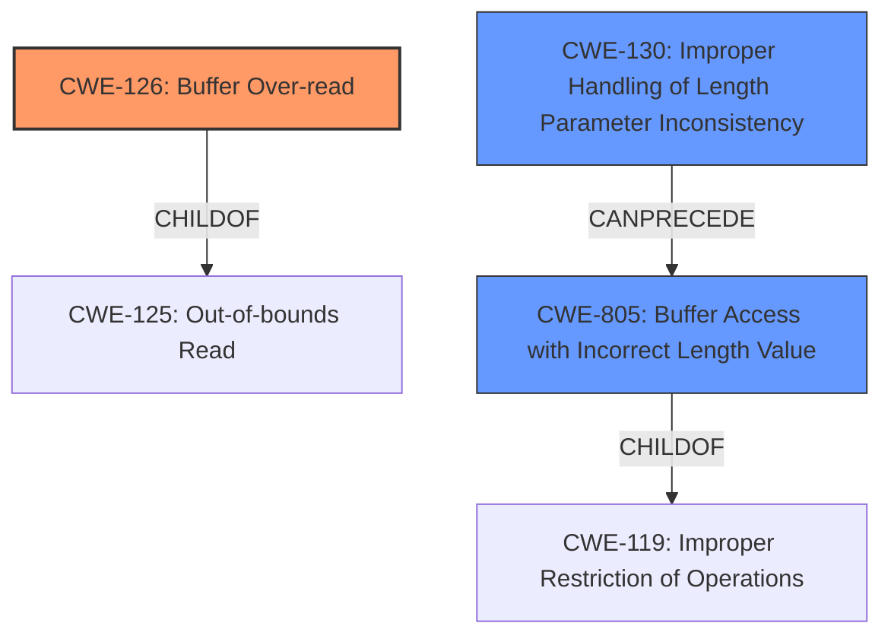

# Enhanced Analysis for CVE-2020-19861

# Summary
| CWE ID | CWE Name | Confidence | CWE Abstraction Level | CWE Vulnerability Mapping Label | CWE-Vulnerability Mapping Notes |
|---|---|---|---|---|---|
| CWE-126 | Buffer Over-read | 0.9 | Variant | Allowed | Primary CWE |
| CWE-130 | Improper Handling of Length Parameter Inconsistency | 0.7 | Base | Allowed | Secondary Candidate |
| CWE-805 | Buffer Access with Incorrect Length Value | 0.6 | Base | Allowed | Secondary Candidate |

## Evidence and Confidence

*   **Confidence Score:** 0.8
*   **Evidence Strength:** HIGH

## Relationship Analysis
The primary CWE, CWE-126 (Buffer Over-read), is a variant of CWE-125 (Out-of-bounds Read), indicating a more specific type of out-of-bounds access. CWE-130 (Improper Handling of Length Parameter Inconsistency) can precede CWE-805 (Buffer Access with Incorrect Length Value), which is related to CWE-119 (Improper Restriction of Operations within the Bounds of a Memory Buffer). The relationship analysis suggests that the vulnerability involves inconsistent length parameters leading to out-of-bounds memory access.



## Vulnerability Chain
The vulnerability chain starts with the **ldns_nsec3_salt_data function trusting the length value obtained from the zone file**, leading to **improper handling of the length parameter**. This results in a **buffer over-read** during the memcpy operation, causing a **heap overflow** and information leakage.

## Summary of Analysis
The assessment is based on the provided vulnerability description and CVE Reference Links Content Summary. The description explicitly mentions that the **ldns_nsec3_salt_data function is too trusted for the length value obtained from the zone file**, leading to a **heap overflow** due to copying `0xfe - ldns_rdf_size(salt_rdf)` bytes. The CVE Reference Links Content Summary confirms the root cause as the function `ldns_nsec3_salt_data` improperly handling the length value without validation, resulting in a heap out-of-bounds read and potential information leakage.

The graph relationships influenced the selection of CWE-126 as the primary CWE because it directly describes the **buffer over-read** condition. CWE-130 and CWE-805 are secondary because they describe the **improper handling of length parameter** that leads to the over-read.

The selected CWEs are at the optimal level of specificity. CWE-126 is a variant that describes the specific type of out-of-bounds access. CWE-130 and CWE-805 provide further context on how the length parameter is mishandled, contributing to the overall vulnerability.

Relevant CWE Information:

**CWE-126: Buffer Over-read**
*   **How the vulnerability's details match the CWE's characteristics:** The vulnerability involves reading data past the end of the allocated buffer due to the **unvalidated length value**, directly matching the CWE's description.
*   **The security implications and potential impact:** The security implication is heap information leakage, which could expose sensitive data stored in the heap memory.
*   **Any parent-child relationships or chain patterns that influenced your mapping:** CWE-126 is a variant of CWE-125 (Out-of-bounds Read), providing a more specific classification.
*   **Whether the weakness is primary or secondary in the vulnerability:** Primary.
*   **How the official MITRE mapping guidance influenced your decision:** The mapping guidance allows the use of variant level CWEs, which accurately describes the **buffer over-read**.

**CWE-130: Improper Handling of Length Parameter Inconsistency**
*   **How the vulnerability's details match the CWE's characteristics:** The function trusts the length value obtained from the zone file without validation, leading to the vulnerability.
*   **The security implications and potential impact:** The potential impact is a buffer overflow or out-of-bounds read.
*   **Any parent-child relationships or chain patterns that influenced your mapping:** This can precede CWE-805
*   **Whether the weakness is primary or secondary in the vulnerability:** Secondary.
*   **How the official MITRE mapping guidance influenced your decision:** Allowed usage.

**CWE-805: Buffer Access with Incorrect Length Value**
*   **How the vulnerability's details match the CWE's characteristics:** An incorrect length value is used during the memcpy operation, causing access to memory outside the bounds of the buffer.
*   **The security implications and potential impact:** Buffer overflow and out-of-bounds read
*   **Any parent-child relationships or chain patterns that influenced your mapping:** ChildOf CWE-119, Improper Restriction of Operations within the Bounds of a Memory Buffer
*   **Whether the weakness is primary or secondary in the vulnerability:** Secondary.
*   **How the official MITRE mapping guidance influenced your decision:** Allowed usage.

CWEs Considered but Not Used:

*   CWE-190 (Integer Overflow or Wraparound): While integer overflow could potentially be involved if the length calculation leads to an overflow, the primary issue is the **lack of validation of the length** rather than an overflow itself.
*   CWE-789 (Memory Allocation with Excessive Size Value): This is relevant when the allocated memory size is excessively large, but the vulnerability is due to reading past the buffer and not the allocation size.
*   CWE-1284 (Improper Validation of Specified Quantity in Input): Considered, but CWE-130 more accurately captures the specific issue of handling inconsistent length parameters during parsing.
*   CWE-193 (Off-by-one Error): While possible, there's no direct evidence suggesting the error is specifically off-by-one, instead of a more significant discrepancy.


## CWE Relationship Analysis

Current CWEs represent these abstraction levels: .


### Vulnerability Chain Analysis

**Chain starting from CWE-805:**
- 805 (Buffer Access with Incorrect Length Value) - ROOT


**Chain starting from CWE-193:**
- 193 (Off-by-one Error) - ROOT


### CWE Relationship Diagram

```mermaid
graph TD
    classDef primary fill:#f96,stroke:#333,stroke-width:2px
    classDef secondary fill:#69f,stroke:#333
    classDef tertiary fill:#9e9,stroke:#333
```