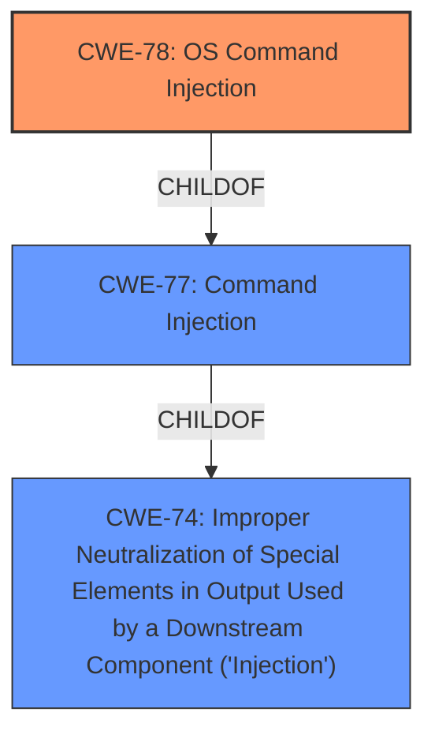

# Analysis for CVE-2020-19907

# Summary
| CWE ID  | CWE Name                                                                     | Confidence | CWE Abstraction Level | CWE Vulnerability Mapping Label | CWE-Vulnerability Mapping Notes |
| :-------- | :--------------------------------------------------------------------------- | :--------- | :---------------------- | :------------------------------ | :-------------------------------- |
| CWE-78  | Improper Neutralization of Special Elements used in an OS Command ('OS Command Injection') | 1          | Base                    | Allowed                       | Primary CWE                       |

## Evidence and Confidence

*   **Confidence Score:** 1
*   **Evidence Strength:** HIGH

## Relationship Analysis
The primary relationship influencing the CWE selection is the hierarchical relationship between CWE-77 (Command Injection) and its child CWE-78 (OS Command Injection). Since the vulnerability specifically involves OS commands, CWE-78 is the more specific and appropriate choice.

## Vulnerability Chain
The vulnerability chain involves the **improper neutralization** of special elements within a URL, leading to OS command injection, which allows an attacker to execute arbitrary OS commands.

## Summary of Analysis
The analysis indicates a high confidence in assigning CWE-78 as the primary CWE. The vulnerability description clearly states "**command injection**" in the sandcat plugin leading to the ability to "execute any command or service." The CVE Reference Links Content Summary confirms that the root cause is OS **command injection** via a user-provided URL, allowing arbitrary OS command execution.

The selection of CWE-78 is further supported by the Retriever Results, which list CWE-78 as a top candidate with a high score (0.700). The MITRE mapping guidance for CWE-78 states that it is a Base level of abstraction and its usage is Allowed.

Other CWEs were considered but deemed less appropriate:

*   CWE-77 (Command Injection): While related, it is a broader category and less specific than CWE-78. CWE-78 is a child of CWE-77 and is more applicable because the commands being injected are OS commands.
*   CWE-89 (SQL Injection) and CWE-88 (Argument Injection): These are different types of injection attacks and do not apply to the described vulnerability.
*   CWE-138 (Improper Neutralization of Special Elements): This is too general and doesn't pinpoint the specific type of injection.
*   CWE-96 (Static Code Injection): This CWE is not applicable because the code is not being injected into a static resource, but rather executed directly.
*   CWE-184 (Incomplete List of Disallowed Inputs): While potentially relevant, the primary issue is the lack of proper neutralization, not necessarily an incomplete list of disallowed inputs.
*   CWE-116 (Improper Encoding or Escaping of Output): While encoding/escaping could be a mitigation, the root cause is the lack of neutralization.
*   CWE-1336 (Improper Neutralization of Special Elements Used in a Template Engine): This is not applicable, as the vulnerability does not involve a template engine.

The chosen CWE is at the optimal level of specificity because it directly addresses the root cause: the **improper neutralization** of special elements in OS commands.