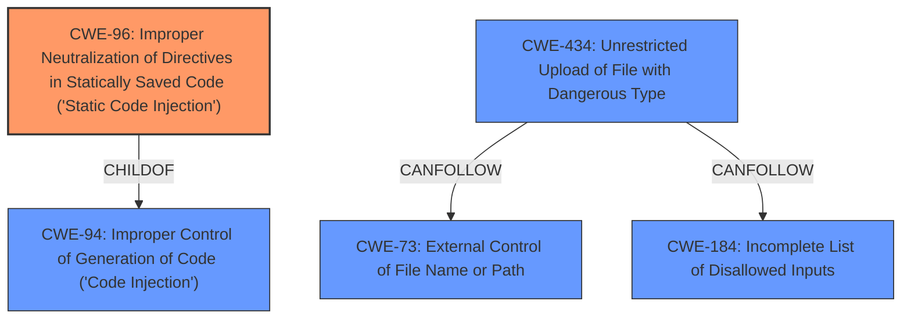

# Enhanced Analysis for CVE-2020-20124

# Summary
| CWE ID | CWE Name | Confidence | CWE Abstraction Level | CWE Vulnerability Mapping Label | CWE-Vulnerability Mapping Notes |
|---|---|---|---|---|---|
| CWE-96 | Improper Neutralization of Directives in Statically Saved Code ('Static Code Injection') | 0.9 | Base | Allowed | Primary CWE |
| CWE-434 | Unrestricted Upload of File with Dangerous Type | 0.7 | Base | Allowed | Secondary Candidate |

## Evidence and Confidence

*   **Confidence Score:** 0.8
*   **Evidence Strength:** HIGH

## Relationship Analysis
The primary CWE is CWE-96, which is a base-level CWE. CWE-96 is a child of CWE-94, which is a more general code injection CWE.
CWE-434 is a peer of CWE-430 and CWE-436. It can follow CWE-73 and CWE-184.
The choice of CWE-96 is influenced by its base-level abstraction and the explicit act of writing data to a static PHP file.



## Vulnerability Chain
The vulnerability chain starts with the **lack of input sanitization** of `$GLOBALS['setting']` in the `set` method, which passes unsanitized data to `set_cache`. The `set_cache` function then performs an **arbitrary file write** by writing the unsanitized data directly to a PHP file. This allows for **remote code execution** when the injected PHP code is executed.

## Summary of Analysis
The initial assessment focused on the **improper handling of user-supplied data** within the `set_cache` and `set` methods, leading to remote code execution. The analysis considered various CWEs, including those related to code injection and file handling.

The final decision to assign CWE-96 as the primary CWE is based on the evidence that the `set_cache` function directly writes data to a PHP file without proper sanitization, which aligns with the description of CWE-96: "The product receives input from an upstream component, but it does not neutralize or incorrectly neutralizes code syntax before inserting the input into an executable resource, such as a library, configuration file, or template." This is reinforced by the CVE Reference Links Content Summary, which states that the `set_cache` function writes the provided `$data` directly to a `.php` file and if this data is not an array it is not sanitized.

CWE-434 was considered as a secondary CWE because the vulnerability involves writing to a file.

The selected CWEs are at the optimal level of specificity because they accurately reflect the root cause of the vulnerability and the mechanism by which it is exploited.

Relevant CWE Information:
- **CWE-96:** The primary weakness, describing the **improper neutralization** of code syntax before inserting it into a static code file.
- **CWE-434:** A secondary weakness, involving the unrestricted upload of a file with a dangerous type.


## CWE Relationship Analysis

Current CWEs represent these abstraction levels: .


### Vulnerability Chain Analysis

**Chain starting from CWE-73:**
- 73 (External Control of File Name or Path) - ROOT


**Chain starting from CWE-96:**
- 96 (Improper Neutralization of Directives in Statically Saved Code ('Static Code Injection')) - ROOT


### CWE Relationship Diagram

```mermaid
graph TD
    classDef primary fill:#f96,stroke:#333,stroke-width:2px
    classDef secondary fill:#69f,stroke:#333
    classDef tertiary fill:#9e9,stroke:#333
```