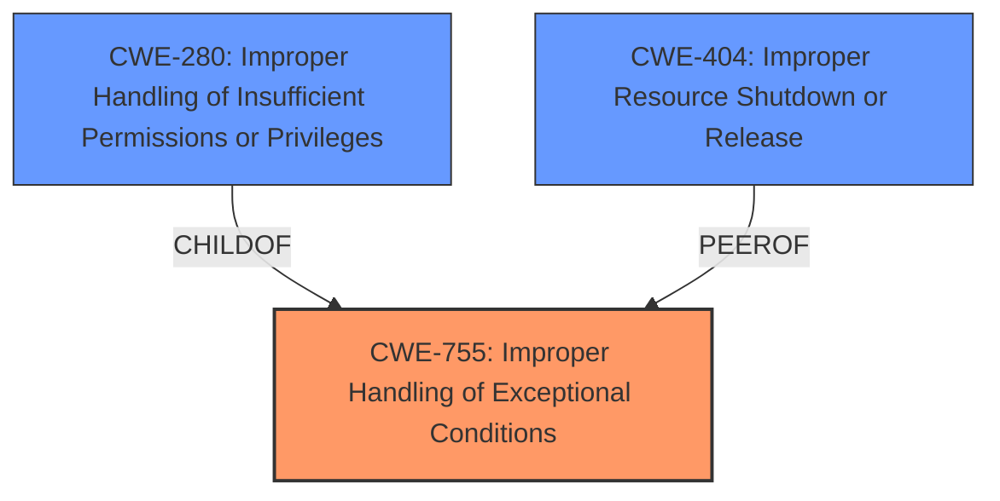

# Raw Analyzer Response for CVE-2020-2020

# Summary
| CWE ID | CWE Name | Confidence | CWE Abstraction Level | CWE Vulnerability Mapping Label | CWE-Vulnerability Mapping Notes |
|---|---|---|---|---|---|
| CWE-755 | Improper Handling of Exceptional Conditions | 0.9 | Class | Primary | Discouraged |
| CWE-280 | Improper Handling of Insufficient Permissions or Privileges | 0.6 | Base | Secondary | Allowed |
| CWE-404 | Improper Resource Shutdown or Release | 0.5 | Class | Secondary | Allowed-with-Review |

## Evidence and Confidence

*   **Confidence Score:** 0.7
*   **Evidence Strength:** HIGH

## Relationship Analysis
The primary CWE identified is CWE-755, which is a Class-level weakness. This suggests that more specific Base or Variant-level CWEs might be more appropriate if the evidence supported it. CWE-755 is a parent of CWE-280. While the description mentions file creation by an authenticated user, it's more about the agent's failure to handle the exceptional condition that arises from this creation rather than a direct permissions issue.

## Vulnerability Chain
The vulnerability chain starts with a local authenticated user creating files in the software's internal program directory. The **improper handling of this exceptional condition** by the Cortex XDR Agent leads to the agent's failure to start, resulting in a denial-of-service.

## Summary of Analysis
The initial analysis focused on the **improper handling of exceptional conditions**, which is explicitly mentioned in the vulnerability description and CVE summary as the root cause. The retriever results also highlighted CWE-755 as a potential match, though the guidance discourages its direct use due to its high abstraction level.

However, given the information available, the primary weakness is best described by CWE-755, with secondary considerations for CWE-280 because the exceptional condition could be triggered by the user not having sufficient privilege.

CWE-755 is at the optimal level of specificity given the information available. While further investigation might reveal a more specific cause, the current description centers on the agent's general failure to handle the unexpected file creation scenario.

Relevant CWE Information:

# Enhanced Context (25 CWEs)
The following CWEs were identified as potentially relevant to this vulnerability:

## CWE-280: Improper Handling of Insufficient Permissions or Privileges
**Abstraction Level**: Base
**Similarity Score**: 0.78
**Source**: dense

**Description**:
The product does not handle or incorrectly handles when it has insufficient privileges to access resources or functionality as specified by their permissions. This may cause it to follow unexpected code paths that may leave the product in an invalid state.

**Mapping Guidance**:
- Usage: Allowed
- Rationale: This CWE entry is at the Base level of abstraction, which is a preferred level of abstraction for mapping to the root causes of vulnerabilities.
**Vulnerability Description Key Phrases**:
- **rootcause:** **improper handling of exceptional conditions**

CWE-280 may be a secondary concern because the root cause may be due to the local authenticated user's insufficient privileges.

## CWE-274: Improper Handling of Insufficient Privileges
**Abstraction Level**: Base
**Similarity Score**: 0.78
**Source**: dense

**Description**:
The product does not handle or incorrectly handles when it has insufficient privileges to perform an operation, leading to resultant weaknesses.

**Mapping Guidance**:
- Usage: Discouraged
- Rationale: This CWE entry could be deprecated in a future version of CWE.
**Vulnerability Description Key Phrases**:
- **rootcause:** **improper handling of exceptional conditions**

CWE-274 is similar to CWE-280 and therefore a secondary concern.

## CWE-266: Incorrect Privilege Assignment
**Abstraction Level**: Base
**Similarity Score**: 0.77
**Source**: dense

**Description**:
A product incorrectly assigns a privilege to a particular actor, creating an unintended sphere of control for that actor.

**Mapping Guidance**:
- Usage: Allowed
- Rationale: This CWE entry is at the Base level of abstraction, which is a preferred level of abstraction for mapping to the root causes of vulnerabilities.
**Vulnerability Description Key Phrases**:
- **rootcause:** **improper handling of exceptional conditions**

CWE-266 does not appear to be a good fit because the issue is not related to privilege assignment.

## CWE-668: Exposure of Resource to Wrong Sphere
**Abstraction Level**: Class
**Similarity Score**: 0.76
**Source**: dense

**Description**:
The product exposes a resource to the wrong control sphere, providing unintended actors with inappropriate access to the resource.

**Mapping Guidance**:
- Usage: Discouraged
- Rationale: CWE-668 is high-level and is often misused as a catch-all when lower-level CWE IDs might be applicable. It is sometimes used for low-information vulnerability reports [REF-1287]. It is a level-1 Class (i.e., a child of a Pillar). It is not useful for trend analysis.
**Vulnerability Description Key Phrases**:
- **rootcause:** **improper handling of exceptional conditions**

CWE-668 is not a good fit because the issue is not due to an exposure of resource.

## CWE-653: Improper Isolation or Compartmentalization
**Abstraction Level**: Class
**Similarity Score**: 0.76
**Source**: dense

**Description**:
The product does not properly compartmentalize or isolate functionality, processes, or resources that require different privilege levels, rights, or permissions.

**Mapping Guidance**:
- Usage: Allowed
- Rationale: This CWE entry is at the Base level of abstraction, which is a preferred level of abstraction for mapping to the root causes of vulnerabilities.
**Vulnerability Description Key Phrases**:
- **rootcause:** **improper handling of exceptional conditions**

CWE-653 does not appear to be a good fit because the issue is not related to isolation or compartmentalization.

## CWE-538: Insertion of Sensitive Information into Externally-Accessible File or Directory
**Abstraction Level**: Base
**Similarity Score**: 0.76
**Source**: dense

**Description**:
The product places sensitive information into files or directories that are accessible to actors who are allowed to have access to the files, but not to the sensitive information.

**Mapping Guidance**:
- Usage: Allowed
- Rationale: This CWE entry is at the Base level of abstraction, which is a preferred level of abstraction for mapping to the root causes of vulnerabilities.
**Vulnerability Description Key Phrases**:
- **rootcause:** **improper handling of exceptional conditions**

CWE-538 is not a good fit because there is no sensitive information.

## CWE-404: Improper Resource Shutdown or Release
**Abstraction Level**: Class
**Similarity Score**: 0.76
**Source**: dense

**Description**:
The product does not release or incorrectly releases a resource before it is made available for re-use.

**Mapping Guidance**:
- Usage: Allowed-with-Review
- Rationale: This CWE entry is a Class and might have Base-level children that would be more appropriate
**Vulnerability Description Key Phrases**:
- **rootcause:** **improper handling of exceptional conditions**

CWE-404 may be a secondary concern because the Cortex XDR agent does not properly shutdown after the exceptional condition occurs.

## CWE-267: Privilege Defined With Unsafe Actions
**Abstraction Level**: Base
**Similarity Score**: 0.75
**Source**: dense

**Description**:
A particular privilege, role, capability, or right can be used to perform unsafe actions that were not intended, even when it is assigned to the correct entity.

**Mapping Guidance**:
- Usage: Allowed
- Rationale: This CWE entry is at the Base level of abstraction, which is a preferred level of abstraction for mapping to the root causes of vulnerabilities.
**Vulnerability Description Key Phrases**:
- **rootcause:** **improper handling of exceptional conditions**

CWE-267 is not a good fit because the vulnerability is not directly related to the definition of privilege.

## CWE-497: Exposure of Sensitive System Information to an Unauthorized Control Sphere
**Abstraction Level**: Base
**Similarity Score**: 0.75
**Source**: dense

**Description**:
The product does not properly prevent sensitive system-level information from being accessed by unauthorized actors who do not have the same level of access to the underlying system as the product does.