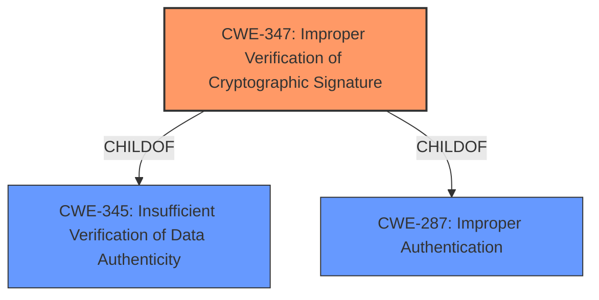

# Analysis for CVE-2020-2021

# Summary
| CWE ID  | CWE Name                                                                | Confidence | CWE Abstraction Level | CWE Vulnerability Mapping Label | CWE-Vulnerability Mapping Notes |
| :-------- | :---------------------------------------------------------------------- | :---------- | :---------------------- | :------------------------------ | :------------------------------ |
| CWE-347   | Improper Verification of Cryptographic Signature                      | 1          | Base                    | Primary                         | Allowed                         |
| CWE-287   | Improper Authentication                                                 | 0.7        | Class                   | Secondary                       | Discouraged                     |

## Evidence and Confidence

*   **Confidence Score:** 0.9
*   **Evidence Strength:** HIGH

## Relationship Analysis
The primary CWE selected is CWE-347, which is a base-level CWE describing **improper verification of cryptographic signatures**. This is a direct match to the vulnerability's root cause, which involves **improper verification of signatures** in SAML authentication.

CWE-347 is a child of CWE-345 (Insufficient Verification of Data Authenticity), and CWE-287 (Improper Authentication). While the vulnerability ultimately leads to authentication bypass, the direct root cause is within the signature verification process itself, justifying the selection of CWE-347.

## Vulnerability Chain
The vulnerability chain starts with **improper verification of signatures** (CWE-347). This leads to the ability for an unauthenticated attacker to bypass authentication mechanisms, ultimately gaining unauthorized access to protected resources or administrative privileges. Therefore, the chain can be represented as:
CWE-347 -> Authentication Bypass -> Access to Protected Resources / Admin Access

## Summary of Analysis
The analysis is primarily based on the provided vulnerability description and the CVE reference links content summary. The key evidence is the statement that the vulnerability involves **improper verification of signatures** in PAN-OS SAML authentication, which directly aligns with CWE-347.

The retriever results also support this selection, with CWE-347 having a high similarity score. The mapping guidance for CWE-347 recommends its use at the base level of abstraction, which is appropriate in this case as it directly describes the root cause.

CWE-287 (Improper Authentication) was considered but determined to be a secondary effect rather than the primary cause. The core issue is the flawed signature verification process, which then leads to authentication bypass. While authentication is bypassed, the more fundamental flaw is the signature verification, making CWE-347 the more precise and informative classification.

The selected CWEs are at the optimal level of specificity because CWE-347 directly identifies the coding error (**improper verification of signatures**), while CWE-287 describes a higher-level consequence (authentication bypass). The evidence supports identifying the **improper verification** as the root cause.

Relevant CWE Information:

# Enhanced Context (25 CWEs)
The following CWEs were identified as potentially relevant to this vulnerability:

## CWE-303: Incorrect Implementation of Authentication Algorithm
**Abstraction Level**: Base
**Similarity Score**: 0.79
**Source**: dense

**Description**:
The requirements for the product dictate the use of an established authentication algorithm, but the implementation of the algorithm is incorrect.

**Mapping Guidance**:
- Usage: Allowed
- Rationale: This CWE entry is at the Base level of abstraction, which is a preferred level of abstraction for mapping to the root causes of vulnerabilities.

## CWE-288: Authentication Bypass Using an Alternate Path or Channel
**Abstraction Level**: Base
**Similarity Score**: 0.78
**Source**: dense

**Description**:
The product requires authentication, but the product has an alternate path or channel that does not require authentication.

**Mapping Guidance**:
- Usage: Allowed
- Rationale: This CWE entry is at the Base level of abstraction, which is a preferred level of abstraction for mapping to the root causes of vulnerabilities.

## CWE-345: Insufficient Verification of Data Authenticity
**Abstraction Level**: Class
**Similarity Score**: 0.78
**Source**: dense

**Description**:
The product does not sufficiently verify the origin or authenticity of data, in a way that causes it to accept invalid data.

**Mapping Guidance**:
- Usage: Discouraged
- Rationale: This CWE entry is a level-1 Class (i.e., a child of a Pillar). It might have lower-level children that would be more appropriate

## CWE-807: Reliance on Untrusted Inputs in a Security Decision
**Abstraction Level**: Base
**Similarity Score**: 0.78
**Source**: dense

**Description**:
The product uses a protection mechanism that relies on the existence or values of an input, but the input can be modified by an untrusted actor in a way that bypasses the protection mechanism.

**Mapping Guidance**:
- Usage: Allowed
- Rationale: This CWE entry is at the Base level of abstraction, which is a preferred level of abstraction for mapping to the root causes of vulnerabilities.

## CWE-1390: Weak Authentication
**Abstraction Level**: Class
**Similarity Score**: 0.78
**Source**: dense

**Description**:
The product uses an authentication mechanism to restrict access to specific users or identities, but the mechanism does not sufficiently prove that the claimed identity is correct.

**Mapping Guidance**:
- Usage: Allowed-with-Review
- Rationale: This CWE entry is a Class and might have Base-level children that would be more appropriate

## CWE-668: Exposure of Resource to Wrong Sphere
**Abstraction Level**: Class
**Similarity Score**: 0.78
**Source**: dense

**Description**:
The product exposes a resource to the wrong control sphere, providing unintended actors with inappropriate access to the resource.

**Mapping Guidance**:
- Usage: Discouraged
- Rationale: CWE-668 is high-level and is often misused as a catch-all when lower-level CWE IDs might be applicable. It is sometimes used for low-information vulnerability reports [REF-1287]. It is a level-1 Class (i.e., a child of a Pillar). It is not useful for trend analysis.

## CWE-41: Improper Resolution of Path Equivalence
**Abstraction Level**: Base
**Similarity Score**: 0.77
**Source**: dense

**Description**:
The product is vulnerable to file system contents disclosure through path equivalence. Path equivalence involves the use of special characters in file and directory names. The associated manipulations are intended to generate multiple names for the same object.

**Mapping Guidance**:
- Usage: Allowed
- Rationale: This CWE entry is at the Base level of abstraction, which is a preferred level of abstraction for mapping to the root causes of vulnerabilities.

## CWE-289: Authentication Bypass by Alternate Name
**Abstraction Level**: Base
**Similarity Score**: 0.77
**Source**: dense

**Description**:
The product performs authentication based on the name of a resource being accessed, or the name of the actor performing the access, but it does not properly check all possible names for that resource or actor.

**Mapping Guidance**:
- Usage: Allowed
- Rationale: This CWE entry is at the Base level of abstraction, which is a preferred level of abstraction for mapping to the root causes of vulnerabilities.

## CWE-23: Relative Path Traversal
**Abstraction Level**: Base
**Similarity Score**: 0.77
**Source**: dense

**Description**:
The product uses external input to construct a pathname that should be within a restricted directory, but it does not properly neutralize sequences such as ".." that can resolve to a location that is outside of that directory.

**Mapping Guidance**:
- Usage: Allowed
- Rationale: This CWE entry is at the Base level of abstraction, which is a preferred level of abstraction for mapping to the root causes of vulnerabilities.

## CWE-290: Authentication Bypass by Spoofing
**Abstraction Level**: Base
**Similarity Score**: 0.77
**Source**: dense

**Description**:
This attack-focused weakness is caused by incorrectly implemented authentication schemes that are subject to spoofing attacks.

**Mapping Guidance**:
- Usage: Allowed
- Rationale: This CWE entry is at the Base level of abstraction, which is a preferred level of abstraction for mapping to the root causes of vulnerabilities.

## CWE-347: Improper Verification of Cryptographic Signature
**Abstraction Level**: Base
**Similarity Score**: 6426.18
**Source**: sparse

**Description**:
The product does not verify, or incorrectly verifies, the cryptographic signature for data.

**Mapping Guidance**:
- Usage: Allowed
-