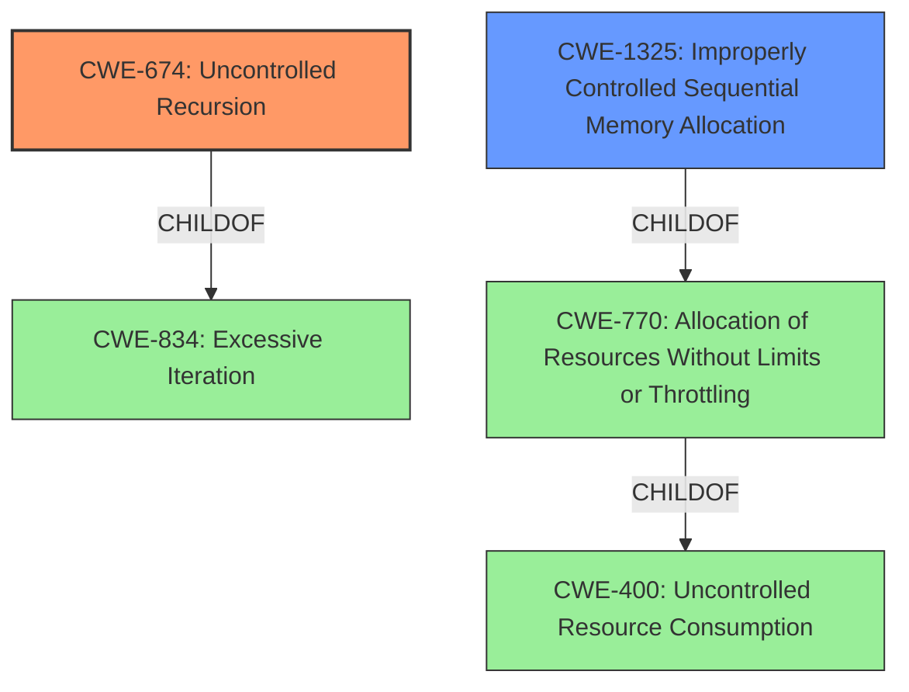

# Enhanced Analysis for CVE-2020-20213

# Summary
| CWE ID | CWE Name | Confidence | CWE Abstraction Level | CWE Vulnerability Mapping Label | CWE-Vulnerability Mapping Notes |
|---|---|---|---|---|---|
| CWE-674 | Uncontrolled Recursion | 0.9 | Class | Primary | Allowed-with-Review |
| CWE-1325 | Improperly Controlled Sequential Memory Allocation | 0.8 | Base | Secondary | Allowed |

## Evidence and Confidence

*   **Confidence Score:** 0.85
*   **Evidence Strength:** HIGH

## Relationship Analysis
The primary CWE is CWE-674 (Uncontrolled Recursion), a Class-level CWE. The vulnerability description explicitly mentions a stack exhaustion vulnerability caused by uncontrolled recursion, making CWE-674 a strong initial candidate.

CWE-674 is a child of CWE-834 (Excessive Iteration), indicating that uncontrolled recursion is a specific type of excessive iteration.

CWE-1325 (Improperly Controlled Sequential Memory Allocation) is related because the **stack exhaustion** is caused by uncontrolled memory allocation during each recursive call. CWE-1325 is a child of CWE-770 (Allocation of Resources Without Limits or Throttling), providing a broader context of resource management issues.



## Vulnerability Chain
The vulnerability chain starts with the following steps:
1. An attacker sends a crafted packet to the `/nova/bin/net` process.
2. The crafted packet triggers uncontrolled recursion.
3. Each recursive call allocates memory on the stack.
4. The stack is exhausted due to the excessive memory allocation.
5. The system's CPU is overloaded, leading to a Denial of Service.

The CWEs associated with this chain are:
- CWE-674 (Uncontrolled Recursion) - Root cause
- CWE-1325 (Improperly Controlled Sequential Memory Allocation) - Weakness
- Denial of Service (Impact)

## Summary of Analysis
Initially, the analysis focused on identifying the root cause of the vulnerability. The vulnerability description explicitly states a **stack exhaustion** vulnerability. The CVE Reference Links Content Summary confirms that the stack exhaustion is due to uncontrolled recursion triggered by a crafted packet.

The Retriever Results identified several potential CWEs, including CWE-1325 (Improperly Controlled Sequential Memory Allocation) and CWE-674 (Uncontrolled Recursion).

CWE-674 (Uncontrolled Recursion) was selected as the primary CWE because the root cause is specifically related to the uncontrolled recursion, which is also confirmed by the "CVE Reference Links Content Summary": "This is caused by recursive function calls triggered by a crafted packet." CWE-674 directly addresses the issue of excessive resource consumption due to uncontrolled recursion.

CWE-1325 (Improperly Controlled Sequential Memory Allocation) was chosen as a secondary CWE because the **stack exhaustion** is a result of memory allocation during each recursive call. This memory allocation is not properly controlled, leading to the exhaustion.

The final assessment is based on the provided evidence, relationship analysis, and mapping guidance. The selected CWEs accurately represent the vulnerability at the appropriate level of specificity.

Relevant CWE Information:

# Enhanced Context (25 CWEs)
The following CWEs were identified as potentially relevant to this vulnerability:

## CWE-1325: Improperly Controlled Sequential Memory Allocation
**Abstraction Level**: Base
**Similarity Score**: 0.79
**Source**: dense

**Description**:
The product manages a group of objects or resources and performs a separate memory allocation for each object, but it does not properly limit the total amount of memory that is consumed by all of the combined objects.

**Mapping Guidance**:
- Usage: Allowed
- Rationale: This CWE entry is at the Base level of abstraction, which is a preferred level of abstraction for mapping to the root causes of vulnerabilities.

## CWE-789: Memory Allocation with Excessive Size Value
**Abstraction Level**: Variant
**Similarity Score**: 0.78
**Source**: dense

**Description**:
The product allocates memory based on an untrusted, large size value, but it does not ensure that the size is within expected limits, allowing arbitrary amounts of memory to be allocated.

**Mapping Guidance**:
- Usage: Allowed
- Rationale: This CWE entry is at the Variant level of abstraction, which is a preferred level of abstraction for mapping to the root causes of vulnerabilities.

## CWE-404: Improper Resource Shutdown or Release
**Abstraction Level**: Class
**Similarity Score**: 0.77
**Source**: dense

**Description**:
The product does not release or incorrectly releases a resource before it is made available for re-use.

**Mapping Guidance**:
- Usage: Allowed-with-Review
- Rationale: This CWE entry is a Class and might have Base-level children that would be more appropriate

## CWE-131: Incorrect Calculation of Buffer Size
**Abstraction Level**: Base
**Similarity Score**: 0.76
**Source**: dense

**Description**:
The product does not correctly calculate the size to be used when allocating a buffer, which could lead to a buffer overflow.

**Mapping Guidance**:
- Usage: Allowed
- Rationale: This CWE entry is at the Base level of abstraction, which is a preferred level of abstraction for mapping to the root causes of vulnerabilities.

## CWE-191: Integer Underflow (Wrap or Wraparound)
**Abstraction Level**: Base
**Similarity Score**: 0.76
**Source**: dense

**Description**:
The product subtracts one value from another, such that the result is less than the minimum allowable integer value, which produces a value that is not equal to the correct result.

**Mapping Guidance**:
- Usage: Allowed
- Rationale: This CWE entry is at the Base level of abstraction, which is a preferred level of abstraction for mapping to the root causes of vulnerabilities.

## CWE-226: Sensitive Information in Resource Not Removed Before Reuse
**Abstraction Level**: Base
**Similarity Score**: 0.76
**Source**: dense

**Description**:
The product releases a resource such as memory or a file so that it can be made available for reuse, but it does not clear or "zeroize" the information contained in the resource before the product performs a critical state transition or makes the resource available for reuse by other entities.

**Mapping Guidance**:
- Usage: Allowed
- Rationale: This CWE entry is at the Base level of abstraction, which is a preferred level of abstraction for mapping to the root causes of vulnerabilities.

## CWE-805: Buffer Access with Incorrect Length Value
**Abstraction Level**: Base
**Similarity Score**: 0.76
**Source**: dense

**Description**:
The product uses a sequential operation to read or write a buffer, but it uses an incorrect length value that causes it to access memory that is outside of the bounds of the buffer.

**Mapping Guidance**:
- Usage: Allowed
- Rationale: This CWE entry is at the Base level of abstraction, which is a preferred level of abstraction for mapping to the root causes of vulnerabilities.

## CWE-119: Improper Restriction of Operations within the Bounds of a Memory Buffer
**Abstraction Level**: Class
**Similarity Score**: 0.76
**Source**: dense

**Description**:
The product performs operations on a memory buffer, but it reads from or writes to a memory location outside the buffer's intended boundary. This may result in read or write operations on unexpected memory locations that could be linked to other variables, data structures, or internal program data.

**Mapping Guidance**:
- Usage: Discouraged
- Rationale: CWE-119 is commonly misused in low-information vulnerability reports when lower-level CWEs could be used instead, or when more details about the vulnerability are available.

## CWE-126: Buffer Over-read
**Abstraction Level**: Variant
**Similarity Score**: 0.76
**Source**: dense

**Description**:
The product reads from a buffer using buffer access mechanisms such as indexes or pointers that reference memory locations after the targeted buffer.

**Mapping Guidance**:
- Usage: Allowed
- Rationale: This CWE entry is at the Variant level of abstraction, which is a preferred level of abstraction for mapping to the root causes of vulnerabilities.

## CWE-


## CWE Relationship Analysis

Current CWEs represent these abstraction levels: .


### Vulnerability Chain Analysis

**Chain starting from CWE-674:**
- 674 (Uncontrolled Recursion) - ROOT


**Chain starting from CWE-404:**
- 404 (Improper Resource Shutdown or Release) - ROOT


### CWE Relationship Diagram

```mermaid
graph TD
    classDef primary fill:#f96,stroke:#333,stroke-width:2px
    classDef secondary fill:#69f,stroke:#333
    classDef tertiary fill:#9e9,stroke:#333
```