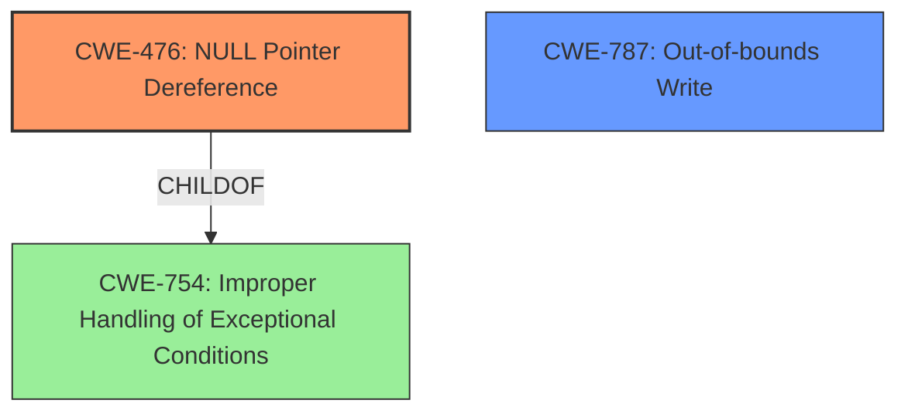

# Raw Analyzer Response for CVE-2020-20216

# Summary
| CWE ID | CWE Name | Confidence | CWE Abstraction Level | CWE Vulnerability Mapping Label | CWE-Vulnerability Mapping Notes |
|---|---|---|---|---|---|
| CWE-476 | NULL Pointer Dereference | 1.0 | Base | Allowed | Primary CWE |
| CWE-787 | Out-of-bounds Write | 0.5 | Base | Allowed | Secondary CWE Candidate |

## Evidence and Confidence

*   **Confidence Score:** 0.8
*   **Evidence Strength:** HIGH

## Relationship Analysis
The primary relationship impacting the decision is the ChildOf relationship between CWE-476 and CWE-754 (Improper Handling of Exceptional Conditions). While memory corruption is indicated, the direct evidence points to a **NULL pointer dereference** as the immediate cause. CWE-787 is a broader issue that could lead to a NULL pointer dereference, but the description explicitly states the dereference.

## Vulnerability Chain
The vulnerability chain starts with the crafted packet leading to memory corruption, which then results in a **NULL pointer dereference**, ultimately causing a Denial of Service. The crafted packet is not classified as a CWE, because the description focuses on the **NULL pointer dereference**.

## Summary of Analysis
The initial assessment identified the **NULL pointer dereference** as the primary weakness, supported by the vulnerability description and CVE reference summary: "**NULL pointer dereference:** The graphing process crashes due to a NULL pointer dereference, triggered by a specially crafted packet." The Retriever Results also list CWE-476 as the top candidate.

CWE-787 (Out-of-bounds Write) was considered because the description mentions memory corruption. However, the direct cause is the **NULL pointer dereference**. Therefore, CWE-476 is more specific and accurately represents the vulnerability. The relationship graph shows how these CWEs are related.

The selection of CWE-476 is at the optimal level of specificity (Base), as it precisely describes the immediate cause of the vulnerability.

Relevant CWE Information:

# Enhanced Context (25 CWEs)
The following CWEs were identified as potentially relevant to this vulnerability:

## CWE-476: NULL Pointer Dereference
**Abstraction Level**: Base
**Similarity Score**: 0.79
**Source**: dense

**Description**:
The product dereferences a pointer that it expects to be valid but is NULL.

**Mapping Guidance**:
- Usage: Allowed
- Rationale: This CWE entry is at the Base level of abstraction, which is a preferred level of abstraction for mapping to the root causes of vulnerabilities.

## CWE-787: Out-of-bounds Write
**Abstraction Level**: base
**Similarity Score**: 4.33
**Source**: graph

**Description**:
CWE-787: Out-of-bounds Write

**Mapping Guidance**:
- Usage: Allowed
- Rationale: This CWE entry is at the Base level of abstraction, which is a preferred level of abstraction for mapping to the root causes of vulnerabilities.

### Detailed Analysis of Selected CWEs:

*   **CWE-476: NULL Pointer Dereference**
    *   **Match:** The vulnerability description explicitly states a "**NULL pointer dereference**" in the `/nova/bin/graphing` process.
    *   **Security Implications:** A **NULL pointer dereference** leads to a crash, resulting in a Denial of Service.
    *   **Relationships:** CWE-476 is a child of CWE-754 (Improper Handling of Exceptional Conditions).
    *   **Mapping Guidance:** The MITRE mapping guidance recommends using the Base level of abstraction when possible, and CWE-476 is a Base-level CWE. The Usage is "Allowed".
    *   **Confidence:** 1.0

*   **CWE-787: Out-of-bounds Write**
    *   **Match:** The vulnerability description mentions memory corruption, which could be related to an out-of-bounds write.
    *   **Security Implications:** Out-of-bounds writes can lead to various issues, including memory corruption and denial of service.
    *   **Relationships:** CWE-787 is a child of CWE-119 (Improper Restriction of Operations within the Bounds of a Memory Buffer).
    *   **Mapping Guidance:** The MITRE mapping guidance recommends using the Base level of abstraction when possible, and CWE-787 is a Base-level CWE. The Usage is "Allowed".
    *   **Confidence:** 0.5

### Detailed Analysis of Omitted CWEs:

*   **CWE-822: Untrusted Pointer Dereference, CWE-824: Access of Uninitialized Pointer, CWE-823: Use of Out-of-range Pointer Offset:** These CWEs were considered but not selected because they are not as directly supported by the vulnerability description as CWE-476. While they could potentially be related to the underlying memory corruption, the immediate cause is the **NULL pointer dereference**.
*   **CWE-252: Unchecked Return Value:** There is no evidence to suggest an unchecked return value is the root cause.
*   **CWE-665: Improper Initialization:** There is no direct evidence of improper initialization leading to the **NULL pointer dereference**, although this cannot be ruled out.
*   **CWE-401: Missing Release of Memory after Effective Lifetime:** While a memory leak could contribute to instability, the primary issue is the **NULL pointer dereference**.
*   **CWE-825: Expired Pointer Dereference:** There is no specific evidence that an expired pointer is being dereferenced, only that a NULL pointer is being dereferenced.
*   **CWE-908: Use of Uninitialized Resource:** Similar to CWE-665, there is no direct evidence.