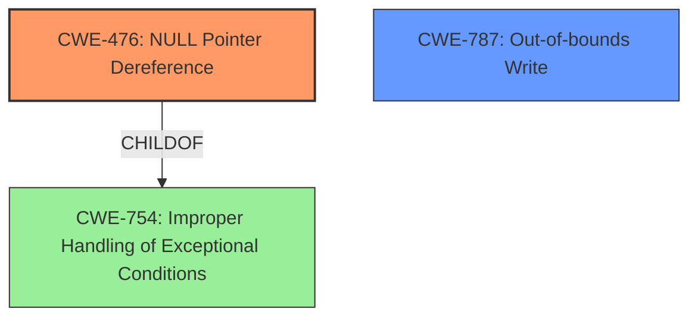

# Analysis for CVE-2020-20216

# Summary
| CWE ID | CWE Name | Confidence | CWE Abstraction Level | CWE Vulnerability Mapping Label | CWE-Vulnerability Mapping Notes |
|---|---|---|---|---|---|
| CWE-476 | NULL Pointer Dereference | 1.0 | Base | Allowed | Primary CWE |
| CWE-787 | Out-of-bounds Write | 0.5 | Base | Allowed | Secondary CWE Candidate |

## Evidence and Confidence

*   **Confidence Score:** 0.8
*   **Evidence Strength:** HIGH

## Relationship Analysis
The primary relationship impacting the decision is the ChildOf relationship between CWE-476 and CWE-754 (Improper Handling of Exceptional Conditions). While memory corruption is indicated, the direct evidence points to a **NULL pointer dereference** as the immediate cause. CWE-787 is a broader issue that could lead to a NULL pointer dereference, but the description explicitly states the dereference.

## Vulnerability Chain
The vulnerability chain starts with the crafted packet leading to memory corruption, which then results in a **NULL pointer dereference**, ultimately causing a Denial of Service. The crafted packet is not classified as a CWE, because the description focuses on the **NULL pointer dereference**.

## Summary of Analysis
The initial assessment identified the **NULL pointer dereference** as the primary weakness, supported by the vulnerability description and CVE reference summary: "**NULL pointer dereference:** The graphing process crashes due to a NULL pointer dereference, triggered by a specially crafted packet." The Retriever Results also list CWE-476 as the top candidate.

CWE-787 (Out-of-bounds Write) was considered because the description mentions memory corruption. However, the direct cause is the **NULL pointer dereference**. Therefore, CWE-476 is more specific and accurately represents the vulnerability. The relationship graph shows how these CWEs are related.

The selection of CWE-476 is at the optimal level of specificity (Base), as it precisely describes the immediate cause of the vulnerability.

Relevant CWE Information:

# Enhanced Context (25 CWEs)
The following CWEs were identified as potentially relevant to this vulnerability:

## CWE-476: NULL Pointer Dereference
**Abstraction Level**: Base
**Similarity Score**: 0.79
**Source**: dense

**Description**:
The product dereferences a pointer that it expects to be valid but is NULL.

**Mapping Guidance**:
- Usage: Allowed
- Rationale: This CWE entry is at the Base level of abstraction, which is a preferred level of abstraction for mapping to the root causes of vulnerabilities.

## CWE-787: Out-of-bounds Write
**Abstraction Level**: base
**Similarity Score**: 4.33
**Source**: graph

**Description**:
CWE-787: Out-of-bounds Write

**Mapping Guidance**:
- Usage: Allowed
- Rationale: This CWE entry is at the Base level of abstraction, which is a preferred level of abstraction for mapping to the root causes of vulnerabilities.

### Detailed Analysis of Selected CWEs:

*   **CWE-476: NULL Pointer Dereference**
    *   **Match:** The vulnerability description explicitly states a "**NULL pointer dereference**" in the `/nova/bin/graphing` process.
    *   **Security Implications:** A **NULL pointer dereference** leads to a crash, resulting in a Denial of Service.
    *   **Relationships:** CWE-476 is a child of CWE-754 (Improper Handling of Exceptional Conditions).
    *   **Mapping Guidance:** The MITRE mapping guidance recommends using the Base level of abstraction when possible, and CWE-476 is a Base-level CWE. The Usage is "Allowed".
    *   **Confidence:** 1.0

*   **CWE-787: Out-of-bounds Write**
    *   **Match:** The vulnerability description mentions memory corruption, which could be related to an out-of-bounds write.
    *   **Security Implications:** Out-of-bounds writes can lead to various issues, including memory corruption and denial of service.
    *   **Relationships:** CWE-787 is a child of CWE-119 (Improper Restriction of Operations within the Bounds of a Memory Buffer).
    *   **Mapping Guidance:** The MITRE mapping guidance recommends using the Base level of abstraction when possible, and CWE-787 is a Base-level CWE. The Usage is "Allowed".
    *   **Confidence:** 0.5

### Detailed Analysis of Omitted CWEs:

*   **CWE-822: Untrusted Pointer Dereference, CWE-824: Access of Uninitialized Pointer, CWE-823: Use of Out-of-range Pointer Offset:** These CWEs were considered but not selected because they are not as directly supported by the vulnerability description as CWE-476. While they could potentially be related to the underlying memory corruption, the immediate cause is the **NULL pointer dereference**.
*   **CWE-252: Unchecked Return Value:** There is no evidence to suggest an unchecked return value is the root cause.
*   **CWE-665: Improper Initialization:** There is no direct evidence of improper initialization leading to the **NULL pointer dereference**, although this cannot be ruled out.
*   **CWE-401: Missing Release of Memory after Effective Lifetime:** While a memory leak could contribute to instability, the primary issue is the **NULL pointer dereference**.
*   **CWE-825: Expired Pointer Dereference:** There is no specific evidence that an expired pointer is being dereferenced, only that a NULL pointer is being dereferenced.
*   **CWE-908: Use of Uninitialized Resource:** Similar to CWE-665, there is no direct evidence.

# Enhanced Query for CVE-2020-20216

## Vulnerability Description
Mikrotik RouterOs 6.44.6 (long-term tree) suffers from a memory corruption vulnerability in the /nova/bin/graphing process. An authenticated remote attacker can cause a Denial of Service (**NULL pointer dereference**).

### Vulnerability Description Key Phrases
- **weakness:** **NULL pointer dereference**
- **impact:** Denial of Service
- **vector:** memory corruption
- **attacker:** authenticated remote attacker
- **product:** Mikrotik RouterOs
- **version:** 6.44.6 (long-term tree)
- **component:** /nova/bin/graphing process

### CWE for similar CVE Descriptions
### Primary CWE Match
CWE-787

#### Top CWEs
- CWE-787 (Count: 59)
- CWE-476 (Count: 33)
- CWE-617 (Count: 8)

## CVE Reference Links Content Summary
Based on the provided content, here's a breakdown of the vulnerability described for CVE-2020-20216:

**Root Cause:**
- The vulnerability is a memory corruption issue within the `/nova/bin/graphing` process of MikroTik's RouterOS.

**Weaknesses/Vulnerabilities Present:**
- **NULL pointer dereference:** The graphing process crashes due to a NULL pointer dereference, triggered by a specially crafted packet. This indicates a flaw in how the process handles certain input, leading to the use of an invalid memory address.

**Impact of Exploitation:**
- **Denial of Service (DoS):** Successful exploitation results in the crashing of the `graphing` process. This can disrupt the normal operation of the MikroTik device, as the graphing process is likely responsible for collecting and displaying network statistics and related data.

**Attack Vectors:**
- **Remote Attack:** The attack can be performed remotely.
- **Crafted Packets:** The attacker needs to send a specially crafted network packet to the vulnerable process.

**Required Attacker Capabilities/Position:**
- **Authenticated Access:** The attacker needs to be an authenticated user on the MikroTik device to send the crafted packet, this implies that the vulnerability requires some level of access to the device and is not a remotely exploitable vulnerability without any prior access
- **Network Access:** The attacker requires network connectivity to the MikroTik device to transmit the malicious packet.

**Additional Information:**
- The vulnerability was found in RouterOS 6.44.6 (long-term tree).
- It was fixed in stable version 6.47.
- The vulnerability is triggered due to a memory corruption issue which is caused by sending a crafted packet, leading to a null pointer dereference.

## Retriever Results

### Top Combined Results

| Rank | CWE ID | Name | Abstraction | Usage  | Retrievers | Individual Scores |
|------|--------|------|-------------|-------|------------|-------------------|
| 1 | 476 | NULL Pointer Dereference | Base | Allowed | sparse | 0.354 |
| 2 | 787 | Out-of-bounds Write | Base | Allowed | sparse | 0.315 |
| 3 | 822 | Untrusted Pointer Dereference | Base | Allowed | sparse | 0.217 |
| 4 | 252 | Unchecked Return Value | Base | Allowed | sparse | 0.211 |
| 5 | 665 | Improper Initialization | Class | Discouraged | sparse | 0.202 |
| 6 | 401 | Missing Release of Memory after Effective Lifetime | Variant | Allowed | dense | 0.579 |
| 7 | 825 | Expired Pointer Dereference | Base | Allowed | graph | 0.003 |
| 8 | 824 | Access of Uninitialized Pointer | Base | Allowed | sparse | 0.193 |
| 9 | 823 | Use of Out-of-range Pointer Offset | Base | Allowed | sparse | 0.192 |
| 10 | 908 | Use of Uninitialized Resource | Base | Allowed | sparse | 0.190 |

# Complete CWE Specifications

## CWE-476: NULL Pointer Dereference
**Abstraction:** Base
**Status:** Stable

### Description
The product dereferences a pointer that it expects to be valid but is NULL.

### Extended Description
Not provided

### Alternative Terms
NPD: Common abbreviation for Null Pointer Dereference
null deref: Common abbreviation for Null Pointer Dereference
NPE: Common abbreviation for Null Pointer Exception
nil pointer dereference: used for access of nil in Go programs

### Relationships
ChildOf -> CWE-710
ChildOf -> CWE-754
ChildOf -> CWE-754

### Mapping Guidance
**Usage:** Allowed
**Rationale:** This CWE entry is at the Base level of abstraction, which is a preferred level of abstraction for mapping to the root causes of vulnerabilities.
**Comments:** Carefully read both the name and description to ensure that this mapping is an appropriate fit. Do not try to 'force' a mapping to a lower-level Base/Variant simply to comply with this preferred level of abstraction.
**Reasons:**
- Acceptable-Use

### Observed Examples
- **CVE-2005-3274:** race condition causes a table to be corrupted if a timer activates while it is being modified, leading to resultant NULL dereference; also involves locking.
- **CVE-2002-1912:** large number of packets leads to NULL dereference
- **CVE-2005-0772:** packet with invalid error status value triggers NULL dereference

## CWE-787: Out-of-bounds Write
**Abstraction:** Base
**Status:** Draft

### Description
The product writes data past the end, or before the beginning, of the intended buffer.

### Extended Description
Not provided

### Alternative Terms
Memory Corruption: Often used to describe the consequences of writing to memory outside the bounds of a buffer, or to memory that is otherwise invalid.

### Relationships
ChildOf -> CWE-119
ChildOf -> CWE-119
ChildOf -> CWE-119
ChildOf -> CWE-119

### Mapping Guidance
**Usage:** Allowed
**Rationale:** This CWE entry is at the Base level of abstraction, which is a preferred level of abstraction for mapping to the root causes of vulnerabilities.
**Comments:** Carefully read both the name and description to ensure that this mapping is an appropriate fit. Do not try to 'force' a mapping to a lower-level Base/Variant simply to comply with this preferred level of abstraction.
**Reasons:**
- Acceptable-Use

### Observed Examples
- **CVE-2023-1017:** The reference implementation code for a Trusted Platform Module does not implement length checks on data, allowing for an attacker to write 2 bytes past the end of a buffer.
- **CVE-2021-21220:** Chain: insufficient input validation (CWE-20) in browser allows heap corruption (CWE-787), as exploited in the wild per CISA KEV.
- **CVE-2021-28664:** GPU kernel driver allows memory corruption because a user can obtain read/write access to read-only pages, as exploited in the wild per CISA KEV.

## CWE-822: Untrusted Pointer Dereference
**Abstraction:** Base
**Status:** Incomplete

### Description
The product obtains a value from an untrusted source, converts this value to a pointer, and dereferences the resulting pointer.

### Extended Description

An attacker can supply a pointer for memory locations that the product is not expecting. If the pointer is dereferenced for a write operation, the attack might allow modification of critical state variables, cause a crash, or execute code. If the dereferencing operation is for a read, then the attack might allow reading of sensitive data, cause a crash, or set a variable to an unexpected value (since the value will be read from an unexpected memory location).

There are several variants of this weakness, including but not necessarily limited to:

  - The untrusted value is directly invoked as a function call.

  - In OS kernels or drivers where there is a boundary between "userland" and privileged memory spaces, an untrusted pointer might enter through an API or system call (see CWE-781 for one such example).

  - Inadvertently accepting the value from an untrusted control sphere when it did not have to be accepted as input at all. This might occur when the code was originally developed to be run by a single user in a non-networked environment, and the code is then ported to or otherwise exposed to a networked environment.

### Alternative Terms
None

### Relationships
ChildOf -> CWE-119
ChildOf -> CWE-119
ChildOf -> CWE-119
CanPrecede -> CWE-125
CanPrecede -> CWE-787

### Mapping Guidance
**Usage:** Allowed
**Rationale:** This CWE entry is at the Base level of abstraction, which is a preferred level of abstraction for mapping to the root causes of vulnerabilities.
**Comments:** Carefully read both the name and description to ensure that this mapping is an appropriate fit. Do not try to 'force' a mapping to a lower-level Base/Variant simply to comply with this preferred level of abstraction.
**Reasons:**
- Acceptable-Use

### Additional Notes
**[Maintenance]** There are close relationships between incorrect pointer dereferences and other weaknesses related to buffer operations. There may not be sufficient community agreement regarding these relationships. Further study is needed to determine when these relationships are chains, composites, perspective/layering, or other types of relationships. As of September 2010, most of the relationships are being captured as chains.

**[Terminology]** Many weaknesses related to pointer dereferences fall under the general term of "memory corruption" or "memory safety." As of September 2010, there is no commonly-used terminology that covers the lower-level variants.

### Observed Examples
- **CVE-2007-5655:** message-passing framework interprets values in packets as pointers, causing a crash.
- **CVE-2010-2299:** labeled as a "type confusion" issue, also referred to as a "stale pointer." However, the bug ID says "contents are simply interpreted as a pointer... renderer ordinarily doesn't supply this pointer directly". The "handle" in the untrusted area is replaced in one function, but not another - thus also, effectively, exposure to wrong sphere (CWE-668).
- **CVE-2009-1719:** Untrusted dereference using undocumented constructor.

## CWE-252: Unchecked Return Value
**Abstraction:** Base
**Status:** Draft

### Description
The product does not check the return value from a method or function, which can prevent it from detecting unexpected states and conditions.

### Extended Description
Two common programmer assumptions are "this function call can never fail" and "it doesn't matter if this function call fails". If an attacker can force the function to fail or otherwise return a value that is not expected, then the subsequent program logic could lead to a vulnerability, because the product is not in a state that the programmer assumes. For example, if the program calls a function to drop privileges but does not check the return code to ensure that privileges were successfully dropped, then the program will continue to operate with the higher privileges.

### Alternative Terms
None

### Relationships
ChildOf -> CWE-754
ChildOf -> CWE-754
CanPrecede -> CWE-476

### Mapping Guidance
**Usage:** Allowed
**Rationale:** This CWE entry is at the Base level of abstraction, which is a preferred level of abstraction for mapping to the root causes of vulnerabilities.
**Comments:** Carefully read both the name and description to ensure that this mapping is an appropriate fit. Do not try to 'force' a mapping to a lower-level Base/Variant simply to comply with this preferred level of abstraction.
**Reasons:**
- Acceptable-Use

### Observed Examples
- **CVE-2020-17533:** Chain: unchecked return value (CWE-252) of some functions for policy enforcement leads to authorization bypass (CWE-862)
- **CVE-2020-6078:** Chain: The return value of a function returning a pointer is not checked for success (CWE-252) resulting in the later use of an uninitialized variable (CWE-456) and a null pointer dereference (CWE-476)
- **CVE-2019-15900:** Chain: sscanf() call is used to check if a username and group exists, but the return value of sscanf() call is not checked (CWE-252), causing an uninitialized variable to be checked (CWE-457), returning success to allow authorization bypass for executing a privileged (CWE-863).

## CWE-665: Improper Initialization
**Abstraction:** Class
**Status:** Draft

### Description
The product does not initialize or incorrectly initializes a resource, which might leave the resource in an unexpected state when it is accessed or used.

### Extended Description
This can have security implications when the associated resource is expected to have certain properties or values, such as a variable that determines whether a user has been authenticated or not.

### Alternative Terms
None

### Relationships
ChildOf -> CWE-664

### Mapping Guidance
**Usage:** Discouraged
**Rationale:** This CWE entry is a level-1 Class (i.e., a child of a Pillar). It might have lower-level children that would be more appropriate
**Comments:** Examine children of this entry to see if there is a better fit
**Reasons:**
- Abstraction

### Observed Examples
- **CVE-2001-1471:** chain: an invalid value prevents a library file from being included, skipping initialization of key variables, leading to resultant eval injection.
- **CVE-2008-3637:** Improper error checking in protection mechanism produces an uninitialized variable, allowing security bypass and code execution.
- **CVE-2008-4197:** Use of uninitialized memory may allow code execution.

## CWE-401: Missing Release of Memory after Effective Lifetime
**Abstraction:** Variant
**Status:** Draft

### Description
The product does not sufficiently track and release allocated memory after it has been used, which slowly consumes remaining memory.

### Extended Description
This is often triggered by improper handling of malformed data or unexpectedly interrupted sessions. In some languages, developers are responsible for tracking memory allocation and releasing the memory. If there are no more pointers or references to the memory, then it can no longer be tracked and identified for release.

### Alternative Terms
Memory Leak

### Relationships
ChildOf -> CWE-772
ChildOf -> CWE-404
ChildOf -> CWE-404

### Mapping Guidance
**Usage:** Allowed
**Rationale:** This CWE entry is at the Variant level of abstraction, which is a preferred level of abstraction for mapping to the root causes of vulnerabilities.
**Comments:** Carefully read both the name and description to ensure that this mapping is an appropriate fit. Do not try to 'force' a mapping to a lower-level Base/Variant simply to comply with this preferred level of abstraction.
**Reasons:**
- Acceptable-Use

### Additional Notes
**[Relationship]** This is often a resultant weakness due to improper handling of malformed data or early termination of sessions.

**[Terminology]** "memory leak" has sometimes been used to describe other kinds of issues, e.g. for information leaks in which the contents of memory are inadvertently leaked (CVE-2003-0400 is one such example of this terminology conflict).

### Observed Examples
- **CVE-2005-3119:** Memory leak because function does not free() an element of a data structure.
- **CVE-2004-0427:** Memory leak when counter variable is not decremented.
- **CVE-2002-0574:** chain: reference count is not decremented, leading to memory leak in OS by sending ICMP packets.

## CWE-825: Expired Pointer Dereference
**Abstraction:** Base
**Status:** Incomplete

### Description
The product dereferences a pointer that contains a location for memory that was previously valid, but is no longer valid.

### Extended Description
When a product releases memory, but it maintains a pointer to that memory, then the memory might be re-allocated at a later time. If the original pointer is accessed to read or write data, then this could cause the product to read or modify data that is in use by a different function or process. Depending on how the newly-allocated memory is used, this could lead to a denial of service, information exposure, or code execution.

### Alternative Terms
Dangling pointer

### Relationships
ChildOf -> CWE-119
ChildOf -> CWE-119
ChildOf -> CWE-119
ChildOf -> CWE-672
CanPrecede -> CWE-125
CanPrecede -> CWE-787

### Mapping Guidance
**Usage:** Allowed
**Rationale:** This CWE entry is at the Base level of abstraction, which is a preferred level of abstraction for mapping to the root causes of vulnerabilities.
**Comments:** Carefully read both the name and description to ensure that this mapping is an appropriate fit. Do not try to 'force' a mapping to a lower-level Base/Variant simply to comply with this preferred level of abstraction.
**Reasons:**
- Acceptable-Use

### Additional Notes
**[Maintenance]** There are close relationships between incorrect pointer dereferences and other weaknesses related to buffer operations. There may not be sufficient community agreement regarding these relationships. Further study is needed to determine when these relationships are chains, composites, perspective/layering, or other types of relationships. As of September 2010, most of the relationships are being captured as chains.

**[Terminology]** Many weaknesses related to pointer dereferences fall under the general term of "memory corruption" or "memory safety." As of September 2010, there is no commonly-used terminology that covers the lower-level variants.

### Observed Examples
- **CVE-2008-5013:** access of expired memory address leads to arbitrary code execution
- **CVE-2010-3257:** stale pointer issue leads to denial of service and possibly other consequences
- **CVE-2008-0062:** Chain: a message having an unknown message type may cause a reference to uninitialized memory resulting in a null pointer dereference (CWE-476) or dangling pointer (CWE-825), possibly crashing the system or causing heap corruption.

## CWE-824: Access of Uninitialized Pointer
**Abstraction:** Base
**Status:** Incomplete

### Description
The product accesses or uses a pointer that has not been initialized.

### Extended Description

If the pointer contains an uninitialized value, then the value might not point to a valid memory location. This could cause the product to read from or write to unexpected memory locations, leading to a denial of service. If the uninitialized pointer is used as a function call, then arbitrary functions could be invoked. If an attacker can influence the portion of uninitialized memory that is contained in the pointer, this weakness could be leveraged to execute code or perform other attacks.

Depending on memory layout, associated memory management behaviors, and product operation, the attacker might be able to influence the contents of the uninitialized pointer, thus gaining more fine-grained control of the memory location to be accessed.

### Alternative Terms
None

### Relationships
ChildOf -> CWE-119
ChildOf -> CWE-119
ChildOf -> CWE-119
ChildOf -> CWE-119
CanPrecede -> CWE-125
CanPrecede -> CWE-787

### Mapping Guidance
**Usage:** Allowed
**Rationale:** This CWE entry is at the Base level of abstraction, which is a preferred level of abstraction for mapping to the root causes of vulnerabilities.
**Comments:** Carefully read both the name and description to ensure that this mapping is an appropriate fit. Do not try to 'force' a mapping to a lower-level Base/Variant simply to comply with this preferred level of abstraction.
**Reasons:**
- Acceptable-Use

### Additional Notes
**[Maintenance]** There are close relationships between incorrect pointer dereferences and other weaknesses related to buffer operations. There may not be sufficient community agreement regarding these relationships. Further study is needed to determine when these relationships are chains, composites, perspective/layering, or other types of relationships. As of September 2010, most of the relationships are being captured as chains.

**[Terminology]** Many weaknesses related to pointer dereferences fall under the general term of "memory corruption" or "memory safety." As of September 2010, there is no commonly-used terminology that covers the lower-level variants.

### Observed Examples
- **CVE-2024-32878:** LLM product has a free of an uninitialized pointer
- **CVE-2010-0211:** chain: unchecked return value (CWE-252) leads to free of invalid, uninitialized pointer (CWE-824).
- **CVE-2009-2768:** Pointer in structure is not initialized, leading to NULL pointer dereference (CWE-476) and system crash.

## CWE-823: Use of Out-of-range Pointer Offset
**Abstraction:** Base
**Status:** Incomplete

### Description
The product performs pointer arithmetic on a valid pointer, but it uses an offset that can point outside of the intended range of valid memory locations for the resulting pointer.

### Extended Description

While a pointer can contain a reference to any arbitrary memory location, a program typically only intends to use the pointer to access limited portions of memory, such as contiguous memory used to access an individual array.

Programs may use offsets in order to access fields or sub-elements stored within structured data. The offset might be out-of-range if it comes from an untrusted source, is the result of an incorrect calculation, or occurs because of another error.

If an attacker can control or influence the offset so that it points outside of the intended boundaries of the structure, then the attacker may be able to read or write to memory locations that are used elsewhere in the product. As a result, the attack might change the state of the product as accessed through program variables, cause a crash or instable behavior, and possibly lead to code execution.

### Alternative Terms
Untrusted pointer offset: This term is narrower than the concept of "out-of-range" offset, since the offset might be the result of a calculation or other error that does not depend on any externally-supplied values.

### Relationships
ChildOf -> CWE-119
ChildOf -> CWE-119
ChildOf -> CWE-119
CanPrecede -> CWE-125
CanPrecede -> CWE-787

### Mapping Guidance
**Usage:** Allowed
**Rationale:** This CWE entry is at the Base level of abstraction, which is a preferred level of abstraction for mapping to the root causes of vulnerabilities.
**Comments:** Carefully read both the name and description to ensure that this mapping is an appropriate fit. Do not try to 'force' a mapping to a lower-level Base/Variant simply to comply with this preferred level of abstraction.
**Reasons:**
- Acceptable-Use

### Additional Notes
**[Maintenance]** There are close relationships between incorrect pointer dereferences and other weaknesses related to buffer operations. There may not be sufficient community agreement regarding these relationships. Further study is needed to determine when these relationships are chains, composites, perspective/layering, or other types of relationships. As of September 2010, most of the relationships are being captured as chains.

**[Terminology]** Many weaknesses related to pointer dereferences fall under the general term of "memory corruption" or "memory safety." As of September 2010, there is no commonly-used terminology that covers the lower-level variants.

### Observed Examples
- **CVE-2010-2160:** Invalid offset in undocumented opcode leads to memory corruption.
- **CVE-2010-1281:** Multimedia player uses untrusted value from a file when using file-pointer calculations.
- **CVE-2009-3129:** Spreadsheet program processes a record with an invalid size field, which is later used as an offset.

## CWE-908: Use of Uninitialized Resource
**Abstraction:** Base
**Status:** Incomplete

### Description
The product uses or accesses a resource that has not been initialized.

### Extended Description
When a resource has not been properly initialized, the product may behave unexpectedly. This may lead to a crash or invalid memory access, but the consequences vary depending on the type of resource and how it is used within the product.

### Alternative Terms
None

### Relationships
ChildOf -> CWE-665
ChildOf -> CWE-665

### Mapping Guidance
**Usage:** Allowed
**Rationale:** This CWE entry is at the Base level of abstraction, which is a preferred level of abstraction for mapping to the root causes of vulnerabilities.
**Comments:** Carefully read both the name and description to ensure that this mapping is an appropriate fit. Do not try to 'force' a mapping to a lower-level Base/Variant simply to comply with this preferred level of abstraction.
**Reasons:**
- Acceptable-Use

### Observed Examples
- **CVE-2019-9805:** Chain: Creation of the packet client occurs before initialization is complete (CWE-696) resulting in a read from uninitialized memory (CWE-908), causing memory corruption.
- **CVE-2008-4197:** Use of uninitialized memory may allow code execution.
- **CVE-2008-2934:** Free of an uninitialized pointer leads to crash and possible code execution.

