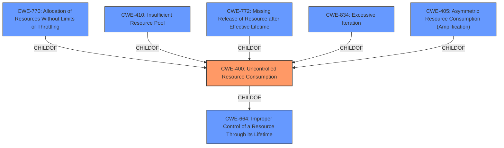

# Analysis for CVE-2020-20217

# Summary
| CWE ID | CWE Name | Confidence | CWE Abstraction Level | CWE Vulnerability Mapping Label | CWE-Vulnerability Mapping Notes |
|---|---|---|---|---|---|
| CWE-400 | Uncontrolled Resource Consumption | 0.9 | Class | Allowed-with-Review | The product does not properly control the allocation and maintenance of a limited resource, thereby enabling an actor to influence the amount of resources consumed, eventually leading to the exhaustion of available resources. |

## Evidence and Confidence

*   **Confidence Score:** 0.9
*   **Evidence Strength:** HIGH

## Relationship Analysis
The primary CWE is CWE-400, which is a Class-level CWE. While it's generally discouraged to map to Class-level CWEs directly, the description of the vulnerability clearly points to **uncontrolled resource consumption**. The retriever results also list CWE-400 as the top candidate.

## Vulnerability Chain
The chain of events is as follows:
1.  **Root Cause**: **Uncontrolled resource consumption** in the `/nova/bin/route` process.
2.  **Trigger**: Authenticated remote attacker sends a crafted packet.
3.  **Impact**: High CPU load, leading to Denial of Service.

## Summary of Analysis
The initial analysis and criticism focused on identifying the root cause of the vulnerability and mapping it to the most appropriate CWE. The vulnerability description clearly states "**uncontrolled resource consumption**" as the weakness. The CVE reference links content summary reinforces this by stating that the `route` process is vulnerable to **uncontrolled resource consumption**.

The retriever results list CWE-400 as the top candidate with a score of 0.301. While CWE-400 is a Class-level CWE and the mapping guidance discourages direct mapping to Class-level CWEs, it is the most accurate representation of the vulnerability based on the provided evidence. The mapping guidance suggests considering children/descendants such as CWE-770, CWE-771, CWE-410, CWE-772, CWE-834, and CWE-405. However, none of these children are as directly applicable as CWE-400. The description notes that the issue stems from not properly controlling the allocation and maintenance of limited resources, leading to resource exhaustion.

The selected CWE is at the optimal level of specificity because it directly reflects the **uncontrolled resource consumption** vulnerability described in the vulnerability report.