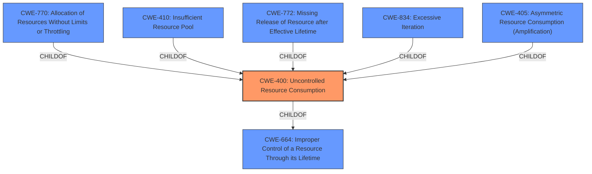

# Analysis for CVE-2020-20217

# Summary
| CWE ID | CWE Name | Confidence | CWE Abstraction Level | CWE Vulnerability Mapping Label | CWE-Vulnerability Mapping Notes |
|---|---|---|---|---|---|
| CWE-400 | Uncontrolled Resource Consumption | 0.9 | Class | Allowed-with-Review | The product does not properly control the allocation and maintenance of a limited resource, thereby enabling an actor to influence the amount of resources consumed, eventually leading to the exhaustion of available resources. |

## Evidence and Confidence

*   **Confidence Score:** 0.9
*   **Evidence Strength:** HIGH

## Relationship Analysis
The primary CWE is CWE-400, which is a Class-level CWE. While it's generally discouraged to map to Class-level CWEs directly, the description of the vulnerability clearly points to **uncontrolled resource consumption**. The retriever results also list CWE-400 as the top candidate.

## Vulnerability Chain
The chain of events is as follows:
1.  **Root Cause**: **Uncontrolled resource consumption** in the `/nova/bin/route` process.
2.  **Trigger**: Authenticated remote attacker sends a crafted packet.
3.  **Impact**: High CPU load, leading to Denial of Service.

## Summary of Analysis
The initial analysis and criticism focused on identifying the root cause of the vulnerability and mapping it to the most appropriate CWE. The vulnerability description clearly states "**uncontrolled resource consumption**" as the weakness. The CVE reference links content summary reinforces this by stating that the `route` process is vulnerable to **uncontrolled resource consumption**.

The retriever results list CWE-400 as the top candidate with a score of 0.301. While CWE-400 is a Class-level CWE and the mapping guidance discourages direct mapping to Class-level CWEs, it is the most accurate representation of the vulnerability based on the provided evidence. The mapping guidance suggests considering children/descendants such as CWE-770, CWE-771, CWE-410, CWE-772, CWE-834, and CWE-405. However, none of these children are as directly applicable as CWE-400. The description notes that the issue stems from not properly controlling the allocation and maintenance of limited resources, leading to resource exhaustion.

The selected CWE is at the optimal level of specificity because it directly reflects the **uncontrolled resource consumption** vulnerability described in the vulnerability report.

# Enhanced Query for CVE-2020-20217

## Vulnerability Description
Mikrotik RouterOs before 6.47 (stable tree) suffers from an **uncontrolled resource consumption** vulnerability in the /nova/bin/route process. An authenticated remote attacker can cause a Denial of Service due to overloading the systems CPU.

### Vulnerability Description Key Phrases
- **weakness:** **uncontrolled resource consumption**
- **impact:** Denial of Service
- **attacker:** authenticated remote attacker
- **product:** Mikrotik RouterOs
- **version:** before 6.47
- **component:** /nova/bin/route process

## CVE Reference Links Content Summary
Based on the provided content, here's the breakdown of the vulnerability:

**CVE ID:** CVE-2020-20217

**Root Cause:**
The `route` process in MikroTik RouterOS is vulnerable to uncontrolled resource consumption.

**Weaknesses/Vulnerabilities:**
- Uncontrolled resource consumption in the `route` process.

**Impact of Exploitation:**
- A crafted packet sent by an authenticated remote user can cause high CPU load on the device.
- High CPU load may lead to slow response times or the device becoming unresponsive.

**Attack Vectors:**
- Sending a crafted network packet to the affected device.

**Required Attacker Capabilities/Position:**
- Authenticated remote access to the MikroTik device.

**Affected Versions:**
- Initially found in long-term version `6.44.6`.
- Fixed in stable version `6.47`.
- The provided content confirms that stable version `6.46.3` was vulnerable.

**Timeline:**
- 2019/12/02: Vulnerability reported to the vendor.
- 2019/12/03: Vendor confirmed and reproduced the vulnerability.
- 2021/05/04: CVE ID assigned.

## Retriever Results

### Top Combined Results

| Rank | CWE ID | Name | Abstraction | Usage  | Retrievers | Individual Scores |
|------|--------|------|-------------|-------|------------|-------------------|
| 1 | 400 | Uncontrolled Resource Consumption | Class | Discouraged | sparse | 0.301 |
| 2 | 476 | NULL Pointer Dereference | Base | Allowed | sparse | 0.272 |
| 3 | 787 | Out-of-bounds Write | Base | Allowed | sparse | 0.266 |
| 4 | 674 | Uncontrolled Recursion | Class | Allowed-with-Review | sparse | 0.260 |
| 5 | 1176 | Inefficient CPU Computation | Class | Allowed-with-Review | sparse | 0.221 |
| 6 | 78 | Improper Neutralization of Special Elements used in an OS Command ('OS Command Injection') | Base | Allowed | dense | 0.540 |
| 7 | 825 | Expired Pointer Dereference | Base | Allowed | graph | 0.002 |
| 8 | 401 | Missing Release of Memory after Effective Lifetime | Variant | Allowed | sparse | 0.209 |
| 9 | 772 | Missing Release of Resource after Effective Lifetime | Base | Allowed | sparse | 0.209 |
| 10 | 789 | Memory Allocation with Excessive Size Value | Variant | Allowed | sparse | 0.208 |

# Complete CWE Specifications

## CWE-400: Uncontrolled Resource Consumption
**Abstraction:** Class
**Status:** Draft

### Description
The product does not properly control the allocation and maintenance of a limited resource, thereby enabling an actor to influence the amount of resources consumed, eventually leading to the exhaustion of available resources.

### Extended Description

Limited resources include memory, file system storage, database connection pool entries, and CPU. If an attacker can trigger the allocation of these limited resources, but the number or size of the resources is not controlled, then the attacker could cause a denial of service that consumes all available resources. This would prevent valid users from accessing the product, and it could potentially have an impact on the surrounding environment. For example, a memory exhaustion attack against an application could slow down the application as well as its host operating system.

There are at least three distinct scenarios which can commonly lead to resource exhaustion:

  - Lack of throttling for the number of allocated resources

  - Losing all references to a resource before reaching the shutdown stage

  - Not closing/returning a resource after processing

Resource exhaustion problems are often result due to an incorrect implementation of the following situations:

  - Error conditions and other exceptional circumstances.

  - Confusion over which part of the program is responsible for releasing the resource.

### Alternative Terms
Resource Exhaustion

### Relationships
ChildOf -> CWE-664

### Mapping Guidance
**Usage:** Discouraged
**Rationale:** CWE-400 is intended for incorrect behaviors in which the product is expected to track and restrict how many resources it consumes, but CWE-400 is often misused because it is conflated with the "technical impact" of vulnerabilities in which resource consumption occurs. It is sometimes used for low-information vulnerability reports. It is a level-1 Class (i.e., a child of a Pillar).
**Comments:** Closely analyze the specific mistake that is causing resource consumption, and perform a CWE mapping for that mistake. Consider children/descendants such as CWE-770: Allocation of Resources Without Limits or Throttling, CWE-771: Missing Reference to Active Allocated Resource, CWE-410: Insufficient Resource Pool, CWE-772: Missing Release of Resource after Effective Lifetime, CWE-834: Excessive Iteration, CWE-405: Asymmetric Resource Consumption (Amplification), and others.
**Reasons:**
- Frequent Misuse

### Additional Notes
**[Maintenance]** "Resource consumption" could be interpreted as a consequence instead of an insecure behavior, so this entry is being considered for modification. It appears to be referenced too frequently when more precise mappings are available. Some of its children, such as CWE-771, might be better considered as a chain.

**[Theoretical]** Vulnerability theory is largely about how behaviors and resources interact. "Resource exhaustion" can be regarded as either a consequence or an attack, depending on the perspective. This entry is an attempt to reflect the underlying weaknesses that enable these attacks (or consequences) to take place.

**[Other]** 

Database queries that take a long time to process are good DoS targets. An attacker would have to write a few lines of Perl code to generate enough traffic to exceed the site's ability to keep up. This would effectively prevent authorized users from using the site at all. Resources can be exploited simply by ensuring that the target machine must do much more work and consume more resources in order to service a request than the attacker must do to initiate a request.

A prime example of this can be found in old switches that were vulnerable to "macof" attacks (so named for a tool developed by Dugsong). These attacks flooded a switch with random IP and MAC address combinations, therefore exhausting the switch's cache, which held the information of which port corresponded to which MAC addresses. Once this cache was exhausted, the switch would fail in an insecure way and would begin to act simply as a hub, broadcasting all traffic on all ports and allowing for basic sniffing attacks.

**[Maintenance]** The Taxonomy_Mappings to ISA/IEC 62443 were added in CWE 4.10, but they are still under review and might change in future CWE versions. These draft mappings were performed by members of the "Mapping CWE to 62443" subgroup of the CWE-CAPEC ICS/OT Special Interest Group (SIG), and their work is incomplete as of CWE 4.10. The mappings are included to facilitate discussion and review by the broader ICS/OT community, and they are likely to change in future CWE versions.

### Observed Examples
- **CVE-2022-21668:** Chain: Python library does not limit the resources used to process images that specify a very large number of bands (CWE-1284), leading to excessive memory consumption (CWE-789) or an integer overflow (CWE-190).
- **CVE-2020-7218:** Go-based workload orchestrator does not limit resource usage with unauthenticated connections, allowing a DoS by flooding the service
- **CVE-2020-3566:** Resource exhaustion in distributed OS because of "insufficient" IGMP queue management, as exploited in the wild per CISA KEV.

## CWE-476: NULL Pointer Dereference
**Abstraction:** Base
**Status:** Stable

### Description
The product dereferences a pointer that it expects to be valid but is NULL.

### Extended Description
Not provided

### Alternative Terms
NPD: Common abbreviation for Null Pointer Dereference
null deref: Common abbreviation for Null Pointer Dereference
NPE: Common abbreviation for Null Pointer Exception
nil pointer dereference: used for access of nil in Go programs

### Relationships
ChildOf -> CWE-710
ChildOf -> CWE-754
ChildOf -> CWE-754

### Mapping Guidance
**Usage:** Allowed
**Rationale:** This CWE entry is at the Base level of abstraction, which is a preferred level of abstraction for mapping to the root causes of vulnerabilities.
**Comments:** Carefully read both the name and description to ensure that this mapping is an appropriate fit. Do not try to 'force' a mapping to a lower-level Base/Variant simply to comply with this preferred level of abstraction.
**Reasons:**
- Acceptable-Use

### Observed Examples
- **CVE-2005-3274:** race condition causes a table to be corrupted if a timer activates while it is being modified, leading to resultant NULL dereference; also involves locking.
- **CVE-2002-1912:** large number of packets leads to NULL dereference
- **CVE-2005-0772:** packet with invalid error status value triggers NULL dereference

## CWE-787: Out-of-bounds Write
**Abstraction:** Base
**Status:** Draft

### Description
The product writes data past the end, or before the beginning, of the intended buffer.

### Extended Description
Not provided

### Alternative Terms
Memory Corruption: Often used to describe the consequences of writing to memory outside the bounds of a buffer, or to memory that is otherwise invalid.

### Relationships
ChildOf -> CWE-119
ChildOf -> CWE-119
ChildOf -> CWE-119
ChildOf -> CWE-119

### Mapping Guidance
**Usage:** Allowed
**Rationale:** This CWE entry is at the Base level of abstraction, which is a preferred level of abstraction for mapping to the root causes of vulnerabilities.
**Comments:** Carefully read both the name and description to ensure that this mapping is an appropriate fit. Do not try to 'force' a mapping to a lower-level Base/Variant simply to comply with this preferred level of abstraction.
**Reasons:**
- Acceptable-Use

### Observed Examples
- **CVE-2023-1017:** The reference implementation code for a Trusted Platform Module does not implement length checks on data, allowing for an attacker to write 2 bytes past the end of a buffer.
- **CVE-2021-21220:** Chain: insufficient input validation (CWE-20) in browser allows heap corruption (CWE-787), as exploited in the wild per CISA KEV.
- **CVE-2021-28664:** GPU kernel driver allows memory corruption because a user can obtain read/write access to read-only pages, as exploited in the wild per CISA KEV.

## CWE-674: Uncontrolled Recursion
**Abstraction:** Class
**Status:** Draft

### Description
The product does not properly control the amount of recursion that takes place,  consuming excessive resources, such as allocated memory or the program stack.

### Extended Description
Not provided

### Alternative Terms
Stack Exhaustion

### Relationships
ChildOf -> CWE-834

### Mapping Guidance
**Usage:** Allowed-with-Review
**Rationale:** This CWE entry is a Class and might have Base-level children that would be more appropriate
**Comments:** Examine children of this entry to see if there is a better fit
**Reasons:**
- Abstraction

### Observed Examples
- **CVE-2007-1285:** Deeply nested arrays trigger stack exhaustion.
- **CVE-2007-3409:** Self-referencing pointers create infinite loop and resultant stack exhaustion.
- **CVE-2016-10707:** Javascript application accidentally changes input in a way that prevents a recursive call from detecting an exit condition.

## CWE-1176: Inefficient CPU Computation
**Abstraction:** Class
**Status:** Incomplete

### Description
The product performs CPU computations using
         algorithms that are not as efficient as they could be for the
         needs of the developer, i.e., the computations can be
         optimized further.

### Extended Description

This issue can make the product perform more slowly, possibly in ways that are noticeable to the users. If an attacker can influence the amount of computation that must be performed, e.g. by triggering worst-case complexity, then this performance problem might introduce a vulnerability.

### Alternative Terms
None

### Relationships
ChildOf -> CWE-405

### Mapping Guidance
**Usage:** Allowed-with-Review
**Rationale:** This CWE entry is a Class and might have Base-level children that would be more appropriate
**Comments:** Examine children of this entry to see if there is a better fit
**Reasons:**
- Abstraction

### Observed Examples
- **CVE-2022-37734:** Chain: lexer in Java-based GraphQL server does not enforce maximum of tokens early enough (CWE-696), allowing excessive CPU consumption (CWE-1176)

## CWE-78: Improper Neutralization of Special Elements used in an OS Command ('OS Command Injection')
**Abstraction:** Base
**Status:** Stable

### Description
The product constructs all or part of an OS command using externally-influenced input from an upstream component, but it does not neutralize or incorrectly neutralizes special elements that could modify the intended OS command when it is sent to a downstream component.

### Extended Description

This weakness can lead to a vulnerability in environments in which the attacker does not have direct access to the operating system, such as in web applications. Alternately, if the weakness occurs in a privileged program, it could allow the attacker to specify commands that normally would not be accessible, or to call alternate commands with privileges that the attacker does not have. The problem is exacerbated if the compromised process does not follow the principle of least privilege, because the attacker-controlled commands may run with special system privileges that increases the amount of damage.

There are at least two subtypes of OS command injection:

  - The application intends to execute a single, fixed program that is under its own control. It intends to use externally-supplied inputs as arguments to that program. For example, the program might use system("nslookup [HOSTNAME]") to run nslookup and allow the user to supply a HOSTNAME, which is used as an argument. Attackers cannot prevent nslookup from executing. However, if the program does not remove command separators from the HOSTNAME argument, attackers could place the separators into the arguments, which allows them to execute their own program after nslookup has finished executing.

  - The application accepts an input that it uses to fully select which program to run, as well as which commands to use. The application simply redirects this entire command to the operating system. For example, the program might use "exec([COMMAND])" to execute the [COMMAND] that was supplied by the user. If the COMMAND is under attacker control, then the attacker can execute arbitrary commands or programs. If the command is being executed using functions like exec() and CreateProcess(), the attacker might not be able to combine multiple commands together in the same line.

From a weakness standpoint, these variants represent distinct programmer errors. In the first variant, the programmer clearly intends that input from untrusted parties will be part of the arguments in the command to be executed. In the second variant, the programmer does not intend for the command to be accessible to any untrusted party, but the programmer probably has not accounted for alternate ways in which malicious attackers can provide input.

### Alternative Terms
Shell injection
Shell metacharacters
OS Command Injection

### Relationships
ChildOf -> CWE-77
ChildOf -> CWE-74
ChildOf -> CWE-77
ChildOf -> CWE-77
CanAlsoBe -> CWE-88

### Mapping Guidance
**Usage:** Allowed
**Rationale:** This CWE entry is at the Base level of abstraction, which is a preferred level of abstraction for mapping to the root causes of vulnerabilities.
**Comments:** Carefully read both the name and description to ensure that this mapping is an appropriate fit. Do not try to 'force' a mapping to a lower-level Base/Variant simply to comply with this preferred level of abstraction.
**Reasons:**
- Acceptable-Use

### Additional Notes
**[Terminology]** The "OS command injection" phrase carries different meanings to different people. For some people, it only refers to cases in which the attacker injects command separators into arguments for an application-controlled program that is being invoked. For some people, it refers to any type of attack that can allow the attacker to execute OS commands of their own choosing. This usage could include untrusted search path weaknesses (CWE-426) that cause the application to find and execute an attacker-controlled program. Further complicating the issue is the case when argument injection (CWE-88) allows alternate command-line switches or options to be inserted into the command line, such as an "-exec" switch whose purpose may be to execute the subsequent argument as a command (this -exec switch exists in the UNIX "find" command, for example). In this latter case, however, CWE-88 could be regarded as the primary weakness in a chain with CWE-78.

**[Research Gap]** More investigation is needed into the distinction between the OS command injection variants, including the role with argument injection (CWE-88). Equivalent distinctions may exist in other injection-related problems such as SQL injection.

### Observed Examples
- **CVE-2020-10987:** OS command injection in Wi-Fi router, as exploited in the wild per CISA KEV.
- **CVE-2020-10221:** Template functionality in network configuration management tool allows OS command injection, as exploited in the wild per CISA KEV.
- **CVE-2020-9054:** Chain: improper input validation (CWE-20) in username parameter, leading to OS command injection (CWE-78), as exploited in the wild per CISA KEV.

## CWE-825: Expired Pointer Dereference
**Abstraction:** Base
**Status:** Incomplete

### Description
The product dereferences a pointer that contains a location for memory that was previously valid, but is no longer valid.

### Extended Description
When a product releases memory, but it maintains a pointer to that memory, then the memory might be re-allocated at a later time. If the original pointer is accessed to read or write data, then this could cause the product to read or modify data that is in use by a different function or process. Depending on how the newly-allocated memory is used, this could lead to a denial of service, information exposure, or code execution.

### Alternative Terms
Dangling pointer

### Relationships
ChildOf -> CWE-119
ChildOf -> CWE-119
ChildOf -> CWE-119
ChildOf -> CWE-672
CanPrecede -> CWE-125
CanPrecede -> CWE-787

### Mapping Guidance
**Usage:** Allowed
**Rationale:** This CWE entry is at the Base level of abstraction, which is a preferred level of abstraction for mapping to the root causes of vulnerabilities.
**Comments:** Carefully read both the name and description to ensure that this mapping is an appropriate fit. Do not try to 'force' a mapping to a lower-level Base/Variant simply to comply with this preferred level of abstraction.
**Reasons:**
- Acceptable-Use

### Additional Notes
**[Maintenance]** There are close relationships between incorrect pointer dereferences and other weaknesses related to buffer operations. There may not be sufficient community agreement regarding these relationships. Further study is needed to determine when these relationships are chains, composites, perspective/layering, or other types of relationships. As of September 2010, most of the relationships are being captured as chains.

**[Terminology]** Many weaknesses related to pointer dereferences fall under the general term of "memory corruption" or "memory safety." As of September 2010, there is no commonly-used terminology that covers the lower-level variants.

### Observed Examples
- **CVE-2008-5013:** access of expired memory address leads to arbitrary code execution
- **CVE-2010-3257:** stale pointer issue leads to denial of service and possibly other consequences
- **CVE-2008-0062:** Chain: a message having an unknown message type may cause a reference to uninitialized memory resulting in a null pointer dereference (CWE-476) or dangling pointer (CWE-825), possibly crashing the system or causing heap corruption.

## CWE-401: Missing Release of Memory after Effective Lifetime
**Abstraction:** Variant
**Status:** Draft

### Description
The product does not sufficiently track and release allocated memory after it has been used, which slowly consumes remaining memory.

### Extended Description
This is often triggered by improper handling of malformed data or unexpectedly interrupted sessions. In some languages, developers are responsible for tracking memory allocation and releasing the memory. If there are no more pointers or references to the memory, then it can no longer be tracked and identified for release.

### Alternative Terms
Memory Leak

### Relationships
ChildOf -> CWE-772
ChildOf -> CWE-404
ChildOf -> CWE-404

### Mapping Guidance
**Usage:** Allowed
**Rationale:** This CWE entry is at the Variant level of abstraction, which is a preferred level of abstraction for mapping to the root causes of vulnerabilities.
**Comments:** Carefully read both the name and description to ensure that this mapping is an appropriate fit. Do not try to 'force' a mapping to a lower-level Base/Variant simply to comply with this preferred level of abstraction.
**Reasons:**
- Acceptable-Use

### Additional Notes
**[Relationship]** This is often a resultant weakness due to improper handling of malformed data or early termination of sessions.

**[Terminology]** "memory leak" has sometimes been used to describe other kinds of issues, e.g. for information leaks in which the contents of memory are inadvertently leaked (CVE-2003-0400 is one such example of this terminology conflict).

### Observed Examples
- **CVE-2005-3119:** Memory leak because function does not free() an element of a data structure.
- **CVE-2004-0427:** Memory leak when counter variable is not decremented.
- **CVE-2002-0574:** chain: reference count is not decremented, leading to memory leak in OS by sending ICMP packets.

## CWE-772: Missing Release of Resource after Effective Lifetime
**Abstraction:** Base
**Status:** Draft

### Description
The product does not release a resource after its effective lifetime has ended, i.e., after the resource is no longer needed.

### Extended Description
When a resource is not released after use, it can allow attackers to cause a denial of service by causing the allocation of resources without triggering their release. Frequently-affected resources include memory, CPU, disk space, power or battery, etc.

### Alternative Terms
None

### Relationships
ChildOf -> CWE-404
ChildOf -> CWE-404
ChildOf -> CWE-404
ChildOf -> CWE-404

### Mapping Guidance
**Usage:** Allowed
**Rationale:** This CWE entry is at the Base level of abstraction, which is a preferred level of abstraction for mapping to the root causes of vulnerabilities.
**Comments:** Carefully read both the name and description to ensure that this mapping is an appropriate fit. Do not try to 'force' a mapping to a lower-level Base/Variant simply to comply with this preferred level of abstraction.
**Reasons:**
- Acceptable-Use

### Additional Notes
**[Maintenance]** "Resource exhaustion" (CWE-400) is currently treated as a weakness, although it is more like a category of weaknesses that all have the same type of consequence. While this entry treats CWE-400 as a parent in view 1000, the relationship is probably more appropriately described as a chain.

**[Theoretical]** Vulnerability theory is largely about how behaviors and resources interact. "Resource exhaustion" can be regarded as either a consequence or an attack, depending on the perspective. This entry is an attempt to reflect one of the underlying weaknesses that enable these attacks (or consequences) to take place.

### Observed Examples
- **CVE-2007-0897:** Chain: anti-virus product encounters a malformed file but returns from a function without closing a file descriptor (CWE-775) leading to file descriptor consumption (CWE-400) and failed scans.
- **CVE-2001-0830:** Sockets not properly closed when attacker repeatedly connects and disconnects from server.
- **CVE-1999-1127:** Does not shut down named pipe connections if malformed data is sent.

## CWE-789: Memory Allocation with Excessive Size Value
**Abstraction:** Variant
**Status:** Draft

### Description
The product allocates memory based on an untrusted, large size value, but it does not ensure that the size is within expected limits, allowing arbitrary amounts of memory to be allocated.

### Extended Description
Not provided

### Alternative Terms
Stack Exhaustion: When a weakness allocates excessive memory on the stack, it is often described as "stack exhaustion," which is a technical impact of the weakness. This technical impact is often encountered as a consequence of CWE-789 and/or CWE-1325.

### Relationships
ChildOf -> CWE-770
CanPrecede -> CWE-476

### Mapping Guidance
**Usage:** Allowed
**Rationale:** This CWE entry is at the Variant level of abstraction, which is a preferred level of abstraction for mapping to the root causes of vulnerabilities.
**Comments:** Carefully read both the name and description to ensure that this mapping is an appropriate fit. Do not try to 'force' a mapping to a lower-level Base/Variant simply to comply with this preferred level of abstraction.
**Reasons:**
- Acceptable-Use

### Additional Notes
**[Relationship]** This weakness can be closely associated with integer overflows (CWE-190). Integer overflow attacks would concentrate on providing an extremely large number that triggers an overflow that causes less memory to be allocated than expected. By providing a large value that does not trigger an integer overflow, the attacker could still cause excessive amounts of memory to be allocated.

**[Applicable Platform]** 

Uncontrolled memory allocation is possible in many languages, such as dynamic array allocation in perl or initial size parameters in Collections in Java. However, languages like C and C++ where programmers have the power to more directly control memory management will be more susceptible.

### Observed Examples
- **CVE-2022-21668:** Chain: Python library does not limit the resources used to process images that specify a very large number of bands (CWE-1284), leading to excessive memory consumption (CWE-789) or an integer overflow (CWE-190).
- **CVE-2010-3701:** program uses ::alloca() for encoding messages, but large messages trigger segfault
- **CVE-2008-1708:** memory consumption and daemon exit by specifying a large value in a length field

