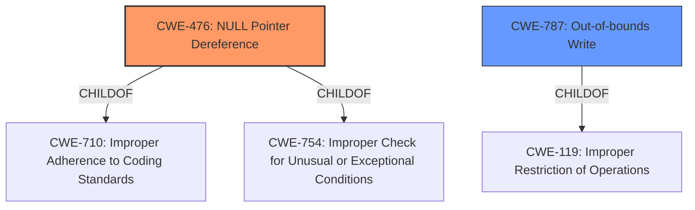

# Raw Analyzer Response for CVE-2020-20219

# Summary
| CWE ID | CWE Name | Confidence | CWE Abstraction Level | CWE Vulnerability Mapping Label | CWE-Vulnerability Mapping Notes |
|---|---|---|---|---|---|
| CWE-476 | NULL Pointer Dereference | 1.0 | Base | Primary | Allowed |
| CWE-787 | Out-of-bounds Write | 0.5 | Base | Secondary | Allowed |

## Evidence and Confidence

*   **Confidence Score:** 0.8
*   **Evidence Strength:** HIGH

## Relationship Analysis
The primary relationship that influenced the CWE selection was the direct identification of a **NULL pointer dereference** in the vulnerability description and CVE details. While **memory corruption** was mentioned, the specific mechanism of the **NULL pointer dereference** led to prioritizing CWE-476. CWE-787 was considered due to the mention of **memory corruption**, but the evidence more strongly supports CWE-476.

## Vulnerability Chain
The vulnerability chain starts with a **NULL pointer dereference** (CWE-476), which directly leads to a Denial of Service (DoS). The initial cause leading to the **NULL pointer** is not detailed in the provided information, so that link is missing from the chain.

## Summary of Analysis
The initial assessment focused on the explicit mention of **memory corruption** and **NULL pointer dereference**. The CVE reference links content summary clearly states that the root cause is a **NULL pointer dereference** in the `/nova/bin/igmp-proxy` process.

The evidence:
- Vulnerability Description Key Phrases:
  -   **weakness:** **memory corruption**
  -   **vector:** NULL pointer dereference
- CVE Reference Links Content Summary:
  -   Root Cause of Vulnerability: The vulnerability is a memory corruption issue in the `/nova/bin/igmp-proxy` process of MikroTik RouterOS. Specifically, it's a NULL pointer dereference.
  -   Weaknesses/Vulnerabilities Present: **NULL pointer dereference**: The `igmpproxy` process attempts to dereference a NULL pointer, which leads to a crash.

The selection of CWE-476 is based on the specific identification of the **NULL pointer dereference** as the direct cause of the crash. While **memory corruption** is mentioned, it is a more general term, and the specific mechanism is the **NULL pointer dereference**. The retriever results also listed CWE-476 as a high-scoring candidate.

CWE-787 (Out-of-bounds Write) was considered because the vulnerability description mentions **memory corruption**. However, the specific mechanism described in the CVE details is a **NULL pointer dereference**, making CWE-476 a more precise and accurate mapping. The confidence in mapping CWE-787 is lower as it's a more general description of what is happening.

Relevant CWE Information:

# Enhanced Context (25 CWEs)

## CWE-476: NULL Pointer Dereference
**Abstraction:** Base
**Similarity Score**: 6450.15 (sparse)
**Description**:
The product dereferences a pointer that it expects to be valid but is NULL.
**Mapping Guidance**:
- Usage: Allowed
- Rationale: This CWE entry is at the Base level of abstraction, which is a preferred level of abstraction for mapping to the root causes of vulnerabilities.

## CWE-787: Out-of-bounds Write
**Abstraction:** Base
**Similarity Score**: 4.33 (graph)
**Description**:
The product writes data past the end, or before the beginning, of the intended buffer.
**Mapping Guidance**:
- Usage: Allowed
- Rationale: This CWE entry is at the Base level of abstraction, which is a preferred level of abstraction for mapping to the root causes of vulnerabilities.