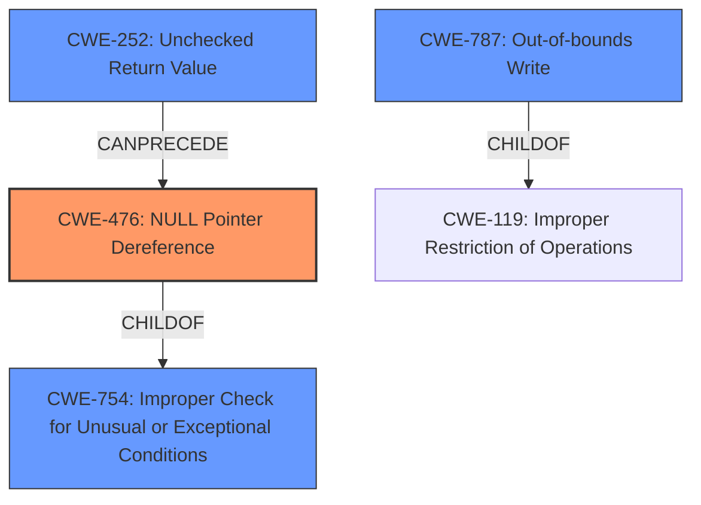

# Enhanced Analysis for CVE-2020-20222

# Summary
| CWE ID | CWE Name | Confidence | CWE Abstraction Level | CWE Vulnerability Mapping Label | CWE-Vulnerability Mapping Notes |
|---|---|---|---|---|---|
| CWE-476 | NULL Pointer Dereference | 0.9 | Base | Primary | Allowed |
| CWE-787 | Out-of-bounds Write | 0.6 | Base | Secondary | Allowed |
| CWE-400 | Uncontrolled Resource Consumption | 0.4 | Class | Secondary | Discouraged |

## Evidence and Confidence

*   **Confidence Score:** 0.7
*   **Evidence Strength:** MEDIUM

## Relationship Analysis
The primary relationship is between CWE-754, Improper Check for Unusual or Exceptional Conditions, and CWE-476, NULL Pointer Dereference, where CWE-476 is a ChildOf CWE-754. Another important relationship to consider is that CWE-476, NULL Pointer Dereference, can follow CWE-252, Unchecked Return Value, where the lack of proper return value checking could lead to a NULL pointer dereference. CWE-787 is a memory corruption issue by writing outside buffer boundaries and is a child of CWE-119.



## Vulnerability Chain
The vulnerability chain starts with the receipt of a crafted network packet. This leads to a **memory corruption** which then results in a **NULL pointer dereference**, ultimately causing a Denial of Service (DoS).

## Summary of Analysis
Based on the information provided, the primary weakness is a **NULL pointer dereference** (CWE-476) leading to a denial-of-service. The vulnerability description explicitly mentions "An authenticated remote attacker can cause a Denial of Service (NULL pointer dereference)". The CVE Reference Links Content Summary also states that "The vulnerability is caused by a memory corruption issue within the `sniffer` process of MikroTik's RouterOS. Specifically, a crafted packet triggers a NULL pointer dereference". The retriever results also list CWE-476 with a high score.

The initial assessment considered CWE-787 (Out-of-bounds Write) because the vulnerability description mentions **memory corruption**. Also, CWE-787 is the primary CWE match according to the similar CVE descriptions. However, the more specific mechanism described is a NULL pointer dereference, making CWE-476 a more precise match as the primary CWE. While memory corruption is present, the root cause directly leading to the denial of service is the NULL pointer dereference. Therefore, CWE-787 is a secondary candidate.

CWE-400 (Uncontrolled Resource Consumption) could be considered since the impact is a denial of service. However, CWE-400 is a very broad category, and the root cause is more specific (NULL pointer dereference), making it a less appropriate primary mapping. It can be considered as a secondary mapping because the NULL pointer dereference leads to a crash of the sniffer process, which could be seen as a form of resource consumption. The usage for CWE-400 is Discouraged.

The selection of CWE-476 is at the optimal level of specificity, as it directly describes the **NULL pointer dereference** that causes the denial of service. The evidence strongly supports this classification, and the relationship analysis helps clarify the context of the vulnerability.

Relevant CWE Information:

# Enhanced Context (25 CWEs)
The following CWEs were identified as potentially relevant to this vulnerability:

## CWE-226: Sensitive Information in Resource Not Removed Before Reuse
**Abstraction Level**: Base
**Similarity Score**: 0.80
**Source**: dense

**Description**:
The product releases a resource such as memory or a file so that it can be made available for reuse, but it does not clear or "zeroize" the information contained in the resource before the product performs a critical state transition or makes the resource available for reuse by other entities.

**Mapping Guidance**:
- Usage: Allowed
- Rationale: This CWE entry is at the Base level of abstraction, which is a preferred level of abstraction for mapping to the root causes of vulnerabilities.


## CWE-404: Improper Resource Shutdown or Release
**Abstraction Level**: Class
**Similarity Score**: 0.80
**Source**: dense

**Description**:
The product does not release or incorrectly releases a resource before it is made available for re-use.

**Mapping Guidance**:
- Usage: Allowed-with-Review
- Rationale: This CWE entry is a Class and might have Base-level children that would be more appropriate


## CWE-664: Improper Control of a Resource Through its Lifetime
**Abstraction Level**: Pillar
**Similarity Score**: 0.79
**Source**: dense

**Description**:
The product does not maintain or incorrectly maintains control over a resource throughout its lifetime of creation, use, and release.

**Mapping Guidance**:
- Usage: Discouraged
- Rationale: This CWE entry is high-level when lower-level children are available.


## CWE-824: Access of Uninitialized Pointer
**Abstraction Level**: Base
**Similarity Score**: 0.77
**Source**: dense

**Description**:
The product accesses or uses a pointer that has not been initialized.

**Mapping Guidance**:
- Usage: Allowed
- Rationale: This CWE entry is at the Base level of abstraction, which is a preferred level of abstraction for mapping to the root causes of vulnerabilities.


## CWE-667: Improper Locking
**Abstraction Level**: Class
**Similarity Score**: 0.77
**Source**: dense

**Description**:
The product does not properly acquire or release a lock on a resource, leading to unexpected resource state changes and behaviors.

**Mapping Guidance**:
- Usage: Allowed-with-Review
- Rationale: This CWE entry is a Class and might have Base-level children that would be more appropriate


## CWE-252: Unchecked Return Value
**Abstraction Level**: Base
**Similarity Score**: 0.77
**Source**: dense

**Description**:
The product does not check the return value from a method or function, which can prevent it from detecting unexpected states and conditions.

**Mapping Guidance**:
- Usage: Allowed
- Rationale: This CWE entry is at the Base level of abstraction, which is a preferred level of abstraction for mapping to the root causes of vulnerabilities.


## CWE-909: Missing Initialization of Resource
**Abstraction Level**: Class
**Similarity Score**: 0.77
**Source**: dense

**Description**:
The product does not initialize a critical resource.

**Mapping Guidance**:
- Usage: Allowed-with-Review
- Rationale: This CWE entry is a Class and might have Base-level children that would be more appropriate


## CWE-665: Improper Initialization
**Abstraction Level**: Class
**Similarity Score**: 0.77
**Source**: dense

**Description**:
The product does not initialize or incorrectly initializes a resource, which might leave the resource in an unexpected state when it is accessed or used.

**Mapping Guidance**:
- Usage: Discouraged
- Rationale: This CWE entry is a level-1 Class (i.e., a child of a Pillar). It might have lower-level children that would be more appropriate


## CWE-908: Use of Uninitialized Resource
**Abstraction Level**: Base
**Similarity Score**: 0.77
**Source**: dense

**Description**:
The product uses or accesses a resource that has not been initialized.

**Mapping Guidance**:
- Usage: Allowed
- Rationale: This CWE entry is at the Base level of abstraction, which is a preferred level of abstraction for mapping to the root causes of vulnerabilities.


## CWE-754: Improper Check for Unusual or Exceptional Conditions
**Abstraction Level**: Class
**Similarity Score**: 0.76
**Source**: dense

**Description**:
The product does not check or incorrectly checks for unusual or exceptional conditions that are not expected to occur frequently during day to day operation of the product.

**Mapping Guidance**:
- Usage: Allowed-with-Review
- Rationale: This CWE entry is a Class and might have Base-level children that would be more appropriate


## CWE-252: Unchecked Return Value
**Abstraction Level**: Base
**Similarity Score**: 6642.00
**Source**: sparse

**


## CWE Relationship Analysis

Current CWEs represent these abstraction levels: .


### Vulnerability Chain Analysis

**Chain starting from CWE-476:**
- 476 (NULL Pointer Dereference) - ROOT


**Chain starting from CWE-787:**
- 787 (Out-of-bounds Write) - ROOT


### CWE Relationship Diagram

```mermaid
graph TD
    classDef primary fill:#f96,stroke:#333,stroke-width:2px
    classDef secondary fill:#69f,stroke:#333
    classDef tertiary fill:#9e9,stroke:#333
```