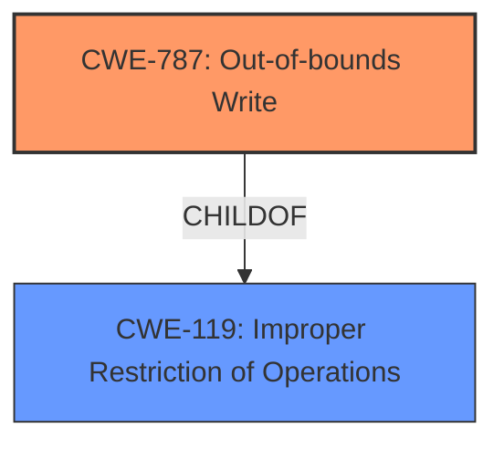

# Analysis for CVE-2020-20237

# Summary
| CWE ID  | CWE Name                                                      | Confidence | CWE Abstraction Level | CWE Vulnerability Mapping Label | CWE-Vulnerability Mapping Notes |
| :-------- | :------------------------------------------------------------ | :--------- | :---------------------- | :------------------------------ | :------------------------------ |
| CWE-787 | Out-of-bounds Write                                           | 1.0        | Base                    | Primary                         | Allowed                       |

## Evidence and Confidence

*   **Confidence Score:** 1.0
*   **Evidence Strength:** HIGH

## Relationship Analysis
The primary weakness, CWE-787 [CWE-787: Out-of-bounds Write], is a base-level CWE that accurately describes the **improper memory access** leading to **memory corruption**. It is a child of the class CWE-119 [CWE-119: Improper Restriction of Operations within the Bounds of a Memory Buffer], but is preferred because it offers greater specificity. The other considered CWEs, such as CWE-476 [CWE-476: NULL Pointer Dereference] and CWE-400 [CWE-400: Uncontrolled Resource Consumption], do not accurately reflect the root cause of the vulnerability.

## Vulnerability Chain
The vulnerability chain starts with **improper memory access**, which leads to **memory corruption**, ultimately causing a Denial of Service.

## Summary of Analysis
The initial assessment identified CWE-787 [CWE-787: Out-of-bounds Write] as the primary candidate due to the **improper memory access** and **memory corruption** mentioned in the vulnerability description and the CVE reference summary. The retriever results also strongly suggested CWE-787 [CWE-787: Out-of-bounds Write].

The evidence for this decision is:
*   Vulnerability Description Key Phrases:
    *   **rootcause:** **improper memory access**
    *   **weakness:** **memory corruption**
*   CVE Reference Links Content Summary:
    *   "It is caused by a memory corruption issue triggered when processing a crafted network packet."
    *   "A memory corruption vulnerability exists in the `sniffer` process. Specifically, the vulnerability leads to invalid memory access, causing the process to crash."

This evidence directly supports the selection of CWE-787 [CWE-787: Out-of-bounds Write] as it involves writing data past the intended buffer, leading to memory corruption.

Other CWEs were considered but ultimately deemed less suitable:

*   CWE-476 [CWE-476: NULL Pointer Dereference]: While it was among the top CWEs for similar descriptions, the vulnerability description does not indicate a NULL pointer dereference.
*   CWE-400 [CWE-400: Uncontrolled Resource Consumption]: The vulnerability leads to a denial of service, but the root cause is not uncontrolled resource consumption but rather memory corruption.

CWE-787 [CWE-787: Out-of-bounds Write] is at the optimal level of specificity as it is a Base-level CWE that directly addresses the memory corruption issue caused by improper memory access.

Relevant CWE Information:

# Enhanced Context (25 CWEs)

## CWE-131: Incorrect Calculation of Buffer Size
**Abstraction Level**: Base
**Similarity Score**: 0.78
**Source**: dense
## CWE-789: Memory Allocation with Excessive Size Value
**Abstraction Level**: Variant
**Similarity Score**: 0.78
**Source**: dense
## CWE-404: Improper Resource Shutdown or Release
**Abstraction Level**: Class
**Similarity Score**: 0.78
**Source**: dense
## CWE-805: Buffer Access with Incorrect Length Value
**Abstraction Level**: Base
**Similarity Score**: 0.78
**Source**: dense
## CWE-226: Sensitive Information in Resource Not Removed Before Reuse
**Abstraction Level**: Base
**Similarity Score**: 0.78
**Source**: dense
## CWE-191: Integer Underflow (Wrap or Wraparound)
**Abstraction Level**: Base
**Similarity Score**: 0.77
**Source**: dense
## CWE-119: Improper Restriction of Operations within the Bounds of a Memory Buffer
**Abstraction Level**: Class
**Similarity Score**: 0.77
**Source**: dense
## CWE-1325: Improperly Controlled Sequential Memory Allocation
**Abstraction Level**: Base
**Similarity Score**: 0.77
**Source**: dense
## CWE-126: Buffer Over-read
**Abstraction Level**: Variant
**Similarity Score**: 0.77
**Source**: dense
## CWE-125: Out-of-bounds Read
**Abstraction Level**: Base
**Similarity Score**: 0.77
**Source**: dense
## CWE-190: Integer Overflow or Wraparound
**Abstraction Level**: Base
**Similarity Score**: 6028.27
**Source**: sparse
## CWE-1284: Improper Validation of Specified Quantity in Input
**Abstraction Level**: Base
**Similarity Score**: 5976.31
**Source**: sparse
## CWE-125: Out-of-bounds Read
**Abstraction Level**: Base
**Similarity Score**: 5948.94
**Source**: sparse
## CWE-476: NULL Pointer Dereference
**Abstraction Level**: Base
**Similarity Score**: 5896.61
**Source**: sparse
## CWE-119: Improper Restriction of Operations within the Bounds of a Memory Buffer
**Abstraction Level**: Class
**Similarity Score**: 5894.70
**Source**: sparse
## CWE-787: Out-of-bounds Write
**Abstraction Level**: base
**Similarity Score**: 4.33
**Source**: graph
## CWE-825: Expired Pointer Dereference
**Abstraction Level**: base
**Similarity Score**: 4.33
**Source**: graph
## CWE-770: Allocation of Resources Without Limits or Throttling
**Abstraction Level**: base
**Similarity Score**: 4.33
**Source**: graph
## CWE-1284: Improper Validation of Specified Quantity in Input
**Abstraction Level**: base
**Similarity Score**: 4.33
**Source**: graph
## CWE-476: NULL Pointer Dereference
**Abstraction Level**: base
**Similarity Score**: 4.33
**Source**: graph
## CWE-410: Insufficient Resource Pool
**Abstraction Level**: base
**Similarity Score**: 4.33
**Source**: graph
## CWE-170: Improper Null Termination
**Abstraction Level**: base
**Similarity Score**: 3.89
**Source**: graph
## CWE-195: Signed to Unsigned Conversion Error
**Abstraction Level**: variant
**Similarity Score**: 3.88
**Source**: graph
## CWE-617: Reachable Assertion
**Abstraction Level**: base
**Similarity Score**: 3.65
**Source**: graph
## CWE-681: Incorrect Conversion between Numeric Types
**Abstraction Level**: base
**Similarity Score**: 3.30
**Source**: graph