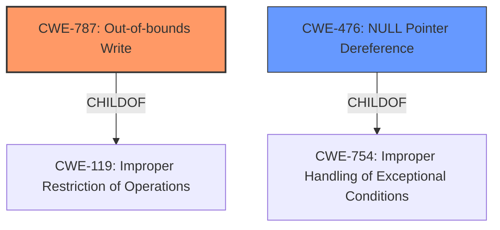

# Enhanced Analysis for CVE-2020-20246

# Summary
| CWE ID  | CWE Name                       | Confidence | CWE Abstraction Level | CWE Vulnerability Mapping Label | CWE-Vulnerability Mapping Notes |
| :------- | :----------------------------- | :--------- | :-------------------- | :------------------------------ | :----------------------------- |
| CWE-787  | Out-of-bounds Write            | 0.85       | Base                  | Allowed                       | Primary CWE                   |
| CWE-476  | NULL Pointer Dereference       | 0.7        | Base                  | Allowed                       | Secondary Candidate             |

## Evidence and Confidence

*   **Confidence Score:** 0.8
*   **Evidence Strength:** MEDIUM

## Relationship Analysis
The primary weakness identified is CWE-787, Out-of-bounds Write, which is a base-level CWE and a child of CWE-119, Improper Restriction of Operations within the Bounds of a Memory Buffer. The vulnerability description mentions "improper memory access", which aligns with the broad scope of CWE-119, but the reference link content summary specifies "memory corruption" which is more specific to CWE-787.

CWE-476, NULL Pointer Dereference, is also considered due to its mention in the CVE Reference Links Content Summary section, even though it is not explicitly mentioned in the vulnerability description. Both CWE-787 and CWE-476 are at the Base level, providing specific insights into the nature of the memory corruption.



## Vulnerability Chain
The vulnerability chain involves a memory corruption vulnerability in the mactel process, leading to **improper memory access**. This can manifest as an out-of-bounds write (CWE-787) or a NULL pointer dereference (CWE-476), both resulting in a denial of service. The root cause is the **improper memory access**, and the impact is the denial of service.

## Summary of Analysis
Initially, the vulnerability description pointed towards a general memory access issue, however the "CVE Reference Links Content Summary" section indicated "memory corruption vulnerability" and "NULL pointer dereference". The **improper memory access** phrase is associated with CWE-787 (Out-of-bounds Write), which aligns well with the provided information. The "CVE Reference Links Content Summary" section also mentions "NULL pointer dereference" as a weakness.

The selection of CWE-787 is based on the "Vulnerability Description" and "Vulnerability Description Key Phrases" where the root cause is "**improper memory access**" and the impact is a Denial of Service. The summary in "CVE Reference Links Content Summary" states the root cause is "The mactel process suffers from a memory corruption vulnerability." and a weakness is "NULL pointer dereference". CWE-787 addresses the **improper memory access** that results in memory corruption by writing outside buffer boundaries. CWE-476 is selected as a secondary CWE due to the "NULL pointer dereference" finding in the summary.

The graph relationships helped confirm that CWE-787 is a more specific instance of CWE-119, while CWE-476 represents a different, but relevant, issue. Both are at the Base level of abstraction, offering more detail than the Class-level CWE-119.

The evidence and relationships justify the selection of CWE-787 as the primary CWE and CWE-476 as a secondary weakness contributing to the vulnerability.
Relevant CWE Information:

# Enhanced Context (25 CWEs)
The following CWEs were identified as potentially relevant to this vulnerability:

## CWE-1289: Improper Validation of Unsafe Equivalence in Input
**Abstraction Level**: Base
**Similarity Score**: 0.81
**Source**: dense

**Description**:
The product receives an input value that is used as a resource identifier or other type of reference, but it does not validate or incorrectly validates that the input is equivalent to a potentially-unsafe value.

**Mapping Guidance**:
- Usage: Allowed
- Rationale: This CWE entry is at the Base level of abstraction, which is a preferred level of abstraction for mapping to the root causes of vulnerabilities.

**Why Not Used:** This CWE is not applicable as the vulnerability doesn't directly relate to validating the equivalence of inputs.

## CWE-1288: Improper Validation of Consistency within Input
**Abstraction Level**: Base
**Similarity Score**: 0.77
**Source**: dense

**Description**:
The product receives a complex input with multiple elements or fields that must be consistent with each other, but it does not validate or incorrectly validates that the input is actually consistent.

**Mapping Guidance**:
- Usage: Allowed
- Rationale: This CWE entry is at the Base level of abstraction, which is a preferred level of abstraction for mapping to the root causes of vulnerabilities.

**Why Not Used:** This CWE is not applicable as the vulnerability is not related to input consistency validation.

## CWE-606: Unchecked Input for Loop Condition
**Abstraction Level**: Base
**Similarity Score**: 0.76
**Source**: dense

**Description**:
The product does not properly check inputs that are used for loop conditions, potentially leading to a denial of service or other consequences because of excessive looping.

**Mapping Guidance**:
- Usage: Allowed
- Rationale: This CWE entry is at the Base level of abstraction, which is a preferred level of abstraction for mapping to the root causes of vulnerabilities.

**Why Not Used:** This CWE is not applicable because the vulnerability is not related to unchecked loop conditions.

## CWE-807: Reliance on Untrusted Inputs in a Security Decision
**Abstraction Level**: Base
**Similarity Score**: 0.76
**Source**: dense

**Description**:
The product uses a protection mechanism that relies on the existence or values of an input, but the input can be modified by an untrusted actor in a way that bypasses the protection mechanism.

**Mapping Guidance**:
- Usage: Allowed
- Rationale: This CWE entry is at the Base level of abstraction, which is a preferred level of abstraction for mapping to the root causes of vulnerabilities.

**Why Not Used:** This CWE is not applicable as the vulnerability is not directly caused by reliance on untrusted inputs for security decisions.

## CWE-183: Permissive List of Allowed Inputs
**Abstraction Level**: Base
**Similarity Score**: 0.76
**Source**: dense

**Description**:
The product implements a protection mechanism that relies on a list of inputs (or properties of inputs) that are explicitly allowed by policy because the inputs are assumed to be safe, but the list is too permissive - that is, it allows an input that is unsafe, leading to resultant weaknesses.

**Mapping Guidance**:
- Usage: Allowed
- Rationale: This CWE entry is at the Base level of abstraction, which is a preferred level of abstraction for mapping to the root causes of vulnerabilities.

**Why Not Used:** This CWE is not applicable as the vulnerability isn't related to an overly permissive list of allowed inputs.

## CWE-404: Improper Resource Shutdown or Release
**Abstraction Level**: Class
**Similarity Score**: 0.76
**Source**: dense

**Description**:
The product does not release or incorrectly releases a resource before it is made available for re-use.

**Mapping Guidance**:
- Usage: Allowed-with-Review
- Rationale: This CWE entry is a Class and might have Base-level children that would be more appropriate

**Why Not Used:** While resource handling might be indirectly involved, the core issue is the **improper memory access**, not necessarily the release of resources.

## CWE-184: Incomplete List of Disallowed Inputs
**Abstraction Level**: Base
**Similarity Score**: 0.76
**Source**: dense

**Description**:
The product implements a protection mechanism that relies on a list of inputs (or properties of inputs) that are not allowed by policy or otherwise require other action to neutralize before additional processing takes place, but the list is incomplete.

**Mapping Guidance**:
- Usage: Allowed
- Rationale: This CWE entry is at the Base level of abstraction, which is a preferred level of abstraction for mapping to the root causes of vulnerabilities.

**Why Not Used:** This CWE is not applicable as the vulnerability is not directly related to an incomplete list of disallowed inputs.

## CWE-226: Sensitive Information in Resource Not Removed Before Reuse
**Abstraction Level**: Base
**Similarity Score**: 0.76
**Source**: dense

**Description**:
The product releases a resource such as memory or a file so that it can be made available for reuse, but it does not clear or "zeroize" the information contained in the resource before the product performs a critical state transition or makes the resource


## CWE Relationship Analysis

Current CWEs represent these abstraction levels: .


### Vulnerability Chain Analysis

**Chain starting from CWE-476:**
- 476 (NULL Pointer Dereference) - ROOT


**Chain starting from CWE-787:**
- 787 (Out-of-bounds Write) - ROOT


### CWE Relationship Diagram

```mermaid
graph TD
    classDef primary fill:#f96,stroke:#333,stroke-width:2px
    classDef secondary fill:#69f,stroke:#333
    classDef tertiary fill:#9e9,stroke:#333
```