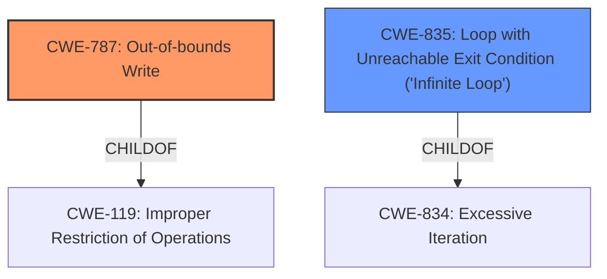

# Analysis Report for CVE-2020-20247

# Vulnerability Analysis Report: CVE-2020-20247

## Description


## Analysis (with Relationship Data)

# Summary
| CWE ID | CWE Name | Confidence | CWE Abstraction Level | CWE Vulnerability Mapping Label | CWE-Vulnerability Mapping Notes |
|---|---|---|---|---|---|
| CWE-787 | Out-of-bounds Write | 1 | Base | Allowed | Primary CWE |
| CWE-835 | Loop with Unreachable Exit Condition ('Infinite Loop') | 0.6 | Base | Allowed | Secondary Candidate |

## Evidence and Confidence

*   **Confidence Score:** 0.8
*   **Evidence Strength:** HIGH

## Relationship Analysis
The primary CWE is CWE-787, which is a base-level CWE and accurately describes the memory corruption issue. CWE-835 is also at the base level. While the description mentions a loop counter variable, indicating a potential infinite loop, memory corruption is the more prominent and direct issue. CWE-787 can CANFOLLOW other memory corruption issues and CWE-835 ChildOf CWE-834.



## Vulnerability Chain
The vulnerability chain starts with a **memory corruption** due to an issue in the loop counter variable which leads to a Denial of Service.

## Summary of Analysis
The initial assessment identified CWE-787 as the primary candidate due to the presence of **memory corruption**. The description "An authenticated remote attacker can cause a Denial of Service due via the loop counter variable" suggests the root cause is the loop counter variable, however, the key weakness is the memory corruption.

The retriever results also list CWE-787 as the top candidate.

The evidence from the vulnerability description key phrases states "**weakness:** **memory corruption**".

Based on this evidence, CWE-787 is the optimal choice.

Relevant CWE Information:

# Enhanced Context (25 CWEs)

## CWE-787: Out-of-bounds Write
**Abstraction:** Base
**Status:** Draft

### Description
The product writes data past the end, or before the beginning, of the intended buffer.

### Extended Description
Not provided

### Alternative Terms
Memory Corruption: Often used to describe the consequences of writing to memory outside the bounds of a buffer, or to memory that is otherwise invalid.

### Relationships
ChildOf -> CWE-119

### Mapping Guidance
**Usage:** Allowed

## CWE-835: Loop with Unreachable Exit Condition ('Infinite Loop')
**Abstraction:** Base
**Status:** Incomplete

### Description
The product contains an iteration or loop with an exit condition that cannot be reached, i.e., an infinite loop.

### Extended Description
Not provided

### Alternative Terms
None

### Relationships
ChildOf -> CWE-834

### Mapping Guidance
**Usage:** Allowed

CWE-787 is the primary CWE because the vulnerability is about **memory corruption** in the /nova/bin/traceroute process. The vulnerability description mentions "An authenticated remote attacker can cause a Denial of Service due via the loop counter variable." While this suggests a potential infinite loop scenario, the core issue is the **memory corruption**, aligning directly with the description of CWE-787. The security implication is a denial of service. CWE-787 is a base-level CWE.

CWE-835 was considered as a secondary candidate because the vulnerability is caused by the loop counter variable, but the primary issue is memory corruption.

CWE-476, CWE-674, CWE-908, CWE-122, CWE-401, CWE-825, CWE-400, CWE-457 were not selected as they did not have sufficient evidence.


## CWE Relationship Analysis

Current CWEs represent these abstraction levels: .


### Vulnerability Chain Analysis

**Chain starting from CWE-476:**
- 476 (NULL Pointer Dereference) - ROOT


**Chain starting from CWE-787:**
- 787 (Out-of-bounds Write) - ROOT


### CWE Relationship Diagram

```mermaid
graph TD
    classDef primary fill:#f96,stroke:#333,stroke-width:2px
    classDef secondary fill:#69f,stroke:#333
    classDef tertiary fill:#9e9,stroke:#333
```


*Report generated on 2025-04-02 06:55:53*
