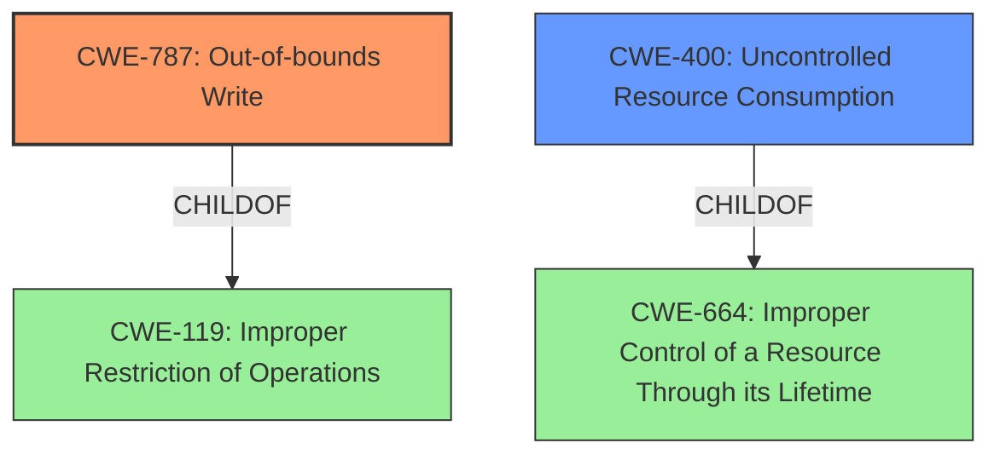

# Raw Analyzer Response for CVE-2020-20249

# Summary
| CWE ID  | CWE Name                         | Confidence | CWE Abstraction Level | CWE Vulnerability Mapping Label | CWE-Vulnerability Mapping Notes |
| :-------- | :--------------------------------- | :--------- | :-------------------- | :------------------------------ | :------------------------------ |
| CWE-787 | Out-of-bounds Write              | 1.0        | Base                  | Allowed                         | Primary CWE                   |
| CWE-400 | Uncontrolled Resource Consumption | 0.4        | Class                 | Discouraged                     | Secondary Candidate             |

## Evidence and Confidence

*   **Confidence Score:** 0.8
*   **Evidence Strength:** HIGH

## Relationship Analysis
The primary relationship influencing the CWE selection is the ChildOf relationship between CWE-787 and CWE-119. CWE-787 is a Base level CWE and a child of the Class level CWE-119 (Improper Restriction of Operations within the Bounds of a Memory Buffer). Since the description indicates a **memory corruption** issue, specifically due to a crafted packet leading to a denial of service, and the retriever results strongly suggest CWE-787, it is the more specific and appropriate choice over its parent, CWE-119, even though CWE-119 has a high similarity score.

## Vulnerability Chain
The vulnerability chain starts with a **crafted packet** sent by an **authenticated remote attacker**. This leads to **memory corruption** in the `resolver` process, ultimately causing a **Denial of Service**. The chain is:

1.  Crafted Network Packet
2.  **Memory Corruption** (CWE-787)
3.  Denial of Service (Potential CWE-400 impact)

## Summary of Analysis
The initial analysis identified **memory corruption** as the core issue, leading to a denial-of-service. The CVE description mentions that sending a crafted packet can cause this **memory corruption** in the `resolver` process. The retriever results pointed strongly to CWE-787 (Out-of-bounds Write) as the best match.

The evidence from the "CVE Reference Links Content Summary" section clearly states: "The `resolver` process has a **memory corruption** vulnerability" and "Invalid memory access due to a crafted network packet." This confirms that CWE-787 is a highly relevant classification.

CWE-400 (Uncontrolled Resource Consumption) was considered as a secondary candidate due to the resulting Denial of Service. However, CWE-400 is a Class-level CWE and is often misused. The more specific root cause is the **memory corruption** itself. Therefore, CWE-787 is the more appropriate primary classification, focusing on the **root cause** of the vulnerability.

The final decision is based on the available evidence and the principle of selecting the most specific CWE that accurately represents the **root cause**. CWE-787 is at the optimal level of specificity (Base) and is directly supported by the vulnerability description and the retriever results.

Relevant CWE Information:

# Enhanced Context (25 CWEs)

## CWE-131: Incorrect Calculation of Buffer Size
**Abstraction Level**: Base
**Similarity Score**: 0.78
**Source**: dense

**Description**:
The product does not correctly calculate the size to be used when allocating a buffer, which could lead to a buffer overflow.
*Not Selected*: Not enough information to determine if an incorrect buffer size calculation is the root cause.

## CWE-226: Sensitive Information in Resource Not Removed Before Reuse
**Abstraction Level**: Base
**Similarity Score**: 0.77
**Source**: dense

**Description**:
The product releases a resource such as memory or a file so that it can be made available for reuse, but it does not clear or "zeroize" the information contained in the resource before the product performs a critical state transition or makes the resource available for reuse by other entities.
*Not Selected*: Not enough information to determine if sensitive information is related to this vulnerability.

## CWE-125: Out-of-bounds Read
**Abstraction Level**: Base
**Similarity Score**: 0.77
**Source**: dense

**Description**:
The product reads data past the end, or before the beginning, of the intended buffer.
*Not Selected*: The description states "memory corruption" and the retriever listed CWE-787.

## CWE-404: Improper Resource Shutdown or Release
**Abstraction Level**: Class
**Similarity Score**: 0.76
**Source**: dense

**Description**:
The product does not release or incorrectly releases a resource before it is made available for re-use.
*Not Selected*: The description states "memory corruption" and the retriever listed CWE-787.

## CWE-129: Improper Validation of Array Index
**Abstraction Level**: Variant
**Similarity Score**: 0.76
**Source**: dense

**Description**:
The product uses untrusted input when calculating or using an array index, but the product does not validate or incorrectly validates the index to ensure the index references a valid position within the array.
*Not Selected*: Not enough information to determine if this is related to an array index.

## CWE-191: Integer Underflow (Wrap or Wraparound)
**Abstraction Level**: Base
**Similarity Score**: 0.76
**Source**: dense

**Description**:
The product subtracts one value from another, such that the result is less than the minimum allowable integer value, which produces a value that is not equal to the correct result.
*Not Selected*: Not enough information to determine if this is an integer underflow.

## CWE-789: Memory Allocation with Excessive Size Value
**Abstraction Level**: Variant
**Similarity Score**: 0.76
**Source**: dense

**Description**:
The product allocates memory based on an untrusted, large size value, but it does not ensure that the size is within expected limits, allowing arbitrary amounts of memory to be allocated.
*Not Selected*: Not enough information to determine if this is related to memory allocation size.

## CWE-130: Improper Handling of Length Parameter Inconsistency
**Abstraction Level**: Base
**Similarity Score**: 0.76
**Source**: dense

**Description**:
The product parses a formatted message or structure, but it does not handle or incorrectly handles a length field that is inconsistent with the actual length of the associated data.
*Not Selected*: Not enough information to determine if this is related to the length parameter.

## CWE-134: Use of Externally-Controlled Format String
**Abstraction Level**: Base
**Similarity Score**: 0.76
**Source**: dense

**Description**:
The product uses a function that accepts a format string as an argument, but the format string originates from an external source.
*Not Selected*: Not enough information to determine if this is related to a format string.

## CWE-119: Improper Restriction of Operations within the Bounds of a Memory Buffer
**Abstraction Level**: Class
**Similarity Score**: 0.76
**Source**: dense

**Description**:
The product performs operations on a memory buffer, but it reads from or writes to a memory location outside the buffer's intended boundary. This may result in read or write operations on unexpected memory locations that could be linked to other variables, data structures, or internal program data.
*Not Selected*: CWE-787 is a better fit.

## CWE-190: Integer Overflow or Wraparound
**Abstraction Level**: Base
**Similarity Score**: 6346.07
**Source**: sparse

**Description**:
The product performs a calculation that can produce an integer overflow or wraparound when the logic assumes that the resulting value will always be larger than the original value. This occurs when an integer value is incremented to a value that is too large to store in the associated representation. When this occurs, the value may become a very small or negative number.
*Not Selected*: Not enough information to determine if this is an integer overflow.

## CWE-1284: Improper Validation of Specified Quantity in Input
**Abstraction Level**: Base
**Similarity Score**: 6340.20
**Source**: sparse

**Description**:
The product receives input that is expected to specify a quantity (such as size or length), but it does not validate or incorrectly validates that the quantity has the required properties.
*Not Selected*: Not enough information to determine if this is an improper validation of quantity.

## CWE-125