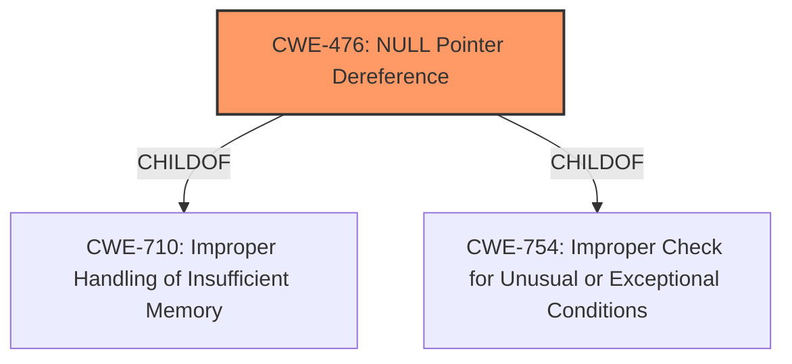

# Analysis for CVE-2020-20252

# Summary
| CWE ID | CWE Name | Confidence | CWE Abstraction Level | CWE Vulnerability Mapping Label | CWE-Vulnerability Mapping Notes |
|---|---|---|---|---|---|
| CWE-476 | NULL Pointer Dereference | 1.0 | Base | Primary | Allowed |

## Evidence and Confidence

*   **Confidence Score:** 1.0
*   **Evidence Strength:** HIGH

## Relationship Analysis
The primary relationship that influenced the decision was the direct match of the vulnerability description to **CWE-476 [NULL Pointer Dereference]**. The vulnerability description explicitly states a **NULL pointer dereference** occurs.

## Vulnerability Chain
The chain of events is: **Memory corruption** leads to **NULL pointer dereference**, causing a **Denial of Service**. The **NULL pointer dereference** is the direct cause of the denial of service.

## Summary of Analysis
The analysis is based on the provided evidence from the vulnerability description and the CVE reference links.

The vulnerability description states: "Mikrotik RouterOs before stable version 6.47 suffers from a memory corruption vulnerability in the /nova/bin/lcdstat process. An authenticated remote attacker can cause a Denial of Service (**NULL pointer dereference**)."

The CVE Reference Links Content Summary states:
"The `lcdstat` process in MikroTik RouterOS has a memory corruption vulnerability. Specifically, a **NULL pointer dereference** occurs within the `lcdstat` process when handling a specially crafted packet."

The retriever results also list **CWE-476 [NULL Pointer Dereference]** as the top candidate.

The selection of **CWE-476 [NULL Pointer Dereference]** is at the optimal level of specificity (Base) because it directly describes the root cause of the denial-of-service vulnerability. Other CWEs such as **CWE-665 [Improper Initialization]**, **CWE-824 [Access of Uninitialized Pointer]**, and **CWE-787 [Out-of-bounds Write]** were considered, but they are either too general or do not precisely match the specific weakness described in the vulnerability.

Relevant CWE Information:

# Enhanced Context (25 CWEs)

## CWE-476: NULL Pointer Dereference
**Abstraction:** Base
**Status:** Stable

### Description
The product dereferences a pointer that it expects to be valid but is NULL.

## CWE-787: Out-of-bounds Write
**Abstraction:** Base
**Status:** Draft

### Description
The product writes data past the end, or before the beginning, of the intended buffer. This was considered, but the primary issue is the NULL pointer dereference.

## CWE-822: Untrusted Pointer Dereference
**Abstraction:** Base
**Status:** Incomplete

### Description
The product obtains a value from an untrusted source, converts this value to a pointer, and dereferences the resulting pointer. This CWE was not selected because the vulnerability description does not indicate the pointer came from an untrusted source.

## CWE-252: Unchecked Return Value
**Abstraction:** Base
**Status:** Draft

### Description
The product does not check the return value from a method or function, which can prevent it from detecting unexpected states and conditions. This CWE was not selected as there's no mention of an unchecked return value in the description.

## CWE-665: Improper Initialization
**Abstraction:** Class
**Status:** Draft

### Description
The product does not initialize or incorrectly initializes a resource, which might leave the resource in an unexpected state when it is accessed or used. While a memory corruption issue could stem from improper initialization, the direct cause is the **NULL pointer dereference**.

## CWE-401: Missing Release of Memory after Effective Lifetime
**Abstraction:** Variant
**Status:** Draft

### Description
The product does not sufficiently track and release allocated memory after it has been used, which slowly consumes remaining memory. This is a memory leak, and the description does not indicate a memory leak condition.

## CWE-825: Expired Pointer Dereference
**Abstraction:** Base
**Status:** Incomplete

### Description
The product dereferences a pointer that contains a location for memory that was previously valid, but is no longer valid. The primary issue is a NULL pointer, not an expired pointer.

## CWE-908: Use of Uninitialized Resource
**Abstraction:** Base
**Status:** Incomplete

### Description
The product uses or accesses a resource that has not been initialized. While related to initialization, the root cause is the **NULL pointer dereference**.

## CWE-824: Access of Uninitialized Pointer
**Abstraction:** Base
**Status:** Incomplete

### Description
The product accesses or uses a pointer that has not been initialized. The root cause is the **NULL pointer dereference**.

## CWE-456: Missing Initialization of a Variable
**Abstraction:** Variant
**Status:** Draft

### Description
The product does not initialize critical variables, which causes the execution environment to use unexpected values. While missing initialization could lead to a **NULL pointer**, the description highlights the direct **NULL pointer dereference**.