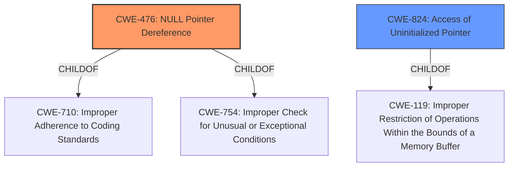

# Analysis for CVE-2020-20254

# Summary
| CWE ID  | CWE Name                       | Confidence | CWE Abstraction Level | CWE Vulnerability Mapping Label | CWE-Vulnerability Mapping Notes |
|---------|--------------------------------|------------|-----------------------|---------------------------------|---------------------------------|
| CWE-476 | NULL Pointer Dereference       | 0.9        | Base                  | Primary                         | Allowed                         |
| CWE-824 | Access of Uninitialized Pointer | 0.6        | Base                  | Secondary                       | Allowed                         |

## Evidence and Confidence

*   **Confidence Score:** 0.9
*   **Evidence Strength:** HIGH

## Relationship Analysis
The primary CWE is CWE-476 **NULL Pointer Dereference**, which is a base-level CWE. CWE-476 is a child of CWE-710 and CWE-754. CWE-824 **Access of Uninitialized Pointer** is also a base-level CWE and a child of CWE-119. CWE-824 can precede CWE-787 **Out-of-bounds Write** and CWE-125 **Out-of-bounds Read**.

## Vulnerability Chain
The vulnerability chain starts with a memory corruption issue which leads to a **NULL pointer dereference**, ultimately causing a denial of service. An uninitialized pointer may be accessed, which could then lead to a **NULL pointer dereference**.

## Summary of Analysis
The vulnerability description explicitly states "**NULL pointer dereference**". The CVE reference links content summary also highlights the "**NULL pointer dereference**" as a weakness. The primary CWE match from similar CVE descriptions is CWE-787 **Out-of-bounds Write**, but the description aligns more closely with CWE-476 **NULL Pointer Dereference**.

CWE-476 **NULL Pointer Dereference** is selected as the primary CWE because the vulnerability description explicitly mentions this weakness. The retriever results also list CWE-476 as the top combined result. The confidence in this mapping is high (0.9) due to the explicit mention of "**NULL pointer dereference**" in the vulnerability description.

CWE-824 **Access of Uninitialized Pointer** is considered as a secondary CWE because it could potentially precede the **NULL pointer dereference** if the pointer was uninitialized before being dereferenced. The confidence in this mapping is moderate (0.6) because it is a possible, but not explicitly stated, condition.

CWE-787 **Out-of-bounds Write** was considered due to its presence in similar CVE descriptions and its relation to memory corruption. However, since the explicit weakness is a **NULL pointer dereference** and not an out-of-bounds write, it was not selected.
Relevant CWE Information:

# Enhanced Context (25 CWEs)
The following CWEs were identified as potentially relevant to this vulnerability:

## CWE-457: Use of Uninitialized Variable
**Abstraction Level**: Variant
**Similarity Score**: 0.81
**Source**: dense

**Description**:
The code uses a variable that has not been initialized, leading to unpredictable or unintended results.

**Mapping Guidance**:
- Usage: Allowed
- Rationale: This CWE entry is at the Variant level of abstraction, which is a preferred level of abstraction for mapping to the root causes of vulnerabilities.

## CWE-824: Access of Uninitialized Pointer
**Abstraction Level**: Base
**Similarity Score**: 0.81
**Source**: dense

**Description**:
The product accesses or uses a pointer that has not been initialized.

**Mapping Guidance**:
- Usage: Allowed
- Rationale: This CWE entry is at the Base level of abstraction, which is a preferred level of abstraction for mapping to the root causes of vulnerabilities.

## CWE-665: Improper Initialization
**Abstraction Level**: Class
**Similarity Score**: 0.80
**Source**: dense

**Description**:
The product does not initialize or incorrectly initializes a resource, which might leave the resource in an unexpected state when it is accessed or used.

**Mapping Guidance**:
- Usage: Discouraged
- Rationale: This CWE entry is a level-1 Class (i.e., a child of a Pillar). It might have lower-level children that would be more appropriate

## CWE-822: Untrusted Pointer Dereference
**Abstraction Level**: Base
**Similarity Score**: 0.80
**Source**: dense

**Description**:
The product obtains a value from an untrusted source, converts this value to a pointer, and dereferences the resulting pointer.

**Mapping Guidance**:
- Usage: Allowed
- Rationale: This CWE entry is at the Base level of abstraction, which is a preferred level of abstraction for mapping to the root causes of vulnerabilities.

## CWE-476: NULL Pointer Dereference
**Abstraction Level**: Base
**Similarity Score**: 0.79
**Source**: dense

**Description**:
The product dereferences a pointer that it expects to be valid but is NULL.

**Mapping Guidance**:
- Usage: Allowed
- Rationale: This CWE entry is at the Base level of abstraction, which is a preferred level of abstraction for mapping to the root causes of vulnerabilities.

## CWE-909: Missing Initialization of Resource
**Abstraction Level**: Class
**Similarity Score**: 0.79
**Source**: dense

**Description**:
The product does not initialize a critical resource.

**Mapping Guidance**:
- Usage: Allowed-with-Review
- Rationale: This CWE entry is a Class and might have Base-level children that would be more appropriate

## CWE-226: Sensitive Information in Resource Not Removed Before Reuse
**Abstraction Level**: Base
**Similarity Score**: 0.79
**Source**: dense

**Description**:
The product releases a resource such as memory or a file so that it can be made available for reuse, but it does not clear or "zeroize" the information contained in the resource before the product performs a critical state transition or makes the resource available for reuse by other entities.

**Mapping Guidance**:
- Usage: Allowed
- Rationale: This CWE entry is at the Base level of abstraction, which is a preferred level of abstraction for mapping to the root causes of vulnerabilities.

## CWE-908: Use of Uninitialized Resource
**Abstraction Level**: Base
**Similarity Score**: 0.78
**Source**: dense

**Description**:
The product uses or accesses a resource that has not been initialized.

**Mapping Guidance**:
- Usage: Allowed
- Rationale: This CWE entry is at the Base level of abstraction, which is a preferred level of abstraction for mapping to the root causes of vulnerabilities.

## CWE-456: Missing Initialization of a Variable
**Abstraction Level**: Variant
**Similarity Score**: 0.78
**Source**: dense

**Description**:
The product does not initialize critical variables, which causes the execution environment to use unexpected values.

**Mapping Guidance**:
- Usage: Allowed
- Rationale: This CWE entry is at the Variant level of abstraction, which is a preferred level of abstraction for mapping to the root causes of vulnerabilities.

## CWE-667: Improper Locking
**Abstraction Level**: Class
**Similarity Score**: 0.78
**Source**: dense

**Description**:
The product does not properly acquire or release a lock on a resource, leading to unexpected resource state changes and behaviors.

**Mapping Guidance**:
- Usage: Allowed-with-Review
- Rationale: This CWE entry is a Class and might have Base-level children that would be more appropriate

## CWE-252: Unchecked Return Value
**Abstraction Level**: Base
**Similarity Score**: 6279.77
**Source**: sparse

**Description**:
The product does not check the return value from a method or function, which can prevent it from detecting unexpected states and conditions.

**Mapping Guidance**:
- Usage: Allowed
- Rationale: This CWE entry is at the Base level of abstraction, which is a preferred level of abstraction for mapping to the root causes of vulnerabilities.

## CWE-476: NULL Pointer Dereference
**Abstraction Level**: Base
**Similarity Score**: 6200.63
**Source**: sparse

**Description**:
The product dereferences a pointer that it expects to be valid but is NULL.

**Mapping Guidance**:
- Usage: Allowed
- Rationale: This CWE entry is at the Base level of abstraction, which is a preferred level of abstraction for mapping to the root