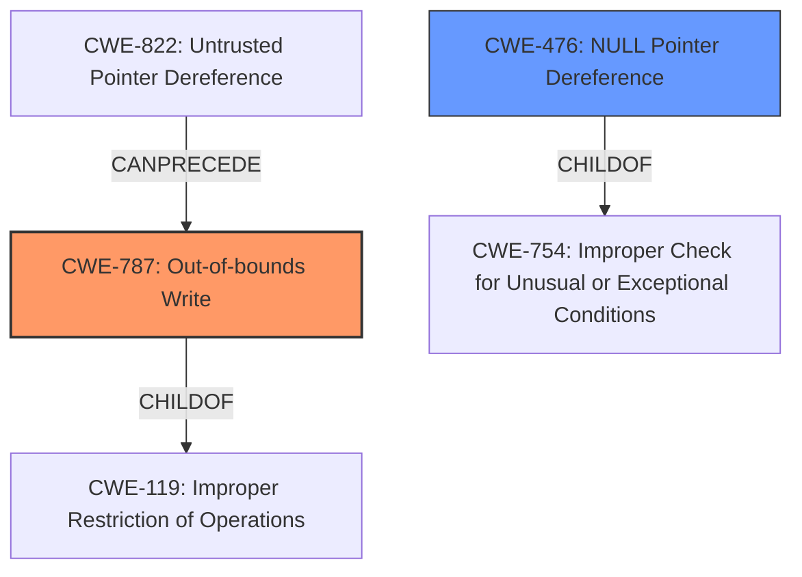

# Analysis for CVE-2020-20265

# Summary
| CWE ID | CWE Name | Confidence | CWE Abstraction Level | CWE Vulnerability Mapping Label | CWE-Vulnerability Mapping Notes |
|---|---|---|---|---|---|
| CWE-787 | Out-of-bounds Write | 0.9 | Base | Allowed | Primary CWE |
| CWE-476 | NULL Pointer Dereference | 0.5 | Base | Allowed | Secondary Candidate |

## Evidence and Confidence

*   **Confidence Score:** 0.7
*   **Evidence Strength:** MEDIUM

## Relationship Analysis
The primary relationship impacting the decision is that CWE-787 **(Out-of-bounds Write)** is a child of CWE-119 **(Improper Restriction of Operations within the Bounds of a Memory Buffer)**. This indicates that CWE-787 is a more specific type of memory corruption. CWE-822 **(Untrusted Pointer Dereference)** can precede CWE-787 indicating it can be a cause. CWE-476 **(NULL Pointer Dereference)** is also a child of CWE-754 **(Improper Check for Unusual or Exceptional Conditions)**, and could be a result of memory corruption. The abstraction levels influenced the selection by favoring the Base level CWE-787 as the primary classification due to its specificity.

## Vulnerability Chain
The vulnerability chain starts with a **crafted packet** sent by an authenticated remote attacker, leading to **memory corruption** in the `/ram/pckg/wireless/nova/bin/wireless` process, which then results in a Denial of Service.

## Summary of Analysis
The initial analysis focused on the **memory corruption** vulnerability, leading to the consideration of CWE-787 **(Out-of-bounds Write)** as the primary candidate. The retriever results strongly suggested CWE-787 as the best match. The vulnerability description key phrases also highlighted the **memory corruption** as a key weakness.

The selection of CWE-787 is based on the evidence that the vulnerability involves **writing data past the end of the intended buffer**. The "CVE Reference Links Content Summary" confirms that the root cause is **memory corruption** due to a **crafted packet**.

CWE-476 **(NULL Pointer Dereference)** was considered as a possible secondary CWE, as the CVE description mentions a NULL pointer dereference in a similar vulnerability (CVE-2020-20266). However, since the primary vulnerability description (CVE-2020-20265) does not explicitly mention a NULL pointer dereference, it is only considered as a secondary candidate with lower confidence.

The relationship graph shows that CWE-787 is a child of CWE-119, making it a more specific and appropriate choice than CWE-119 itself. The abstraction level of CWE-787 (Base) is also preferred for mapping root causes.

Relevant CWE Information:

# Enhanced Context (25 CWEs)
The following CWEs were identified as potentially relevant to this vulnerability:

## CWE-134: Use of Externally-Controlled Format String
**Abstraction Level**: Base
**Similarity Score**: 0.80
**Source**: dense

**Description**:
The product uses a function that accepts a format string as an argument, but the format string originates from an external source.

**Mapping Guidance**:
- Usage: Allowed
- Rationale: This CWE entry is at the Base level of abstraction, which is a preferred level of abstraction for mapping to the root causes of vulnerabilities.

## CWE-125: Out-of-bounds Read
**Abstraction Level**: Base
**Similarity Score**: 0.76
**Source**: dense

**Description**:
The product reads data past the end, or before the beginning, of the intended buffer.

**Mapping Guidance**:
- Usage: Allowed
- Rationale: This CWE entry is at the Base level of abstraction, which is a preferred level of abstraction for mapping to the root causes of vulnerabilities.

## CWE-1289: Improper Validation of Unsafe Equivalence in Input
**Abstraction Level**: Base
**Similarity Score**: 0.76
**Source**: dense

**Description**:
The product receives an input value that is used as a resource identifier or other type of reference, but it does not validate or incorrectly validates that the input is equivalent to a potentially-unsafe value.

**Mapping Guidance**:
- Usage: Allowed
- Rationale: This CWE entry is at the Base level of abstraction, which is a preferred level of abstraction for mapping to the root causes of vulnerabilities.

## CWE-131: Incorrect Calculation of Buffer Size
**Abstraction Level**: Base
**Similarity Score**: 0.76
**Source**: dense

**Description**:
The product does not correctly calculate the size to be used when allocating a buffer, which could lead to a buffer overflow.

**Mapping Guidance**:
- Usage: Allowed
- Rationale: This CWE entry is at the Base level of abstraction, which is a preferred level of abstraction for mapping to the root causes of vulnerabilities.

## CWE-226: Sensitive Information in Resource Not Removed Before Reuse
**Abstraction Level**: Base
**Similarity Score**: 0.75
**Source**: dense

**Description**:
The product releases a resource such as memory or a file so that it can be made available for reuse, but it does not clear or "zeroize" the information contained in the resource before the product performs a critical state transition or makes the resource available for reuse by other entities.

**Mapping Guidance**:
- Usage: Allowed
- Rationale: This CWE entry is at the Base level of abstraction, which is a preferred level of abstraction for mapping to the root causes of vulnerabilities.

## CWE-789: Memory Allocation with Excessive Size Value
**Abstraction Level**: Variant
**Similarity Score**: 0.75
**Source**: dense

**Description**:
The product allocates memory based on an untrusted, large size value, but it does not ensure that the size is within expected limits, allowing arbitrary amounts of memory to be allocated.

**Mapping Guidance**:
- Usage: Allowed
- Rationale: This CWE entry is at the Variant level of abstraction, which is a preferred level of abstraction for mapping to the root causes of vulnerabilities.

## CWE-681: Incorrect Conversion between Numeric Types
**Abstraction Level**: Base
**Similarity Score**: 0.75
**Source**: dense

**Description**:
When converting from one data type to another, such as long to integer, data can be omitted or translated in a way that produces unexpected values. If the resulting values are used in a sensitive context, then dangerous behaviors may occur.

**Mapping Guidance**:
- Usage: Allowed
- Rationale: This CWE entry is at the Base level of abstraction, which is a preferred level of abstraction for mapping to the root causes of vulnerabilities.

## CWE-130: Improper Handling of Length Parameter Inconsistency
**Abstraction Level**: Base
**Similarity Score**: 0.75
**Source**: dense

**Description**:
The product parses a formatted message or structure, but it does not handle or incorrectly handles a length field that is inconsistent with the actual length of the associated data.

**Mapping Guidance**:
- Usage: Allowed
- Rationale: This CWE entry is at the Base level of abstraction, which is a preferred level of abstraction for mapping to the root causes of vulnerabilities.

## CWE-1286: Improper Validation of Syntactic Correctness of Input
**Abstraction Level**: Base
**Similarity Score**: 0.75
**Source**: dense

**Description**:
The product receives input that is expected to be well-formed - i.e., to comply with a certain syntax - but it does not validate or incorrectly validates that the input complies with the syntax.

**Mapping Guidance**:
- Usage: Allowed
- Rationale: This CWE entry is at the Base level of abstraction, which is a preferred level of abstraction for mapping to the root causes of vulnerabilities.

## CWE-193: Off-by-one Error
**Abstraction Level**: Base
**Similarity Score**: 0.75
**Source**: dense

**Description**:
A product calculates or uses an incorrect maximum or minimum value that is 1 more, or 1 less, than the correct value.

**Mapping Guidance**:
- Usage: Allowed
- Rationale: This CWE entry is at the Base level of abstraction, which is a