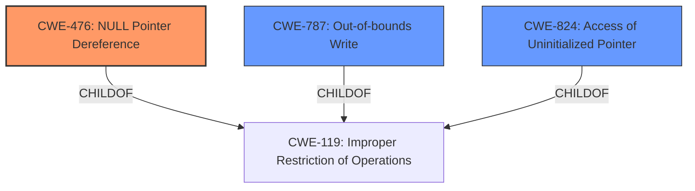

# Analysis Report for CVE-2020-20266

# Vulnerability Analysis Report: CVE-2020-20266

## Description


## Analysis (with Relationship Data)

# Summary
| CWE ID | CWE Name | Confidence | CWE Abstraction Level | CWE Vulnerability Mapping Label | CWE-Vulnerability Mapping Notes |
|---|---|---|---|---|---|
| CWE-476 | NULL Pointer Dereference | 1.0 | Base | Primary | Allowed |
| CWE-787 | Out-of-bounds Write | 0.6 | Base | Secondary | Allowed |
| CWE-824 | Access of Uninitialized Pointer | 0.5 | Base | Secondary | Allowed |

## Evidence and Confidence

*   **Confidence Score:** 0.8
*   **Evidence Strength:** HIGH

## Relationship Analysis
The primary relationship influencing the CWE selection is the parent-child relationship where **CWE-476 (NULL Pointer Dereference)** is a specific type of memory corruption. **CWE-787 (Out-of-bounds Write)** is also related as a potential cause of memory corruption, but less directly supported by the evidence. **CWE-824 (Access of Uninitialized Pointer)** is considered because a **NULL pointer** could be considered an uninitialized pointer. The chosen CWEs are at the Base level of abstraction, providing a detailed representation of the weakness.



## Vulnerability Chain
The vulnerability chain involves a memory corruption issue leading to a **NULL pointer dereference**, ultimately causing a denial of service. The root cause is the memory corruption, the weakness is the **NULL pointer dereference**, and the impact is the denial of service.

## Summary of Analysis
The initial assessment focused on identifying the most accurate CWE based on the provided vulnerability description and related information. The description explicitly mentions a "**NULL pointer dereference**" which strongly indicates **CWE-476 (NULL Pointer Dereference)**. The "CVE Reference Links Content Summary" confirms that the root cause is indeed a **NULL pointer dereference** within the `/nova/bin/dot1x` process, leading to a crash and denial of service.

The Retriever Results also list **CWE-476 (NULL Pointer Dereference)** as the top candidate based on sparse analysis, further supporting this selection.

While **CWE-787 (Out-of-bounds Write)** is suggested by "CWE for similar CVE Descriptions", the provided evidence is more explicit about the **NULL pointer dereference** being the primary issue. However, the memory corruption mentioned in the description could potentially be caused by an out-of-bounds write, making **CWE-787** a possible secondary factor.

**CWE-824 (Access of Uninitialized Pointer)** is considered a secondary candidate as well, since a **NULL pointer** could be interpreted as an uninitialized pointer being dereferenced.

The final decision is based on the explicit mention of "**NULL pointer dereference**" in the vulnerability description and supporting evidence, making **CWE-476 (NULL Pointer Dereference)** the most accurate primary CWE. **CWE-787 (Out-of-bounds Write)** and **CWE-824 (Access of Uninitialized Pointer)** are included as secondary CWEs due to their potential contribution to the memory corruption.

Relevant CWE Information:

# Enhanced Context (25 CWEs)

## CWE-457: Use of Uninitialized Variable
**Abstraction Level**: Variant
**Similarity Score**: 0.81
**Source**: dense

**Description**:
The code uses a variable that has not been initialized, leading to unpredictable or unintended results.

**Mapping Guidance**:
- Usage: Allowed
- Rationale: This CWE entry is at the Variant level of abstraction, which is a preferred level of abstraction for mapping to the root causes of vulnerabilities.

*Not Selected:* While uninitialized variables can lead to issues, the specific mention of a **NULL pointer dereference** points to **CWE-476** as a more accurate classification.

## CWE-824: Access of Uninitialized Pointer
**Abstraction Level**: Base
**Similarity Score**: 0.80
**Source**: dense

**Description**:
The product accesses or uses a pointer that has not been initialized.

**Mapping Guidance**:
- Usage: Allowed
- Rationale: This CWE entry is at the Base level of abstraction, which is a preferred level of abstraction for mapping to the root causes of vulnerabilities.

*Selected as Secondary:* A **NULL pointer** could be considered a special case of an uninitialized pointer. While **CWE-476** is more specific, **CWE-824** provides additional context.

## CWE-665: Improper Initialization
**Abstraction Level**: Class
**Similarity Score**: 0.80
**Source**: dense

**Description**:
The product does not initialize or incorrectly initializes a resource, which might leave the resource in an unexpected state when it is accessed or used.

**Mapping Guidance**:
- Usage: Discouraged
- Rationale: This CWE entry is a level-1 Class (i.e., a child of a Pillar). It might have lower-level children that would be more appropriate

*Not Selected:* This is a higher-level class. The description specifically mentions a **NULL pointer dereference**, so **CWE-476** is more appropriate.

## CWE-822: Untrusted Pointer Dereference
**Abstraction Level**: Base
**Similarity Score**: 0.79
**Source**: dense

**Description**:
The product obtains a value from an untrusted source, converts this value to a pointer, and dereferences the resulting pointer.

**Mapping Guidance**:
- Usage: Allowed
- Rationale: This CWE entry is at the Base level of abstraction, which is a preferred level of abstraction for mapping to the root causes of vulnerabilities.

*Not Selected:* The description doesn't suggest that the pointer comes from an untrusted source.

## CWE-226: Sensitive Information in Resource Not Removed Before Reuse
**Abstraction Level**: Base
**Similarity Score**: 0.79
**Source**: dense

**Description**:
The product releases a resource such as memory or a file so that it can be made available for reuse, but it does not clear or "zeroize" the information contained in the resource before the product performs a critical state transition or makes the resource available for reuse by other entities.

**Mapping Guidance**:
- Usage: Allowed
- Rationale: This CWE entry is at the Base level of abstraction, which is a preferred level of abstraction for mapping to the root causes of vulnerabilities.

*Not Selected:* This CWE doesn't align with the vulnerability description.

## CWE-909: Missing Initialization of Resource
**Abstraction Level**: Class
**Similarity Score**: 0.79
**Source**: dense

**Description**:
The product does not initialize a critical resource.

**Mapping Guidance**:
- Usage: Allowed-with-Review
- Rationale: This CWE entry is a Class and might have Base-level children that would be more appropriate

*Not Selected:* This is a higher-level class. The description specifically mentions a **NULL pointer dereference**, so **CWE-476** is more appropriate.

## CWE-476: NULL Pointer Dereference
**Abstraction Level**: Base
**Similarity Score**: 0.79
**Source**: dense

**Description**:
The product dereferences a pointer that it expects to be valid but is NULL.

**Mapping Guidance**:
- Usage: Allowed
- Rationale: This CWE entry is at the Base level of abstraction, which is a preferred level of abstraction for mapping to the root causes of vulnerabilities.

*Selected as Primary:* The vulnerability description and supporting evidence explicitly state a "**NULL pointer dereference**". This aligns perfectly with **CWE-476**.

## CWE-456: Missing Initialization of a Variable
**Abstraction Level**: Variant
**Similarity Score**: 0.78
**Source**: dense

**Description**:
The product does not initialize critical variables, which causes the execution environment to use unexpected values.

**Mapping Guidance**:
- Usage: Allowed
- Rationale: This CWE entry is at the Variant level of abstraction, which is a preferred level of abstraction for mapping to the root causes of vulnerabilities.

*Not Selected:* While missing initialization can be related to **NULL pointer dereferences**, the description specifically mentions the dereference itself, making **CWE-476** the more direct and appropriate classification.

## CWE-667: Improper Locking
**Abstraction Level**: Class
**Similarity Score**: 0.78
**Source**: dense


## CWE Relationship Analysis

Current CWEs represent these abstraction levels: .


### Vulnerability Chain Analysis

**Chain starting from CWE-476:**
- 476 (NULL Pointer Dereference) - ROOT


**Chain starting from CWE-787:**
- 787 (Out-of-bounds Write) - ROOT


### CWE Relationship Diagram

```mermaid
graph TD
    classDef primary fill:#f96,stroke:#333,stroke-width:2px
    classDef secondary fill:#69f,stroke:#333
    classDef tertiary fill:#9e9,stroke:#333
```


*Report generated on 2025-04-01 16:15:12*
