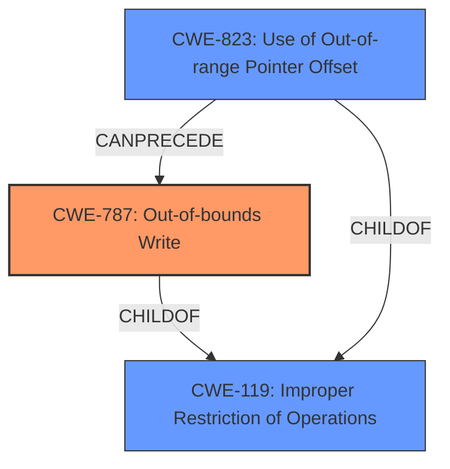

# Raw Analyzer Response for CVE-2020-20267

# Summary
| CWE ID | CWE Name | Confidence | CWE Abstraction Level | CWE Vulnerability Mapping Label | CWE-Vulnerability Mapping Notes |
|---|---|---|---|---|---|
| CWE-787 | Out-of-bounds Write | 0.8 | Base | Allowed | Primary CWE. Memory corruption due to invalid memory access leading to a denial of service aligns with the description of writing data past the end of a buffer. |
| CWE-119 | Improper Restriction of Operations within the Bounds of a Memory Buffer | 0.6 | Class | Discouraged | Secondary candidate. The vulnerability involves accessing memory outside the intended buffer, which falls under the general category of CWE-119. However, CWE-787 is more specific. |
| CWE-823 | Use of Out-of-range Pointer Offset | 0.5 | Base | Allowed | Secondary candidate. The memory corruption could be caused by using a pointer with an offset that points outside the valid memory range. |

## Evidence and Confidence

*   **Confidence Score:** 0.7
*   **Evidence Strength:** MEDIUM

## Relationship Analysis
The primary CWE, CWE-787 **(Out-of-bounds Write)**, is a child of CWE-119 **(Improper Restriction of Operations within the Bounds of a Memory Buffer)**. This indicates a hierarchical relationship where CWE-787 is a more specific case of CWE-119. CWE-823 **(Use of Out-of-range Pointer Offset)** is also a child of CWE-119 and can precede CWE-787 which means that using an out-of-range pointer offset can lead to an out-of-bounds write. Selecting CWE-787 as the primary CWE offers a more precise description of the vulnerability.

## Vulnerability Chain
The vulnerability chain starts with memory corruption in the /nova/bin/resolver process, leading to **invalid memory access**, which results in an out-of-bounds write and finally causes a denial of service.

## Summary of Analysis
The initial analysis pointed towards memory corruption leading to **invalid memory access** causing a denial of service. The "CVE Reference Links Content Summary" confirms the root cause as "Memory corruption in the /nova/bin/resolver process" and the weakness as "Memory corruption due to **invalid memory access**."

The retriever results indicated CWE-787 **(Out-of-bounds Write)**, CWE-476 **(NULL Pointer Dereference)**, and CWE-119 **(Improper Restriction of Operations within the Bounds of a Memory Buffer)** as potential candidates.

CWE-787 **(Out-of-bounds Write)** is selected as the primary CWE because the vulnerability description and the CVE reference summary explicitly mention memory corruption due to **invalid memory access**, which aligns with the concept of writing data past the end of a buffer. The "**weakness:** **invalid memory access**" phrase in the "Vulnerability Description Key Phrases" section supports this.

CWE-119 **(Improper Restriction of Operations within the Bounds of a Memory Buffer)** is considered as a secondary CWE because it is a broader category encompassing memory access issues. The mapping guidance discourages its use when more specific CWEs are available.

CWE-823 **(Use of Out-of-range Pointer Offset)** is considered as a secondary CWE because the **invalid memory access** could be caused by using a pointer with an offset that points outside the valid memory range.

CWE-476 **(NULL Pointer Dereference)** was considered but not selected as the primary CWE because the description focuses on memory corruption and **invalid memory access** rather than specifically mentioning null pointer dereference.

The final decision is based on the evidence from the vulnerability description and the relationships between the CWEs. CWE-787 **(Out-of-bounds Write)** is the most specific and appropriate CWE for this vulnerability.

Relevant CWE Information:
* CWE-787: Out-of-bounds Write
* CWE-119: Improper Restriction of Operations within the Bounds of a Memory Buffer
* CWE-823: Use of Out-of-range Pointer Offset