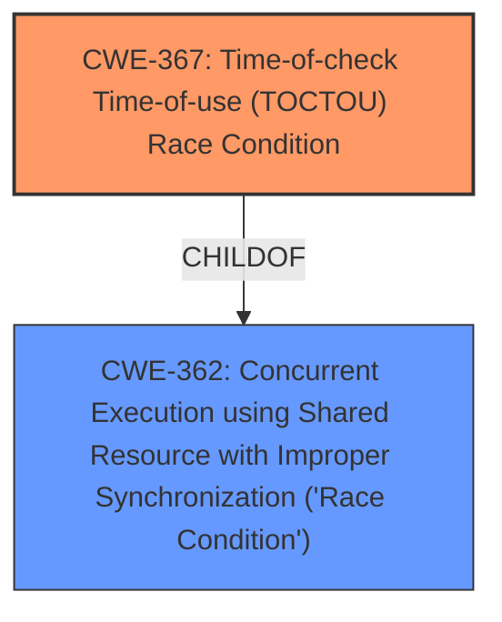

# Enhanced Analysis for CVE-2020-2032

# Summary
| CWE ID | CWE Name | Confidence | CWE Abstraction Level | CWE Vulnerability Mapping Label | CWE-Vulnerability Mapping Notes |
|---|---|---|---|---|---|
| CWE-367 | Time-of-check Time-of-use (TOCTOU) Race Condition | 1.0 | Base | Allowed | Primary CWE |
| CWE-362 | Concurrent Execution using Shared Resource with Improper Synchronization ('Race Condition') | 0.7 | Class | Allowed-with-Review | Secondary Candidate |

## Evidence and Confidence

*   **Confidence Score:** 0.9
*   **Evidence Strength:** HIGH

## Relationship Analysis
The primary CWE is CWE-367, which is a base-level CWE and a child of CWE-362. CWE-362 is a class-level CWE that represents a more general race condition. The description explicitly states a **race condition** and the CVE reference summary specifically identifies a Time-of-check Time-of-use (TOCTOU) **race condition**, making CWE-367 the most appropriate.



## Vulnerability Chain
The vulnerability chain starts with a **race condition** during the GlobalProtect app upgrade process, specifically a TOCTOU condition. This allows a local, limited Windows user to execute programs with SYSTEM privileges.
  - **Root Cause:** CWE-367 Time-of-check Time-of-use (TOCTOU) Race Condition
  - **Impact:** Execute programs with SYSTEM privileges

## Summary of Analysis
The initial analysis strongly points to CWE-367 because the vulnerability description includes "race condition" and the CVE reference summary specifically identifies "Time-of-check Time-of-use (TOCTOU) race condition".

The evidence supporting CWE-367 is:
- The "Vulnerability Description Key Phrases" section lists "**rootcause:** **race condition**"
- The "CVE Reference Links Content Summary" section states "**Weaknesses/vulnerabilities present:** The vulnerability is a Time-of-check Time-of-use (TOCTOU) race condition, categorized as CWE-367."

The relationship analysis confirms that CWE-367 is a more specific type of race condition (TOCTOU) and is a child of the more general CWE-362. The selection of CWE-367 is at the optimal level of specificity because the provided evidence explicitly identifies a TOCTOU race condition.

CWE-362 was considered but not chosen as the primary CWE because while it represents a race condition, it is a class-level CWE. The vulnerability description provides enough information to classify it as the base-level CWE-367, which is a TOCTOU race condition.

Relevant CWE Information:
# Enhanced Context (25 CWEs)
The following CWEs were identified as potentially relevant to this vulnerability:

## CWE-303: Incorrect Implementation of Authentication Algorithm
**Abstraction Level**: Base
**Similarity Score**: 0.78

This CWE is not relevant because the vulnerability is not related to an authentication algorithm.

## CWE-1391: Use of Weak Credentials
**Abstraction Level**: Class
**Similarity Score**: 0.78

This CWE is not relevant because the vulnerability is not related to the use of weak credentials.

## CWE-345: Insufficient Verification of Data Authenticity
**Abstraction Level**: Class
**Similarity Score**: 0.77

This CWE is not relevant because the vulnerability is not related to data authenticity.

## CWE-1390: Weak Authentication
**Abstraction Level**: Class
**Similarity Score**: 0.77

This CWE is not relevant because the vulnerability is not related to weak authentication.

## CWE-807: Reliance on Untrusted Inputs in a Security Decision
**Abstraction Level**: Base
**Similarity Score**: 0.77

This CWE is not relevant because the vulnerability is not related to reliance on untrusted inputs.

## CWE-667: Improper Locking
**Abstraction Level**: Class
**Similarity Score**: 0.77

This CWE is not relevant because the vulnerability is not explicitly related to improper locking, although concurrency issues often involve locking. The description specifies a TOCTOU **race condition**.

## CWE-798: Use of Hard-coded Credentials
**Abstraction Level**: Base
**Similarity Score**: 0.76

This CWE is not relevant because the vulnerability is not related to the use of hard-coded credentials.

## CWE-330: Use of Insufficiently Random Values
**Abstraction Level**: Class
**Similarity Score**: 0.76

This CWE is not relevant because the vulnerability is not related to random values.

## CWE-319: Cleartext Transmission of Sensitive Information
**Abstraction Level**: Base
**Similarity Score**: 0.76

This CWE is not relevant because the vulnerability is not related to cleartext transmission of sensitive information.

## CWE-203: Observable Discrepancy
**Abstraction Level**: Base
**Similarity Score**: 0.76

This CWE is not relevant because the vulnerability is not related to observable discrepancy.

## CWE-367: Time-of-check Time-of-use (TOCTOU) Race Condition
**Abstraction Level**: Base
**Similarity Score**: 5422.93

This CWE is highly relevant because it directly matches the description of the vulnerability as a Time-of-check Time-of-use (TOCTOU) **race condition**.

## CWE-362: Concurrent Execution using Shared Resource with Improper Synchronization ('Race Condition')
**Abstraction Level**: Class
**Similarity Score**: 4958.77

This CWE is relevant as a more general **race condition**, but CWE-367 is more specific.

## CWE-1386: Insecure Operation on Windows Junction / Mount Point
**Abstraction Level**: Base
**Similarity Score**: 4902.83

This CWE is not relevant because the vulnerability is not related to Windows Junction / Mount Points.

## CWE-59: Improper Link Resolution Before File Access ('Link Following')
**Abstraction Level**: Base
**Similarity Score**: 4846.03

This CWE is not relevant because the vulnerability is not related to link following.

## CWE-347: Improper Verification of Cryptographic Signature
**Abstraction Level**: Base
**Similarity Score**: 4736.72

This CWE is not relevant because the vulnerability is not related to cryptographic signature verification.

## CWE-386: Symbolic Name not Mapping to Correct Object
**Abstraction Level**: base
**Similarity Score**: 4.50

This CWE is not relevant because the vulnerability is not related to symbolic name mapping.

## CWE-476: NULL Pointer Dereference
**Abstraction Level**: base
**Similarity Score**: 4.33

This CWE is not relevant because the vulnerability is not related to null pointer dereference.

## CWE-73: External Control of File Name or Path
**Abstraction Level**: base
**Similarity Score**: 3.36

This CWE is not relevant because the vulnerability is not related to external control of file names or paths.

## CWE-123: Write-what-where Condition
**Abstraction Level**: base
**Similarity Score**: 3.36

This CWE is not relevant because the vulnerability is not related to write-what-where conditions.

## CWE-416: Use After Free
**Abstraction Level**: variant
**Similarity Score**: 3.24

This CWE is not relevant because the vulnerability is not related to use-after-free.

## CWE-59: Improper Link Resolution Before File Access ('Link Following')
**Abstraction Level**: base
**Similarity Score**: 3.06

This CWE is not relevant because the vulnerability is not related to improper link resolution before file access.

## CWE-609: Double-Checked Locking
**Abstraction Level**: base
**Similarity Score**: 2.87

This CWE is not relevant because the vulnerability is not related to double-checked locking.

## CWE-363: Race Condition Enabling Link Following
**Abstraction Level**: base
**Similarity Score**: 2.87

This CWE is not relevant because the vulnerability is not related to race conditions enabling link following.

## CWE-364: Signal Handler Race Condition
**Abstraction Level**: base
**Similarity Score**: 2.87

This CWE is not relevant because the vulnerability is not specifically related to signal handlers, although it is a race condition.

## CWE-1265: Unintended Reentrant Invocation of Non-reentrant Code Via Nested Calls
**Abstraction Level**: base
**Similarity Score**: 2.87

This CWE is not relevant because the vulnerability is not related to unintended reentrant invocation of non


## CWE Relationship Analysis

Current CWEs represent these abstraction levels: .


### Vulnerability Chain Analysis

**Chain starting from CWE-123:**
- 123 (Write-what-where Condition) - ROOT


**Chain starting from CWE-362:**
- 362 (Concurrent Execution using Shared Resource with Improper Synchronization ('Race Condition')) - ROOT


### CWE Relationship Diagram

```mermaid
graph TD
    classDef primary fill:#f96,stroke:#333,stroke-width:2px
    classDef secondary fill:#69f,stroke:#333
    classDef tertiary fill:#9e9,stroke:#333
```