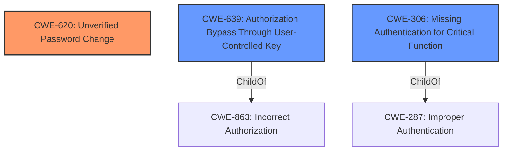

# Analysis for CVE-2020-20466

# Summary
| CWE ID | CWE Name | Confidence | CWE Abstraction Level | CWE Vulnerability Mapping Label | CWE-Vulnerability Mapping Notes |
|---|---|---|---|---|---|
| CWE-620 | Unverified Password Change | 1 | Base | Allowed | Primary CWE |
| CWE-639 | Authorization Bypass Through User-Controlled Key | 0.7 | Base | Allowed | Secondary Candidate |
| CWE-306 | Missing Authentication for Critical Function | 0.6 | Base | Allowed | Secondary Candidate |

## Evidence and Confidence

*   **Confidence Score:** 0.8
*   **Evidence Strength:** HIGH

## Relationship Analysis
The primary CWE, CWE-620 **Unverified Password Change**, accurately reflects the root cause: the application allows password changes without verifying the existing password.

CWE-639 **Authorization Bypass Through User-Controlled Key** is also relevant, as the attacker is using the user ID to modify another user's password, bypassing normal authorization controls.

CWE-306 **Missing Authentication for Critical Function** could apply if password modification is considered a critical function that should have additional authentication beyond the initial login.

## Vulnerability Chain
The vulnerability chain starts with the **lack of verification** on the password change function (CWE-620). This leads to the attacker's ability to **bypass authorization** (CWE-639) and **modify another user's password**, resulting in **unauthorized access** and potential compromise of the target user's account.

## Summary of Analysis
The initial assessment identified that the root cause of the vulnerability is the **absence of a verification mechanism** when changing a user's password. The "CVE Reference Links Content Summary" clearly states: "The `user_edit_password.php` file allows users to modify other users' passwords without verifying the original password." This directly supports the selection of CWE-620 **Unverified Password Change**.

The graph relationships and retriever results also suggested considering CWE-639 **Authorization Bypass Through User-Controlled Key**, because the attacker uses the user ID to change another user's password. This is a valid secondary consideration, but the **lack of verification** is the primary issue.

CWE-306 **Missing Authentication for Critical Function** was considered because password changes are critical.

I am selecting CWE-620 because it is the most specific and accurate representation of the **missing verification** weakness. It is a Base level CWE, aligning with best practices.
The supporting evidence is the vulnerability description key phrases and the CVE Reference Links Content Summary.

Relevant CWE Information:

# Enhanced Context (25 CWEs)

## CWE-74: Improper Neutralization of Special Elements in Output Used by a Downstream Component ('Injection')
**Abstraction Level**: Class
**Similarity Score**: 0.78
**Source**: dense

**Description**:
The product constructs all or part of a command, data structure, or record using externally-influenced input from an upstream component, but it does not neutralize or incorrectly neutralizes special elements that could modify how it is parsed or interpreted when it is sent to a downstream component.

**Mapping Guidance**:
- Usage: Discouraged
- Rationale: CWE-74 is high-level and often misused when lower-level weaknesses are more appropriate.

## CWE-472: External Control of Assumed-Immutable Web Parameter
**Abstraction Level**: Base
**Similarity Score**: 0.77
**Source**: dense

**Description**:
The web application does not sufficiently verify inputs that are assumed to be immutable but are actually externally controllable, such as hidden form fields.

**Mapping Guidance**:
- Usage: Allowed
- Rationale: This CWE entry is at the Base level of abstraction, which is a preferred level of abstraction for mapping to the root causes of vulnerabilities.

## CWE-639: Authorization Bypass Through User-Controlled Key
**Abstraction Level**: Base
**Similarity Score**: 0.77
**Source**: dense

**Description**:
The system's authorization functionality does not prevent one user from gaining access to another user's data or record by modifying the key value identifying the data.

**Mapping Guidance**:
- Usage: Allowed
- Rationale: This CWE entry is at the Base level of abstraction, which is a preferred level of abstraction for mapping to the root causes of vulnerabilities.

## CWE-807: Reliance on Untrusted Inputs in a Security Decision
**Abstraction Level**: Base
**Similarity Score**: 0.77
**Source**: dense

**Description**:
The product uses a protection mechanism that relies on the existence or values of an input, but the input can be modified by an untrusted actor in a way that bypasses the protection mechanism.

**Mapping Guidance**:
- Usage: Allowed
- Rationale: This CWE entry is at the Base level of abstraction, which is a preferred level of abstraction for mapping to the root causes of vulnerabilities.

## CWE-41: Improper Resolution of Path Equivalence
**Abstraction Level**: Base
**Similarity Score**: 0.76
**Source**: dense

**Description**:
The product is vulnerable to file system contents disclosure through path equivalence. Path equivalence involves the use of special characters in file and directory names. The associated manipulations are intended to generate multiple names for the same object.

**Mapping Guidance**:
- Usage: Allowed
- Rationale: This CWE entry is at the Base level of abstraction, which is a preferred level of abstraction for mapping to the root causes of vulnerabilities.

## CWE-1391: Use of Weak Credentials
**Abstraction Level**: Class
**Similarity Score**: 0.76
**Source**: dense

**Description**:
The product uses weak credentials (such as a default key or hard-coded password) that can be calculated, derived, reused, or guessed by an attacker.

**Mapping Guidance**:
- Usage: Allowed-with-Review
- Rationale: This CWE entry is a Class and might have Base-level children that would be more appropriate

## CWE-425: Direct Request ('Forced Browsing')
**Abstraction Level**: Base
**Similarity Score**: 0.76
**Source**: dense

**Description**:
The web application does not adequately enforce appropriate authorization on all restricted URLs, scripts, or files.

**Mapping Guidance**:
- Usage: Allowed
- Rationale: This CWE entry is at the Base level of abstraction, which is a preferred level of abstraction for mapping to the root causes of vulnerabilities.

## CWE-303: Incorrect Implementation of Authentication Algorithm
**Abstraction Level**: Base
**Similarity Score**: 0.76
**Source**: dense

**Description**:
The requirements for the product dictate the use of an established authentication algorithm, but the implementation of the algorithm is incorrect.

**Mapping Guidance**:
- Usage: Allowed
- Rationale: This CWE entry is at the Base level of abstraction, which is a preferred level of abstraction for mapping to the root causes of vulnerabilities.

## CWE-668: Exposure of Resource to Wrong Sphere
**Abstraction Level**: Class
**Similarity Score**: 0.76
**Source**: dense

**Description**:
The product exposes a resource to the wrong control sphere, providing unintended actors with inappropriate access to the resource.

**Mapping Guidance**:
- Usage: Discouraged
- Rationale: CWE-668 is high-level and is often misused as a catch-all when lower-level CWE IDs might be applicable. It is sometimes used for low-information vulnerability reports [REF-1287]. It is a level-1 Class (i.e., a child of a Pillar). It is not useful for trend analysis.

## CWE-1289: Improper Validation of Unsafe Equivalence in Input
**Abstraction Level**: Base
**Similarity Score**: 0.76
**Source**: dense

**Description**:
The product receives an input value that is used as a resource identifier or other type of reference, but it does not validate or incorrectly validates that the input is equivalent to a potentially-unsafe value.

**Mapping Guidance**:
- Usage: Allowed
- Rationale: This CWE entry is at the Base level of abstraction, which is a preferred level of abstraction for mapping to the root causes of vulnerabilities.

## CWE-639: Authorization Bypass Through User-Controlled Key
**Abstraction Level**: Base
**Similarity Score**: 6781.79
**Source**: sparse

**Description**:
The system's authorization functionality does not prevent one user from gaining access to another user's

# Enhanced Query for CVE-2020-20466

## Vulnerability Description
White Shark System (WSS) 1.3.2 is vulnerable to unauthorized access via user_edit_password.php, remote attackers can modify the password of any user.

### Vulnerability Description Key Phrases
- **impact:** modify password of any user
- **attacker:** remote attackers
- **product:** White Shark System (WSS)
- **version:** 1.3.2
- **component:** user_edit_password.php

## CVE Reference Links Content Summary
The provided content describes multiple vulnerabilities in White Shark System(wss) 1.3.2, and does not correlate to a specific CVE. The vulnerabilities are:

**[1] SQL Injection Vulnerability**
*   **Root cause:** The `control_task.php`, `control_project.php`, and `default_user.php` files fail to properly sanitize the `sort` parameter before using it in a database query. Specifically, the `GetSQLValueString` function does not process the data when a type is defined, leading to unsanitized data entering the query.
*   **Vulnerability:** SQL Injection.
*   **Impact:** Remote attackers can exploit this vulnerability to obtain sensitive database information.
*   **Attack vector:** Sending a crafted GET request with a malicious `sort` parameter.
*   **Attacker capabilities:** The attacker needs to be able to send HTTP requests to the server.

**[2] SQL Injection Vulnerability**
*   **Root cause:** The `default_task_edituser.php` file does not sanitize the `csa_to_user` parameter from the POST request, before using it in a database query.
*   **Vulnerability:** SQL Injection.
*   **Impact:** Remote attackers can exploit this vulnerability to obtain sensitive database information.
*   **Attack vector:** Sending a crafted POST request with a malicious `csa_to_user` parameter.
*   **Attacker capabilities:** The attacker needs to be able to send HTTP requests to the server.

**[3] SQL Injection Vulnerability**
*   **Root cause:** The `log_edit.php` file does not sanitize the `date` parameter before using it in a database query. Specifically, the `logdate` variable enters the database query without being processed by the `GetSQLValueString` function.
*   **Vulnerability:** SQL Injection.
*   **Impact:** Remote attackers can exploit this vulnerability to obtain sensitive database information.
*   **Attack vector:** Sending a crafted GET request with a malicious `date` parameter.
*   **Attacker capabilities:** The attacker needs to be able to send HTTP requests to the server.

**[4] Unauthorized Access Vulnerability**
*   **Root cause:** The `user_edit_password.php` file allows users to modify other users' passwords without verifying the original password.
*   **Vulnerability:** Unauthorized Access.
*   **Impact:** Remote attackers can modify the password of any user.
*   **Attack vector:** Sending a crafted POST request with the target user's `ID` and the new password.
*   **Attacker capabilities:** The attacker needs to be logged into the application.

**[5] CSRF Vulnerability**
*   **Root cause:** The `user_edit_password.php` file is vulnerable to CSRF because it lacks proper token protection.
*   **Vulnerability:** Cross-Site Request Forgery (CSRF)
*   **Impact:** Remote attackers can trick a logged-in user into modifying their password by visiting a crafted web page.
*   **Attack vector:**  The attacker crafts a malicious HTML page which submits a password change request to the vulnerable endpoint.
*   **Attacker capabilities:** The attacker needs to be able to induce a logged-in user to visit a malicious webpage.

**[6] Unauthorized Access Vulnerability**
*   **Root cause:** The `default_user_edit.php` file uses the `ID` parameter from the POST request, rather than the session user ID, to determine which user to modify, allowing users to modify other users' information.
*   **Vulnerability:** Unauthorized Access.
*   **Impact:** Remote attackers can modify information of other users, including escalating their own privileges by changing the `tk_user_rank` parameter.
*   **Attack vector:** Sending a crafted POST request with the target user's `ID` and modified data.
*   **Attacker capabilities:** The attacker needs to be logged into the application.

**[7] Sensitive Information Disclosure Vulnerability**
*   **Root cause:** The `if_get_addbook.php` file does not properly authenticate requests and reveals information for all users due to predictable token.
*   **Vulnerability:** Sensitive Information Disclosure.
*   **Impact:** Remote attackers can obtain username information for all users of the current site.
*   **Attack vector:** Sending a POST request to the `if_get_addbook.php` file with the token set to 0.
*   **Attacker capabilities:** The attacker needs to be able to send HTTP requests to the server.

**[8] Unauthorized Access Vulnerability**
*   **Root cause:** The `default_task_add.php` file allows attackers to specify the creator of the task via the `csa_create_user` parameter, and set this value to the admin user's ID.
*   **Vulnerability:** Unauthorized Access.
*   **Impact:** Remote attackers can forge tasks for admin users.
*   **Attack vector:** Sending a POST request to the `default_task_add.php` with a crafted `csa_create_user` parameter.
*   **Attacker capabilities:** The attacker needs to be able to send HTTP requests to the server.

**[9] Website Physical Path Leakage**
*   **Root cause:** The provided screenshots show several files that leak the server's physical path through PHP errors.
*   **Vulnerability:** Information Disclosure
*   **Impact:** The server's physical path is revealed, which can aid in further attacks.
*   **Attack vector:** Accessing the vulnerable files which trigger an error, resulting in path disclosure.
*   **Attacker capabilities:** The attacker needs to be able to send HTTP requests to the server.

The content provides detailed technical information on the vulnerabilities, including vulnerable code snippets and example attack requests.

**NOINFO**

## Retriever Results

### Top Combined Results

| Rank | CWE ID | Name | Abstraction | Usage  | Retrievers | Individual Scores |
|------|--------|------|-------------|-------|------------|-------------------|
| 1 | 620 | Unverified Password Change | Base | Allowed | sparse | 0.062 |
| 2 | 472 | External Control of Assumed-Immutable Web Parameter | Base | Allowed | sparse | 0.049 |
| 3 | 639 | Authorization Bypass Through User-Controlled Key | Base | Allowed | sparse | 0.046 |
| 4 | 209 | Generation of Error Message Containing Sensitive Information | Base | Allowed | sparse | 0.044 |
| 5 | 306 | Missing Authentication for Critical Function | Base | Allowed | sparse | 0.040 |
| 6 | 916 | Use of Password Hash With Insufficient Computational Effort | Base | Allowed | dense | 0.513 |
| 7 | 756 | Missing Custom Error Page | Base | Allowed | graph | 0.002 |
| 8 | 425 | Direct Request ('Forced Browsing') | Base | Allowed | sparse | 0.039 |
| 9 | 285 | Improper Authorization | Class | Discouraged | sparse | 0.039 |
| 10 | 89 | Improper Neutralization of Special Elements used in an SQL Command ('SQL Injection') | Base | Allowed | sparse | 0.038 |

# Complete CWE Specifications

## CWE-620: Unverified Password Change
**Abstraction:** Base
**Status:** Draft

### Description
When setting a new password for a user, the product does not require knowledge of the original password, or using another form of authentication.

### Extended Description
This could be used by an attacker to change passwords for another user, thus gaining the privileges associated with that user.

### Alternative Terms
None

### Relationships
ChildOf -> CWE-1390

### Mapping Guidance
**Usage:** Allowed
**Rationale:** This CWE entry is at the Base level of abstraction, which is a preferred level of abstraction for mapping to the root causes of vulnerabilities.
**Comments:** Carefully read both the name and description to ensure that this mapping is an appropriate fit. Do not try to 'force' a mapping to a lower-level Base/Variant simply to comply with this preferred level of abstraction.
**Reasons:**
- Acceptable-Use

### Observed Examples
- **CVE-2007-0681:** Web app allows remote attackers to change the passwords of arbitrary users without providing the original password, and possibly perform other unauthorized actions.
- **CVE-2000-0944:** Web application password change utility doesn't check the original password.

## CWE-472: External Control of Assumed-Immutable Web Parameter
**Abstraction:** Base
**Status:** Draft

### Description
The web application does not sufficiently verify inputs that are assumed to be immutable but are actually externally controllable, such as hidden form fields.

### Extended Description

If a web product does not properly protect assumed-immutable values from modification in hidden form fields, parameters, cookies, or URLs, this can lead to modification of critical data. Web applications often mistakenly make the assumption that data passed to the client in hidden fields or cookies is not susceptible to tampering. Improper validation of data that are user-controllable can lead to the application processing incorrect, and often malicious, input.

For example, custom cookies commonly store session data or persistent data across sessions. This kind of session data is normally involved in security related decisions on the server side, such as user authentication and access control. Thus, the cookies might contain sensitive data such as user credentials and privileges. This is a dangerous practice, as it can often lead to improper reliance on the value of the client-provided cookie by the server side application.

### Alternative Terms
Assumed-Immutable Parameter Tampering

### Relationships
ChildOf -> CWE-642
ChildOf -> CWE-471

### Mapping Guidance
**Usage:** Allowed
**Rationale:** This CWE entry is at the Base level of abstraction, which is a preferred level of abstraction for mapping to the root causes of vulnerabilities.
**Comments:** Carefully read both the name and description to ensure that this mapping is an appropriate fit. Do not try to 'force' a mapping to a lower-level Base/Variant simply to comply with this preferred level of abstraction.
**Reasons:**
- Acceptable-Use

### Additional Notes
**[Relationship]** This is a primary weakness for many other weaknesses and functional consequences, including XSS, SQL injection, path disclosure, and file inclusion.

**[Theoretical]** This is a technology-specific MAID problem.

### Observed Examples
- **CVE-2002-0108:** Forum product allows spoofed messages of other users via hidden form fields for name and e-mail address.
- **CVE-2000-0253:** Shopping cart allows price modification via hidden form field.
- **CVE-2000-0254:** Shopping cart allows price modification via hidden form field.

## CWE-639: Authorization Bypass Through User-Controlled Key
**Abstraction:** Base
**Status:** Incomplete

### Description
The system's authorization functionality does not prevent one user from gaining access to another user's data or record by modifying the key value identifying the data.

### Extended Description

Retrieval of a user record occurs in the system based on some key value that is under user control. The key would typically identify a user-related record stored in the system and would be used to lookup that record for presentation to the user. It is likely that an attacker would have to be an authenticated user in the system. However, the authorization process would not properly check the data access operation to ensure that the authenticated user performing the operation has sufficient entitlements to perform the requested data access, hence bypassing any other authorization checks present in the system.

For example, attackers can look at places where user specific data is retrieved (e.g. search screens) and determine whether the key for the item being looked up is controllable externally. The key may be a hidden field in the HTML form field, might be passed as a URL parameter or as an unencrypted cookie variable, then in each of these cases it will be possible to tamper with the key value.

One manifestation of this weakness is when a system uses sequential or otherwise easily-guessable session IDs that would allow one user to easily switch to another user's session and read/modify their data.

### Alternative Terms
Insecure Direct Object Reference / IDOR: The "Insecure Direct Object Reference" term, as described in the OWASP Top Ten, is broader than this CWE because it also covers path traversal (CWE-22). Within the context of vulnerability theory, there is a similarity between the OWASP concept and CWE-706: Use of Incorrectly-Resolved Name or Reference.
Broken Object Level Authorization / BOLA: BOLA is used in the 2019 OWASP API Security Top 10 and is said to be the same as IDOR.
Horizontal Authorization: "Horizontal Authorization" is used to describe situations in which two users have the same privilege level, but must be prevented from accessing each other's resources. This is fairly common when using key-based access to resources in a multi-user context.

### Relationships
ChildOf -> CWE-863
ChildOf -> CWE-863
ChildOf -> CWE-284

### Mapping Guidance
**Usage:** Allowed
**Rationale:** This CWE entry is at the Base level of abstraction, which is a preferred level of abstraction for mapping to the root causes of vulnerabilities.
**Comments:** Carefully read both the name and description to ensure that this mapping is an appropriate fit. Do not try to 'force' a mapping to a lower-level Base/Variant simply to comply with this preferred level of abstraction.
**Reasons:**
- Acceptable-Use

### Observed Examples
- **CVE-2021-36539:** An educational application does not appropriately restrict file IDs to a particular user. The attacker can brute-force guess IDs, indicating IDOR.

## CWE-209: Generation of Error Message Containing Sensitive Information
**Abstraction:** Base
**Status:** Draft

### Description
The product generates an error message that includes sensitive information about its environment, users, or associated data.

### Extended Description

The sensitive information may be valuable information on its own (such as a password), or it may be useful for launching other, more serious attacks. The error message may be created in different ways:

  - self-generated: the source code explicitly constructs the error message and delivers it

  - externally-generated: the external environment, such as a language interpreter, handles the error and constructs its own message, whose contents are not under direct control by the programmer

An attacker may use the contents of error messages to help launch another, more focused attack. For example, an attempt to exploit a path traversal weakness (CWE-22) might yield the full pathname of the installed application. In turn, this could be used to select the proper number of ".." sequences to navigate to the targeted file. An attack using SQL injection (CWE-89) might not initially succeed, but an error message could reveal the malformed query, which would expose query logic and possibly even passwords or other sensitive information used within the query.

### Alternative Terms
None

### Relationships
ChildOf -> CWE-200
ChildOf -> CWE-200
ChildOf -> CWE-755

### Mapping Guidance
**Usage:** Allowed
**Rationale:** This CWE entry is at the Base level of abstraction, which is a preferred level of abstraction for mapping to the root causes of vulnerabilities.
**Comments:** Carefully read both the name and description to ensure that this mapping is an appropriate fit. Do not try to 'force' a mapping to a lower-level Base/Variant simply to comply with this preferred level of abstraction.
**Reasons:**
- Acceptable-Use

### Observed Examples
- **CVE-2008-2049:** POP3 server reveals a password in an error message after multiple APOP commands are sent. Might be resultant from another weakness.
- **CVE-2007-5172:** Program reveals password in error message if attacker can trigger certain database errors.
- **CVE-2008-4638:** Composite: application running with high privileges (CWE-250) allows user to specify a restricted file to process, which generates a parsing error that leaks the contents of the file (CWE-209).

## CWE-306: Missing Authentication for Critical Function
**Abstraction:** Base
**Status:** Draft

### Description
The product does not perform any authentication for functionality that requires a provable user identity or consumes a significant amount of resources.

### Extended Description
Not provided

### Alternative Terms
None

### Relationships
ChildOf -> CWE-287
ChildOf -> CWE-287

### Mapping Guidance
**Usage:** Allowed
**Rationale:** This CWE entry is at the Base level of abstraction, which is a preferred level of abstraction for mapping to the root causes of vulnerabilities.
**Comments:** Carefully read both the name and description to ensure that this mapping is an appropriate fit. Do not try to 'force' a mapping to a lower-level Base/Variant simply to comply with this preferred level of abstraction.
**Reasons:**
- Acceptable-Use

### Observed Examples
- **CVE-2022-31260:** Chain: a digital asset management program has an undisclosed backdoor in the legacy version of a PHP script (CWE-912) that could allow an unauthenticated user to export metadata (CWE-306)
- **CVE-2022-29951:** TCP-based protocol in Programmable Logic Controller (PLC) has no authentication.
- **CVE-2022-29952:** Condition Monitor firmware uses a protocol that does not require authentication.

## CWE-916: Use of Password Hash With Insufficient Computational Effort
**Abstraction:** Base
**Status:** Incomplete

### Description
The product generates a hash for a password, but it uses a scheme that does not provide a sufficient level of computational effort that would make password cracking attacks infeasible or expensive.

### Extended Description

Many password storage mechanisms compute a hash and store the hash, instead of storing the original password in plaintext. In this design, authentication involves accepting an incoming password, computing its hash, and comparing it to the stored hash.

Many hash algorithms are designed to execute quickly with minimal overhead, even cryptographic hashes. However, this efficiency is a problem for password storage, because it can reduce an attacker's workload for brute-force password cracking. If an attacker can obtain the hashes through some other method (such as SQL injection on a database that stores hashes), then the attacker can store the hashes offline and use various techniques to crack the passwords by computing hashes efficiently. Without a built-in workload, modern attacks can compute large numbers of hashes, or even exhaust the entire space of all possible passwords, within a very short amount of time, using massively-parallel computing (such as cloud computing) and GPU, ASIC, or FPGA hardware. In such a scenario, an efficient hash algorithm helps the attacker.

There are several properties of a hash scheme that are relevant to its strength against an offline, massively-parallel attack:

  - The amount of CPU time required to compute the hash ("stretching")

  - The amount of memory required to compute the hash ("memory-hard" operations)

  - Including a random value, along with the password, as input to the hash computation ("salting")

  - Given a hash, there is no known way of determining an input (e.g., a password) that produces this hash value, other than by guessing possible inputs ("one-way" hashing)

  - Relative to the number of all possible hashes that can be generated by the scheme, there is a low likelihood of producing the same hash for multiple different inputs ("collision resistance")

Note that the security requirements for the product may vary depending on the environment and the value of the passwords. Different schemes might not provide all of these properties, yet may still provide sufficient security for the environment. Conversely, a solution might be very strong in preserving one property, which still being very weak for an attack against another property, or it might not be able to significantly reduce the efficiency of a massively-parallel attack.

### Alternative Terms
None

### Relationships
ChildOf -> CWE-328
ChildOf -> CWE-327

### Mapping Guidance
**Usage:** Allowed
**Rationale:** This CWE entry is at the Base level of abstraction, which is a preferred level of abstraction for mapping to the root causes of vulnerabilities.
**Comments:** Carefully read both the name and description to ensure that this mapping is an appropriate fit. Do not try to 'force' a mapping to a lower-level Base/Variant simply to comply with this preferred level of abstraction.
**Reasons:**
- Acceptable-Use

### Observed Examples
- **CVE-2008-1526:** Router does not use a salt with a hash, making it easier to crack passwords.
- **CVE-2006-1058:** Router does not use a salt with a hash, making it easier to crack passwords.
- **CVE-2008-4905:** Blogging software uses a hard-coded salt when calculating a password hash.

## CWE-756: Missing Custom Error Page
**Abstraction:** Base
**Status:** Incomplete

### Description
The product does not return custom error pages to the user, possibly exposing sensitive information.

### Extended Description
Not provided

### Alternative Terms
None

### Relationships
ChildOf -> CWE-755
CanPrecede -> CWE-209

### Mapping Guidance
**Usage:** Allowed
**Rationale:** This CWE entry is at the Base level of abstraction, which is a preferred level of abstraction for mapping to the root causes of vulnerabilities.
**Comments:** Carefully read both the name and description to ensure that this mapping is an appropriate fit. Do not try to 'force' a mapping to a lower-level Base/Variant simply to comply with this preferred level of abstraction.
**Reasons:**
- Acceptable-Use

## CWE-425: Direct Request ('Forced Browsing')
**Abstraction:** Base
**Status:** Incomplete

### Description
The web application does not adequately enforce appropriate authorization on all restricted URLs, scripts, or files.

### Extended Description
Web applications susceptible to direct request attacks often make the false assumption that such resources can only be reached through a given navigation path and so only apply authorization at certain points in the path.

### Alternative Terms
forced browsing: The "forced browsing" term could be misinterpreted to include weaknesses such as CSRF or XSS, so its use is discouraged.

### Relationships
ChildOf -> CWE-862
ChildOf -> CWE-862
ChildOf -> CWE-288
ChildOf -> CWE-424
CanPrecede -> CWE-471
CanPrecede -> CWE-98

### Mapping Guidance
**Usage:** Allowed
**Rationale:** This CWE entry is at the Base level of abstraction, which is a preferred level of abstraction for mapping to the root causes of vulnerabilities.
**Comments:** Carefully read both the name and description to ensure that this mapping is an appropriate fit. Do not try to 'force' a mapping to a lower-level Base/Variant simply to comply with this preferred level of abstraction.
**Reasons:**
- Acceptable-Use

### Additional Notes
**[Relationship]** Overlaps Modification of Assumed-Immutable Data (MAID), authorization errors, container errors; often primary to other weaknesses such as XSS and SQL injection.

**[Theoretical]** "Forced browsing" is a step-based manipulation involving the omission of one or more steps, whose order is assumed to be immutable. The application does not verify that the first step was performed successfully before the second step. The consequence is typically "authentication bypass" or "path disclosure," although it can be primary to all kinds of weaknesses, especially in languages such as PHP, which allow external modification of assumed-immutable variables.

### Observed Examples
- **CVE-2022-29238:** Access-control setting in web-based document collaboration tool is not properly implemented by the code, which prevents listing hidden directories but does not prevent direct requests to files in those directories.
- **CVE-2022-23607:** Python-based HTTP library did not scope cookies to a particular domain such that "supercookies" could be sent to any domain on redirect.
- **CVE-2004-2144:** Bypass authentication via direct request.

## CWE-285: Improper Authorization
**Abstraction:** Class
**Status:** Draft

### Description
The product does not perform or incorrectly performs an authorization check when an actor attempts to access a resource or perform an action.

### Extended Description

Assuming a user with a given identity, authorization is the process of determining whether that user can access a given resource, based on the user's privileges and any permissions or other access-control specifications that apply to the resource.

When access control checks are not applied consistently - or not at all - users are able to access data or perform actions that they should not be allowed to perform. This can lead to a wide range of problems, including information exposures, denial of service, and arbitrary code execution.

### Alternative Terms
AuthZ: "AuthZ" is typically used as an abbreviation of "authorization" within the web application security community. It is distinct from "AuthN" (or, sometimes, "AuthC") which is an abbreviation of "authentication." The use of "Auth" as an abbreviation is discouraged, since it could be used for either authentication or authorization.

### Relationships
ChildOf -> CWE-284
ChildOf -> CWE-284

### Mapping Guidance
**Usage:** Discouraged
**Rationale:** CWE-285 is high-level and lower-level CWEs can frequently be used instead. It is a level-1 Class (i.e., a child of a Pillar).
**Comments:** Look at CWE-285's children and consider mapping to CWEs such as CWE-862: Missing Authorization, CWE-863: Incorrect Authorization, CWE-732: Incorrect Permission Assignment for Critical Resource, or others.
**Reasons:**
- Abstraction
**Suggested Alternatives:**
- CWE-862: Missing Authorization
- CWE-863: Incorrect Authorization
- CWE-732: Incorrect Permission Assignment for Critical Resource

### Observed Examples
- **CVE-2022-24730:** Go-based continuous deployment product does not check that a user has certain privileges to update or create an app, allowing adversaries to read sensitive repository information
- **CVE-2009-3168:** Web application does not restrict access to admin scripts, allowing authenticated users to reset administrative passwords.
- **CVE-2009-2960:** Web application does not restrict access to admin scripts, allowing authenticated users to modify passwords of other users.

## CWE-89: Improper Neutralization of Special Elements used in an SQL Command ('SQL Injection')
**Abstraction:** Base
**Status:** Stable

### Description
The product constructs all or part of an SQL command using externally-influenced input from an upstream component, but it does not neutralize or incorrectly neutralizes special elements that could modify the intended SQL command when it is sent to a downstream component. Without sufficient removal or quoting of SQL syntax in user-controllable inputs, the generated SQL query can cause those inputs to be interpreted as SQL instead of ordinary user data.

### Extended Description
Not provided

### Alternative Terms
SQL injection: a common attack-oriented phrase
SQLi: a common abbreviation for "SQL injection"

### Relationships
ChildOf -> CWE-943
ChildOf -> CWE-74

### Mapping Guidance
**Usage:** Allowed
**Rationale:** This CWE entry is at the Base level of abstraction, which is a preferred level of abstraction for mapping to the root causes of vulnerabilities.
**Comments:** Carefully read both the name and description to ensure that this mapping is an appropriate fit. Do not try to 'force' a mapping to a lower-level Base/Variant simply to comply with this preferred level of abstraction.
**Reasons:**
- Acceptable-Use

### Additional Notes
**[Relationship]** SQL injection can be resultant from special character mismanagement, MAID, or denylist/allowlist problems. It can be primary to authentication errors.

### Observed Examples
- **CVE-2023-32530:** SQL injection in security product dashboard using crafted certificate fields
- **CVE-2021-42258:** SQL injection in time and billing software, as exploited in the wild per CISA KEV.
- **CVE-2021-27101:** SQL injection in file-transfer system via a crafted Host header, as exploited in the wild per CISA KEV.

