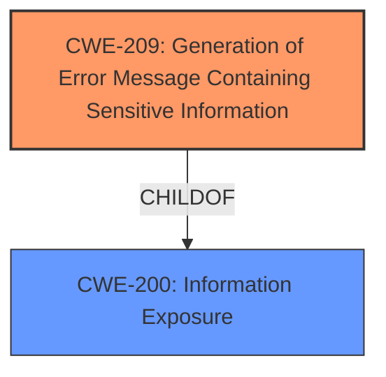

# Analysis Report for CVE-2020-20470

# Vulnerability Analysis Report: CVE-2020-20470

## Description


## Analysis (with Relationship Data)

# Summary
| CWE ID | CWE Name | Confidence | CWE Abstraction Level | CWE Vulnerability Mapping Label | CWE-Vulnerability Mapping Notes |
|---|---|---|---|---|---|
| CWE-209 | Generation of Error Message Containing Sensitive Information | 1 | Base | Primary | Allowed |

## Evidence and Confidence

*   **Confidence Score:** 1
*   **Evidence Strength:** HIGH

## Relationship Analysis
The primary CWE identified is CWE-209 (Generation of Error Message Containing Sensitive Information), which is a Base level CWE. It is related to CWE-200 (Information Exposure) as a child. The vulnerability involves leaking the physical path of the website, which falls under sensitive information disclosure. This path can aid attackers in planning further attacks.



## Vulnerability Chain
The vulnerability chain starts with the application failing to prevent the generation of error messages containing sensitive information, specifically the web site's physical path, and this leads to information exposure.

## Summary of Analysis
The initial assessment identified several potential CWEs from the retriever results, but CWE-209 best fits the vulnerability description because the **root cause** is the exposure of the web site's physical path through error messages.

The vulnerability description states: "White Shark System (WSS) 1.3.2 has web site physical path leakage vulnerability." and the "CVE Reference Links Content Summary" states "The application reveals its physical path through various files including `control_file.php`, `control_log.php`, `control_project.php`, `control_task.php`, `tree.php`. **Weakness:** Exposing the server's internal file structure allows attackers to gain knowledge about the application's environment. **Impact:** Information disclosure, which could facilitate more advanced attacks. **Attack Vector:** By accessing the mentioned files, an attacker can discover the server's physical file path.".

This aligns perfectly with the description of CWE-209: "The product generates an error message that includes sensitive information about its environment, users, or associated data."

CWE-425 (Direct Request ('Forced Browsing')) was also considered, given that accessing the files directly leads to the disclosure. However, the **root cause** isn't the lack of authorization, but the information leakage itself. Thus, CWE-209 is more appropriate.

The decision to select CWE-209 is based on the direct evidence of sensitive information exposure through error messages and the CWE's alignment with the **root cause** of the vulnerability.

Relevant CWE Information:
- CWE-209: Generation of Error Message Containing Sensitive Information


## CWE Relationship Analysis

Current CWEs represent these abstraction levels: .


### Vulnerability Chain Analysis

**Chain starting from CWE-425:**
- 425 (Direct Request ('Forced Browsing')) - ROOT


**Chain starting from CWE-200:**
- 200 (Exposure of Sensitive Information to an Unauthorized Actor) - ROOT


### CWE Relationship Diagram

```mermaid
graph TD
    classDef primary fill:#f96,stroke:#333,stroke-width:2px
    classDef secondary fill:#69f,stroke:#333
    classDef tertiary fill:#9e9,stroke:#333
```


*Report generated on 2025-04-01 23:21:14*
