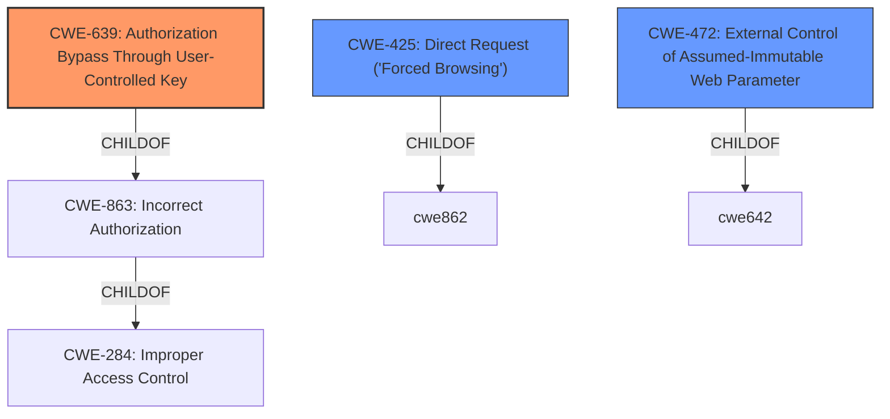

# Analysis for CVE-2020-20471

# Summary
| CWE ID | CWE Name | Confidence | CWE Abstraction Level | CWE Vulnerability Mapping Label | CWE-Vulnerability Mapping Notes |
|---|---|---|---|---|---|
| **CWE-639** | Authorization Bypass Through User-Controlled Key | 0.9 | Base | Primary | Allowed |
| CWE-425 | Direct Request ('Forced Browsing') | 0.7 | Base | Secondary | Allowed |
| CWE-472 | External Control of Assumed-Immutable Web Parameter | 0.6 | Base | Secondary | Allowed |

## Evidence and Confidence

*   **Confidence Score:** 0.8
*   **Evidence Strength:** HIGH

## Relationship Analysis
The primary CWE, CWE-639, is a base-level CWE that falls under the class CWE-863 (Incorrect Authorization). It specifically addresses authorization bypass through user-controlled keys. CWE-425 and CWE-472 are related in that they represent different facets of how user-controlled input can lead to vulnerabilities, often involving flawed assumptions about data integrity or access paths. All are base level.

## Vulnerability Chain
The vulnerability chain starts with the **root cause**: **insufficient authorization checks** in `default_user_edit.php` when updating user information based on the `ID` parameter from POST data. This leads to the **weakness**: the ability to modify any user's information, including their rank. The **impact** is privilege escalation, where a remote attacker can escalate their privileges to admin.

## Summary of Analysis
The initial assessment focused on the **lack of authorization** in `default_user_edit.php`, which allows unauthorized modification of user data. The key phrase "unauthorized access vulnerability" and the description of how an attacker can escalate privileges to admin strongly suggest an authorization issue.

The evidence from the CVE Reference Links Content Summary is:
"**Root Cause:** The `default_user_edit.php` file uses the `ID` parameter from the POST data to update user information without proper authorization checks.
**Vulnerability:** Ability to modify any user's information, including their rank, leading to privilege escalation.
**Impact:** Remote attackers can modify any user's details and escalate their privileges to admin.
**Attack Vector:** Sending a crafted HTTP POST request with a target `ID` and modified user details."

The retriever results and the complete CWE specifications were then analyzed.

CWE-639 (Authorization Bypass Through User-Controlled Key) appears to be the most fitting because the `ID` parameter, directly controlled by the user, is used to access and modify user data without proper authorization. The description of CWE-639 aligns closely with the vulnerability description, especially the part that says "The system's authorization functionality does not prevent one user from gaining access to another user's data or record by modifying the key value identifying the data." This aligns directly with the unauthorized modification of user information via the `ID` parameter.

CWE-425 (Direct Request ('Forced Browsing')) is a secondary consideration as the direct access to `default_user_edit.php` without proper authorization checks could be seen as a form of forced browsing.

CWE-472 (External Control of Assumed-Immutable Web Parameter) is also considered because the `ID` parameter might be treated as an immutable value, but it is, in fact, externally controllable and lacks proper validation.

CWE-620 (Unverified Password Change) was considered because of the "escalate to admin privileges", but it does not apply because the issue is about changing user information using the ID, not specifically changing the password.

CWE-209 (Generation of Error Message Containing Sensitive Information) was not considered, as the vulnerability description doesn't mention the generation of error messages containing sensitive information.

CWE-269 (Improper Privilege Management) was not selected because it's too high-level. The specific weakness is the lack of authorization checks, making CWE-639 a better fit.

CWE-23 (Relative Path Traversal) was not selected, as the vulnerability is not related to path traversal.

The selected CWEs are at the optimal level of specificity. CWE-639 directly addresses the root cause of the vulnerability: the authorization bypass due to the user-controlled `ID` parameter.

Relevant CWE Information:
*   CWE-639: Authorization Bypass Through User-Controlled Key
    *   Abstraction: Base
    *   Description: The system's authorization functionality does not prevent one user from gaining access to another user's data or record by modifying the key value identifying the data.
*   CWE-425: Direct Request ('Forced Browsing')
    *   Abstraction: Base
    *   Description: The web application does not adequately enforce appropriate authorization on all restricted URLs, scripts, or files.
*   CWE-472: External Control of Assumed-Immutable Web Parameter
    *   Abstraction: Base
    *   Description: The web application does not sufficiently verify inputs that are assumed to be immutable but are actually externally controllable, such as hidden form fields.