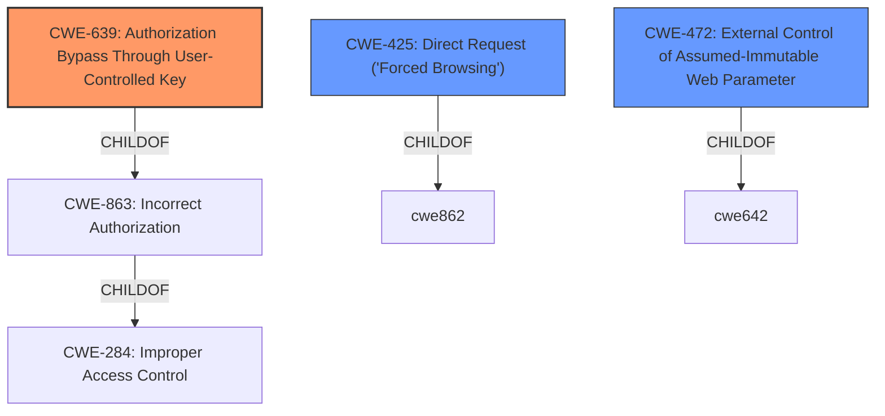

# Analysis for CVE-2020-20471

# Summary
| CWE ID | CWE Name | Confidence | CWE Abstraction Level | CWE Vulnerability Mapping Label | CWE-Vulnerability Mapping Notes |
|---|---|---|---|---|---|
| **CWE-639** | Authorization Bypass Through User-Controlled Key | 0.9 | Base | Primary | Allowed |
| CWE-425 | Direct Request ('Forced Browsing') | 0.7 | Base | Secondary | Allowed |
| CWE-472 | External Control of Assumed-Immutable Web Parameter | 0.6 | Base | Secondary | Allowed |

## Evidence and Confidence

*   **Confidence Score:** 0.8
*   **Evidence Strength:** HIGH

## Relationship Analysis
The primary CWE, CWE-639, is a base-level CWE that falls under the class CWE-863 (Incorrect Authorization). It specifically addresses authorization bypass through user-controlled keys. CWE-425 and CWE-472 are related in that they represent different facets of how user-controlled input can lead to vulnerabilities, often involving flawed assumptions about data integrity or access paths. All are base level.

## Vulnerability Chain
The vulnerability chain starts with the **root cause**: **insufficient authorization checks** in `default_user_edit.php` when updating user information based on the `ID` parameter from POST data. This leads to the **weakness**: the ability to modify any user's information, including their rank. The **impact** is privilege escalation, where a remote attacker can escalate their privileges to admin.

## Summary of Analysis
The initial assessment focused on the **lack of authorization** in `default_user_edit.php`, which allows unauthorized modification of user data. The key phrase "unauthorized access vulnerability" and the description of how an attacker can escalate privileges to admin strongly suggest an authorization issue.

The evidence from the CVE Reference Links Content Summary is:
"**Root Cause:** The `default_user_edit.php` file uses the `ID` parameter from the POST data to update user information without proper authorization checks.
**Vulnerability:** Ability to modify any user's information, including their rank, leading to privilege escalation.
**Impact:** Remote attackers can modify any user's details and escalate their privileges to admin.
**Attack Vector:** Sending a crafted HTTP POST request with a target `ID` and modified user details."

The retriever results and the complete CWE specifications were then analyzed.

CWE-639 (Authorization Bypass Through User-Controlled Key) appears to be the most fitting because the `ID` parameter, directly controlled by the user, is used to access and modify user data without proper authorization. The description of CWE-639 aligns closely with the vulnerability description, especially the part that says "The system's authorization functionality does not prevent one user from gaining access to another user's data or record by modifying the key value identifying the data." This aligns directly with the unauthorized modification of user information via the `ID` parameter.

CWE-425 (Direct Request ('Forced Browsing')) is a secondary consideration as the direct access to `default_user_edit.php` without proper authorization checks could be seen as a form of forced browsing.

CWE-472 (External Control of Assumed-Immutable Web Parameter) is also considered because the `ID` parameter might be treated as an immutable value, but it is, in fact, externally controllable and lacks proper validation.

CWE-620 (Unverified Password Change) was considered because of the "escalate to admin privileges", but it does not apply because the issue is about changing user information using the ID, not specifically changing the password.

CWE-209 (Generation of Error Message Containing Sensitive Information) was not considered, as the vulnerability description doesn't mention the generation of error messages containing sensitive information.

CWE-269 (Improper Privilege Management) was not selected because it's too high-level. The specific weakness is the lack of authorization checks, making CWE-639 a better fit.

CWE-23 (Relative Path Traversal) was not selected, as the vulnerability is not related to path traversal.

The selected CWEs are at the optimal level of specificity. CWE-639 directly addresses the root cause of the vulnerability: the authorization bypass due to the user-controlled `ID` parameter.

Relevant CWE Information:
*   CWE-639: Authorization Bypass Through User-Controlled Key
    *   Abstraction: Base
    *   Description: The system's authorization functionality does not prevent one user from gaining access to another user's data or record by modifying the key value identifying the data.
*   CWE-425: Direct Request ('Forced Browsing')
    *   Abstraction: Base
    *   Description: The web application does not adequately enforce appropriate authorization on all restricted URLs, scripts, or files.
*   CWE-472: External Control of Assumed-Immutable Web Parameter
    *   Abstraction: Base
    *   Description: The web application does not sufficiently verify inputs that are assumed to be immutable but are actually externally controllable, such as hidden form fields.

# Enhanced Query for CVE-2020-20471

## Vulnerability Description
White Shark System (WSS) 1.3.2 has an unauthorized access vulnerability in default_user_edit.php, remote attackers can exploit this vulnerability to escalate to admin privileges.

### Vulnerability Description Key Phrases
- **impact:** escalate to admin privileges
- **attacker:** remote attackers
- **product:** White Shark System (WSS)
- **version:** 1.3.2
- **component:** default_user_edit.php

## CVE Reference Links Content Summary
The provided content details multiple vulnerabilities in White Shark System(wss) version 1.3.2. This content provides more details than a typical CVE description.

Here's a breakdown of the vulnerabilities:

**[1] SQL Injection Vulnerability**

*   **Root Cause:** Insufficient input sanitization of the `sort` parameter in `control_task.php`, `control_project.php`, and `default_user.php` files.
*   **Vulnerability:** SQL injection due to direct insertion of user-controlled data into a database query. The `GetSQLValueString` function does not sanitize the input when the type is defined.
*   **Impact:** Remote attackers can extract sensitive database information.
*   **Attack Vector:** Sending a crafted HTTP GET request with a malicious `sort` parameter.
*   **Attacker Capabilities:** The attacker needs to be able to send HTTP requests to the server.

**[2] SQL Injection Vulnerability**

*   **Root Cause:** Insufficient input sanitization of the `csa_to_user` parameter in the `default_task_edituser.php` file.
*  **Vulnerability:** SQL injection due to direct insertion of user-controlled POST data into a database query.
*   **Impact:** Remote attackers can extract sensitive database information.
*   **Attack Vector:** Sending a crafted HTTP POST request with a malicious `csa_to_user` parameter.
*   **Attacker Capabilities:** The attacker needs to be able to send HTTP requests to the server.

**[3] SQL Injection Vulnerability**

*   **Root Cause:** Insufficient input sanitization of the `date` parameter in the `log_edit.php` file.
*   **Vulnerability:** SQL injection due to direct insertion of user-controlled data into a database query. The data is not processed by the `GetSQLValueString` function.
*   **Impact:** Remote attackers can extract sensitive database information.
*   **Attack Vector:** Sending a crafted HTTP GET request with a malicious `date` parameter.
*   **Attacker Capabilities:** The attacker needs to be able to send HTTP requests to the server.

**[4] Unauthorized Access Vulnerability**

*   **Root Cause:**  The `user_edit_password.php` file allows password modification based on the `ID` parameter without verifying the current password of the user being modified.
*   **Vulnerability:** Ability to change any user's password without proper authorization.
*   **Impact:** Remote attackers can modify the password of any user, including administrators.
*   **Attack Vector:** Sending a crafted HTTP POST request with a target `ID` and new password values.
*   **Attacker Capabilities:** The attacker needs to be able to send HTTP requests to the server, and have access to an authenticated session.

**[5] Cross-Site Request Forgery (CSRF) Vulnerability**

*   **Root Cause:** The `user_edit_password.php` file lacks CSRF protection, allowing malicious requests to be triggered by a victim's browser.
*   **Vulnerability:** Ability to modify a user's password through a CSRF attack.
*   **Impact:** Remote attackers can force a logged-in user to change their password.
*   **Attack Vector:** Tricking a logged-in user into visiting a malicious page that sends a crafted POST request to `user_edit_password.php`.
*    **Attacker Capabilities:** The attacker needs to trick a logged-in user into visiting a malicious page.

**[6] Unauthorized Access Vulnerability**

*   **Root Cause:** The `default_user_edit.php` file uses the `ID` parameter from the POST data to update user information without proper authorization checks.
*  **Vulnerability:** Ability to modify any user's information, including their rank, leading to privilege escalation.
*   **Impact:** Remote attackers can modify any user's details and escalate their privileges to admin.
*   **Attack Vector:** Sending a crafted HTTP POST request with a target `ID` and modified user details.
*   **Attacker Capabilities:** The attacker needs to be able to send HTTP requests to the server, and have access to an authenticated session.

**[7] Sensitive Information Disclosure Vulnerability**

*   **Root Cause:** The `if_get_addbook.php` file lacks proper authentication and authorization checks and the `check_token` function returns the uid of all users when the token is 0.
*   **Vulnerability:** Unauthorized retrieval of all users' information.
*  **Impact:** Remote attackers can obtain the usernames and other details of all users on the current site.
*   **Attack Vector:** Sending a POST request with the token parameter set to 0 to `if_get_addbook.php`.
*    **Attacker Capabilities:** The attacker needs to be able to send HTTP requests to the server.

**[8] Unauthorized Access Vulnerability**

*   **Root Cause:** The `default_task_add.php` file allows specifying the task creator using `$_POST[‘csa_create_user’]` without proper authorization.
*   **Vulnerability:** Ability to create tasks as another user, including the administrator.
*   **Impact:** Remote attackers can forge tasks created by any user including admin.
*  **Attack Vector:** Sending a POST request with a forged `csa_create_user` value to `default_task_add.php`.
*   **Attacker Capabilities:** The attacker needs to be able to send HTTP requests to the server, and have access to an authenticated session.

**[9] Web Site Physical Path Leakage Vulnerability**

*   **Root Cause:**  Multiple files (`control_file.php`, `control_log.php`, `control_project.php`, `control_task.php`, `tree.php`) display the full server path in error messages.
*   **Vulnerability:** Disclosure of server's physical path through error messages.
*   **Impact:**  Remote attackers can gain information about the server's directory structure.
*   **Attack Vector:** Triggering an error in the mentioned files.
*   **Attacker Capabilities:** The attacker needs to be able to send HTTP requests to the server and trigger errors.

In summary, the provided content details numerous vulnerabilities, including SQL injection, unauthorized access, CSRF, and sensitive information disclosure. These issues stem from lack of input validation and authorization checks within the application.

## Retriever Results

### Top Combined Results

| Rank | CWE ID | Name | Abstraction | Usage  | Retrievers | Individual Scores |
|------|--------|------|-------------|-------|------------|-------------------|
| 1 | 620 | Unverified Password Change | Base | Allowed | sparse | 0.057 |
| 2 | 472 | External Control of Assumed-Immutable Web Parameter | Base | Allowed | sparse | 0.055 |
| 3 | 639 | Authorization Bypass Through User-Controlled Key | Base | Allowed | sparse | 0.048 |
| 4 | 209 | Generation of Error Message Containing Sensitive Information | Base | Allowed | sparse | 0.048 |
| 5 | 269 | Improper Privilege Management | Class | Discouraged | sparse | 0.044 |
| 6 | 425 | Direct Request ('Forced Browsing') | Base | Allowed | dense | 0.524 |
| 7 | 471 | Modification of Assumed-Immutable Data (MAID) | Base | Allowed | graph | 0.003 |
| 8 | 285 | Improper Authorization | Class | Discouraged | sparse | 0.043 |
| 9 | 23 | Relative Path Traversal | Base | Allowed | sparse | 0.043 |
| 10 | 306 | Missing Authentication for Critical Function | Base | Allowed | sparse | 0.042 |

# Complete CWE Specifications

## CWE-620: Unverified Password Change
**Abstraction:** Base
**Status:** Draft

### Description
When setting a new password for a user, the product does not require knowledge of the original password, or using another form of authentication.

### Extended Description
This could be used by an attacker to change passwords for another user, thus gaining the privileges associated with that user.

### Alternative Terms
None

### Relationships
ChildOf -> CWE-1390

### Mapping Guidance
**Usage:** Allowed
**Rationale:** This CWE entry is at the Base level of abstraction, which is a preferred level of abstraction for mapping to the root causes of vulnerabilities.
**Comments:** Carefully read both the name and description to ensure that this mapping is an appropriate fit. Do not try to 'force' a mapping to a lower-level Base/Variant simply to comply with this preferred level of abstraction.
**Reasons:**
- Acceptable-Use

### Observed Examples
- **CVE-2007-0681:** Web app allows remote attackers to change the passwords of arbitrary users without providing the original password, and possibly perform other unauthorized actions.
- **CVE-2000-0944:** Web application password change utility doesn't check the original password.

## CWE-472: External Control of Assumed-Immutable Web Parameter
**Abstraction:** Base
**Status:** Draft

### Description
The web application does not sufficiently verify inputs that are assumed to be immutable but are actually externally controllable, such as hidden form fields.

### Extended Description

If a web product does not properly protect assumed-immutable values from modification in hidden form fields, parameters, cookies, or URLs, this can lead to modification of critical data. Web applications often mistakenly make the assumption that data passed to the client in hidden fields or cookies is not susceptible to tampering. Improper validation of data that are user-controllable can lead to the application processing incorrect, and often malicious, input.

For example, custom cookies commonly store session data or persistent data across sessions. This kind of session data is normally involved in security related decisions on the server side, such as user authentication and access control. Thus, the cookies might contain sensitive data such as user credentials and privileges. This is a dangerous practice, as it can often lead to improper reliance on the value of the client-provided cookie by the server side application.

### Alternative Terms
Assumed-Immutable Parameter Tampering

### Relationships
ChildOf -> CWE-642
ChildOf -> CWE-471

### Mapping Guidance
**Usage:** Allowed
**Rationale:** This CWE entry is at the Base level of abstraction, which is a preferred level of abstraction for mapping to the root causes of vulnerabilities.
**Comments:** Carefully read both the name and description to ensure that this mapping is an appropriate fit. Do not try to 'force' a mapping to a lower-level Base/Variant simply to comply with this preferred level of abstraction.
**Reasons:**
- Acceptable-Use

### Additional Notes
**[Relationship]** This is a primary weakness for many other weaknesses and functional consequences, including XSS, SQL injection, path disclosure, and file inclusion.

**[Theoretical]** This is a technology-specific MAID problem.

### Observed Examples
- **CVE-2002-0108:** Forum product allows spoofed messages of other users via hidden form fields for name and e-mail address.
- **CVE-2000-0253:** Shopping cart allows price modification via hidden form field.
- **CVE-2000-0254:** Shopping cart allows price modification via hidden form field.

## CWE-639: Authorization Bypass Through User-Controlled Key
**Abstraction:** Base
**Status:** Incomplete

### Description
The system's authorization functionality does not prevent one user from gaining access to another user's data or record by modifying the key value identifying the data.

### Extended Description

Retrieval of a user record occurs in the system based on some key value that is under user control. The key would typically identify a user-related record stored in the system and would be used to lookup that record for presentation to the user. It is likely that an attacker would have to be an authenticated user in the system. However, the authorization process would not properly check the data access operation to ensure that the authenticated user performing the operation has sufficient entitlements to perform the requested data access, hence bypassing any other authorization checks present in the system.

For example, attackers can look at places where user specific data is retrieved (e.g. search screens) and determine whether the key for the item being looked up is controllable externally. The key may be a hidden field in the HTML form field, might be passed as a URL parameter or as an unencrypted cookie variable, then in each of these cases it will be possible to tamper with the key value.

One manifestation of this weakness is when a system uses sequential or otherwise easily-guessable session IDs that would allow one user to easily switch to another user's session and read/modify their data.

### Alternative Terms
Insecure Direct Object Reference / IDOR: The "Insecure Direct Object Reference" term, as described in the OWASP Top Ten, is broader than this CWE because it also covers path traversal (CWE-22). Within the context of vulnerability theory, there is a similarity between the OWASP concept and CWE-706: Use of Incorrectly-Resolved Name or Reference.
Broken Object Level Authorization / BOLA: BOLA is used in the 2019 OWASP API Security Top 10 and is said to be the same as IDOR.
Horizontal Authorization: "Horizontal Authorization" is used to describe situations in which two users have the same privilege level, but must be prevented from accessing each other's resources. This is fairly common when using key-based access to resources in a multi-user context.

### Relationships
ChildOf -> CWE-863
ChildOf -> CWE-863
ChildOf -> CWE-284

### Mapping Guidance
**Usage:** Allowed
**Rationale:** This CWE entry is at the Base level of abstraction, which is a preferred level of abstraction for mapping to the root causes of vulnerabilities.
**Comments:** Carefully read both the name and description to ensure that this mapping is an appropriate fit. Do not try to 'force' a mapping to a lower-level Base/Variant simply to comply with this preferred level of abstraction.
**Reasons:**
- Acceptable-Use

### Observed Examples
- **CVE-2021-36539:** An educational application does not appropriately restrict file IDs to a particular user. The attacker can brute-force guess IDs, indicating IDOR.

## CWE-209: Generation of Error Message Containing Sensitive Information
**Abstraction:** Base
**Status:** Draft

### Description
The product generates an error message that includes sensitive information about its environment, users, or associated data.

### Extended Description

The sensitive information may be valuable information on its own (such as a password), or it may be useful for launching other, more serious attacks. The error message may be created in different ways:

  - self-generated: the source code explicitly constructs the error message and delivers it

  - externally-generated: the external environment, such as a language interpreter, handles the error and constructs its own message, whose contents are not under direct control by the programmer

An attacker may use the contents of error messages to help launch another, more focused attack. For example, an attempt to exploit a path traversal weakness (CWE-22) might yield the full pathname of the installed application. In turn, this could be used to select the proper number of ".." sequences to navigate to the targeted file. An attack using SQL injection (CWE-89) might not initially succeed, but an error message could reveal the malformed query, which would expose query logic and possibly even passwords or other sensitive information used within the query.

### Alternative Terms
None

### Relationships
ChildOf -> CWE-200
ChildOf -> CWE-200
ChildOf -> CWE-755

### Mapping Guidance
**Usage:** Allowed
**Rationale:** This CWE entry is at the Base level of abstraction, which is a preferred level of abstraction for mapping to the root causes of vulnerabilities.
**Comments:** Carefully read both the name and description to ensure that this mapping is an appropriate fit. Do not try to 'force' a mapping to a lower-level Base/Variant simply to comply with this preferred level of abstraction.
**Reasons:**
- Acceptable-Use

### Observed Examples
- **CVE-2008-2049:** POP3 server reveals a password in an error message after multiple APOP commands are sent. Might be resultant from another weakness.
- **CVE-2007-5172:** Program reveals password in error message if attacker can trigger certain database errors.
- **CVE-2008-4638:** Composite: application running with high privileges (CWE-250) allows user to specify a restricted file to process, which generates a parsing error that leaks the contents of the file (CWE-209).

## CWE-269: Improper Privilege Management
**Abstraction:** Class
**Status:** Draft

### Description
The product does not properly assign, modify, track, or check privileges for an actor, creating an unintended sphere of control for that actor.

### Extended Description
Not provided

### Alternative Terms
None

### Relationships
ChildOf -> CWE-284

### Mapping Guidance
**Usage:** Discouraged
**Rationale:** CWE-269 is commonly misused. It can be conflated with "privilege escalation," which is a technical impact that is listed in many low-information vulnerability reports [REF-1287]. It is not useful for trend analysis.
**Comments:** If an error or mistake allows privilege escalation, then use the CWE ID for that mistake. Avoid using CWE-269 when only phrases such as "privilege escalation" or "gain privileges" are available, as these indicate technical impact of the vulnerability - not the root cause weakness. If the root cause seems to be directly related to privileges, then examine the children of CWE-269 for additional hints, such as Execution with Unnecessary Privileges (CWE-250) or Incorrect Privilege Assignment (CWE-266).
**Reasons:**
- Frequent Misuse

### Additional Notes
**[Maintenance]** The relationships between privileges, permissions, and actors (e.g. users and groups) need further refinement within the Research view. One complication is that these concepts apply to two different pillars, related to control of resources (CWE-664) and protection mechanism failures (CWE-693).

### Observed Examples
- **CVE-2001-1555:** Terminal privileges are not reset when a user logs out.
- **CVE-2001-1514:** Does not properly pass security context to child processes in certain cases, allows privilege escalation.
- **CVE-2001-0128:** Does not properly compute roles.

## CWE-425: Direct Request ('Forced Browsing')
**Abstraction:** Base
**Status:** Incomplete

### Description
The web application does not adequately enforce appropriate authorization on all restricted URLs, scripts, or files.

### Extended Description
Web applications susceptible to direct request attacks often make the false assumption that such resources can only be reached through a given navigation path and so only apply authorization at certain points in the path.

### Alternative Terms
forced browsing: The "forced browsing" term could be misinterpreted to include weaknesses such as CSRF or XSS, so its use is discouraged.

### Relationships
ChildOf -> CWE-862
ChildOf -> CWE-862
ChildOf -> CWE-288
ChildOf -> CWE-424
CanPrecede -> CWE-471
CanPrecede -> CWE-98

### Mapping Guidance
**Usage:** Allowed
**Rationale:** This CWE entry is at the Base level of abstraction, which is a preferred level of abstraction for mapping to the root causes of vulnerabilities.
**Comments:** Carefully read both the name and description to ensure that this mapping is an appropriate fit. Do not try to 'force' a mapping to a lower-level Base/Variant simply to comply with this preferred level of abstraction.
**Reasons:**
- Acceptable-Use

### Additional Notes
**[Relationship]** Overlaps Modification of Assumed-Immutable Data (MAID), authorization errors, container errors; often primary to other weaknesses such as XSS and SQL injection.

**[Theoretical]** "Forced browsing" is a step-based manipulation involving the omission of one or more steps, whose order is assumed to be immutable. The application does not verify that the first step was performed successfully before the second step. The consequence is typically "authentication bypass" or "path disclosure," although it can be primary to all kinds of weaknesses, especially in languages such as PHP, which allow external modification of assumed-immutable variables.

### Observed Examples
- **CVE-2022-29238:** Access-control setting in web-based document collaboration tool is not properly implemented by the code, which prevents listing hidden directories but does not prevent direct requests to files in those directories.
- **CVE-2022-23607:** Python-based HTTP library did not scope cookies to a particular domain such that "supercookies" could be sent to any domain on redirect.
- **CVE-2004-2144:** Bypass authentication via direct request.

## CWE-471: Modification of Assumed-Immutable Data (MAID)
**Abstraction:** Base
**Status:** Draft

### Description
The product does not properly protect an assumed-immutable element from being modified by an attacker.

### Extended Description
This occurs when a particular input is critical enough to the functioning of the application that it should not be modifiable at all, but it is. Certain resources are often assumed to be immutable when they are not, such as hidden form fields in web applications, cookies, and reverse DNS lookups.

### Alternative Terms
None

### Relationships
ChildOf -> CWE-664

### Mapping Guidance
**Usage:** Allowed
**Rationale:** This CWE entry is at the Base level of abstraction, which is a preferred level of abstraction for mapping to the root causes of vulnerabilities.
**Comments:** Carefully read both the name and description to ensure that this mapping is an appropriate fit. Do not try to 'force' a mapping to a lower-level Base/Variant simply to comply with this preferred level of abstraction.
**Reasons:**
- Acceptable-Use

### Additional Notes
**[Relationship]** MAID issues can be primary to many other weaknesses, and they are a major factor in languages that provide easy access to internal program constructs, such as PHP's register_globals and similar features. However, MAID issues can also be resultant from weaknesses that modify internal state; for example, a program might validate some data and store it in memory, but a buffer overflow could overwrite that validated data, leading to a change in program logic.

**[Theoretical]** There are many examples where the MUTABILITY property is a major factor in a vulnerability.

### Observed Examples
- **CVE-2002-1757:** Relies on $PHP_SELF variable for authentication.
- **CVE-2005-1905:** Gain privileges by modifying assumed-immutable code addresses that are accessed by a driver.

## CWE-285: Improper Authorization
**Abstraction:** Class
**Status:** Draft

### Description
The product does not perform or incorrectly performs an authorization check when an actor attempts to access a resource or perform an action.

### Extended Description

Assuming a user with a given identity, authorization is the process of determining whether that user can access a given resource, based on the user's privileges and any permissions or other access-control specifications that apply to the resource.

When access control checks are not applied consistently - or not at all - users are able to access data or perform actions that they should not be allowed to perform. This can lead to a wide range of problems, including information exposures, denial of service, and arbitrary code execution.

### Alternative Terms
AuthZ: "AuthZ" is typically used as an abbreviation of "authorization" within the web application security community. It is distinct from "AuthN" (or, sometimes, "AuthC") which is an abbreviation of "authentication." The use of "Auth" as an abbreviation is discouraged, since it could be used for either authentication or authorization.

### Relationships
ChildOf -> CWE-284
ChildOf -> CWE-284

### Mapping Guidance
**Usage:** Discouraged
**Rationale:** CWE-285 is high-level and lower-level CWEs can frequently be used instead. It is a level-1 Class (i.e., a child of a Pillar).
**Comments:** Look at CWE-285's children and consider mapping to CWEs such as CWE-862: Missing Authorization, CWE-863: Incorrect Authorization, CWE-732: Incorrect Permission Assignment for Critical Resource, or others.
**Reasons:**
- Abstraction
**Suggested Alternatives:**
- CWE-862: Missing Authorization
- CWE-863: Incorrect Authorization
- CWE-732: Incorrect Permission Assignment for Critical Resource

### Observed Examples
- **CVE-2022-24730:** Go-based continuous deployment product does not check that a user has certain privileges to update or create an app, allowing adversaries to read sensitive repository information
- **CVE-2009-3168:** Web application does not restrict access to admin scripts, allowing authenticated users to reset administrative passwords.
- **CVE-2009-2960:** Web application does not restrict access to admin scripts, allowing authenticated users to modify passwords of other users.

## CWE-23: Relative Path Traversal
**Abstraction:** Base
**Status:** Draft

### Description
The product uses external input to construct a pathname that should be within a restricted directory, but it does not properly neutralize sequences such as ".." that can resolve to a location that is outside of that directory.

### Extended Description
This allows attackers to traverse the file system to access files or directories that are outside of the restricted directory.

### Alternative Terms
Zip Slip: "Zip slip" is an attack that uses file archives (e.g., ZIP, tar, rar, etc.) that contain filenames with path traversal sequences that cause the files to be written outside of the directory under which the archive is expected to be extracted [REF-1282]. It is most commonly used for relative path traversal (CWE-23) and link following (CWE-59).

### Relationships
ChildOf -> CWE-22
ChildOf -> CWE-22
ChildOf -> CWE-22

### Mapping Guidance
**Usage:** Allowed
**Rationale:** This CWE entry is at the Base level of abstraction, which is a preferred level of abstraction for mapping to the root causes of vulnerabilities.
**Comments:** Carefully read both the name and description to ensure that this mapping is an appropriate fit. Do not try to 'force' a mapping to a lower-level Base/Variant simply to comply with this preferred level of abstraction.
**Reasons:**
- Acceptable-Use

### Observed Examples
- **CVE-2024-37032:** Large language model (LLM) management tool does not validate the format of a digest value (CWE-1287) from a private, untrusted model registry, enabling relative path traversal (CWE-23), a.k.a. Probllama
- **CVE-2022-45918:** Chain: a learning management tool debugger uses external input to locate previous session logs (CWE-73) and does not properly validate the given path (CWE-20), allowing for filesystem path traversal using "../" sequences (CWE-24)
- **CVE-2019-20916:** Python package manager does not correctly restrict the filename specified in a Content-Disposition header, allowing arbitrary file read using path traversal sequences such as "../"

## CWE-306: Missing Authentication for Critical Function
**Abstraction:** Base
**Status:** Draft

### Description
The product does not perform any authentication for functionality that requires a provable user identity or consumes a significant amount of resources.

### Extended Description
Not provided

### Alternative Terms
None

### Relationships
ChildOf -> CWE-287
ChildOf -> CWE-287

### Mapping Guidance
**Usage:** Allowed
**Rationale:** This CWE entry is at the Base level of abstraction, which is a preferred level of abstraction for mapping to the root causes of vulnerabilities.
**Comments:** Carefully read both the name and description to ensure that this mapping is an appropriate fit. Do not try to 'force' a mapping to a lower-level Base/Variant simply to comply with this preferred level of abstraction.
**Reasons:**
- Acceptable-Use

### Observed Examples
- **CVE-2022-31260:** Chain: a digital asset management program has an undisclosed backdoor in the legacy version of a PHP script (CWE-912) that could allow an unauthenticated user to export metadata (CWE-306)
- **CVE-2022-29951:** TCP-based protocol in Programmable Logic Controller (PLC) has no authentication.
- **CVE-2022-29952:** Condition Monitor firmware uses a protocol that does not require authentication.

