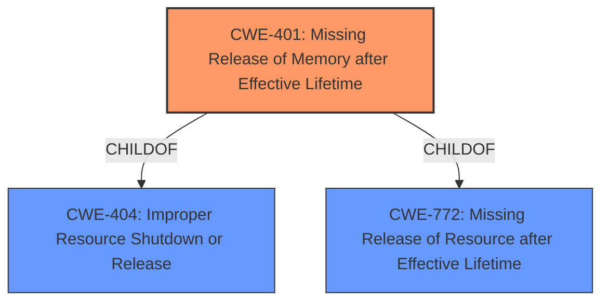

# Analysis for CVE-2020-20665

# Summary
| CWE ID | CWE Name | Confidence | CWE Abstraction Level | CWE Vulnerability Mapping Label | CWE-Vulnerability Mapping Notes |
|---|---|---|---|---|---|
| CWE-401 | Missing Release of Memory after Effective Lifetime | 1.0 | Variant | Allowed | Primary CWE |

## Evidence and Confidence

*   **Confidence Score:** 1.0
*   **Evidence Strength:** HIGH

## Relationship Analysis
The primary CWE selected is CWE-401 (Missing Release of Memory after Effective Lifetime), which is a variant of CWE-404 (Improper Resource Shutdown or Release) and CWE-772 (Missing Release of Resource after Effective Lifetime). Given the specific nature of the **memory leak**, CWE-401 is the most appropriate and specific choice.

## Vulnerability Chain
The vulnerability chain involves a coding error where allocated memory is not released.
  - Root Cause: **Missing release of memory** (CWE-401).
  - Impact: Resource exhaustion leading to potential service interruption.

## Summary of Analysis
The analysis is based on the provided evidence indicating a **memory leak** in `main.c`. The CVE Reference Links Content Summary explicitly states: "**Weaknesses/Vulnerabilities Present:** Memory leak, potentially double free. **Impact of Exploitation:** The leak leads to a resource exhaustion where memory is allocated but not freed leading to potential service interruption."

CWE-401 (Missing Release of Memory after Effective Lifetime) is the best fit because it specifically addresses the scenario where allocated memory is not released, leading to resource exhaustion. The retriever results also ranked CWE-401 as the top match. The abstraction level of "Variant" is appropriate as it is more specific than the class level CWE-404 or CWE-772.

Other CWEs Considered:

*   CWE-125 (Out-of-bounds Read): While a potential consequence of memory mismanagement, it is not the root cause.
*   CWE-909 (Missing Initialization of Resource): This CWE does not accurately describe the vulnerability. The issue is not with missing initialization, but with failing to release allocated memory.
*   CWE-476 (NULL Pointer Dereference): Not directly related to the described **memory leak**.
*   CWE-403 (Exposure of File Descriptor to Unintended Control Sphere ('File Descriptor Leak')): Addresses a different type of resource exposure, not applicable here.
*   CWE-1325 (Improperly Controlled Sequential Memory Allocation): While related to memory management, it does not precisely capture the essence of the **memory leak**.
* CWE-770 (Allocation of Resources Without Limits or Throttling): This CWE describes the situation where the amount of resources are not limited and not the specific case of a memory leak.
* CWE-787 (Out-of-bounds Write): Not directly related to the described **memory leak**.

Based on the evidence and the definitions of the CWEs, CWE-401 is the most specific and accurate classification for the given vulnerability description.