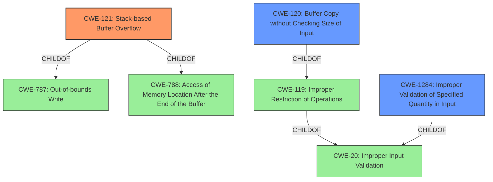

# Analysis Report for CVE-2020-20746

# Vulnerability Analysis Report: CVE-2020-20746

## Description


## Analysis (with Relationship Data)

# Summary
| CWE ID | CWE Name | Confidence | CWE Abstraction Level | CWE Vulnerability Mapping Label | CWE-Vulnerability Mapping Notes |
|---|---|---|---|---|---|
| CWE-121 | Stack-based Buffer Overflow | 1.0 | Variant | Primary | Allowed |
| CWE-120 | Buffer Copy without Checking Size of Input ('Classic Buffer Overflow') | 0.75 | Base | Secondary | Allowed-with-Review |
| CWE-1284 | Improper Validation of Specified Quantity in Input | 0.75 | Base | Secondary | Allowed |

## Evidence and Confidence

*   **Confidence Score:** 0.9
*   **Evidence Strength:** HIGH

## Relationship Analysis
The primary CWE is CWE-121, which is a `Variant` of CWE-787 (`Out-of-bounds Write`) and CWE-788 (`Access of Memory Location After the End of the Buffer`). CWE-120 is also related, as a `Base` CWE of CWE-119, which is a broader `Class` that includes various buffer handling issues. CWE-190 is also considered because an integer overflow can lead to buffer overflows, but it's not the primary cause here. CWE-1284 is considered because **improper input validation** of the size could lead to a buffer overflow.



## Vulnerability Chain
The vulnerability chain starts with **lack of input validation** (CWE-1284), leading to a **stack-based buffer overflow** (CWE-121), which can then result in arbitrary code execution or denial of service.

## Summary of Analysis
The analysis is based on the vulnerability description and CVE reference links.

The vulnerability description clearly states a "**stack-based buffer overflow**" exists. The CVE Reference Links Content Summary confirms that the **root cause** is a stack-based buffer overflow in the `fromSetRouteStatic` function due to the use of `sscanf` without proper bounds checking, parsing user-supplied content into a stack variable. This confirms that CWE-121 is a good fit.

The use of `sscanf` without validation implies that the size of the input is not being checked against the size of the buffer, which is also described by CWE-120: "Buffer Copy without Checking Size of Input ('Classic Buffer Overflow')". Since the overflow is happening on the stack, CWE-121 is a more precise description.

The **lack of input validation** also means that CWE-1284 "Improper Validation of Specified Quantity in Input" is applicable. The "list" parameter from the HTTP POST request is not validated for length, leading to the overflow.

CWE-119 "Improper Restriction of Operations within the Bounds of a Memory Buffer" is too general, and is discouraged by MITRE when more specific CWEs are available.

CWE-190 "Integer Overflow or Wraparound" is not directly applicable, as the vulnerability is not primarily caused by an integer overflow.

The selection of CWE-121 is at the optimal level of specificity, as it directly reflects the **root cause** described in the vulnerability description and CVE reference.

Relevant CWE Information:

# Enhanced Context (25 CWEs)
The following CWEs were identified as potentially relevant to this vulnerability:

## CWE-121: Stack-based Buffer Overflow
**Abstraction:** Variant
**Status:** Draft

### Description
A stack-based buffer overflow condition is a condition where the buffer being overwritten is allocated on the stack (i.e., is a local variable or, rarely, a parameter to a function).

### Extended Description
Not provided

### Alternative Terms
Stack Overflow: "Stack Overflow" is often used to mean the same thing as stack-based buffer overflow, however it is also used on occasion to mean stack exhaustion, usually a result from an excessively recursive function call. Due to the ambiguity of the term, use of stack overflow to describe either circumstance is discouraged.

### Relationships
ChildOf -> CWE-788
ChildOf -> CWE-787

### Mapping Guidance
**Usage:** Allowed
**Rationale:** This CWE entry is at the Variant level of abstraction, which is a preferred level of abstraction for mapping to the root causes of vulnerabilities.
**Comments:** Carefully read both the name and description to ensure that this mapping is an appropriate fit. Do not try to 'force' a mapping to a lower-level Base/Variant simply to comply with this preferred level of abstraction.
**Reasons:**
- Acceptable-Use


## CWE Relationship Analysis

Current CWEs represent these abstraction levels: .


### Vulnerability Chain Analysis

**Chain starting from CWE-121:**
- 121 (Stack-based Buffer Overflow) - ROOT


**Chain starting from CWE-787:**
- 787 (Out-of-bounds Write) - ROOT


### CWE Relationship Diagram

```mermaid
graph TD
    classDef primary fill:#f96,stroke:#333,stroke-width:2px
    classDef secondary fill:#69f,stroke:#333
    classDef tertiary fill:#9e9,stroke:#333
```


*Report generated on 2025-04-02 02:10:13*
