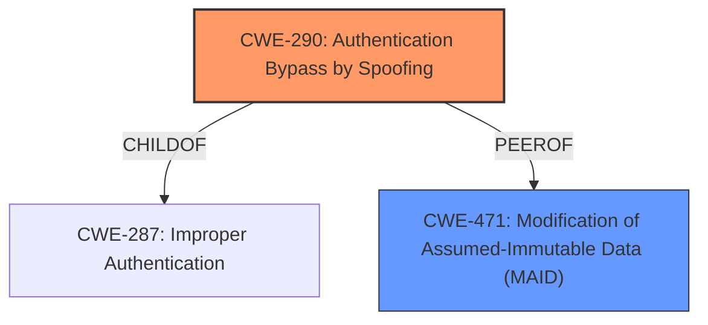

# Analysis for CVE-2020-2075

# Summary
| CWE ID | CWE Name | Confidence | CWE Abstraction Level | CWE Vulnerability Mapping Label | CWE-Vulnerability Mapping Notes |
|---|---|---|---|---|---|
| CWE-290 | Authentication Bypass by Spoofing | 0.7 | Base | Primary | Allowed |
| CWE-471 | Modification of Assumed-Immutable Data (MAID) | 0.5 | Base | Secondary | Allowed |

## Evidence and Confidence

*   **Confidence Score:** 0.7
*   **Evidence Strength:** LOW

## Relationship Analysis
The primary CWE is CWE-290 Authentication Bypass by Spoofing, which is a child of CWE-287 Improper Authentication. This indicates that the vulnerability involves bypassing authentication. The secondary CWE is CWE-471 Modification of Assumed-Immutable Data (MAID), which can indicate that the crafted packet modifies data that should not be modified, to achieve the bypass.

## Vulnerability Chain
The vulnerability chain starts with the **Platform mechanism AutoIP** allowing remote attackers to send a **crafted packet**, leading to authentication bypass and ultimately a device reboot.

## Summary of Analysis
The initial analysis focused on the **Platform mechanism AutoIP** and the ability of remote attackers to reboot the device with a **crafted packet**. Due to the lack of specific details in the CVE description and the **NOINFO** from the CVE Reference Links Content Summary, the assessment is based on the vulnerability description key phrases. The retriever results suggested several CWEs related to authentication and input validation, but the best fit seemed to be CWE-290 Authentication Bypass by Spoofing, given the potential to spoof packets and bypass authentication.

The relationship analysis further refined the selection. CWE-290 is a child of CWE-287, indicating it's a specific type of authentication issue. CWE-471 Modification of Assumed-Immutable Data (MAID) was considered as a contributing factor, as the **crafted packet** likely modifies data that should not be modified to achieve the bypass. The selection of CWE-290 is at the appropriate level of specificity, as it describes the core issue of bypassing authentication through spoofing.

Relevant CWE Information:

# Enhanced Context (25 CWEs)

## CWE-807: Reliance on Untrusted Inputs in a Security Decision
**Abstraction Level**: Base
**Similarity Score**: 0.79
**Source**: dense

**Description**:
The product uses a protection mechanism that relies on the existence or values of an input, but the input can be modified by an untrusted actor in a way that bypasses the protection mechanism.

**Mapping Guidance**:
- Usage: Allowed
- Rationale: This CWE entry is at the Base level of abstraction, which is a preferred level of abstraction for mapping to the root causes of vulnerabilities.

## CWE-319: Cleartext Transmission of Sensitive Information
**Abstraction Level**: Base
**Similarity Score**: 0.78
**Source**: dense

**Description**:
The product transmits sensitive or security-critical data in cleartext in a communication channel that can be sniffed by unauthorized actors.

**Mapping Guidance**:
- Usage: Allowed
- Rationale: This CWE entry is at the Base level of abstraction, which is a preferred level of abstraction for mapping to the root causes of vulnerabilities.

## CWE-345: Insufficient Verification of Data Authenticity
**Abstraction Level**: Class
**Similarity Score**: 0.78
**Source**: dense

**Description**:
The product does not sufficiently verify the origin or authenticity of data, in a way that causes it to accept invalid data.

**Mapping Guidance**:
- Usage: Discouraged
- Rationale: This CWE entry is a level-1 Class (i.e., a child of a Pillar). It might have lower-level children that would be more appropriate

## CWE-303: Incorrect Implementation of Authentication Algorithm
**Abstraction Level**: Base
**Similarity Score**: 0.78
**Source**: dense

**Description**:
The requirements for the product dictate the use of an established authentication algorithm, but the implementation of the algorithm is incorrect.

**Mapping Guidance**:
- Usage: Allowed
- Rationale: This CWE entry is at the Base level of abstraction, which is a preferred level of abstraction for mapping to the root causes of vulnerabilities.

## CWE-312: Cleartext Storage of Sensitive Information
**Abstraction Level**: Base
**Similarity Score**: 0.78
**Source**: dense

**Description**:
The product stores sensitive information in cleartext within a resource that might be accessible to another control sphere.

**Mapping Guidance**:
- Usage: Allowed
- Rationale: This CWE entry is at the Base level of abstraction, which is a preferred level of abstraction for mapping to the root causes of vulnerabilities.

## CWE-657: Violation of Secure Design Principles
**Abstraction Level**: Class
**Similarity Score**: 0.77
**Source**: dense

**Description**:
The product violates well-established principles for secure design.

**Mapping Guidance**:
- Usage: Discouraged
- Rationale: This CWE entry is a level-1 Class (i.e., a child of a Pillar). It might have lower-level children that would be more appropriate

## CWE-668: Exposure of Resource to Wrong Sphere
**Abstraction Level**: Class
**Similarity Score**: 0.77
**Source**: dense

**Description**:
The product exposes a resource to the wrong control sphere, providing unintended actors with inappropriate access to the resource.

**Mapping Guidance**:
- Usage: Discouraged
- Rationale: CWE-668 is high-level and is often misused as a catch-all when lower-level CWE IDs might be applicable. It is sometimes used for low-information vulnerability reports [REF-1287]. It is a level-1 Class (i.e., a child of a Pillar). It is not useful for trend analysis.

## CWE-212: Improper Removal of Sensitive Information Before Storage or Transfer
**Abstraction Level**: Base
**Similarity Score**: 0.77
**Source**: dense

**Description**:
The product stores, transfers, or shares a resource that contains sensitive information, but it does not properly remove that information before the product makes the resource available to unauthorized actors.

**Mapping Guidance**:
- Usage: Allowed
- Rationale: This CWE entry is at the Base level of abstraction, which is a preferred level of abstraction for mapping to the root causes of vulnerabilities.

## CWE-311: Missing Encryption of Sensitive Data
**Abstraction Level**: Class
**Similarity Score**: 0.77
**Source**: dense

**Description**:
The product does not encrypt sensitive or critical information before storage or transmission.

**Mapping Guidance**:
- Usage: Discouraged
- Rationale: CWE-311 is high-level with more precise children available. It is a level-1 Class (i.e., a child of a Pillar).

## CWE-703: Improper Check or Handling of Exceptional Conditions
**Abstraction Level**: Pillar
**Similarity Score**: 0.77
**Source**: dense

**Description**:
The product does not properly anticipate or handle exceptional conditions that rarely occur during normal operation of the product.

**Mapping Guidance**:
- Usage: Discouraged
- Rationale: This CWE entry is extremely high-level, a Pillar.

## CWE-184: Incomplete List of Disallowed Inputs
**Abstraction Level**: Base
**Similarity Score**: 4247.77
**Source**: sparse

**Description**:
The product implements a protection mechanism that relies on a list of inputs (or properties of inputs) that are not allowed by policy or otherwise require other action to neutralize before additional processing takes place, but the list is incomplete.

**Mapping Guidance**:
- Usage: Allowed
- Rationale: This CWE entry is at the Base level of abstraction, which is a preferred level of abstraction for mapping to the root causes of vulnerabilities.

## CWE-319: Cleartext Transmission of Sensitive Information
**Abstraction Level**: Base
**Similarity Score**: 4083.23
**Source**: sparse

**Description**:
The product transmits sensitive or security-critical data in cleartext in a communication channel that can be sniffed by unauthorized actors.

**Mapping Guidance**:
- Usage: Allowed
- Rationale: This CWE entry is at the Base level of abstraction, which is a preferred level of abstraction for mapping to the root causes of vulnerabilities.

## CWE-1390: Weak Authentication
**Abstraction Level**: Class
**Similarity Score**: 3997.99
**Source**: sparse

**Description**:

# Enhanced Query for CVE-2020-2075

## Vulnerability Description
**Platform mechanism AutoIP** allows remote attackers to reboot the device via a crafted packet in SICK AG solutions Bulkscan LMS111, Bulkscan LMS511, CLV62x CLV65x, ICR890-3, LMS10x, LMS11x, LMS15x, LMS12x, LMS13x, LMS14x, LMS5xx, LMS53x, MSC800, RFH.

### Vulnerability Description Key Phrases
- **rootcause:** **Platform mechanism AutoIP**
- **impact:** reboot the device
- **vector:** crafted packet
- **attacker:** remote attackers
- **product:** SICK AG solutions Bulkscan LMS111 and Bulkscan LMS511 and CLV62x and CLV65x and ICR890-3 and LMS10x and LMS11x and LMS15x and LMS12x and LMS13x and LMS14x and LMS5xx and LMS53x and MSC800 and RFH

## CVE Reference Links Content Summary
This document provides a general overview of SICK's Product Security Incident Response Team (PSIRT) and their vulnerability handling process. It also lists security advisories, but **does not contain specific information about CVE-2020-2075.**

Therefore, the response is: **NOINFO**

## Retriever Results

### Top Combined Results

| Rank | CWE ID | Name | Abstraction | Usage  | Retrievers | Individual Scores |
|------|--------|------|-------------|-------|------------|-------------------|
| 1 | 755 | Improper Handling of Exceptional Conditions | Class | Discouraged | sparse | 0.284 |
| 2 | 303 | Incorrect Implementation of Authentication Algorithm | Base | Allowed | sparse | 0.105 |
| 3 | 1287 | Improper Validation of Specified Type of Input | Base | Allowed | sparse | 0.100 |
| 4 | 1390 | Weak Authentication | Class | Allowed-with-Review | sparse | 0.099 |
| 5 | 306 | Missing Authentication for Critical Function | Base | Allowed | sparse | 0.098 |
| 6 | 291 | Reliance on IP Address for Authentication | Variant | Allowed | dense | 0.566 |
| 7 | 184 | Incomplete List of Disallowed Inputs | Base | Allowed | graph | 0.002 |
| 8 | 693 | Protection Mechanism Failure | Pillar | Discouraged | sparse | 0.096 |
| 9 | 1284 | Improper Validation of Specified Quantity in Input | Base | Allowed | sparse | 0.094 |
| 10 | 319 | Cleartext Transmission of Sensitive Information | Base | Allowed | sparse | 0.093 |

# Complete CWE Specifications

## CWE-755: Improper Handling of Exceptional Conditions
**Abstraction:** Class
**Status:** Incomplete

### Description
The product does not handle or incorrectly handles an exceptional condition.

### Extended Description
Not provided

### Alternative Terms
None

### Relationships
ChildOf -> CWE-703

### Mapping Guidance
**Usage:** Discouraged
**Rationale:** This CWE entry is a level-1 Class (i.e., a child of a Pillar). It might have lower-level children that would be more appropriate
**Comments:** Examine children of this entry to see if there is a better fit
**Reasons:**
- Abstraction

### Observed Examples
- **CVE-2023-41151:** SDK for OPC Unified Architecture (OPC UA) server has uncaught exception when a socket is blocked for writing but the server tries to send an error
- **[REF-1374]:** Chain: JavaScript-based cryptocurrency library can fall back to the insecure Math.random() function instead of reporting a failure (CWE-392), thus reducing the entropy (CWE-332) and leading to generation of non-unique cryptographic keys for Bitcoin wallets (CWE-1391)
- **CVE-2021-3011:** virtual interrupt controller in a virtualization product allows crash of host by writing a certain invalid value to a register, which triggers a fatal error instead of returning an error code

## CWE-303: Incorrect Implementation of Authentication Algorithm
**Abstraction:** Base
**Status:** Draft

### Description
The requirements for the product dictate the use of an established authentication algorithm, but the implementation of the algorithm is incorrect.

### Extended Description
This incorrect implementation may allow authentication to be bypassed.

### Alternative Terms
None

### Relationships
ChildOf -> CWE-1390

### Mapping Guidance
**Usage:** Allowed
**Rationale:** This CWE entry is at the Base level of abstraction, which is a preferred level of abstraction for mapping to the root causes of vulnerabilities.
**Comments:** Carefully read both the name and description to ensure that this mapping is an appropriate fit. Do not try to 'force' a mapping to a lower-level Base/Variant simply to comply with this preferred level of abstraction.
**Reasons:**
- Acceptable-Use

### Observed Examples
- **CVE-2003-0750:** Conditional should have been an 'or' not an 'and'.

## CWE-1287: Improper Validation of Specified Type of Input
**Abstraction:** Base
**Status:** Incomplete

### Description
The product receives input that is expected to be of a certain type, but it does not validate or incorrectly validates that the input is actually of the expected type.

### Extended Description

When input does not comply with the expected type, attackers could trigger unexpected errors, cause incorrect actions to take place, or exploit latent vulnerabilities that would not be possible if the input conformed with the expected type.

This weakness can appear in type-unsafe programming languages, or in programming languages that support casting or conversion of an input to another type.

### Alternative Terms
None

### Relationships
ChildOf -> CWE-20
PeerOf -> CWE-843

### Mapping Guidance
**Usage:** Allowed
**Rationale:** This CWE entry is at the Base level of abstraction, which is a preferred level of abstraction for mapping to the root causes of vulnerabilities.
**Comments:** Carefully read both the name and description to ensure that this mapping is an appropriate fit. Do not try to 'force' a mapping to a lower-level Base/Variant simply to comply with this preferred level of abstraction.
**Reasons:**
- Acceptable-Use

### Additional Notes
**[Maintenance]** This entry is still under development and will continue to see updates and content improvements.

### Observed Examples
- **CVE-2024-37032:** Large language model (LLM) management tool does not validate the format of a digest value (CWE-1287) from a private, untrusted model registry, enabling relative path traversal (CWE-23), a.k.a. Probllama
- **CVE-2008-2223:** SQL injection through an ID that was supposed to be numeric.

## CWE-1390: Weak Authentication
**Abstraction:** Class
**Status:** Incomplete

### Description
The product uses an authentication mechanism to restrict access to specific users or identities, but the mechanism does not sufficiently prove that the claimed identity is correct.

### Extended Description

Attackers may be able to bypass weak authentication faster and/or with less effort than expected.

### Alternative Terms
None

### Relationships
ChildOf -> CWE-287

### Mapping Guidance
**Usage:** Allowed-with-Review
**Rationale:** This CWE entry is a Class and might have Base-level children that would be more appropriate
**Comments:** Examine children of this entry to see if there is a better fit
**Reasons:**
- Abstraction

### Observed Examples
- **CVE-2022-30034:** Chain: Web UI for a Python RPC framework does not use regex anchors to validate user login emails (CWE-777), potentially allowing bypass of OAuth (CWE-1390).
- **CVE-2022-35248:** Chat application skips validation when Central Authentication Service (CAS) is enabled, effectively removing the second factor from two-factor authentication
- **CVE-2021-3116:** Chain: Python-based HTTP Proxy server uses the wrong boolean operators (CWE-480) causing an incorrect comparison (CWE-697) that identifies an authN failure if all three conditions are met instead of only one, allowing bypass of the proxy authentication (CWE-1390)

## CWE-306: Missing Authentication for Critical Function
**Abstraction:** Base
**Status:** Draft

### Description
The product does not perform any authentication for functionality that requires a provable user identity or consumes a significant amount of resources.

### Extended Description
Not provided

### Alternative Terms
None

### Relationships
ChildOf -> CWE-287
ChildOf -> CWE-287

### Mapping Guidance
**Usage:** Allowed
**Rationale:** This CWE entry is at the Base level of abstraction, which is a preferred level of abstraction for mapping to the root causes of vulnerabilities.
**Comments:** Carefully read both the name and description to ensure that this mapping is an appropriate fit. Do not try to 'force' a mapping to a lower-level Base/Variant simply to comply with this preferred level of abstraction.
**Reasons:**
- Acceptable-Use

### Observed Examples
- **CVE-2022-31260:** Chain: a digital asset management program has an undisclosed backdoor in the legacy version of a PHP script (CWE-912) that could allow an unauthenticated user to export metadata (CWE-306)
- **CVE-2022-29951:** TCP-based protocol in Programmable Logic Controller (PLC) has no authentication.
- **CVE-2022-29952:** Condition Monitor firmware uses a protocol that does not require authentication.

## CWE-291: Reliance on IP Address for Authentication
**Abstraction:** Variant
**Status:** Incomplete

### Description
The product uses an IP address for authentication.

### Extended Description
IP addresses can be easily spoofed. Attackers can forge the source IP address of the packets they send, but response packets will return to the forged IP address. To see the response packets, the attacker has to sniff the traffic between the victim machine and the forged IP address. In order to accomplish the required sniffing, attackers typically attempt to locate themselves on the same subnet as the victim machine. Attackers may be able to circumvent this requirement by using source routing, but source routing is disabled across much of the Internet today. In summary, IP address verification can be a useful part of an authentication scheme, but it should not be the single factor required for authentication.

### Alternative Terms
None

### Relationships
ChildOf -> CWE-290
ChildOf -> CWE-923
ChildOf -> CWE-471

### Mapping Guidance
**Usage:** Allowed
**Rationale:** This CWE entry is at the Variant level of abstraction, which is a preferred level of abstraction for mapping to the root causes of vulnerabilities.
**Comments:** Carefully read both the name and description to ensure that this mapping is an appropriate fit. Do not try to 'force' a mapping to a lower-level Base/Variant simply to comply with this preferred level of abstraction.
**Reasons:**
- Acceptable-Use

### Observed Examples
- **CVE-2022-30319:** S-bus functionality in a home automation product performs access control using an IP allowlist, which can be bypassed by a forged IP address.

## CWE-184: Incomplete List of Disallowed Inputs
**Abstraction:** Base
**Status:** Draft

### Description
The product implements a protection mechanism that relies on a list of inputs (or properties of inputs) that are not allowed by policy or otherwise require other action to neutralize before additional processing takes place, but the list is incomplete.

### Extended Description
Not provided

### Alternative Terms
Denylist / Deny List: This is used by CWE and CAPEC instead of other commonly-used terms. Its counterpart is allowlist.
Blocklist / Block List: This is often used by security tools such as firewalls, email or web gateways, proxies, etc.
Blacklist / Black List: This term is frequently used, but usage has been declining as organizations have started to adopt other terms.

### Relationships
ChildOf -> CWE-693
ChildOf -> CWE-1023
CanPrecede -> CWE-79
CanPrecede -> CWE-78
CanPrecede -> CWE-434
CanPrecede -> CWE-98

### Mapping Guidance
**Usage:** Allowed
**Rationale:** This CWE entry is at the Base level of abstraction, which is a preferred level of abstraction for mapping to the root causes of vulnerabilities.
**Comments:** Carefully read both the name and description to ensure that this mapping is an appropriate fit. Do not try to 'force' a mapping to a lower-level Base/Variant simply to comply with this preferred level of abstraction.
**Reasons:**
- Acceptable-Use

### Additional Notes
**[Relationship]** 

Multiple interpretation errors can indirectly introduce inputs that should be disallowed. For example, a list of dangerous shell metacharacters might not include a metacharacter that only has meaning in one particular shell, not all of them; or a check for XSS manipulations might ignore an unusual construct that is supported by one web browser, but not others.

### Observed Examples
- **CVE-2024-4315:** Chain: API for text generation using Large Language Models (LLMs) does not include the "\" Windows folder separator in its denylist (CWE-184) when attempting to prevent Local File Inclusion via path traversal (CWE-22), allowing deletion of arbitrary files on Windows systems.
- **CVE-2008-2309:** product uses a denylist to identify potentially dangerous content, allowing attacker to bypass a warning
- **CVE-2005-2782:** PHP remote file inclusion in web application that filters "http" and "https" URLs, but not "ftp".

## CWE-693: Protection Mechanism Failure
**Abstraction:** Pillar
**Status:** Draft

### Description
The product does not use or incorrectly uses a protection mechanism that provides sufficient defense against directed attacks against the product.

### Extended Description
This weakness covers three distinct situations. A "missing" protection mechanism occurs when the application does not define any mechanism against a certain class of attack. An "insufficient" protection mechanism might provide some defenses - for example, against the most common attacks - but it does not protect against everything that is intended. Finally, an "ignored" mechanism occurs when a mechanism is available and in active use within the product, but the developer has not applied it in some code path.

### Alternative Terms
None

### Relationships
None

### Mapping Guidance
**Usage:** Discouraged
**Rationale:** This CWE entry is extremely high-level, a Pillar.
**Comments:** Consider children or descendants of this entry instead.
**Reasons:**
- Abstraction

### Additional Notes
**[Research Gap]** The concept of protection mechanisms is well established, but protection mechanism failures have not been studied comprehensively. It is suspected that protection mechanisms can have significantly different types of weaknesses than the weaknesses that they are intended to prevent.

## CWE-1284: Improper Validation of Specified Quantity in Input
**Abstraction:** Base
**Status:** Incomplete

### Description
The product receives input that is expected to specify a quantity (such as size or length), but it does not validate or incorrectly validates that the quantity has the required properties.

### Extended Description

Specified quantities include size, length, frequency, price, rate, number of operations, time, and others. Code may rely on specified quantities to allocate resources, perform calculations, control iteration, etc. When the quantity is not properly validated, then attackers can specify malicious quantities to cause excessive resource allocation, trigger unexpected failures, enable buffer overflows, etc.

### Alternative Terms
None

### Relationships
ChildOf -> CWE-20
ChildOf -> CWE-20
CanPrecede -> CWE-789

### Mapping Guidance
**Usage:** Allowed
**Rationale:** This CWE entry is at the Base level of abstraction, which is a preferred level of abstraction for mapping to the root causes of vulnerabilities.
**Comments:** Carefully read both the name and description to ensure that this mapping is an appropriate fit. Do not try to 'force' a mapping to a lower-level Base/Variant simply to comply with this preferred level of abstraction.
**Reasons:**
- Acceptable-Use

### Additional Notes
**[Maintenance]** This entry is still under development and will continue to see updates and content improvements.

### Observed Examples
- **CVE-2022-21668:** Chain: Python library does not limit the resources used to process images that specify a very large number of bands (CWE-1284), leading to excessive memory consumption (CWE-789) or an integer overflow (CWE-190).
- **CVE-2008-1440:** lack of validation of length field leads to infinite loop
- **CVE-2008-2374:** lack of validation of string length fields allows memory consumption or buffer over-read

## CWE-319: Cleartext Transmission of Sensitive Information
**Abstraction:** Base
**Status:** Draft

### Description
The product transmits sensitive or security-critical data in cleartext in a communication channel that can be sniffed by unauthorized actors.

### Extended Description

Many communication channels can be "sniffed" (monitored) by adversaries during data transmission. For example, in networking, packets can traverse many intermediary nodes from the source to the destination, whether across the internet, an internal network, the cloud, etc. Some actors might have privileged access to a network interface or any link along the channel, such as a router, but they might not be authorized to collect the underlying data. As a result, network traffic could be sniffed by adversaries, spilling security-critical data.

Applicable communication channels are not limited to software products. Applicable channels include hardware-specific technologies such as internal hardware networks and external debug channels, supporting remote JTAG debugging. When mitigations are not applied to combat adversaries within the product's threat model, this weakness significantly lowers the difficulty of exploitation by such adversaries.

When full communications are recorded or logged, such as with a packet dump, an adversary could attempt to obtain the dump long after the transmission has occurred and try to "sniff" the cleartext from the recorded communications in the dump itself. Even if the information is encoded in a way that is not human-readable, certain techniques could determine which encoding is being used, then decode the information. 

### Alternative Terms
None

### Relationships
ChildOf -> CWE-311
ChildOf -> CWE-311

### Mapping Guidance
**Usage:** Allowed
**Rationale:** This CWE entry is at the Base level of abstraction, which is a preferred level of abstraction for mapping to the root causes of vulnerabilities.
**Comments:** Carefully read both the name and description to ensure that this mapping is an appropriate fit. Do not try to 'force' a mapping to a lower-level Base/Variant simply to comply with this preferred level of abstraction.
**Reasons:**
- Acceptable-Use

### Additional Notes
**[Maintenance]** The Taxonomy_Mappings to ISA/IEC 62443 were added in CWE 4.10, but they are still under review and might change in future CWE versions. These draft mappings were performed by members of the "Mapping CWE to 62443" subgroup of the CWE-CAPEC ICS/OT Special Interest Group (SIG), and their work is incomplete as of CWE 4.10. The mappings are included to facilitate discussion and review by the broader ICS/OT community, and they are likely to change in future CWE versions.

### Observed Examples
- **CVE-2022-29519:** Programmable Logic Controller (PLC) sends sensitive information in plaintext, including passwords and session tokens.
- **CVE-2022-30312:** Building Controller uses a protocol that transmits authentication credentials in plaintext.
- **CVE-2022-31204:** Programmable Logic Controller (PLC) sends password in plaintext.

