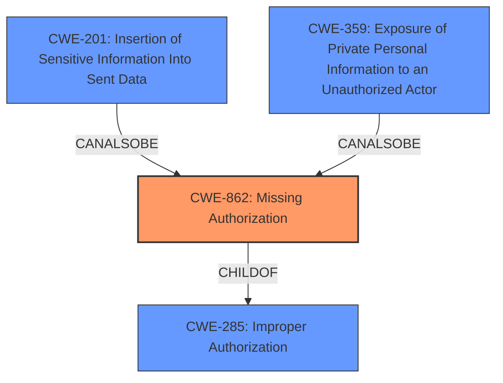

# Analysis for CVE-2020-2094

# Summary
| CWE ID | CWE Name | Confidence | CWE Abstraction Level | CWE Vulnerability Mapping Label | CWE-Vulnerability Mapping Notes |
|---|---|---|---|---|---|
| CWE-862 | Missing Authorization | 1.0 | Class | Primary | Allowed-with-Review |
| CWE-201 | Insertion of Sensitive Information Into Sent Data | 0.5 | Base | Secondary | Allowed |
| CWE-359 | Exposure of Private Personal Information to an Unauthorized Actor | 0.4 | Base | Secondary | Allowed |

## Evidence and Confidence

*   **Confidence Score:** 0.8
*   **Evidence Strength:** HIGH

## Relationship Analysis
The primary relationship influencing the CWE selection is the parent-child relationship. CWE-862 (Missing Authorization) is a child of CWE-285 (Improper Authorization). While CWE-285 could be considered, CWE-862 is more specific and aligns directly with the "**missing permission check**" root cause. Additionally, CWE-201 (Insertion of Sensitive Information Into Sent Data) and CWE-359 (Exposure of Private Personal Information to an Unauthorized Actor) can be linked to CWE-862, because the **missing authorization** allows an attacker to trigger the sending of an email with potentially sensitive details to an unauthorized recipient.

## Vulnerability Chain
The vulnerability chain starts with the **missing permission check** (CWE-862). This **missing check** leads to the impact of allowing attackers to send emails to attacker-specified recipients. The email's content is fixed, but the recipient's email may be considered personal information, so CWE-359 is considered. Also, sending an email to an attacker-specified recipient contains sensitive information so CWE-201 is considered.

## Summary of Analysis
The initial assessment identified CWE-862 as the primary candidate due to the explicit mention of "**missing permission check**" in the vulnerability description. The CVE reference links also confirm the **missing permission checks** as a root cause.

The retriever results also indicate CWE-862 as the top match. The relationship analysis reinforces this selection. CWE-862 is a child of CWE-285, but CWE-862 is more specific.

CWE-201 and CWE-359 were also considered as the attacker is able to send emails to attacker-specified recipient, where the email may contain sensitive information and the recipient's email may be considered personal information.

The selection of CWE-862 is based on the provided evidence, relationship analysis, and mapping guidance. The other CWEs are less relevant given the root cause directly points to **missing authorization**.

Relevant CWE Information:

# Enhanced Context (25 CWEs)

## CWE-538: Insertion of Sensitive Information into Externally-Accessible File or Directory
**Abstraction Level**: Base
**Similarity Score**: 0.78
**Source**: dense

**Description**:
The product places sensitive information into files or directories that are accessible to actors who are allowed to have access to the files, but not to the sensitive information.

**Mapping Guidance**:
- Usage: Allowed
- Rationale: This CWE entry is at the Base level of abstraction, which is a preferred level of abstraction for mapping to the root causes of vulnerabilities.

*Not Selected:* The vulnerability does not involve placing sensitive information into externally-accessible files or directories.

## CWE-319: Cleartext Transmission of Sensitive Information
**Abstraction Level**: Base
**Similarity Score**: 0.77
**Source**: dense

**Description**:
The product transmits sensitive or security-critical data in cleartext in a communication channel that can be sniffed by unauthorized actors.

**Mapping Guidance**:
- Usage: Allowed
- Rationale: This CWE entry is at the Base level of abstraction, which is a preferred level of abstraction for mapping to the root causes of vulnerabilities.

*Not Selected:* While the email sending might be in cleartext, the core issue is the **missing authorization**, not the transmission itself.

## CWE-312: Cleartext Storage of Sensitive Information
**Abstraction Level**: Base
**Similarity Score**: 0.77
**Source**: dense

**Description**:
The product stores sensitive information in cleartext within a resource that might be accessible to another control sphere.

**Mapping Guidance**:
- Usage: Allowed
- Rationale: This CWE entry is at the Base level of abstraction, which is a preferred level of abstraction for mapping to the root causes of vulnerabilities.

*Not Selected:* The vulnerability doesn't involve storing sensitive information in cleartext.

## CWE-212: Improper Removal of Sensitive Information Before Storage or Transfer
**Abstraction Level**: Base
**Similarity Score**: 0.76
**Source**: dense

**Description**:
The product stores, transfers, or shares a resource that contains sensitive information, but it does not properly remove that information before the product makes the resource available to unauthorized actors.

**Mapping Guidance**:
- Usage: Allowed
- Rationale: This CWE entry is at the Base level of abstraction, which is a preferred level of abstraction for mapping to the root causes of vulnerabilities.

*Not Selected:* This is not about improper removal of sensitive information, but about a **missing authorization check**.

## CWE-807: Reliance on Untrusted Inputs in a Security Decision
**Abstraction Level**: Base
**Similarity Score**: 0.76
**Source**: dense

**Description**:
The product uses a protection mechanism that relies on the existence or values of an input, but the input can be modified by an untrusted actor in a way that bypasses the protection mechanism.

**Mapping Guidance**:
- Usage: Allowed
- Rationale: This CWE entry is at the Base level of abstraction, which is a preferred level of abstraction for mapping to the root causes of vulnerabilities.

*Not Selected:* The vulnerability isn't about relying on untrusted inputs, but rather the **missing authorization check**.

## CWE-1390: Weak Authentication
**Abstraction Level**: Class
**Similarity Score**: 0.76
**Source**: dense

**Description**:
The product uses an authentication mechanism to restrict access to specific users or identities, but the mechanism does not sufficiently prove that the claimed identity is correct.

**Mapping Guidance**:
- Usage: Allowed-with-Review
- Rationale: This CWE entry is a Class and might have Base-level children that would be more appropriate

*Not Selected:* The issue is not weak authentication, it's the **missing authorization** after a user is already authenticated.

## CWE-1391: Use of Weak Credentials
**Abstraction Level**: Class
**Similarity Score**: 0.76
**Source**: dense

**Description**:
The product uses weak credentials (such as a default key or hard-coded password) that can be calculated, derived, reused, or guessed by an attacker.

**Mapping Guidance**:
- Usage: Allowed-with-Review
- Rationale: This CWE entry is a Class and might have Base-level children that would be more appropriate

*Not Selected:* This is not about weak credentials, it's a **missing authorization check**.

## CWE-345: Insufficient Verification of Data Authenticity
**Abstraction Level**: Class
**Similarity Score**: 0.76
**Source**: dense

**Description**:
The product does not sufficiently verify the origin or authenticity of data, in a way that causes it to accept invalid data.

**Mapping Guidance**:
- Usage: Discouraged
- Rationale: This CWE entry is a level-1 Class (i.e., a child of a Pillar). It might have lower-level children that would be more appropriate

*Not Selected:* This is not about insufficient verification of data authenticity, but a **missing authorization check**.

## CWE-668: Exposure of Resource to Wrong Sphere
**Abstraction Level**: Class
**Similarity Score**: 0.76
**Source**: dense

**Description**:
The product exposes a resource to the wrong control sphere, providing unintended actors with inappropriate access to the resource.

**Mapping Guidance**:
- Usage: Discouraged
- Rationale: CWE-668 is high-level and is often misused as a catch-all when lower-level CWE IDs might be applicable. It is sometimes used for low-information vulnerability reports [REF-1287]. It is a level-1 Class (i.e., a child of a Pillar).

# Enhanced Query for CVE-2020-2094

## Vulnerability Description
A **missing permission check** in Jenkins Health Advisor by CloudBees Plugin 3.0 and earlier allows attackers with Overall/Read permission to send a fixed email to an attacker-specific recipient.

### Vulnerability Description Key Phrases
- **rootcause:** **missing permission check**
- **impact:** send fixed email to attacker-specific recipient
- **attacker:** attackers with Overall/Read permission
- **product:** Jenkins Health Advisor by CloudBees Plugin
- **version:** 3.0 and earlier

## CVE Reference Links Content Summary
- **Root cause of vulnerability:** The Health Advisor by CloudBees Plugin does not perform permission checks in methods performing form validation and does not require POST requests.
- **Weaknesses/vulnerabilities present:** Missing permission checks, CSRF
- **Impact of exploitation:** Allows users with Overall/Read access to send an email with fixed content to an attacker-specified recipient.
- **Attack vectors:** By crafting a request to the vulnerable form validation method.
- **Required attacker capabilities/position:** The attacker needs to have Overall/Read access to Jenkins.

## Retriever Results

### Top Combined Results

| Rank | CWE ID | Name | Abstraction | Usage  | Retrievers | Individual Scores |
|------|--------|------|-------------|-------|------------|-------------------|
| 1 | 862 | Missing Authorization | Class | Allowed-with-Review | sparse | 0.304 |
| 2 | 863 | Incorrect Authorization | Class | Allowed-with-Review | sparse | 0.225 |
| 3 | 256 | Plaintext Storage of a Password | Base | Allowed | sparse | 0.213 |
| 4 | 285 | Improper Authorization | Class | Discouraged | sparse | 0.208 |
| 5 | 927 | Use of Implicit Intent for Sensitive Communication | Variant | Allowed | sparse | 0.192 |
| 6 | 276 | Incorrect Default Permissions | Base | Allowed | dense | 0.504 |
| 7 | 359 | Exposure of Private Personal Information to an Unauthorized Actor | Base | Allowed | graph | 0.002 |
| 8 | 306 | Missing Authentication for Critical Function | Base | Allowed | sparse | 0.190 |
| 9 | 201 | Insertion of Sensitive Information Into Sent Data | Base | Allowed | sparse | 0.189 |
| 10 | 522 | Insufficiently Protected Credentials | Class | Allowed-with-Review | sparse | 0.187 |

# Complete CWE Specifications

## CWE-862: Missing Authorization
**Abstraction:** Class
**Status:** Incomplete

### Description
The product does not perform an authorization check when an actor attempts to access a resource or perform an action.

### Extended Description
Not provided

### Alternative Terms
AuthZ: "AuthZ" is typically used as an abbreviation of "authorization" within the web application security community. It is distinct from "AuthN" (or, sometimes, "AuthC") which is an abbreviation of "authentication." The use of "Auth" as an abbreviation is discouraged, since it could be used for either authentication or authorization.

### Relationships
ChildOf -> CWE-285
ChildOf -> CWE-284

### Mapping Guidance
**Usage:** Allowed-with-Review
**Rationale:** This CWE entry is a Class and might have Base-level children that would be more appropriate
**Comments:** Examine children of this entry to see if there is a better fit
**Reasons:**
- Abstraction

### Additional Notes
**[Terminology]** Assuming a user with a given identity, authorization is the process of determining whether that user can access a given resource, based on the user's privileges and any permissions or other access-control specifications that apply to the resource.

### Observed Examples
- **CVE-2022-24730:** Go-based continuous deployment product does not check that a user has certain privileges to update or create an app, allowing adversaries to read sensitive repository information
- **CVE-2009-3168:** Web application does not restrict access to admin scripts, allowing authenticated users to reset administrative passwords.
- **CVE-2009-3597:** Web application stores database file under the web root with insufficient access control (CWE-219), allowing direct request.

## CWE-863: Incorrect Authorization
**Abstraction:** Class
**Status:** Incomplete

### Description
The product performs an authorization check when an actor attempts to access a resource or perform an action, but it does not correctly perform the check.

### Extended Description
Not provided

### Alternative Terms
AuthZ: "AuthZ" is typically used as an abbreviation of "authorization" within the web application security community. It is distinct from "AuthN" (or, sometimes, "AuthC") which is an abbreviation of "authentication." The use of "Auth" as an abbreviation is discouraged, since it could be used for either authentication or authorization.

### Relationships
ChildOf -> CWE-285
ChildOf -> CWE-284

### Mapping Guidance
**Usage:** Allowed-with-Review
**Rationale:** This CWE entry is a Class and might have Base-level children that would be more appropriate
**Comments:** Examine children of this entry to see if there is a better fit
**Reasons:**
- Abstraction

### Additional Notes
**[Terminology]** 

Assuming a user with a given identity, authorization is the process of determining whether that user can access a given resource, based on the user's privileges and any permissions or other access-control specifications that apply to the resource.

### Observed Examples
- **CVE-2021-39155:** Chain: A microservice integration and management platform compares the hostname in the HTTP Host header in a case-sensitive way (CWE-178, CWE-1289), allowing bypass of the authorization policy (CWE-863) using a hostname with mixed case or other variations.
- **CVE-2019-15900:** Chain: sscanf() call is used to check if a username and group exists, but the return value of sscanf() call is not checked (CWE-252), causing an uninitialized variable to be checked (CWE-457), returning success to allow authorization bypass for executing a privileged (CWE-863).
- **CVE-2009-2213:** Gateway uses default "Allow" configuration for its authorization settings.

## CWE-256: Plaintext Storage of a Password
**Abstraction:** Base
**Status:** Incomplete

### Description
Storing a password in plaintext may result in a system compromise.

### Extended Description
Password management issues occur when a password is stored in plaintext in an application's properties, configuration file, or memory. Storing a plaintext password in a configuration file allows anyone who can read the file access to the password-protected resource. In some contexts, even storage of a plaintext password in memory is considered a security risk if the password is not cleared immediately after it is used.

### Alternative Terms
None

### Relationships
ChildOf -> CWE-522

### Mapping Guidance
**Usage:** Allowed
**Rationale:** This CWE entry is at the Base level of abstraction, which is a preferred level of abstraction for mapping to the root causes of vulnerabilities.
**Comments:** Carefully read both the name and description to ensure that this mapping is an appropriate fit. Do not try to 'force' a mapping to a lower-level Base/Variant simply to comply with this preferred level of abstraction.
**Reasons:**
- Acceptable-Use

### Observed Examples
- **CVE-2022-30275:** Remote Terminal Unit (RTU) uses a driver that relies on a password stored in plaintext.

## CWE-285: Improper Authorization
**Abstraction:** Class
**Status:** Draft

### Description
The product does not perform or incorrectly performs an authorization check when an actor attempts to access a resource or perform an action.

### Extended Description

Assuming a user with a given identity, authorization is the process of determining whether that user can access a given resource, based on the user's privileges and any permissions or other access-control specifications that apply to the resource.

When access control checks are not applied consistently - or not at all - users are able to access data or perform actions that they should not be allowed to perform. This can lead to a wide range of problems, including information exposures, denial of service, and arbitrary code execution.

### Alternative Terms
AuthZ: "AuthZ" is typically used as an abbreviation of "authorization" within the web application security community. It is distinct from "AuthN" (or, sometimes, "AuthC") which is an abbreviation of "authentication." The use of "Auth" as an abbreviation is discouraged, since it could be used for either authentication or authorization.

### Relationships
ChildOf -> CWE-284
ChildOf -> CWE-284

### Mapping Guidance
**Usage:** Discouraged
**Rationale:** CWE-285 is high-level and lower-level CWEs can frequently be used instead. It is a level-1 Class (i.e., a child of a Pillar).
**Comments:** Look at CWE-285's children and consider mapping to CWEs such as CWE-862: Missing Authorization, CWE-863: Incorrect Authorization, CWE-732: Incorrect Permission Assignment for Critical Resource, or others.
**Reasons:**
- Abstraction
**Suggested Alternatives:**
- CWE-862: Missing Authorization
- CWE-863: Incorrect Authorization
- CWE-732: Incorrect Permission Assignment for Critical Resource

### Observed Examples
- **CVE-2022-24730:** Go-based continuous deployment product does not check that a user has certain privileges to update or create an app, allowing adversaries to read sensitive repository information
- **CVE-2009-3168:** Web application does not restrict access to admin scripts, allowing authenticated users to reset administrative passwords.
- **CVE-2009-2960:** Web application does not restrict access to admin scripts, allowing authenticated users to modify passwords of other users.

## CWE-927: Use of Implicit Intent for Sensitive Communication
**Abstraction:** Variant
**Status:** Incomplete

### Description
The Android application uses an implicit intent for transmitting sensitive data to other applications.

### Extended Description

Since an implicit intent does not specify a particular application to receive the data, any application can process the intent by using an Intent Filter for that intent. This can allow untrusted applications to obtain sensitive data. There are two variations on the standard broadcast intent, ordered and sticky.

Ordered broadcast intents are delivered to a series of registered receivers in order of priority as declared by the Receivers. A malicious receiver can give itself a high priority and cause a denial of service by stopping the broadcast from propagating further down the chain. There is also the possibility of malicious data modification, as a receiver may also alter the data within the Intent before passing it on to the next receiver. The downstream components have no way of asserting that the data has not been altered earlier in the chain.

Sticky broadcast intents remain accessible after the initial broadcast. An old sticky intent will be broadcast again to any new receivers that register for it in the future, greatly increasing the chances of information exposure over time. Also, sticky broadcasts cannot be protected by permissions that may apply to other kinds of intents.

In addition, any broadcast intent may include a URI that references data that the receiving component does not normally have the privileges to access. The sender of the intent can include special privileges that grant the receiver read or write access to the specific URI included in the intent. A malicious receiver that intercepts this intent will also gain those privileges and be able to read or write the resource at the specified URI.

### Alternative Terms
None

### Relationships
ChildOf -> CWE-285
ChildOf -> CWE-668

### Mapping Guidance
**Usage:** Allowed
**Rationale:** This CWE entry is at the Variant level of abstraction, which is a preferred level of abstraction for mapping to the root causes of vulnerabilities.
**Comments:** Carefully read both the name and description to ensure that this mapping is an appropriate fit. Do not try to 'force' a mapping to a lower-level Base/Variant simply to comply with this preferred level of abstraction.
**Reasons:**
- Acceptable-Use

### Observed Examples
- **CVE-2022-4903:** An Android application does not use FLAG_IMMUTABLE when creating a PendingIntent.

## CWE-276: Incorrect Default Permissions
**Abstraction:** Base
**Status:** Draft

### Description
During installation, installed file permissions are set to allow anyone to modify those files.

### Extended Description
Not provided

### Alternative Terms
None

### Relationships
ChildOf -> CWE-732
ChildOf -> CWE-732

### Mapping Guidance
**Usage:** Allowed
**Rationale:** This CWE entry is at the Base level of abstraction, which is a preferred level of abstraction for mapping to the root causes of vulnerabilities.
**Comments:** Carefully read both the name and description to ensure that this mapping is an appropriate fit. Do not try to 'force' a mapping to a lower-level Base/Variant simply to comply with this preferred level of abstraction.
**Reasons:**
- Acceptable-Use

### Observed Examples
- **CVE-2005-1941:** Executables installed world-writable.
- **CVE-2002-1713:** Home directories installed world-readable.
- **CVE-2001-1550:** World-writable log files allow information loss; world-readable file has cleartext passwords.

## CWE-359: Exposure of Private Personal Information to an Unauthorized Actor
**Abstraction:** Base
**Status:** Incomplete

### Description
The product does not properly prevent a person's private, personal information from being accessed by actors who either (1) are not explicitly authorized to access the information or (2) do not have the implicit consent of the person about whom the information is collected.

### Extended Description
Not provided

### Alternative Terms
Privacy violation
Privacy leak
Privacy leakage

### Relationships
ChildOf -> CWE-200

### Mapping Guidance
**Usage:** Allowed
**Rationale:** This CWE entry is at the Base level of abstraction, which is a preferred level of abstraction for mapping to the root causes of vulnerabilities.
**Comments:** Carefully read both the name and description to ensure that this mapping is an appropriate fit. Do not try to 'force' a mapping to a lower-level Base/Variant simply to comply with this preferred level of abstraction.
**Reasons:**
- Acceptable-Use

### Additional Notes
**[Maintenance]** This entry overlaps many other entries that are not organized around the kind of sensitive information that is exposed. However, because privacy is treated with such importance due to regulations and other factors, and it may be useful for weakness-finding tools to highlight capabilities that detect personal private information instead of system information, it is not clear whether - and how - this entry should be deprecated.

**[Other]** 

There are many types of sensitive information that products must protect from attackers, including system data, communications, configuration, business secrets, intellectual property, and an individual's personal (private) information. Private personal information may include a password, phone number, geographic location, personal messages, credit card number, etc. Private information is important to consider whether the person is a user of the product, or part of a data set that is processed by the product. An exposure of private information does not necessarily prevent the product from working properly, and in fact the exposure might be intended by the developer, e.g. as part of data sharing with other organizations. However, the exposure of personal private information can still be undesirable or explicitly prohibited by law or regulation.

Some types of private information include:

  - Government identifiers, such as Social Security Numbers

  - Contact information, such as home addresses and telephone numbers

  - Geographic location - where the user is (or was)

  - Employment history

  - Financial data - such as credit card numbers, salary, bank accounts, and debts

  - Pictures, video, or audio

  - Behavioral patterns - such as web surfing history, when certain activities are performed, etc.

  - Relationships (and types of relationships) with others - family, friends, contacts, etc.

  - Communications - e-mail addresses, private messages, text messages, chat logs, etc.

  - Health - medical conditions, insurance status, prescription records

  - Account passwords and other credentials

Some of this information may be characterized as PII (Personally Identifiable Information), Protected Health Information (PHI), etc. Categories of private information may overlap or vary based on the intended usage or the policies and practices of a particular industry.

Sometimes data that is not labeled as private can have a privacy implication in a different context. For example, student identification numbers are usually not considered private because there is no explicit and publicly-available mapping to an individual student's personal information. However, if a school generates identification numbers based on student social security numbers, then the identification numbers should be considered private.

## CWE-306: Missing Authentication for Critical Function
**Abstraction:** Base
**Status:** Draft

### Description
The product does not perform any authentication for functionality that requires a provable user identity or consumes a significant amount of resources.

### Extended Description
Not provided

### Alternative Terms
None

### Relationships
ChildOf -> CWE-287
ChildOf -> CWE-287

### Mapping Guidance
**Usage:** Allowed
**Rationale:** This CWE entry is at the Base level of abstraction, which is a preferred level of abstraction for mapping to the root causes of vulnerabilities.
**Comments:** Carefully read both the name and description to ensure that this mapping is an appropriate fit. Do not try to 'force' a mapping to a lower-level Base/Variant simply to comply with this preferred level of abstraction.
**Reasons:**
- Acceptable-Use

### Observed Examples
- **CVE-2022-31260:** Chain: a digital asset management program has an undisclosed backdoor in the legacy version of a PHP script (CWE-912) that could allow an unauthenticated user to export metadata (CWE-306)
- **CVE-2022-29951:** TCP-based protocol in Programmable Logic Controller (PLC) has no authentication.
- **CVE-2022-29952:** Condition Monitor firmware uses a protocol that does not require authentication.

## CWE-201: Insertion of Sensitive Information Into Sent Data
**Abstraction:** Base
**Status:** Draft

### Description
The code transmits data to another actor, but a portion of the data includes sensitive information that should not be accessible to that actor.

### Extended Description
Not provided

### Alternative Terms
None

### Relationships
ChildOf -> CWE-200
CanAlsoBe -> CWE-209
CanAlsoBe -> CWE-202

### Mapping Guidance
**Usage:** Allowed
**Rationale:** This CWE entry is at the Base level of abstraction, which is a preferred level of abstraction for mapping to the root causes of vulnerabilities.
**Comments:** Carefully read both the name and description to ensure that this mapping is an appropriate fit. Do not try to 'force' a mapping to a lower-level Base/Variant simply to comply with this preferred level of abstraction.
**Reasons:**
- Acceptable-Use

### Additional Notes
**[Other]** Sensitive information could include data that is sensitive in and of itself (such as credentials or private messages), or otherwise useful in the further exploitation of the system (such as internal file system structure).

### Observed Examples
- **CVE-2022-0708:** Collaboration platform does not clear team emails in a response, allowing leak of email addresses

## CWE-522: Insufficiently Protected Credentials
**Abstraction:** Class
**Status:** Incomplete

### Description
The product transmits or stores authentication credentials, but it uses an insecure method that is susceptible to unauthorized interception and/or retrieval.

### Extended Description
Not provided

### Alternative Terms
None

### Relationships
ChildOf -> CWE-1390
ChildOf -> CWE-287
ChildOf -> CWE-668

### Mapping Guidance
**Usage:** Allowed-with-Review
**Rationale:** This CWE entry is a Class and might have Base-level children that would be more appropriate
**Comments:** Examine children of this entry to see if there is a better fit
**Reasons:**
- Abstraction

### Observed Examples
- **CVE-2022-30018:** A messaging platform serializes all elements of User/Group objects, making private information available to adversaries
- **CVE-2022-29959:** Initialization file contains credentials that can be decoded using a "simple string transformation"
- **CVE-2022-35411:** Python-based RPC framework enables pickle functionality by default, allowing clients to unpickle untrusted data.

