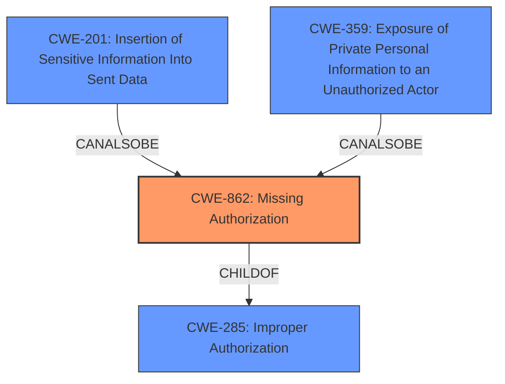

# Analysis Report for CVE-2020-2094

# Vulnerability Analysis Report: CVE-2020-2094

## Description


## Analysis (with Relationship Data)

# Summary
| CWE ID | CWE Name | Confidence | CWE Abstraction Level | CWE Vulnerability Mapping Label | CWE-Vulnerability Mapping Notes |
|---|---|---|---|---|---|
| CWE-862 | Missing Authorization | 1.0 | Class | Primary | Allowed-with-Review |
| CWE-201 | Insertion of Sensitive Information Into Sent Data | 0.5 | Base | Secondary | Allowed |
| CWE-359 | Exposure of Private Personal Information to an Unauthorized Actor | 0.4 | Base | Secondary | Allowed |

## Evidence and Confidence

*   **Confidence Score:** 0.8
*   **Evidence Strength:** HIGH

## Relationship Analysis
The primary relationship influencing the CWE selection is the parent-child relationship. CWE-862 (Missing Authorization) is a child of CWE-285 (Improper Authorization). While CWE-285 could be considered, CWE-862 is more specific and aligns directly with the "**missing permission check**" root cause. Additionally, CWE-201 (Insertion of Sensitive Information Into Sent Data) and CWE-359 (Exposure of Private Personal Information to an Unauthorized Actor) can be linked to CWE-862, because the **missing authorization** allows an attacker to trigger the sending of an email with potentially sensitive details to an unauthorized recipient.



## Vulnerability Chain
The vulnerability chain starts with the **missing permission check** (CWE-862). This **missing check** leads to the impact of allowing attackers to send emails to attacker-specified recipients. The email's content is fixed, but the recipient's email may be considered personal information, so CWE-359 is considered. Also, sending an email to an attacker-specified recipient contains sensitive information so CWE-201 is considered.

## Summary of Analysis
The initial assessment identified CWE-862 as the primary candidate due to the explicit mention of "**missing permission check**" in the vulnerability description. The CVE reference links also confirm the **missing permission checks** as a root cause.

The retriever results also indicate CWE-862 as the top match. The relationship analysis reinforces this selection. CWE-862 is a child of CWE-285, but CWE-862 is more specific.

CWE-201 and CWE-359 were also considered as the attacker is able to send emails to attacker-specified recipient, where the email may contain sensitive information and the recipient's email may be considered personal information.

The selection of CWE-862 is based on the provided evidence, relationship analysis, and mapping guidance. The other CWEs are less relevant given the root cause directly points to **missing authorization**.

Relevant CWE Information:

# Enhanced Context (25 CWEs)

## CWE-538: Insertion of Sensitive Information into Externally-Accessible File or Directory
**Abstraction Level**: Base
**Similarity Score**: 0.78
**Source**: dense

**Description**:
The product places sensitive information into files or directories that are accessible to actors who are allowed to have access to the files, but not to the sensitive information.

**Mapping Guidance**:
- Usage: Allowed
- Rationale: This CWE entry is at the Base level of abstraction, which is a preferred level of abstraction for mapping to the root causes of vulnerabilities.

*Not Selected:* The vulnerability does not involve placing sensitive information into externally-accessible files or directories.

## CWE-319: Cleartext Transmission of Sensitive Information
**Abstraction Level**: Base
**Similarity Score**: 0.77
**Source**: dense

**Description**:
The product transmits sensitive or security-critical data in cleartext in a communication channel that can be sniffed by unauthorized actors.

**Mapping Guidance**:
- Usage: Allowed
- Rationale: This CWE entry is at the Base level of abstraction, which is a preferred level of abstraction for mapping to the root causes of vulnerabilities.

*Not Selected:* While the email sending might be in cleartext, the core issue is the **missing authorization**, not the transmission itself.

## CWE-312: Cleartext Storage of Sensitive Information
**Abstraction Level**: Base
**Similarity Score**: 0.77
**Source**: dense

**Description**:
The product stores sensitive information in cleartext within a resource that might be accessible to another control sphere.

**Mapping Guidance**:
- Usage: Allowed
- Rationale: This CWE entry is at the Base level of abstraction, which is a preferred level of abstraction for mapping to the root causes of vulnerabilities.

*Not Selected:* The vulnerability doesn't involve storing sensitive information in cleartext.

## CWE-212: Improper Removal of Sensitive Information Before Storage or Transfer
**Abstraction Level**: Base
**Similarity Score**: 0.76
**Source**: dense

**Description**:
The product stores, transfers, or shares a resource that contains sensitive information, but it does not properly remove that information before the product makes the resource available to unauthorized actors.

**Mapping Guidance**:
- Usage: Allowed
- Rationale: This CWE entry is at the Base level of abstraction, which is a preferred level of abstraction for mapping to the root causes of vulnerabilities.

*Not Selected:* This is not about improper removal of sensitive information, but about a **missing authorization check**.

## CWE-807: Reliance on Untrusted Inputs in a Security Decision
**Abstraction Level**: Base
**Similarity Score**: 0.76
**Source**: dense

**Description**:
The product uses a protection mechanism that relies on the existence or values of an input, but the input can be modified by an untrusted actor in a way that bypasses the protection mechanism.

**Mapping Guidance**:
- Usage: Allowed
- Rationale: This CWE entry is at the Base level of abstraction, which is a preferred level of abstraction for mapping to the root causes of vulnerabilities.

*Not Selected:* The vulnerability isn't about relying on untrusted inputs, but rather the **missing authorization check**.

## CWE-1390: Weak Authentication
**Abstraction Level**: Class
**Similarity Score**: 0.76
**Source**: dense

**Description**:
The product uses an authentication mechanism to restrict access to specific users or identities, but the mechanism does not sufficiently prove that the claimed identity is correct.

**Mapping Guidance**:
- Usage: Allowed-with-Review
- Rationale: This CWE entry is a Class and might have Base-level children that would be more appropriate

*Not Selected:* The issue is not weak authentication, it's the **missing authorization** after a user is already authenticated.

## CWE-1391: Use of Weak Credentials
**Abstraction Level**: Class
**Similarity Score**: 0.76
**Source**: dense

**Description**:
The product uses weak credentials (such as a default key or hard-coded password) that can be calculated, derived, reused, or guessed by an attacker.

**Mapping Guidance**:
- Usage: Allowed-with-Review
- Rationale: This CWE entry is a Class and might have Base-level children that would be more appropriate

*Not Selected:* This is not about weak credentials, it's a **missing authorization check**.

## CWE-345: Insufficient Verification of Data Authenticity
**Abstraction Level**: Class
**Similarity Score**: 0.76
**Source**: dense

**Description**:
The product does not sufficiently verify the origin or authenticity of data, in a way that causes it to accept invalid data.

**Mapping Guidance**:
- Usage: Discouraged
- Rationale: This CWE entry is a level-1 Class (i.e., a child of a Pillar). It might have lower-level children that would be more appropriate

*Not Selected:* This is not about insufficient verification of data authenticity, but a **missing authorization check**.

## CWE-668: Exposure of Resource to Wrong Sphere
**Abstraction Level**: Class
**Similarity Score**: 0.76
**Source**: dense

**Description**:
The product exposes a resource to the wrong control sphere, providing unintended actors with inappropriate access to the resource.

**Mapping Guidance**:
- Usage: Discouraged
- Rationale: CWE-668 is high-level and is often misused as a catch-all when lower-level CWE IDs might be applicable. It is sometimes used for low-information vulnerability reports [REF-1287]. It is a level-1 Class (i.e., a child of a Pillar).


## CWE Relationship Analysis

Current CWEs represent these abstraction levels: .


### Vulnerability Chain Analysis

**Chain starting from CWE-862:**
- 862 (Missing Authorization) - ROOT


**Chain starting from CWE-201:**
- 201 (Insertion of Sensitive Information Into Sent Data) - ROOT


### CWE Relationship Diagram

```mermaid
graph TD
    classDef primary fill:#f96,stroke:#333,stroke-width:2px
    classDef secondary fill:#69f,stroke:#333
    classDef tertiary fill:#9e9,stroke:#333
```


*Report generated on 2025-04-02 17:00:45*
