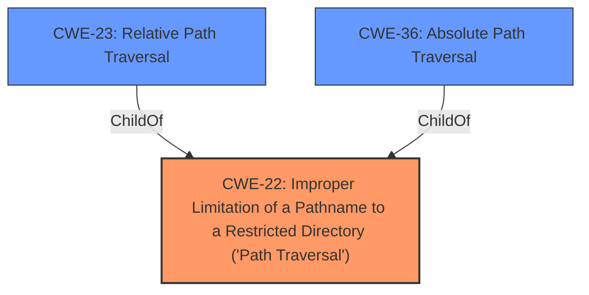

# Analysis Report for CVE-2020-20944

# Vulnerability Analysis Report: CVE-2020-20944

## Description


## Analysis (with Relationship Data)

# Summary
| CWE ID | CWE Name | Confidence | CWE Abstraction Level | CWE Vulnerability Mapping Label | CWE-Vulnerability Mapping Notes |
|---|---|---|---|---|---|
| CWE-22 | Improper Limitation of a Pathname to a Restricted Directory ('Path Traversal') | 0.9 | Base | Allowed | Primary CWE |

## Evidence and Confidence

*   **Confidence Score:** 0.9
*   **Evidence Strength:** HIGH

## Relationship Analysis
The primary CWE selected is CWE-22, which represents the root cause of the vulnerability: **improper limitation of a pathname to a restricted directory**. This is a Base level CWE, providing an appropriate level of specificity. Several other CWEs were considered, especially those related to injection and path manipulation. However, CWE-22 was deemed the most accurate representation of the **vulnerability**.



## Vulnerability Chain
The vulnerability chain consists of:
1.  **Root Cause**: CWE-22 Improper Limitation of a Pathname to a Restricted Directory ('Path Traversal')
2.  **Impact**: Arbitrary file deletion

## Summary of Analysis
The analysis indicates a high confidence in the selection of CWE-22 as the primary CWE for this vulnerability. The vulnerability description clearly states that the application allows attackers to arbitrarily delete files due to a path traversal issue.

The supporting evidence comes from the "CVE Reference Links Content Summary":
*   "**Root Cause**: Lack of proper input sanitization and validation in the database backup deletion functionality."
*   "**Weakness**: The application doesn't properly validate the `baktime` parameter during database backup deletion, allowing an attacker to use directory traversal to delete arbitrary files on the server."
*   "**Impact**: An attacker can delete any files accessible by the webserver user, leading to potential data loss and site malfunction."
*   "**Attack Vector**: Sending a crafted HTTP POST request to the vulnerable endpoint with a path traversal payload in the `baktime` parameter."

This evidence confirms that the vulnerability is caused by **improper** validation of the `baktime` parameter, which allows for directory traversal and arbitrary file deletion.

The selection of CWE-22 is based on the fact that the application **does not properly** limit the pathname to a restricted directory, allowing an attacker to traverse the file system and delete files outside of the intended directory.

**CWEs Considered but Not Used:**

*   **CWE-23 (Relative Path Traversal):** While relative path traversal might be a specific technique used, CWE-22 is a more general case that encompasses both relative and absolute path traversal. Since the description doesn't specify the type of path traversal, CWE-22 is more appropriate.
*   **CWE-73 (External Control of File Name or Path):** This CWE is related but focuses more on the external control aspect. The primary issue here is the **improper limitation** of the pathname, making CWE-22 a better fit.
*   **CWE-434 (Unrestricted Upload of File with Dangerous Type):** This CWE is not relevant because the vulnerability involves file deletion, not file upload.
*   **CWE-94 (Improper Control of Generation of Code ('Code Injection')) and CWE-89 (Improper Neutralization of Special Elements used in an SQL Command ('SQL Injection')):** These CWEs are not relevant as the vulnerability involves file system operations and not code or SQL injection.
*   **CWE-425 (Direct Request ('Forced Browsing')):** This CWE describes missing authorization checks on URLs. While authorization might be related, the root cause is the path traversal, making CWE-22 more accurate.
*   **CWE-285 (Improper Authorization):** This is a class-level CWE, and the more specific CWE-22 is more appropriate.

The final decision to use CWE-22 is based on the direct evidence of path traversal leading to arbitrary file deletion, aligning perfectly with the CWE's description and characteristics. The evidence clearly indicates that the application **does not properly** limit the pathname, allowing the attacker to traverse the file system.


## CWE Relationship Analysis

Current CWEs represent these abstraction levels: .


### Vulnerability Chain Analysis

**Chain starting from CWE-36:**
- 36 (Absolute Path Traversal) - ROOT


**Chain starting from CWE-73:**
- 73 (External Control of File Name or Path) - ROOT


### CWE Relationship Diagram

```mermaid
graph TD
    classDef primary fill:#f96,stroke:#333,stroke-width:2px
    classDef secondary fill:#69f,stroke:#333
    classDef tertiary fill:#9e9,stroke:#333
```


*Report generated on 2025-04-02 02:56:35*
