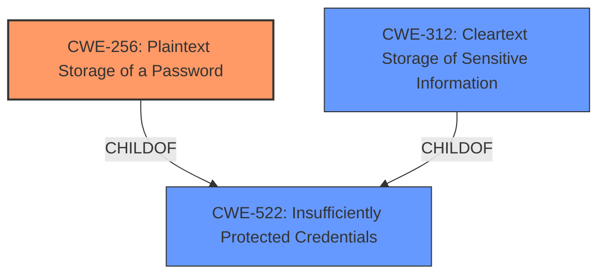

# Analysis for CVE-2020-2095

# Summary
| CWE ID | CWE Name | Confidence | CWE Abstraction Level | CWE Vulnerability Mapping Label | CWE-Vulnerability Mapping Notes |
|---|---|---|---|---|---|
| CWE-256 | Plaintext Storage of a Password | 1.0 | Base | Allowed | Primary CWE |
| CWE-312 | Cleartext Storage of Sensitive Information | 0.7 | Base | Allowed | Secondary Candidate |
| CWE-522 | Insufficiently Protected Credentials | 0.6 | Class | Allowed-with-Review | Secondary Candidate |

## Evidence and Confidence

*   **Confidence Score:** 0.9
*   **Evidence Strength:** HIGH

## Relationship Analysis
The primary CWE, CWE-256, is a specific type of CWE-522, which broadly covers insufficiently protected credentials. CWE-312, Cleartext Storage of Sensitive Information, is also related, being a parent of CWE-256. The abstraction levels influenced the choice of CWE-256 as the most specific and accurate representation of the vulnerability.

## Vulnerability Chain
The chain of events is as follows: the **root cause** is the **API key stored unencrypted** in the job config.xml files. This leads to the vulnerability where users with Extended Read permission or access to the master file system can view the API key. Thus, the chain is: **Improper Storage -> Information Disclosure.**

## Summary of Analysis
The initial analysis focused on identifying the most specific CWE that captures the essence of storing a password in plaintext. The Retriever Results and Complete CWE Specifications were crucial in refining this selection.

The vulnerability description explicitly states that the "API key" was "stored unencrypted in job config.xml files". The CVE Reference Links Content Summary confirms this stating, "Sensitive information (NuGet API key) is stored in plain text instead of being encrypted."

CWE-256 (Plaintext Storage of a Password) directly matches this description. It is a Base level CWE, which is preferred. The mapping guidance for CWE-256 ALLOWED and states "This CWE entry is at the Base level of abstraction, which is a preferred level of abstraction for mapping to the root causes of vulnerabilities."

CWE-312 (Cleartext Storage of Sensitive Information) was considered but deemed less specific, as it covers all sensitive information, not specifically passwords. CWE-522 (Insufficiently Protected Credentials) is a Class-level CWE, and its description is more general than CWE-256. The mapping guidance for CWE-522 is Allowed-with-Review and states, "This CWE entry is a Class and might have Base-level children that would be more appropriate".

Therefore, CWE-256 is the most appropriate and specific CWE.

Relevant CWE Information:

# Enhanced Context (25 CWEs)

## CWE-312: Cleartext Storage of Sensitive Information
**Abstraction Level**: Base
**Similarity Score**: 0.82
**Source**: dense

**Description**:
The product stores sensitive information in cleartext within a resource that might be accessible to another control sphere.

**Mapping Guidance**:
- Usage: Allowed
- Rationale: This CWE entry is at the Base level of abstraction, which is a preferred level of abstraction for mapping to the root causes of vulnerabilities.

## CWE-256: Plaintext Storage of a Password
**Abstraction Level**: Base
**Similarity Score**: 0.80
**Source**: dense

**Description**:
Storing a password in plaintext may result in a system compromise.

**Mapping Guidance**:
- Usage: Allowed
- Rationale: This CWE entry is at the Base level of abstraction, which is a preferred level of abstraction for mapping to the root causes of vulnerabilities.

## CWE-522: Insufficiently Protected Credentials
**Abstraction Level**: Class
**Similarity Score**: 0.79
**Source**: dense

**Description**:
The product transmits or stores authentication credentials, but it uses an insecure method that is susceptible to unauthorized interception and/or retrieval.

**Mapping Guidance**:
- Usage: Allowed-with-Review
- Rationale: This CWE entry is a Class and might have Base-level children that would be more appropriate

## CWE-538: Insertion of Sensitive Information into Externally-Accessible File or Directory
**Abstraction Level**: Base
**Similarity Score**: 0.79
**Source**: dense

**Description**:
The product places sensitive information into files or directories that are accessible to actors who are allowed to have access to the files, but not to the sensitive information.

**Mapping Guidance**:
- Usage: Allowed
- Rationale: This CWE entry is at the Base level of abstraction, which is a preferred level of abstraction for mapping to the root causes of vulnerabilities.

## CWE-319: Cleartext Transmission of Sensitive Information
**Abstraction Level**: Base
**Similarity Score**: 0.78
**Source**: dense

**Description**:
The product transmits sensitive or security-critical data in cleartext in a communication channel that can be sniffed by unauthorized actors.

**Mapping Guidance**:
- Usage: Allowed
- Rationale: This CWE entry is at the Base level of abstraction, which is a preferred level of abstraction for mapping to the root causes of vulnerabilities.

## CWE-311: Missing Encryption of Sensitive Data
**Abstraction Level**: Class
**Similarity Score**: 0.78
**Source**: dense

**Description**:
The product does not encrypt sensitive or critical information before storage or transmission.

**Mapping Guidance**:
- Usage: Discouraged
- Rationale: CWE-311 is high-level with more precise children available. It is a level-1 Class (i.e., a child of a Pillar).

## CWE-212: Improper Removal of Sensitive Information Before Storage or Transfer
**Abstraction Level**: Base
**Similarity Score**: 0.77
**Source**: dense

**Description**:
The product stores, transfers, or shares a resource that contains sensitive information, but it does not properly remove that information before the product makes the resource available to unauthorized actors.

**Mapping Guidance**:
- Usage: Allowed
- Rationale: This CWE entry is at the Base level of abstraction, which is a preferred level of abstraction for mapping to the root causes of vulnerabilities.

## CWE-922: Insecure Storage of Sensitive Information
**Abstraction Level**: Class
**Similarity Score**: 0.77
**Source**: dense

**Description**:
The product stores sensitive information without properly limiting read or write access by unauthorized actors.

**Mapping Guidance**:
- Usage: Allowed-with-Review
- Rationale: This CWE entry is a Class and might have Base-level children that would be more appropriate

## CWE-1391: Use of Weak Credentials
**Abstraction Level**: Class
**Similarity Score**: 0.77
**Source**: dense

**Description**:
The product uses weak credentials (such as a default key or hard-coded password) that can be calculated, derived, reused, or guessed by an attacker.

**Mapping Guidance**:
- Usage: Allowed-with-Review
- Rationale: This CWE entry is a Class and might have Base-level children that would be more appropriate

## CWE-257: Storing Passwords in a Recoverable Format
**Abstraction Level**: Base
**Similarity Score**: 0.76
**Source**: dense

**Description**:
The storage of passwords in a recoverable format makes them subject to password reuse attacks by malicious users. In fact, it should be noted that recoverable encrypted passwords provide no significant benefit over plaintext passwords since they are subject not only to reuse by malicious attackers but also by malicious insiders. If a system administrator can recover a password directly, or use a brute force search on the available information, the administrator can use the password on other accounts.

**Mapping Guidance**:
- Usage: Allowed
- Rationale: This CWE entry is at the Base level of abstraction, which is a preferred level of abstraction for mapping to the root causes of vulnerabilities.

## CWE-312: Cleartext Storage of Sensitive Information
**Abstraction Level**: Base
**Similarity Score**: 4069.94
**Source**: sparse

**Description**:
The product stores sensitive information in cleartext within a resource that might be accessible to another control sphere.

**Mapping Guidance**:
- Usage: Allowed
- Rationale: This CWE entry is at the Base level of abstraction, which is a preferred level of abstraction for mapping to the root causes of vulnerabilities.

## CWE-522: Insufficiently Protected Credentials
**Abstraction Level**: Class
**Similarity Score**: 3930.17
**

# Enhanced Query for CVE-2020-2095

## Vulnerability Description
Jenkins Redgate SQL Change Automation Plugin 2.0.4 and earlier stored an API key unencrypted in job config.xml files on the Jenkins master where they could be viewed by users with Extended Read permission, or access to the master file system.

### Vulnerability Description Key Phrases
- **rootcause:** **API key stored unencrypted**
- **attacker:** users with Extended Read permission and users with access to the master file system
- **product:** Jenkins Redgate SQL Change Automation Plugin
- **version:** 2.0.4 and earlier
- **component:** job config.xml files

## CVE Reference Links Content Summary
- **Root cause of vulnerability**: The Redgate SQL Change Automation Plugin stores a NuGet API key unencrypted in job `config.xml` files.
- **Weaknesses/vulnerabilities present**: Sensitive information (NuGet API key) is stored in plain text instead of being encrypted.
- **Impact of exploitation**: An attacker could potentially view the stored API key by gaining access to job configurations through the Jenkins interface (Extended Read permission) or by accessing the Jenkins controller's file system.
- **Attack vectors**:
    - Accessing the job's `config.xml` file via the Jenkins UI with the "Extended Read" permission.
    - Direct access to the Jenkins controller's file system where configuration files are stored.
- **Required attacker capabilities/position**:
    - The attacker needs to have at least "Extended Read" permissions on Jenkins, or access to the Jenkins controller filesystem.

## Retriever Results

### Top Combined Results

| Rank | CWE ID | Name | Abstraction | Usage  | Retrievers | Individual Scores |
|------|--------|------|-------------|-------|------------|-------------------|
| 1 | 256 | Plaintext Storage of a Password | Base | Allowed | sparse | 0.412 |
| 2 | 522 | Insufficiently Protected Credentials | Class | Allowed-with-Review | sparse | 0.406 |
| 3 | 260 | Password in Configuration File | Base | Allowed | sparse | 0.350 |
| 4 | 538 | Insertion of Sensitive Information into Externally-Accessible File or Directory | Base | Allowed | sparse | 0.283 |
| 5 | 862 | Missing Authorization | Class | Allowed-with-Review | sparse | 0.281 |
| 6 | 1394 | Use of Default Cryptographic Key | Base | Allowed | dense | 0.487 |
| 7 | 549 | Missing Password Field Masking | Base | Allowed | graph | 0.002 |
| 8 | 532 | Insertion of Sensitive Information into Log File | Base | Allowed | sparse | 0.259 |
| 9 | 863 | Incorrect Authorization | Class | Allowed-with-Review | sparse | 0.250 |
| 10 | 312 | Cleartext Storage of Sensitive Information | Base | Allowed | sparse | 0.239 |

# Complete CWE Specifications

## CWE-256: Plaintext Storage of a Password
**Abstraction:** Base
**Status:** Incomplete

### Description
Storing a password in plaintext may result in a system compromise.

### Extended Description
Password management issues occur when a password is stored in plaintext in an application's properties, configuration file, or memory. Storing a plaintext password in a configuration file allows anyone who can read the file access to the password-protected resource. In some contexts, even storage of a plaintext password in memory is considered a security risk if the password is not cleared immediately after it is used.

### Alternative Terms
None

### Relationships
ChildOf -> CWE-522

### Mapping Guidance
**Usage:** Allowed
**Rationale:** This CWE entry is at the Base level of abstraction, which is a preferred level of abstraction for mapping to the root causes of vulnerabilities.
**Comments:** Carefully read both the name and description to ensure that this mapping is an appropriate fit. Do not try to 'force' a mapping to a lower-level Base/Variant simply to comply with this preferred level of abstraction.
**Reasons:**
- Acceptable-Use

### Observed Examples
- **CVE-2022-30275:** Remote Terminal Unit (RTU) uses a driver that relies on a password stored in plaintext.

## CWE-522: Insufficiently Protected Credentials
**Abstraction:** Class
**Status:** Incomplete

### Description
The product transmits or stores authentication credentials, but it uses an insecure method that is susceptible to unauthorized interception and/or retrieval.

### Extended Description
Not provided

### Alternative Terms
None

### Relationships
ChildOf -> CWE-1390
ChildOf -> CWE-287
ChildOf -> CWE-668

### Mapping Guidance
**Usage:** Allowed-with-Review
**Rationale:** This CWE entry is a Class and might have Base-level children that would be more appropriate
**Comments:** Examine children of this entry to see if there is a better fit
**Reasons:**
- Abstraction

### Observed Examples
- **CVE-2022-30018:** A messaging platform serializes all elements of User/Group objects, making private information available to adversaries
- **CVE-2022-29959:** Initialization file contains credentials that can be decoded using a "simple string transformation"
- **CVE-2022-35411:** Python-based RPC framework enables pickle functionality by default, allowing clients to unpickle untrusted data.

## CWE-260: Password in Configuration File
**Abstraction:** Base
**Status:** Incomplete

### Description
The product stores a password in a configuration file that might be accessible to actors who do not know the password.

### Extended Description
This can result in compromise of the system for which the password is used. An attacker could gain access to this file and learn the stored password or worse yet, change the password to one of their choosing.

### Alternative Terms
None

### Relationships
ChildOf -> CWE-522

### Mapping Guidance
**Usage:** Allowed
**Rationale:** This CWE entry is at the Base level of abstraction, which is a preferred level of abstraction for mapping to the root causes of vulnerabilities.
**Comments:** Carefully read both the name and description to ensure that this mapping is an appropriate fit. Do not try to 'force' a mapping to a lower-level Base/Variant simply to comply with this preferred level of abstraction.
**Reasons:**
- Acceptable-Use

### Observed Examples
- **CVE-2022-38665:** A continuous delivery pipeline management tool stores an unencypted password in a configuration file.

## CWE-538: Insertion of Sensitive Information into Externally-Accessible File or Directory
**Abstraction:** Base
**Status:** Draft

### Description
The product places sensitive information into files or directories that are accessible to actors who are allowed to have access to the files, but not to the sensitive information.

### Extended Description
Not provided

### Alternative Terms
None

### Relationships
ChildOf -> CWE-200

### Mapping Guidance
**Usage:** Allowed
**Rationale:** This CWE entry is at the Base level of abstraction, which is a preferred level of abstraction for mapping to the root causes of vulnerabilities.
**Comments:** Carefully read both the name and description to ensure that this mapping is an appropriate fit. Do not try to 'force' a mapping to a lower-level Base/Variant simply to comply with this preferred level of abstraction.
**Reasons:**
- Acceptable-Use

### Additional Notes
**[Maintenance]** Depending on usage, this could be a weakness or a category. Further study of all its children is needed, and the entire sub-tree may need to be clarified. The current organization is based primarily on the exposure of sensitive information as a consequence, instead of as a primary weakness.

**[Maintenance]** There is a close relationship with CWE-552, which is more focused on weaknesses. As a result, it may be more appropriate to convert CWE-538 to a category.

### Observed Examples
- **CVE-2018-1999036:** SSH password for private key stored in build log

## CWE-862: Missing Authorization
**Abstraction:** Class
**Status:** Incomplete

### Description
The product does not perform an authorization check when an actor attempts to access a resource or perform an action.

### Extended Description
Not provided

### Alternative Terms
AuthZ: "AuthZ" is typically used as an abbreviation of "authorization" within the web application security community. It is distinct from "AuthN" (or, sometimes, "AuthC") which is an abbreviation of "authentication." The use of "Auth" as an abbreviation is discouraged, since it could be used for either authentication or authorization.

### Relationships
ChildOf -> CWE-285
ChildOf -> CWE-284

### Mapping Guidance
**Usage:** Allowed-with-Review
**Rationale:** This CWE entry is a Class and might have Base-level children that would be more appropriate
**Comments:** Examine children of this entry to see if there is a better fit
**Reasons:**
- Abstraction

### Additional Notes
**[Terminology]** Assuming a user with a given identity, authorization is the process of determining whether that user can access a given resource, based on the user's privileges and any permissions or other access-control specifications that apply to the resource.

### Observed Examples
- **CVE-2022-24730:** Go-based continuous deployment product does not check that a user has certain privileges to update or create an app, allowing adversaries to read sensitive repository information
- **CVE-2009-3168:** Web application does not restrict access to admin scripts, allowing authenticated users to reset administrative passwords.
- **CVE-2009-3597:** Web application stores database file under the web root with insufficient access control (CWE-219), allowing direct request.

## CWE-1394: Use of Default Cryptographic Key
**Abstraction:** Base
**Status:** Incomplete

### Description
The product uses a default cryptographic key for potentially critical functionality.

### Extended Description
It is common practice for products to be designed to use default keys. The rationale is to simplify the manufacturing process or the system administrator's task of installation and deployment into an enterprise. However, if admins do not change the defaults, it is easier for attackers to bypass authentication quickly across multiple organizations.

### Alternative Terms
None

### Relationships
ChildOf -> CWE-1392

### Mapping Guidance
**Usage:** Allowed
**Rationale:** This CWE entry is at the Base level of abstraction, which is a preferred level of abstraction for mapping to the root causes of vulnerabilities.
**Comments:** Carefully read both the name and description to ensure that this mapping is an appropriate fit. Do not try to 'force' a mapping to a lower-level Base/Variant simply to comply with this preferred level of abstraction.
**Reasons:**
- Acceptable-Use

### Observed Examples
- **CVE-2018-3825:** cloud cluster management product has a default master encryption key
- **CVE-2016-1561:** backup storage product has a default SSH public key in the authorized_keys file, allowing root access
- **CVE-2010-2306:** Intrusion Detection System (IDS) uses the same static, private SSL keys for multiple devices and installations, allowing decryption of SSL traffic

## CWE-549: Missing Password Field Masking
**Abstraction:** Base
**Status:** Draft

### Description
The product does not mask passwords during entry, increasing the potential for attackers to observe and capture passwords.

### Extended Description
Not provided

### Alternative Terms
None

### Relationships
ChildOf -> CWE-522

### Mapping Guidance
**Usage:** Allowed
**Rationale:** This CWE entry is at the Base level of abstraction, which is a preferred level of abstraction for mapping to the root causes of vulnerabilities.
**Comments:** Carefully read both the name and description to ensure that this mapping is an appropriate fit. Do not try to 'force' a mapping to a lower-level Base/Variant simply to comply with this preferred level of abstraction.
**Reasons:**
- Acceptable-Use

## CWE-532: Insertion of Sensitive Information into Log File
**Abstraction:** Base
**Status:** Incomplete

### Description
The product writes sensitive information to a log file.

### Extended Description
Not provided

### Alternative Terms
None

### Relationships
ChildOf -> CWE-538
ChildOf -> CWE-200

### Mapping Guidance
**Usage:** Allowed
**Rationale:** This CWE entry is at the Base level of abstraction, which is a preferred level of abstraction for mapping to the root causes of vulnerabilities.
**Comments:** Carefully read both the name and description to ensure that this mapping is an appropriate fit. Do not try to 'force' a mapping to a lower-level Base/Variant simply to comply with this preferred level of abstraction.
**Reasons:**
- Acceptable-Use

### Observed Examples
- **CVE-2017-9615:** verbose logging stores admin credentials in a world-readable log file
- **CVE-2018-1999036:** SSH password for private key stored in build log

## CWE-863: Incorrect Authorization
**Abstraction:** Class
**Status:** Incomplete

### Description
The product performs an authorization check when an actor attempts to access a resource or perform an action, but it does not correctly perform the check.

### Extended Description
Not provided

### Alternative Terms
AuthZ: "AuthZ" is typically used as an abbreviation of "authorization" within the web application security community. It is distinct from "AuthN" (or, sometimes, "AuthC") which is an abbreviation of "authentication." The use of "Auth" as an abbreviation is discouraged, since it could be used for either authentication or authorization.

### Relationships
ChildOf -> CWE-285
ChildOf -> CWE-284

### Mapping Guidance
**Usage:** Allowed-with-Review
**Rationale:** This CWE entry is a Class and might have Base-level children that would be more appropriate
**Comments:** Examine children of this entry to see if there is a better fit
**Reasons:**
- Abstraction

### Additional Notes
**[Terminology]** 

Assuming a user with a given identity, authorization is the process of determining whether that user can access a given resource, based on the user's privileges and any permissions or other access-control specifications that apply to the resource.

### Observed Examples
- **CVE-2021-39155:** Chain: A microservice integration and management platform compares the hostname in the HTTP Host header in a case-sensitive way (CWE-178, CWE-1289), allowing bypass of the authorization policy (CWE-863) using a hostname with mixed case or other variations.
- **CVE-2019-15900:** Chain: sscanf() call is used to check if a username and group exists, but the return value of sscanf() call is not checked (CWE-252), causing an uninitialized variable to be checked (CWE-457), returning success to allow authorization bypass for executing a privileged (CWE-863).
- **CVE-2009-2213:** Gateway uses default "Allow" configuration for its authorization settings.

## CWE-312: Cleartext Storage of Sensitive Information
**Abstraction:** Base
**Status:** Draft

### Description
The product stores sensitive information in cleartext within a resource that might be accessible to another control sphere.

### Extended Description

Because the information is stored in cleartext (i.e., unencrypted), attackers could potentially read it. Even if the information is encoded in a way that is not human-readable, certain techniques could determine which encoding is being used, then decode the information.

When organizations adopt cloud services, it can be easier for attackers to access the data from anywhere on the Internet.

In some systems/environments such as cloud, the use of "double encryption" (at both the software and hardware layer) might be required, and the developer might be solely responsible for both layers, instead of shared responsibility with the administrator of the broader system/environment.

### Alternative Terms
None

### Relationships
ChildOf -> CWE-311
ChildOf -> CWE-311
ChildOf -> CWE-922

### Mapping Guidance
**Usage:** Allowed
**Rationale:** This CWE entry is at the Base level of abstraction, which is a preferred level of abstraction for mapping to the root causes of vulnerabilities.
**Comments:** Carefully read both the name and description to ensure that this mapping is an appropriate fit. Do not try to 'force' a mapping to a lower-level Base/Variant simply to comply with this preferred level of abstraction.
**Reasons:**
- Acceptable-Use

### Additional Notes
**[Terminology]** Different people use "cleartext" and "plaintext" to mean the same thing: the lack of encryption. However, within cryptography, these have more precise meanings. Plaintext is the information just before it is fed into a cryptographic algorithm, including already-encrypted text. Cleartext is any information that is unencrypted, although it might be in an encoded form that is not easily human-readable (such as base64 encoding).

### Observed Examples
- **CVE-2022-30275:** Remote Terminal Unit (RTU) uses a driver that relies on a password stored in plaintext.
- **CVE-2009-2272:** password and username stored in cleartext in a cookie
- **CVE-2009-1466:** password stored in cleartext in a file with insecure permissions

