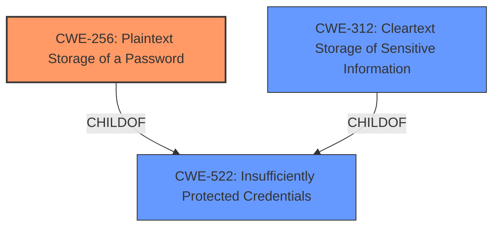

# Analysis Report for CVE-2020-2095

# Vulnerability Analysis Report: CVE-2020-2095

## Description


## Analysis (with Relationship Data)

# Summary
| CWE ID | CWE Name | Confidence | CWE Abstraction Level | CWE Vulnerability Mapping Label | CWE-Vulnerability Mapping Notes |
|---|---|---|---|---|---|
| CWE-256 | Plaintext Storage of a Password | 1.0 | Base | Allowed | Primary CWE |
| CWE-312 | Cleartext Storage of Sensitive Information | 0.7 | Base | Allowed | Secondary Candidate |
| CWE-522 | Insufficiently Protected Credentials | 0.6 | Class | Allowed-with-Review | Secondary Candidate |

## Evidence and Confidence

*   **Confidence Score:** 0.9
*   **Evidence Strength:** HIGH

## Relationship Analysis
The primary CWE, CWE-256, is a specific type of CWE-522, which broadly covers insufficiently protected credentials. CWE-312, Cleartext Storage of Sensitive Information, is also related, being a parent of CWE-256. The abstraction levels influenced the choice of CWE-256 as the most specific and accurate representation of the vulnerability.



## Vulnerability Chain
The chain of events is as follows: the **root cause** is the **API key stored unencrypted** in the job config.xml files. This leads to the vulnerability where users with Extended Read permission or access to the master file system can view the API key. Thus, the chain is: **Improper Storage -> Information Disclosure.**

## Summary of Analysis
The initial analysis focused on identifying the most specific CWE that captures the essence of storing a password in plaintext. The Retriever Results and Complete CWE Specifications were crucial in refining this selection.

The vulnerability description explicitly states that the "API key" was "stored unencrypted in job config.xml files". The CVE Reference Links Content Summary confirms this stating, "Sensitive information (NuGet API key) is stored in plain text instead of being encrypted."

CWE-256 (Plaintext Storage of a Password) directly matches this description. It is a Base level CWE, which is preferred. The mapping guidance for CWE-256 ALLOWED and states "This CWE entry is at the Base level of abstraction, which is a preferred level of abstraction for mapping to the root causes of vulnerabilities."

CWE-312 (Cleartext Storage of Sensitive Information) was considered but deemed less specific, as it covers all sensitive information, not specifically passwords. CWE-522 (Insufficiently Protected Credentials) is a Class-level CWE, and its description is more general than CWE-256. The mapping guidance for CWE-522 is Allowed-with-Review and states, "This CWE entry is a Class and might have Base-level children that would be more appropriate".

Therefore, CWE-256 is the most appropriate and specific CWE.

Relevant CWE Information:

# Enhanced Context (25 CWEs)

## CWE-312: Cleartext Storage of Sensitive Information
**Abstraction Level**: Base
**Similarity Score**: 0.82
**Source**: dense

**Description**:
The product stores sensitive information in cleartext within a resource that might be accessible to another control sphere.

**Mapping Guidance**:
- Usage: Allowed
- Rationale: This CWE entry is at the Base level of abstraction, which is a preferred level of abstraction for mapping to the root causes of vulnerabilities.

## CWE-256: Plaintext Storage of a Password
**Abstraction Level**: Base
**Similarity Score**: 0.80
**Source**: dense

**Description**:
Storing a password in plaintext may result in a system compromise.

**Mapping Guidance**:
- Usage: Allowed
- Rationale: This CWE entry is at the Base level of abstraction, which is a preferred level of abstraction for mapping to the root causes of vulnerabilities.

## CWE-522: Insufficiently Protected Credentials
**Abstraction Level**: Class
**Similarity Score**: 0.79
**Source**: dense

**Description**:
The product transmits or stores authentication credentials, but it uses an insecure method that is susceptible to unauthorized interception and/or retrieval.

**Mapping Guidance**:
- Usage: Allowed-with-Review
- Rationale: This CWE entry is a Class and might have Base-level children that would be more appropriate

## CWE-538: Insertion of Sensitive Information into Externally-Accessible File or Directory
**Abstraction Level**: Base
**Similarity Score**: 0.79
**Source**: dense

**Description**:
The product places sensitive information into files or directories that are accessible to actors who are allowed to have access to the files, but not to the sensitive information.

**Mapping Guidance**:
- Usage: Allowed
- Rationale: This CWE entry is at the Base level of abstraction, which is a preferred level of abstraction for mapping to the root causes of vulnerabilities.

## CWE-319: Cleartext Transmission of Sensitive Information
**Abstraction Level**: Base
**Similarity Score**: 0.78
**Source**: dense

**Description**:
The product transmits sensitive or security-critical data in cleartext in a communication channel that can be sniffed by unauthorized actors.

**Mapping Guidance**:
- Usage: Allowed
- Rationale: This CWE entry is at the Base level of abstraction, which is a preferred level of abstraction for mapping to the root causes of vulnerabilities.

## CWE-311: Missing Encryption of Sensitive Data
**Abstraction Level**: Class
**Similarity Score**: 0.78
**Source**: dense

**Description**:
The product does not encrypt sensitive or critical information before storage or transmission.

**Mapping Guidance**:
- Usage: Discouraged
- Rationale: CWE-311 is high-level with more precise children available. It is a level-1 Class (i.e., a child of a Pillar).

## CWE-212: Improper Removal of Sensitive Information Before Storage or Transfer
**Abstraction Level**: Base
**Similarity Score**: 0.77
**Source**: dense

**Description**:
The product stores, transfers, or shares a resource that contains sensitive information, but it does not properly remove that information before the product makes the resource available to unauthorized actors.

**Mapping Guidance**:
- Usage: Allowed
- Rationale: This CWE entry is at the Base level of abstraction, which is a preferred level of abstraction for mapping to the root causes of vulnerabilities.

## CWE-922: Insecure Storage of Sensitive Information
**Abstraction Level**: Class
**Similarity Score**: 0.77
**Source**: dense

**Description**:
The product stores sensitive information without properly limiting read or write access by unauthorized actors.

**Mapping Guidance**:
- Usage: Allowed-with-Review
- Rationale: This CWE entry is a Class and might have Base-level children that would be more appropriate

## CWE-1391: Use of Weak Credentials
**Abstraction Level**: Class
**Similarity Score**: 0.77
**Source**: dense

**Description**:
The product uses weak credentials (such as a default key or hard-coded password) that can be calculated, derived, reused, or guessed by an attacker.

**Mapping Guidance**:
- Usage: Allowed-with-Review
- Rationale: This CWE entry is a Class and might have Base-level children that would be more appropriate

## CWE-257: Storing Passwords in a Recoverable Format
**Abstraction Level**: Base
**Similarity Score**: 0.76
**Source**: dense

**Description**:
The storage of passwords in a recoverable format makes them subject to password reuse attacks by malicious users. In fact, it should be noted that recoverable encrypted passwords provide no significant benefit over plaintext passwords since they are subject not only to reuse by malicious attackers but also by malicious insiders. If a system administrator can recover a password directly, or use a brute force search on the available information, the administrator can use the password on other accounts.

**Mapping Guidance**:
- Usage: Allowed
- Rationale: This CWE entry is at the Base level of abstraction, which is a preferred level of abstraction for mapping to the root causes of vulnerabilities.

## CWE-312: Cleartext Storage of Sensitive Information
**Abstraction Level**: Base
**Similarity Score**: 4069.94
**Source**: sparse

**Description**:
The product stores sensitive information in cleartext within a resource that might be accessible to another control sphere.

**Mapping Guidance**:
- Usage: Allowed
- Rationale: This CWE entry is at the Base level of abstraction, which is a preferred level of abstraction for mapping to the root causes of vulnerabilities.

## CWE-522: Insufficiently Protected Credentials
**Abstraction Level**: Class
**Similarity Score**: 3930.17
**


## CWE Relationship Analysis

Current CWEs represent these abstraction levels: .


### Vulnerability Chain Analysis

**Chain starting from CWE-312:**
- 312 (Cleartext Storage of Sensitive Information) - ROOT


**Chain starting from CWE-538:**
- 538 (Insertion of Sensitive Information into Externally-Accessible File or Directory) - ROOT


### CWE Relationship Diagram

```mermaid
graph TD
    classDef primary fill:#f96,stroke:#333,stroke-width:2px
    classDef secondary fill:#69f,stroke:#333
    classDef tertiary fill:#9e9,stroke:#333
```


*Report generated on 2025-04-02 13:38:47*
