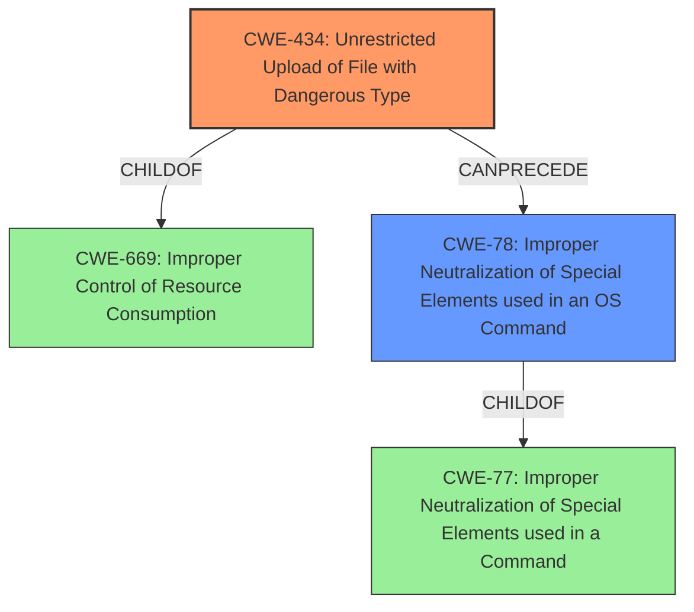

# Analysis Report for CVE-2020-20951

# Vulnerability Analysis Report: CVE-2020-20951

## Description


## Analysis (with Relationship Data)

# Summary
| CWE ID  | CWE Name                                                        | Confidence | CWE Abstraction Level | CWE Vulnerability Mapping Label | CWE-Vulnerability Mapping Notes |
| :-------- | :-------------------------------------------------------------- | :---------- | :---------------------- | :------------------------------ | :-------------------------------- |
| CWE-434 | Unrestricted Upload of File with Dangerous Type                 | 1.0         | Base                    | Allowed                         | Primary CWE                     |
| CWE-78  | Improper Neutralization of Special Elements used in an OS Command ('OS Command Injection') | 0.8         | Base                    | Allowed                         | Secondary CWE                     |

## Evidence and Confidence

*   **Confidence Score:** 0.9
*   **Evidence Strength:** HIGH

## Relationship Analysis
The primary CWE, CWE-434, is a Base level CWE which accurately reflects the **unrestricted upload** of a dangerous file type. CWE-434 is a child of CWE-669, Improper Control of Resource Consumption. CWE-78, Improper Neutralization of Special Elements used in an OS Command ('OS Command Injection'), is a base level CWE that can occur if the uploaded file is executed, leading to command injection. CWE-78 is a child of CWE-77, Improper Neutralization of Special Elements used in a Command. The relationship between CWE-434 and CWE-78 is that a successful CWE-434 can lead to CWE-78.



## Vulnerability Chain
The vulnerability chain starts with the **unrestricted upload of a file with a dangerous type** (CWE-434). This leads to the ability to execute arbitrary PHP code, resulting in **OS command injection** (CWE-78).

## Summary of Analysis
The initial analysis correctly identified the primary weakness as CWE-434, Unrestricted Upload of File with Dangerous Type, based on the vulnerability description, key phrases, and CVE reference links content summary. The analysis also considered the potential for OS command injection (CWE-78) as a secondary weakness, which arises from the ability to execute the uploaded file.

The evidence from the CVE Reference Links Content Summary supports the selection of CWE-434: "The vulnerability stems from a flaw in the file upload functionality... The second upload of a file does not get renamed, allowing a malicious PHP file to be uploaded." This directly aligns with the CWE-434 description: "The product allows the upload or transfer of dangerous file types that are automatically processed within its environment." The **impact** is remote command execution, which results from **improper neutralization of special elements used in an OS Command**.

The selection of CWE-434 and CWE-78 is at the optimal level of specificity because they directly address the root cause (unrestricted file upload) and the immediate consequence (command execution) of the vulnerability.

Relevant CWE Information:
# Enhanced Context (25 CWEs)
## CWE-434: Unrestricted Upload of File with Dangerous Type

**Description**:
The product allows the upload or transfer of dangerous file types that are automatically processed within its environment.

**Mapping Guidance**:
- Usage: Allowed
- Rationale: This CWE entry is at the Base level of abstraction, which is a preferred level of abstraction for mapping to the root causes of vulnerabilities.

## CWE-78: Improper Neutralization of Special Elements used in an OS Command ('OS Command Injection')

**Description**:
The product constructs all or part of an OS command using externally-influenced input from an upstream component, but it does not neutralize or incorrectly neutralizes special elements that could modify the intended OS command when it is sent to a downstream component.

**Mapping Guidance**:
- Usage: Allowed
- Rationale: This CWE entry is at the Base level of abstraction, which is a preferred level of abstraction for mapping to the root causes of vulnerabilities.


## CWE Relationship Analysis

Current CWEs represent these abstraction levels: .


### Vulnerability Chain Analysis

**Chain starting from CWE-78:**
- 78 (Improper Neutralization of Special Elements used in an OS Command ('OS Command Injection')) - ROOT


**Chain starting from CWE-669:**
- 669 (Incorrect Resource Transfer Between Spheres) - ROOT


### CWE Relationship Diagram

```mermaid
graph TD
    classDef primary fill:#f96,stroke:#333,stroke-width:2px
    classDef secondary fill:#69f,stroke:#333
    classDef tertiary fill:#9e9,stroke:#333
```


*Report generated on 2025-04-02 07:25:20*
