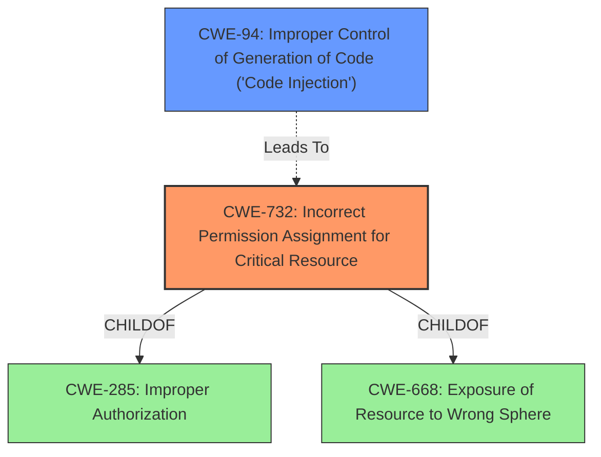

# Enhanced Analysis for CVE-2020-21124

# Summary
| CWE ID | CWE Name | Confidence | CWE Abstraction Level | CWE Vulnerability Mapping Label | CWE-Vulnerability Mapping Notes |
|---|---|---|---|---|---|
| CWE-732 | Incorrect Permission Assignment for Critical Resource | 0.8 | Class | Allowed-with-Review | Primary CWE |
| CWE-94 | Improper Control of Generation of Code ('Code Injection') | 0.7 | Base | Allowed-with-Review | Secondary CWE |

## Evidence and Confidence

*   **Confidence Score:** 0.75
*   **Evidence Strength:** MEDIUM

## Relationship Analysis
The primary relationship that influenced the decision was the child-of relationship between CWE-732 and CWE-285 (Improper Authorization) and CWE-668 (Exposure of Resource to Wrong Sphere). The vulnerability description states a **lack of access control** to the designer page, which aligns with incorrect permission assignments that expose the resource.

CWE-94 is a secondary concern since the **root cause of the vulnerability** leads to arbitrary code execution.



## Vulnerability Chain
The vulnerability chain starts with the **lack of access control** (CWE-732) on the designer page. This **lack of access control** allows attackers to load arbitrary classes via `Class.forName` (as mentioned in the "CVE Reference Links Content Summary"), leading to arbitrary code execution (CWE-94).

CWE-732 (Incorrect Permission Assignment) -> CWE-94 (Code Injection)

## Summary of Analysis
The initial analysis focused on the **lack of access control** on the designer page. The key phrase "**lack of access control**" strongly suggests an authorization issue. The "CVE Reference Links Content Summary" elaborates on the root cause of the vulnerability by mentioning the use of `Class.forName` with user-controlled input, leading to arbitrary class loading and execution.

CWE-732 (Incorrect Permission Assignment for Critical Resource) is selected as the primary CWE because it directly addresses the **lack of access control** on the designer page, which is the initial vulnerability. The description of CWE-732 matches the scenario where a critical resource (the designer page) is accessible to unintended actors due to incorrect permission assignment. The mapping guidance for CWE-732 mentions that it is often misused when "permissions" are not checked, which aligns with the **lack of access control** described in the vulnerability. While the mapping guidance suggests caution and a deeper analysis of the specific mistake, the provided information directly points to an authorization issue.

CWE-94 (Improper Control of Generation of Code ('Code Injection')) is included as a secondary CWE because the attacker can load arbitrary classes leading to code execution.

The selection of CWE-732 is at the Class level of abstraction, as it directly represents the incorrect permission assignment. Although CWE-284 (Improper Access Control) is a parent of CWE-732, it is a Pillar level and too general.

Relevant CWE Information:

# Enhanced Context (25 CWEs)

## CWE-807: Reliance on Untrusted Inputs in a Security Decision
**Abstraction Level**: Base
**Similarity Score**: 0.77
**Source**: dense

**Description**:
The product uses a protection mechanism that relies on the existence or values of an input, but the input can be modified by an untrusted actor in a way that bypasses the protection mechanism.

**Mapping Guidance**:
- Usage: Allowed
- Rationale: This CWE entry is at the Base level of abstraction, which is a preferred level of abstraction for mapping to the root causes of vulnerabilities.

This was not selected because it describes an issue where a protection mechanism exists but is bypassed, and this vulnerability describes a **lack of access control**.

## CWE-1289: Improper Validation of Unsafe Equivalence in Input
**Abstraction Level**: Base
**Similarity Score**: 0.77
**Source**: dense

**Description**:
The product receives an input value that is used as a resource identifier or other type of reference, but it does not validate or incorrectly validates that the input is equivalent to a potentially-unsafe value.

**Mapping Guidance**:
- Usage: Allowed
- Rationale: This CWE entry is at the Base level of abstraction, which is a preferred level of abstraction for mapping to the root causes of vulnerabilities.

This was not selected because it describes an input validation issue, and this vulnerability is about a **lack of access control**.

## CWE-1220: Insufficient Granularity of Access Control
**Abstraction Level**: Base
**Similarity Score**: 0.76
**Source**: dense

**Description**:
The product implements access controls via a policy or other feature with the intention to disable or restrict accesses (reads and/or writes) to assets in a system from untrusted agents. However, implemented access controls lack required granularity, which renders the control policy too broad because it allows accesses from unauthorized agents to the security-sensitive assets.

**Mapping Guidance**:
- Usage: Allowed
- Rationale: This CWE entry is at the Base level of abstraction, which is a preferred level of abstraction for mapping to the root causes of vulnerabilities.

This was not selected because the vulnerability is about a **lack of access control**, and this CWE describes a scenario where access controls are implemented but lack the required granularity.

## CWE-73: External Control of File Name or Path
**Abstraction Level**: Base
**Similarity Score**: 0.76
**Source**: dense

**Description**:
The product allows user input to control or influence paths or file names that are used in filesystem operations.

**Mapping Guidance**:
- Usage: Allowed
- Rationale: This CWE entry is at the Base level of abstraction, which is a preferred level of abstraction for mapping to the root causes of vulnerabilities.

This was not selected because the vulnerability is about a **lack of access control**, not directly related to file name or path manipulation.

## CWE-184: Incomplete List of Disallowed Inputs
**Abstraction Level**: Base
**Similarity Score**: 0.75
**Source**: dense

**Description**:
The product implements a protection mechanism that relies on a list of inputs (or properties of inputs) that are not allowed by policy or otherwise require other action to neutralize before additional processing takes place, but the list is incomplete.

**Mapping Guidance**:
- Usage: Allowed
- Rationale: This CWE entry is at the Base level of abstraction, which is a preferred level of abstraction for mapping to the root causes of vulnerabilities.

This was not selected because the vulnerability is about a **lack of access control**, not an incomplete list of disallowed inputs.

## CWE-41: Improper Resolution of Path Equivalence
**Abstraction Level**: Base
**Similarity Score**: 0.75
**Source**: dense

**Description**:
The product is vulnerable to file system contents disclosure through path equivalence. Path equivalence involves the use of special characters in file and directory names. The associated manipulations are intended to generate multiple names for the same object.

**Mapping Guidance**:
- Usage: Allowed
- Rationale: This CWE entry is at the Base level of abstraction, which is a preferred level of abstraction for mapping to the root causes of vulnerabilities.

This was not selected because the vulnerability is about a **lack of access control**, not improper resolution of path equivalence.

## CWE-799: Improper Control of Interaction Frequency
**Abstraction Level**: Class
**Similarity Score**: 0.75
**Source**: dense

**Description**:
The product does not properly limit the number or frequency of interactions that it has with an actor, such as the number of incoming requests.

**Mapping Guidance**:
- Usage: Allowed-with-Review
- Rationale: This CWE entry is a Class and might have Base-level children that would be more appropriate

This was not selected because the vulnerability is about a **lack of access control**, not the frequency of interactions.

## CWE-691: Insufficient Control Flow Management
**Abstraction Level**: Pillar
**Similarity Score**: 0.75
**Source**: dense

**Description**:
The code does not sufficiently manage its control flow during execution, creating conditions in which the control flow can be modified in unexpected ways.

**Mapping Guidance**:
- Usage: Discouraged
- Rationale: This CWE entry is extremely high-level, a Pillar. However, classification research is limited for weaknesses of this type, so there can be gaps or organizational difficulties within CWE that force use of


## CWE Relationship Analysis

Current CWEs represent these abstraction levels: .


### Vulnerability Chain Analysis

**Chain starting from CWE-732:**
- 732 (Incorrect Permission Assignment for Critical Resource) - ROOT


**Chain starting from CWE-691:**
- 691 (Insufficient Control Flow Management) - ROOT


### CWE Relationship Diagram

```mermaid
graph TD
    classDef primary fill:#f96,stroke:#333,stroke-width:2px
    classDef secondary fill:#69f,stroke:#333
    classDef tertiary fill:#9e9,stroke:#333
```